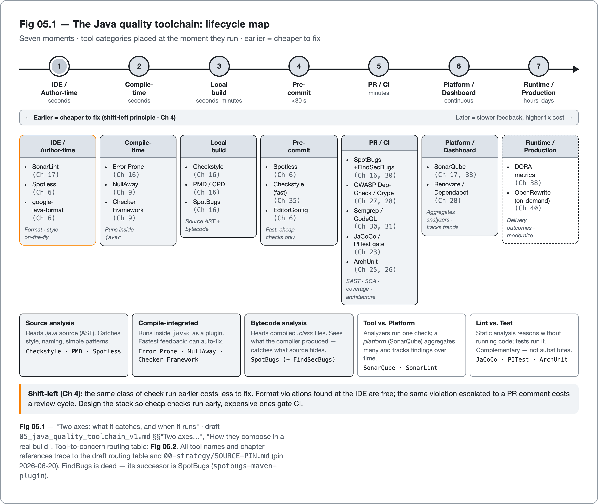
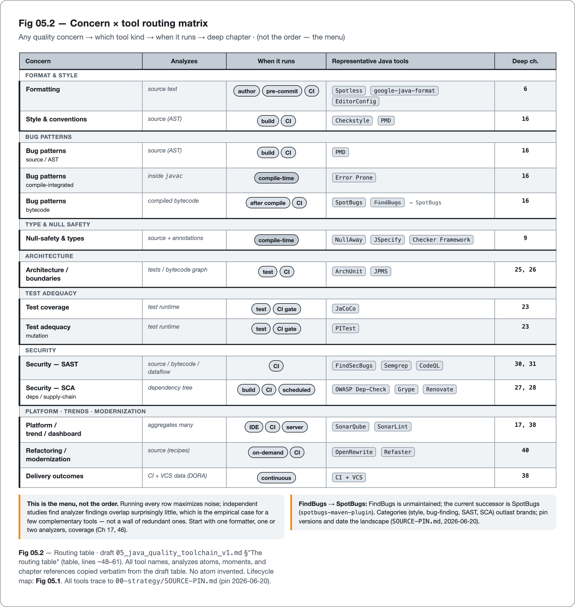

<!--
Dossier key: 05 (solo) — per 01-index/FINAL_INDEX.md Ch 3
Slug: 05_java_quality_toolchain
Part / arc position: Part I — Foundations, Chapter 3
Companion module: 08-companion-code/05_java_quality_toolchain/ — EXAMPLE-BUILD GREEN (mvn -B -Pquality verify SUCCESS, JDK 21.0.11 / Maven 3.9.16; 4 tests pass, 0 Checkstyle, 0 SpotBugs, JaCoCo report written — see _EXAMPLE.md). This is also the seed of the companion reference project (capstone, Ch 46). Spec at foot.
Verified against SOURCE-PIN: 2026-06-20 (each tool's pinned row; source/bytecode/compile-time distinctions; FindBugs→SpotBugs).
DRAFT v1 — map chapter; gates manual; EXAMPLE-BUILD GREEN at JDK 21.0.11 (see _EXAMPLE.md).
-->

# A Map of the Territory

*The Java quality toolchain at a glance — linters, analyzers, formatters, coverage, gates · 05 · Part I*

## Hook

A new lead inherits a Java service and a mandate: "raise code quality." The search begins, and the firehose opens: Checkstyle, PMD, SpotBugs, Error Prone, SonarQube, NullAway, ArchUnit, JaCoCo, PITest, Spotless, Semgrep, OWASP Dependency-Check, Renovate. A dozen tools, each with a passionate following, each claiming a piece of "quality." Which ones to install? In what order? Do they overlap? Will running all thirteen bury the team in noise?

This chapter is the map. It does not cover configuring any single tool; that is the rest of the book. It covers the *territory*: what class of problem each kind of tool catches, *when* in the workflow it catches it, and which later chapter goes deep. The map makes it possible to design a coherent stack instead of bolting on tools by reputation.

## Overview

**What this chapter covers**

- The two axes that organize every Java quality tool: **what** it catches and **when** it runs.
- A routing table from any quality concern to the tool that addresses it and the chapter that details it.
- The distinctions that explain *why a layered stack runs more than one*: source vs bytecode vs compile-time; lint vs test; tool vs platform.
- Why the menu is not the order, and running all of them is not the goal.

**What this chapter does NOT cover.** Any tool's configuration, rules, or trade-offs in depth (Parts IV–IX), and the one opinionated "here's a stack" recommendation (Chapter 46). This is orientation, deliberately thin.

**One idea to hold from the outset:** no single tool is "the quality tool." Quality tooling is a *layered* system, and the value is in composing the layers. That is exactly what a map is for.

## How it works

Two figures carry the territory before the prose unpacks it. Figure 3.1 lays the toolchain over the development lifecycle, placing each category of tool at the moment it runs, from the IDE through to production feedback.



*Figure 3.1 — The Java quality toolchain lifecycle map. Seven moments, with each tool category placed at the moment it runs; earlier is cheaper to fix.*

Figure 3.2 turns the same landscape sideways into a lookup: a routing matrix from any quality concern to the kind of tool that addresses it, the moment it runs, and the chapter that goes deep.



*Figure 3.2 — The concern-by-tool routing matrix. Any quality concern maps to a tool kind, the moment it runs, and the deep chapter. The matrix is the menu, not the order.*


### Two axes: what it catches, and when it runs

Every tool in the Java quality landscape can be placed on two axes, and a tool's value depends on both.

- **By *moment* (when it runs):** author-time (IDE) → compile-time → local build → pre-commit → PR / CI → platform / dashboard → runtime / production feedback. **Earlier is cheaper to fix** (the shift-left principle, Chapter 4).
- **By *class of problem* (what it finds):** formatting, style/conventions, bug patterns, type/null safety, architecture, test adequacy, dependency/supply-chain risk, security, and trend/debt.

A tool that catches a bug at compile time (Error Prone) gives faster, cheaper feedback than the same class of check at PR time. So "which tool" is really "which problem, caught at which moment."

### The routing table

This is the chapter's spine: for any concern, which kind of tool, when it runs, and where the book goes deep.

| Concern | Representative Java tools | Analyzes | Moment | Deep chapter |
|---|---|---|---|---|
| Formatting | Spotless, google-java-format, EditorConfig | source text | author / pre-commit / CI | 6 |
| Style & conventions | Checkstyle, PMD | source (AST) | build / CI | 16 |
| Bug patterns (source / compile) | PMD, Error Prone | source / inside `javac` | build / **compile-time** | 16 |
| Bug patterns (bytecode) | SpotBugs (+ FindSecBugs) | compiled bytecode | after compile / CI | 16 |
| Null-safety & types | NullAway, JSpecify, Checker Framework | source + annotations | compile-time | 9 |
| Architecture / boundaries | ArchUnit, JPMS | tests / bytecode graph | test / CI | 25, 26 |
| Test adequacy | JaCoCo (coverage), PITest (mutation) | test runtime | test / CI gate | 23 |
| Security — SAST | FindSecBugs, Semgrep, CodeQL | source / bytecode / dataflow | CI | 30, 31 |
| Security — SCA / deps | OWASP Dependency-Check, Grype, Renovate | dependency tree | build / CI / scheduled | 27, 28 |
| Platform / trend / dashboard | SonarQube / SonarLint | aggregates many | IDE + CI + server | 17, 38 |
| Refactoring / modernization | OpenRewrite, Refaster | source (recipes) | on-demand / CI | 40 |
| Delivery outcomes | CI + VCS data (DORA) | the process | continuous | 38 |

### Why a layered stack runs more than one: the distinctions that matter

Three distinctions explain the apparent redundancy, and a senior reader should hold all three.

- **Source vs bytecode vs compile-integrated.** Checkstyle and PMD read **source**; SpotBugs reads **bytecode** (so it sees what the compiler actually produced, catching things invisible in source); Error Prone runs **inside `javac`** as a compiler plugin (fastest feedback, and it can auto-fix). They see different things. That is *why* a layered stack catches more than any one tool.

```
   source ──▶ [Checkstyle, PMD, Error Prone*] ──▶ javac ──▶ bytecode ──▶ [SpotBugs]
                          *Error Prone runs inside javac
```

- **Lint/analyze vs test.** Static analysis reasons about code *without running it*; tests run it. They are complementary, not substitutes (Part V).
- **Tool vs platform.** Checkstyle, PMD, and SpotBugs are analyzers; **SonarQube** is a *platform* that can run its own analyzers and aggregate results over time with quality gates (Chapter 17). Aggregators wrap multiple analyzers behind one dashboard.

> **CONCEPT** A *linter* flags style and simple patterns; a *static analyzer* reasons more deeply (data-flow, the path a value takes); a *platform* aggregates findings and tracks them over time. The words blur in practice. What matters is the layer each occupies.

### How they compose in a real build

The map becomes a build through Maven or Gradle plugins (`maven-checkstyle-plugin`, `spotbugs-maven-plugin`, `spotless-maven-plugin`, `jacoco-maven-plugin`, and Gradle equivalents). **Ordering matters:** fast, cheap checks first (format, fast linters to fail fast), heavier analysis (SpotBugs, Sonar) later, coverage and mutation gates near the end (Chapters 33, 34). The same checks run at pre-commit (Chapter 35) and in CI (Chapter 34) so developers are not surprised at the gate.

The companion module assembles that order in one build. The cheapest layer is the compiler itself, held to every warning and made fatal:

<!-- include: 05_java_quality_toolchain/pom.xml#compiler-flags -->

A formatter runs next, pinned so its rendering does not drift and applied only to changed files:

<!-- include: 05_java_quality_toolchain/config/spotless/spotless-reference.xml#formatter -->

Then the analyzers, each at its own vantage point. Checkstyle reads source, its engine pinned separately from the plugin (the two-pin split):

<!-- include: 05_java_quality_toolchain/pom.xml#checkstyle-wire -->

SpotBugs on the compiled bytecode:

<!-- include: 05_java_quality_toolchain/pom.xml#spotbugs-wire -->

And coverage over the test run, last:

<!-- include: 05_java_quality_toolchain/pom.xml#coverage-wire -->

> **Trace it back.** Every tool named here resolves to a pinned row in `SOURCE-PIN.md` (versions dated 2026-06-20); the source/bytecode/compile-time placements trace to each tool's own docs. This is a map chapter, so the do-and-verify beat is simple. Open `SOURCE-PIN.md` and confirm a tool's pinned version before reaching for it.

## Deep dive

### The menu is not the order

The critical caveat: the map is the *menu*, not the *order*, and running everything is not the goal. Running every tool maximizes noise and build time and produces overlapping findings; Checkstyle, PMD, and SonarQube will all flag some of the same things. Independent studies of Java static-analysis tools find their findings *overlap surprisingly little*, which is the empirical case for layering a few complementary tools, and also the warning that piling on redundant ones multiplies noise.

**Chapter 17** covers combining and de-duplicating the analyzers into a coherent layered stack; **Chapter 46** builds one concrete reference stack end to end.

### A note on dead tools

The landscape moves, so every claim anchors on the pin and carries a date. The clearest example: **FindBugs is dead.** Its successor is **SpotBugs**, and the old `findbugs-maven-plugin` is replaced by `spotbugs-maven-plugin`. Citing FindBugs as current is the kind of staleness this book's source-pin discipline exists to prevent. Categories (style, bug-finding, SAST, SCA) are stabler than brands; the pinned versions in `SOURCE-PIN.md` are the current snapshot.

## Limitations

- **Overlap and noise.** Multiple analyzers raise duplicate findings; without de-duplication and tuned rulesets, the signal drowns (Chapter 19). More tools is not more quality.
- **Build-time cost.** Each layer adds time; an un-tuned full stack can make CI painfully slow (Chapter 33).
- **False positives erode trust.** Every static tool has them; a noisy gate gets ignored or disabled, which is the worst outcome (Chapter 19).
- **A green stack is necessary, not sufficient.** Passing every tool does not mean the design is good or the code is correct (Chapters 2, 23, 37).
- **The map is a snapshot.** Tool popularity shifts; this book pins versions and dates the landscape, and leans on the (stabler) categories.
- **Tools do not create culture.** A stack nobody heeds is theatre (Chapter 4); adoption is a people problem (Chapters 4, 38).

## Alternatives

- **An all-in-one platform** (e.g. SonarQube doing style + bugs + security + coverage aggregation) versus **best-of-breed** individual analyzers wired into the build. The platform is simpler to operate and gives one dashboard; best-of-breed gives deeper, tool-specific checks and no single-vendor dependency. Most real stacks blend both. Neither is "correct"; the trade-off is operational simplicity versus depth, detailed in Chapters 17 and 46.

## When to use

- **Use this map** when designing or auditing a quality stack, to verify coverage of each concern that matters and avoid three tools addressing the same one.
- **Pick by both axes:** the *problem* to be caught and the *moment* to catch it (earlier is cheaper).
- **Start small and layer:** a few complementary tools (one formatter, one or two analyzers, coverage) beat a wall of overlapping ones; expand only as each earns its keep (Chapters 17, 38).
- **Do not** treat the full menu as a checklist to install; that is the fast path to a noisy, slow, ignored gate.

## Hand-off

The territory is mapped. Tools only stick in a team that wants them, and quality is, before anything else, a property of people and how they work. Before Part II turns to the craft of writing quality Java, one more foundation awaits: the culture that makes every tool in this map matter.

## Back matter

**Key takeaways**

- Java quality tooling is a **layered system**, organized by **what** a tool catches and **when** it runs (earlier = cheaper).
- The routing table maps any concern → the tool kind → the deep chapter. Use it to design a stack.
- A layered stack runs more than one tool because each sees different things (**source vs bytecode vs compile-time**); **lint ≠ test**; **tool ≠ platform**.
- The menu is **not** the order. Running everything maximizes noise. Layer a few complementary tools (Chapters 17, 46).
- Categories outlast brands; pin versions and date the landscape (FindBugs → SpotBugs).

**Key concepts**

- *Linter / static analyzer / platform*: flag-patterns vs reason-deeply vs aggregate-and-track.
- *Source vs bytecode vs compile-integrated analysis*: what the tool reads, and when.
- *SCA vs SAST*: scanning dependencies for known vulns vs analyzing the application's own code (Chapters 28, 30).

**Reference (traced to the pin)**

- Tool inventory + pinned versions: `00-strategy/SOURCE-PIN.md` (dated 2026-06-20). Maven/Gradle plugin GAVs: Chapters 16, 27.
- Dead → current: FindBugs → SpotBugs; `findbugs-maven-plugin` → `spotbugs-maven-plugin`.

**Companion module (built — EXAMPLE-BUILD green at JDK 21.0.11, `mvn -B -Pquality verify` SUCCESS; 4 tests pass, 0 Checkstyle violations, 0 SpotBugs findings, JaCoCo report written):** `08-companion-code/05_java_quality_toolchain/` is the map made concrete and the seed of the companion reference project (Chapter 46). One Maven build assembles the layered local toolchain: the compiler held to `-Xlint:all -Werror` in the default build (the cheapest layer), and Checkstyle (source), SpotBugs (bytecode) and JaCoCo (coverage) in the opt-in `-Pquality` profile (cheap checks first, heavier analysis later). The displayed snippets are tag regions inside that build: the compiler flags, the two-pin Checkstyle engine override, the SpotBugs configuration, and the JaCoCo executions live in `pom.xml`; the formatter layer is shown as a reference configuration in `config/spotless/spotless-reference.xml` (`spotless-maven-plugin 3.6.0` + google-java-format `1.35.0`, not wired into the green build, its plugin version carried as a property; see `09-flags/34`). The small `org.acme.toolchain` package (`LineItem`, `Cart`) gives each layer something real to read and the module passes its own gate. **Failure path:** `LineItem` rejects a blank SKU, a negative price, or a non-positive quantity at construction; **observability:** `Cart.size()` is the headline metric and `Cart.isReady()` a readiness probe, with the JaCoCo report the coverage surface. Analyzer plugin/engine versions track the proven-green peer modules and are flagged where they differ from `SOURCE-PIN.md` (`09-flags/05_toolchain_plugin_versions.md`). Snippet tags: `compiler-flags`, `formatter`, `checkstyle-wire`, `spotbugs-wire`, `coverage-wire`.

**Sources and further reading**

*Tier 1 — Primary / official*
- Each tool's official docs at its pinned version (`SOURCE-PIN.md`): Checkstyle, PMD, SpotBugs, Error Prone, SonarQube, JaCoCo, ArchUnit, Spotless, OWASP Dependency-Check.
- The Checkstyle wiki's curated "Java static code analysis tools" list.

*Tier 2 — Accessible / further reading*
- "A critical comparison on six static analysis tools" (ScienceDirect). Finding-overlap and precision evidence for layering.
- Maven / Gradle plugin references for build integration.

## Next chapter teaser

If a stack of tools only works in a team that welcomes it, what does a quality culture actually look like, and can one be built on purpose?

---

<!--
RUNNABLE EXAMPLE SPEC (seeded Step 4b; EXAMPLE-BUILD GREEN — built at JDK 21.0.11, see _EXAMPLE.md)
- Module: 08-companion-code/05_java_quality_toolchain/ — a small Maven module wiring the staple stack into ONE build (spotless + checkstyle + pmd + spotbugs + error_prone + jacoco), each producing one representative finding. THIS IS THE SEED OF THE COMPANION REFERENCE PROJECT reused by Ch 46 (capstone) — build once, reuse.
- File list: pom.xml (the layered plugin config — tag-regions per tool); src/main/java/.../Sample.java (one deliberate finding per tool); src/test/java/.../SampleTest.java.
- Run command: ./mvnw -B verify
- Expected output: each tool reports its representative finding; after fixes, BUILD SUCCESS.
- BUILD STATUS: GREEN — built at JDK 21.0.11 / Maven 3.9.16, `mvn -B -Pquality verify` SUCCESS (4 tests pass, 0 Checkstyle, 0 SpotBugs, JaCoCo report written; see _EXAMPLE.md). This is the reusable reference-project base, not a throwaway.

FIGURE PLAN (Step 9)
- Figure 05.1 (THE chapter figure) — the lifecycle map: IDE → compile → build → pre-commit → PR/CI → platform → production, each tool category placed at its moment, arrows = feedback latency. Reused as the book's reference figure. Trace each placement to tool docs.
- Figure 05.2 — concern × tool matrix (the routing table as a shaded grid): the reader's "which tool for which problem" lookup.
-->
