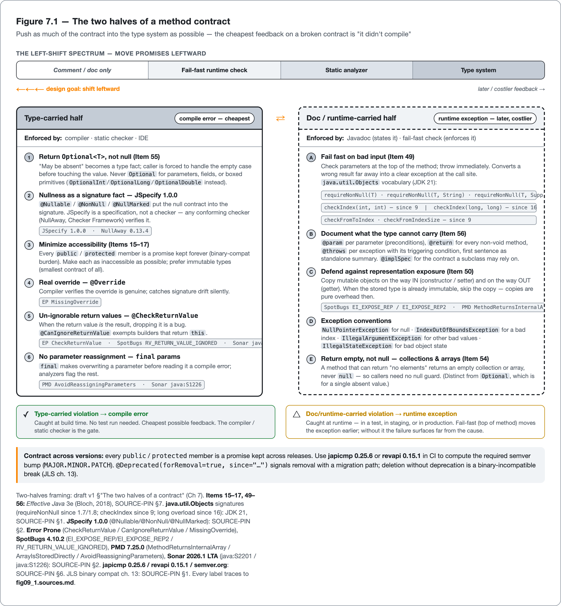

<!--
Dossier key: 09 (owner) + folds 60 — per 01-index/FINAL_INDEX.md Ch 7
Slug: 09_api_method_contracts
Part / arc position: Part II — Writing Quality Java, Chapter 7
Companion module: 08-companion-code/09_api_method_contracts/ — EXAMPLE-BUILD = BUILT GREEN (Checkstyle + SpotBugs under -Pquality; 11 tests pass; empirically confirms the JDK API surfaces used). Spec at foot.
Verified against SOURCE-PIN: 2026-06-27. Sources: JDK 21 API (java.util.Objects requireNonNull/checkIndex family — signatures+since verified, and exercised green in the companion module; java.util.Optional); Effective Java 3e (2018) Items 15–17, 49–56; JLS SE 21 §6.6/§8.4.1/§15.12.2 + ch.13 binary compat (exact §§ verify @pin — primary-text discipline); JEP 395 (records, GA 16) / 409 (sealed, GA 17) / 441 (pattern-switch, GA 21); JEP 467 (/// Markdown, JDK 23 — ⚠ AHEAD-OF-PIN, flagged 09_jep467_markdown_doccomments_ahead_of_pin.md); Error Prone (CheckReturnValue/CanIgnoreReturnValue/MissingOverride); SpotBugs (EI_EXPOSE_REP(2)/RV_RETURN_VALUE_IGNORED); PMD (MethodReturnsInternalArray/ArrayIsStoredDirectly/AvoidReassigningParameters/UseVarargs); SonarQube java:S2201 (scoped — flagged 09_s2201_scope_limit_unverified.md)/java:S1226; JSpecify 1.0.0 (@Nullable/@NonNull/@NullMarked); SemVer (semver.org); revapi; japicmp.
⚠ comparison-sensitive (revapi vs japicmp) — each its own case+limit, no crown. ⚠ verify-at-pin (primary-text items only, not fetchable in-repo): EJ 3e verbatim item titles + any page ref; JLS SE 21 exact §§; revapi/japicmp exact option names (versions now pinned, SOURCE-PIN §6).
DRAFT v1 — gates manual; contract-card + two-halves shape; EXAMPLE-BUILD GREEN (built — see _EXAMPLE.md).
-->

# A Method Is a Promise

*Designing contracts that are easy to keep and hard to break — in the small, and across versions · Part II*

> The signature is the part of the promise the compiler enforces. Everything else, the developer enforces.

## Hook

A teammate calls `findAccount(id)` and writes `account.getBalance()` on the next line. It throws `NullPointerException`, because `findAccount` returns `null` when there is no match and nothing in the signature said so. The fix is not a null check at the call site. The method's *signature lied*: it claimed to return an `Account`, but it sometimes returns nothing, and that "sometimes nothing" was invisible. Change the return type to `Optional<Account>` and the same mistake no longer compiles; the caller is forced to handle the empty case before touching a balance.

A method is a *contract*: a promise about what callers must supply, what they get back, and what happens when the promise is broken. The craft of API design is making that contract **explicit, hard to misuse, and machine-checkable**, so a violation becomes a compile error or a failed build instead of a 2 a.m. page. The chapter closes where the contract meets *time*, the question of how a published API changes without silently breaking dependents.

## Overview

**What this chapter covers**

- The contract framing: a method's promise has a **type-carried half** (the compiler/checker enforces it) and a **doc/runtime-carried half** (Javadoc states it, a fail-fast check enforces it).
- The *Effective Java* method-design canon (Items 49–56, plus 15–17): minimize the surface, fail fast on bad input, return empty not null, use `Optional` judiciously, defend against representation exposure, document the rest.
- How each design rule is **machine-checked** (by the JDK type system, by a runtime guard, or by a named analyzer: Error Prone, SpotBugs, PMD, Sonar) and where it is review-only.
- Encoding the contract in the type system: nullness as a signature fact (JSpecify), real overrides (`@Override`), un-ignorable return values.
- The contract across **versions**: source vs binary compatibility (JLS ch.13), semantic versioning, and the tools that compute the required bump (revapi, japicmp).

**What this chapter does NOT cover.** Null-safety enforcement tooling in depth (Chapter 9), error-handling and exception design (Chapter 8's neighbour), immutability and `equals`/`hashCode` contracts (Chapter 8), and the analyzer internals (Part IV). The *design statement* lives here; the enforcement detail lives in the chapters that follow.

The one idea worth holding: *push as much of the contract into the type system as possible, because the cheapest possible feedback on a broken contract is "it didn't compile."* Everything the type system cannot carry, document and check at runtime.

## How it works

Figure 7.1 lays the contract out as two columns: the type-carried half the compiler enforces, and the doc/runtime-carried half a Javadoc clause states and a fail-fast check defends. Read it left to right; it is the map the rest of the chapter fills in.



*Figure 7.1 — The two halves of a method contract — Push as much of the contract into the type system as possible — the cheapest feedback on a broken contract is "it didn't compile"*


### The two halves of a contract

Every method makes a promise with two parts, and they are enforced in completely different places.

| Half | Carries | Enforced by | Cost of a violation |
|---|---|---|---|
| **Type-carried** | visibility, types, immutability, `Optional`, nullness, generics | compiler / static checker | compile error (cheapest) |
| **Doc/runtime-carried** | preconditions beyond the type (`index ≥ 0`), exception semantics, thread-safety, side effects | Javadoc + fail-fast runtime check | runtime exception (later, costlier) |

The whole skill is *moving promises leftward*: from a comment nobody reads, to a runtime check that fails fast, to a type that will not compile when broken. The `Optional<Account>` change from the opening example is exactly that move. It took "may be absent," which had been an undocumented runtime surprise, and made it a fact in the signature.

> **CONCEPT** *The contract-card.* For each design rule in this chapter: state **the promise**, name **the mechanism** that carries it, cite the **Effective Java item**, list the **analyzer rule** that machine-checks it (if any), and give its **when-NOT-to-use**. The recurring "is this machine-checkable?" question is the point.

### Minimize the surface (Items 15–17)

The smallest API carries the lowest maintenance burden, because every `public` or `protected` member is a promise that must be kept *forever* (the binary-compatibility burden covered at the end of this chapter). *Effective Java* Item 15 (on minimizing the accessibility of classes and members) argues for giving every member the narrowest access level it can tolerate; a top-level class that can drop to package-private should. Item 16 (on using accessors rather than public fields in public classes) keeps the field private behind a method so the representation is not frozen into the contract. Item 17 (on minimizing mutability) gives an immutable type the simplest contract there is: its state never changes, so it is automatically thread-safe and never needs a defensive copy. (Records, JEP 395, GA in Java 16, are the modern shorthand; see Chapter 8.)

The mechanism is subtraction: a smaller surface means a smaller contract to maintain.

### Fail fast on bad input (Item 49)

The precondition half of the contract is enforced by **checking parameters at the top of the method** and throwing immediately. *Effective Java* Item 49 makes this its central instruction: document each restriction on a parameter, then enforce it with a check at the start of the method body. This converts a wrong result far away into a clear exception at the call site. The JDK ships the vocabulary in `java.util.Objects` (signatures verified against the JDK 21 API and exercised green in the companion module):

| Method | Since | Throws on violation |
|---|---|---|
| `requireNonNull(T)` / `(T, String)` / `(T, Supplier<String>)` | 1.7 / 1.7 / 1.8 | `NullPointerException` |
| `requireNonNullElse` / `requireNonNullElseGet` | 9 | `NPE` if both null |
| `checkIndex(int, int)` (and `long` overload, since 16) | 9 / 16 | `IndexOutOfBoundsException` |
| `checkFromToIndex` / `checkFromIndexSize` | 9 | `IndexOutOfBoundsException` |

The documented exception conventions are part of the contract too: `NullPointerException` for null, `IndexOutOfBoundsException` for a bad index, `IllegalArgumentException` for other bad values, `IllegalStateException` for bad object state. (Heavier *declarative* validation, such as Jakarta Bean Validation `@NotNull`/`@Size`, is Chapter 10's territory; the in-method fail-fast idiom is what this chapter covers.)

In the companion module, a transfer guards every argument before it reads or writes anything (`requireNonNull` for the references, `checkIndex` for the bounded retry attempt, an explicit range test for the amount), so a broken call fails at the call site, not deep in the computation:

<!-- include: 09_api_method_contracts/src/main/java/org/acme/contracts/MoneyTransferService.java#precondition-guards -->

### Design the signature, return type, and parameters (Items 51–55)

- **Signatures (Item 51):** name methods carefully; keep parameter lists short (Bloch's guidance: aim for four or fewer); for long lists, prefer a builder or a parameter object; favour interfaces over classes for parameter types; prefer a two-value enum over a `boolean` parameter when the call site is not otherwise self-explanatory (`setVisible(Visibility.HIDDEN)` over `setVisible(false)`).
- **Overloading (Item 52) and varargs (Item 53):** use both judiciously. Overload *resolution* is static (compile-time, by declared type, JLS §15.12.2), which surprises callers who expect override-like dynamic dispatch; avoid two same-arity overloads a single argument could match either way. Varargs (JLS §8.4.1) allocate an array per call; for "at least one required," use an explicit first parameter plus varargs for the rest. (PMD `UseVarargs` nudges toward varargs where an array parameter is used.)
- **Return empty, not null (Item 54):** a method that can return "no elements" returns an empty collection or array, never `null`, so callers need no guard.
- **Return `Optional` judiciously (Item 55):** `Optional<T>`, used as a *return type only*, puts "a result may be absent" into the type, as the hook showed. Bloch's caveats: never `Optional` of a boxed primitive (use `OptionalInt`/`OptionalLong`/`OptionalDouble`); never for collection element types (return empty); avoid `Optional` fields and parameters.

The companion module's account-lookup port returns the absence in its signature, so a caller cannot reach a balance without first handling the empty case:

<!-- include: 09_api_method_contracts/src/main/java/org/acme/contracts/AccountRepository.java#optional-return -->

### Do not leak the representation (Item 50)

When a class stores or returns a mutable object, copy it on the way **in** and on the way **out**; a caller holding the same reference can otherwise mutate internal state behind the class. No other rule in this chapter is more consistently flagged by the tools:

- SpotBugs `EI_EXPOSE_REP` (a getter returns a mutable internal field) and `EI_EXPOSE_REP2` (a constructor/setter stores an externally-supplied mutable object directly).
- PMD `MethodReturnsInternalArray` and `ArrayIsStoredDirectly`.

The companion module's batch type copies its list on the way in and on the way out, so neither the caller's original list nor the returned one is a handle on internal state:

<!-- include: 09_api_method_contracts/src/main/java/org/acme/contracts/TransferBatch.java#defensive-copy -->

### Encode the contract in the type system

- **Nullness as a signature fact (JSpecify 1.0).** JSpecify standardizes `@Nullable`, `@NonNull`, `@NullMarked` (everything in scope is non-null unless marked otherwise), and `@NullUnmarked`. Crucially, JSpecify is a *specification, not a checker*: it gives a tool-agnostic vocabulary so a method's null contract lives in its signature, and any conforming checker (NullAway, the Checker Framework, the IDE) can verify it (Chapter 9). The design statement here is narrow: *nullness is part of the signature*; tooling depth is Chapter 9's territory. The companion module marks its whole package non-null by default in one declaration, then opts a single return out explicitly where absence is real:

<!-- include: 09_api_method_contracts/src/main/java/org/acme/contracts/package-info.java#nullness-marked -->

- **Real overrides (`@Override`).** Error Prone `MissingOverride` flags a method that overrides a supertype method without the annotation; with it, the compiler verifies the override is genuine, catching signature drift.
- **Un-ignorable return values.** When a return value *is* the result (a check, a new immutable value), dropping it is a bug. Error Prone `CheckReturnValue` (error) makes the result un-ignorable; `CanIgnoreReturnValue` exempts builders that return `this`. SpotBugs `RV_RETURN_VALUE_IGNORED` and Sonar `java:S2201` cover the same ground from their own angles.
- **Do not silently reassign parameters.** PMD `AvoidReassigningParameters` and Sonar `java:S1226` flag overwriting a parameter before reading it; `final` parameters make it a compile constraint.

### Document the part types cannot carry (Item 56)

For everything the signature cannot express, the doc comment *is* the contract. *Effective Java* Item 56 (on writing doc comments for all exposed API elements) puts it directly: anything a caller can reach should carry a doc comment that states its contract, since an undocumented exported element is one the caller has to reverse-engineer. The conventions: `@param` per parameter (its preconditions), `@return` for every non-void method, `@throws` for each exception with its triggering condition, and a first sentence that stands alone as the summary. `@implSpec` documents the contract a subclass may rely on. (The contested question of *how much* to comment implementation code belongs to the previous chapter; the point here is narrower, that a published API's contract is documented.) A query method in the companion module carries each of those clauses, so the parts the signature cannot state are stated where a reader and a doc generator both find them:

<!-- include: 09_api_method_contracts/src/main/java/org/acme/contracts/MoneyTransferService.java#javadoc-contract -->

> **A note on what is coming (JDK 23+).** Markdown doc comments, the `///` form from JEP 467, ship in JDK 23, past this book's Java 21 anchor. They are a direction-of-travel for Javadoc authoring, not a feature available at the anchor, so nothing in this chapter relies on them; at Java 21 the contract is written with HTML-and-`@tag` Javadoc as shown above.

### Where each rule is enforced

These design rules are *machine-checkable*, not folklore. Each is checked in a specific place, though, and some only by review.

| Contract concern | Type system | Runtime guard | Analyzer (cited to its own tool) | Review only |
|---|---|---|---|---|
| Non-null parameter | JSpecify + checker | `requireNonNull` | EP `NullArgumentForNonNullParameter`; SpotBugs `NP_NONNULL_PARAM_VIOLATION` | — |
| Valid index/range | — | `checkIndex` | — | edge cases |
| Return value used | — | — | EP `CheckReturnValue`; SpotBugs `RV_RETURN_VALUE_IGNORED`; Sonar `java:S2201` (scoped) | the unscoped rest |
| No representation exposure | immutability | defensive copy | SpotBugs `EI_EXPOSE_REP(2)`; PMD `MethodReturnsInternalArray` | — |
| No param reassignment | `final` param | — | PMD `AvoidReassigningParameters`; Sonar `java:S1226` | — |
| Real override | — | — | EP `MissingOverride` | — |
| *Names are truthful* | — | — | — | **always** |

These tools are *enforcers of the same design rules*, not rivals; where two cover the same ground, each is cited to its own docs and the layering question (which to run) is Chapter 17's. The last row is the previous chapter's lesson echoing forward: a tool checks the contract's shape; only a human checks whether the name on it is true.

## Deep dive: the contract across versions (semver & binary compatibility)

A published contract must be kept *over time*. That is where API design meets release discipline, and where Java has a trap that catches even careful teams: **source compatibility and binary compatibility are not the same thing.**

A change can recompile cleanly in the local build and still break a consumer who does not recompile, because that consumer links against the shipped `.jar` at runtime. The JLS (ch. 13) defines binary compatibility precisely; the short version is that some changes which look harmless in source (certain signature changes, inlined constants, a method moving up a hierarchy) are binary-*incompatible* for an already-compiled caller. Consumers who do not recompile care about binary compatibility, and `mvn test` in the library's own build will never surface that breakage.

The constant case is the one most teams trip over, so it is worth watching happen. A library publishes a compile-time constant:

```java
// v1 of the library
public static final int MAX_RETRIES = 3;
```

A consumer compiles `if (n < MAX_RETRIES)` against `v1`. The JLS binary-compatibility rules (ch. 13) inline a compile-time constant directly into each caller's bytecode, so the consumer's `.class` now holds the literal `3`, with no reference left to the field. The library then ships `v2`:

```java
// v2 of the library
public static final int MAX_RETRIES = 5;
```

Recompiling the consumer picks up `5`. The consumer who only swaps the new `.jar` in place keeps running the inlined `3`, silently, with no error at link or run time. Source-compatible, binary-incompatible, and invisible to the library's own `mvn test`. That gap between the two columns is precisely what the next tools are built to compute.

**Semantic versioning** is the contract that communicates change: `MAJOR.MINOR.PATCH`, where a breaking change demands a MAJOR bump, additive changes a MINOR, and fixes a PATCH (semver.org). The promise is only as good as the accuracy of what is declared changed, and that is exactly what can be *computed* from the actual API diff rather than left to memory:

- **japicmp** compares two JARs for binary *and* source incompatibilities; its `--semantic-versioning` mode reports which version part requires a bump, and the Maven option `breakBuildBasedOnSemanticVersioning` fails the build when the declared bump does not match the detected changes.
- **revapi** does API analysis and change-tracking, categorizes changes by severity, and runs standalone, as a Maven plugin, or as a library; its scope reaches beyond Java classes (configuration, schemas).

The two tools take different approaches: revapi is broader-than-Java and severity-driven; japicmp is focused on diffing two JARs. A team chooses by need, and neither is crowned. Wired into CI against the last released artifact, either turns "did this release break a consumer?" from hope into a build gate (a fitness function, Chapter 26). The design rules from the earlier sections are what make this gate *quiet*: a smaller public surface (Item 15) and a more additive evolution (`@Deprecated(forRemoval=true, since=...)` with a migration path rather than deletion) mean the compatibility check fires less often.

## Limitations & when NOT to reach for it

- **Runtime checks are not free or complete.** `requireNonNull` and explicit guards add a check on every call and shift failure to runtime. Item 49's own caveat: for private/package-private methods with a closed, controlled caller set, prefer `assert`, or skip the check where the computation validates implicitly. Over-checking every internal method is ceremony.
- **`Optional` has real costs.** It is a heap object, it is not `Serializable`, and it is an anti-pattern for fields, parameters, and boxed primitives. Returning it where an empty collection is clearer over-engineers the contract.
- **Defensive copying can be expensive or wrong.** Copying large collections on every getter is real cost; and `.clone()` on a multi-dimensional or element-mutable array is a *shallow* copy that does not actually protect the representation (a documented SpotBugs sharp edge). When the stored type is already immutable, copies are pure overhead; reach for immutability instead.
- **Analyzer rules have documented scope limits.** Sonar `java:S2201` checks only a *fixed list* of immutable return types (`String`, `Boolean`, the boxed numerics `Integer`, `Double`, `Float`, `Byte`, `Short`, plus `Character` and `StackTraceElement`) and misses the rest; the precise list can widen between analyzer versions (verify against the pinned Sonar release; tracked in `09-flags/09_s2201_scope_limit_unverified.md`). Error Prone `CheckReturnValue` fires only where the annotation is present. "The analyzer enforces my contract" is true only for the annotated/scoped subset.
- **Annotation packages are not one standard.** Error Prone's, the dormant JSR-305 `javax.annotation`, and JSpecify all exist; mixing them, or annotating a library and hoping every consumer's checker honours it, is fragile. JSpecify is the consolidation effort, but adoption is partial (Chapter 9).
- **Documentation contracts drift.** A `@param`/`@throws` clause can silently disconnect from the code; a precise-looking comment that no longer matches the code actively misleads.
- **Compatibility tools detect signature breaks, not behavioural ones.** A method that keeps its signature but changes its *meaning* passes japicmp/revapi and still breaks consumers; tests and a changelog remain necessary. The tools also cost setup: excluding intentional breaks, internal packages, and generated code is real configuration, and a noisy report gets ignored (Chapter 18).
- **When not to invest at all.** Compatibility gating is overkill for a leaf service that nobody depends on as a library; it has no external consumers to protect. A tiny internal API among three colleagues does not need the full contract apparatus on every method.

## Alternatives & adjacent approaches

- **Bean Validation** (`@NotNull`, `@Size`): declarative precondition checking, strong at system boundaries (request DTOs). Complementary to in-method fail-fast, not a replacement; see Chapter 10.
- **Design by Contract** (Eiffel-style pre/post/invariants, or libraries that emulate it): a more formal version of the same idea; Java's idiom is the lightweight `Objects` checks plus Javadoc rather than language-level contracts.
- **`assert` statements:** the right tool for *internal* invariants where the caller set is fully controlled (Item 49), but they are disabled by default at runtime, so never use them for a public method's argument validation.
- **Clirr / japi-compliance-checker:** older or alternative compatibility checkers in the same space as revapi/japicmp; named for completeness, with the same "signature-break, not behaviour-break" limit.

These layer rather than compete: types catch what they can at compile time, runtime guards catch the rest at the boundary, analyzers enforce the design rules in CI, and compatibility tools guard the contract across releases.

## When to use what

- **On every public method:** push the contract into the type (return `Optional` or empty, not null; mark nullness; minimize accessibility), then fail fast on what the type cannot carry, then document the remainder (Item 56).
- **On a hot internal path with controlled callers:** prefer `assert` or skip redundant checks; do not pay runtime validation for callers already validated at the boundary.
- **On a mutable field that must be stored or exposed:** defensive-copy in and out (*unless* the type is already immutable, in which case use immutability and skip the copy).
- **On a return value that carries the result:** annotate it un-ignorable (`@CheckReturnValue`) so dropping it fails the build.
- **On a published library or shared module:** wire japicmp or revapi into CI against the last release, honour the computed semver bump, and deprecate-with-migration rather than delete.
- **On a leaf application with no library consumers:** skip the compatibility gate; spend the effort on contract clarity within the codebase instead.

## Hand-off to the next chapter

The contract framing is now in place: a promise with a type-carried half and a doc/runtime half, enforced as far left as the type system allows, and held stable across versions. The next chapters apply that framing to the specific contracts a method makes when things go *wrong*: the exception and error-handling design that determines what a `@throws` clause actually promises, and the immutability and `equals`/`hashCode` contracts that determine whether value types behave correctly in collections. The fail-fast guard is the first sentence of that larger story about failure.

## Back matter — sources & traceability

- **JDK 21 API — `java.util.Objects`** — `requireNonNull` (since 1.7/1.8), `checkIndex`/`checkFromToIndex`/`checkFromIndexSize` (since 9; `long` overloads 16); documented exception conventions. Signatures verified @ JDK 21. **`java.util.Optional`** — return-type contract.
- **Effective Java 3e** (Bloch, 2018) — Items 15–17 (accessibility, accessors, mutability), 49 (check parameters), 50 (defensive copies), 51–53 (signatures/overloading/varargs), 54–55 (empty-not-null / `Optional`), 56 (doc all exposed API). *(Named-canon secondary source: item numbers and topics are cited and the Item→title mapping is web-confirmed against the public 3e table of contents; the chapter presents this guidance as paraphrase in its own words, with no verbatim Item-title quotation and no page reference — the physical 3e text is not fetchable in-repo, so no book wording is reproduced.)*
- **JLS SE 21** — access control §6.6, varargs §8.4.1, overload resolution §15.12.2, binary compatibility ch.13. *(Edition pinned (SE 21); the exact section numbers are confirmed against the JLS SE 21 text at `/pin-source` — standards-edition discipline, not fetchable in-repo.)*
- **JEPs** — 395 (records, final 16), 409 (sealed, 17), 441 (pattern matching for `switch`, 21) — GA at the Java 21 anchor and exercised in the companion module (records); 467 (`///` Markdown docs, JDK 23) — ⚠ AHEAD-OF-PIN, not available at the anchor (flagged `09-flags/09_jep467_markdown_doccomments_ahead_of_pin.md`).
- **Error Prone** — `CheckReturnValue` (ERROR), `CanIgnoreReturnValue`, `MissingOverride` (WARNING), `NullArgumentForNonNullParameter`, `InconsistentOverloads`, `ParameterName`. *(Rule IDs verified; default severities and the exact 2.x build are confirmed against the Error Prone release at companion-build/`/pin-source` — SOURCE-PIN §2 pins this line "exact patch at build," and this module's gate runs Checkstyle + SpotBugs rather than Error Prone.)*
- **SpotBugs** — `EI_EXPOSE_REP`/`EI_EXPOSE_REP2`, `RV_RETURN_VALUE_IGNORED`, `NP_NONNULL_PARAM_VIOLATION`. *(IDs verified; shallow-clone caveat per issue tracker.)*
- **PMD** — `MethodReturnsInternalArray`, `ArrayIsStoredDirectly`, `AvoidReassigningParameters`, `UseVarargs`.
- **SonarQube** — `java:S2201` (return-value-ignored, scoped to a fixed immutable-type list — exact list verified against the pinned Sonar release; tracked in `09-flags/09_s2201_scope_limit_unverified.md`), `java:S1226` (reassign-before-read, RSPEC-1226).
- **JSpecify 1.0.0** — `@Nullable`/`@NonNull`/`@NullMarked`/`@NullUnmarked`; spec, not a checker. (Version per SOURCE-PIN §2; `@NullMarked`-package + explicit `@Nullable` opt-out exercised green in the companion module via `org.jspecify:jspecify:1.0.0`.)
- **SemVer** (semver.org) — `MAJOR.MINOR.PATCH`. **revapi** 0.15.1 (revapi.org) — severity-categorized API change tracking. **japicmp** 0.25.6 (siom79.github.io/japicmp) — JAR diff, `--semantic-versioning`, `breakBuildBasedOnSemanticVersioning`. (Versions per SOURCE-PIN §6; exact CLI/Maven option names verified against each tool's docs at `/pin-source` — the compatibility sub-module is a spec here, not yet built.)

**Companion module (BUILT GREEN — Floor C):** `08-companion-code/09_api_method_contracts/` — a contract-tight `MoneyTransfer` service: minimized accessibility, `Objects.requireNonNull`/`checkIndex` fail-fast, an immutable `record` result, an `Optional<Account>` lookup, a defensive copy, full `@param`/`@return`/`@throws`/`@implSpec` Javadoc, `@NullMarked` package. The contracts are machine-checked by Checkstyle + SpotBugs under the `-Pquality` profile (`mvn -Pquality verify`), with the SpotBugs suppression filter empty, so the representation-exposure detectors stay quiet by design, not by suppression; 11 JUnit tests assert each contract holds at runtime. **Failure path:** removing the `requireNonNull` guard reintroduces a late NPE the tests catch, and re-exposing the internal list trips the SpotBugs `EI_EXPOSE_REP` family at `verify`. **Companion sub-module (planned):** a tiny library `v1`→`v2` with a deliberate binary-incompatible change that japicmp (or revapi) flags in CI, demanding a MAJOR bump; not yet built. Snippet tags: `precondition-guards`, `optional-return`, `defensive-copy`, `javadoc-contract`, `nullness-marked`.
