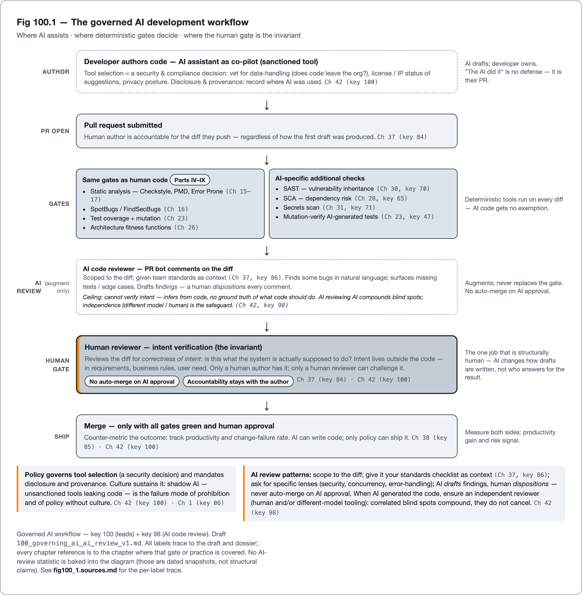

<!--
Dossier key: 100 (owner, leads) + folds 98 — per 01-index/FINAL_INDEX.md Ch 42 (CLOSES Part XII; Ch 43 opens Part XIII — Performance & Observability)
Slug: 100_governing_ai_ai_review (owner key 100)
Part / arc position: Part XII — AI-Era Code Quality, Chapter 42 of 41-42 (CLOSER)
Companion module: 08-companion-code/ (a one-page AI-in-the-workflow policy template + counter-metric dashboard note; an illustrative AI-review comment on a Java diff — a real catch + a false positive + a missed subtle bug) — ⚠ EXAMPLE-BUILD = PENDING (policy/illustrative artifacts, not a buildable module). Spec at foot.
Verified against SOURCE-PIN: 2026-06-20. Sources (2 dossiers; CLOSES Part XII; the individual stance (Ch 41) scaled to the ORGANIZATION; stats dated+attributed; NOT legal advice; the book practices what it preaches):
- Governing AI in the workflow (100, leads): AI raises productivity AND risk → a team needs a deliberate POLICY for HOW AI is used — not a ban, not a free-for-all. Governing AI-assisted dev: which tools sanctioned, what verification AI output must pass, who's accountable, how to keep the HUMAN GATE intact. Thesis (Sonatype): "AI can write code, but only POLICY can ship it." Tool selection = a SECURITY/COMPLIANCE decision not just productivity (vet for data-handling — does your code leave the org?; license/IP of suggestions; privacy scorecard — choose deliberately). Verification policy (CORE): AI code passes the SAME gates as human (Parts IV-IX) PLUS AI-specific checks — SAST/SCA/secrets (Ch 30/28/31 key 70/65/71) for vulnerability-inheritance (Ch 41 key 97); mutation-verify AI tests (Ch 23/41 key 47/99); human review w/ intent-verification (Ch 37/§B key 84/98); NO auto-merge on AI approval. Keep the human gate / ACCOUNTABILITY: a human author is accountable for AI-assisted code they submit (it's their PR; "the AI did it" is NOT a defense). Disclosure & provenance: record where AI was used (this book does — PROVENANCE/AI-DISCLOSURE); some contexts require it. Policy + CULTURE (Ch 1 key 06): governance = training + communication + feedback loops (why the policy exists; how to report bad suggestions/prompt-vulns), not just a rules doc; generative culture → adopted not evaded (shadow AI = the failure). Measure carefully (Ch 1/38 key 04/85): AI-productivity claims (~78% report higher productivity, ~72% faster TTM) come WITH ~65% reporting higher risk — track BOTH counter-metric'd; don't celebrate velocity while ignoring change-failure-rate (Ch 36/38 key 85). Stats ⚠ verify+dated. LIMITS: policy-without-enforcement/culture-fails (shadow AI — unsanctioned tools leaking code); over-restriction-drives-workarounds (banning pushes underground; pragmatic-enforced succeeds where prohibition drives shadow AI); verification-has-a-ceiling (gates + AI review catch a fraction; governance reduces not eliminates risk; human gate essential but fallible — automation bias); stats-volatile+often-vendor-sourced (date+attribute; productivity claims marketing-adjacent); NOT-legal-advice (AI-IP/compliance EU AI Act / license of generated code needs counsel — stay factual).
- AI code review (98, §B, ⚠ tooling + AI-reviews-AI debate): AI code reviewers (PR bots commenting on diffs via an LLM) — a fast-growing layer on automated review (Ch 34 key 78) + human review (Ch 37 key 84). Catch real issues + explain in natural language — but evidence shows clear LIMITS, esp on intent + subtle logic. Framed: AI review AUGMENTS the human + tool gates, NEVER replaces. How: LLM given the diff (±context), prompted to find bugs/smells/security + suggest fixes, posting inline PR comments (Checks API Ch 34). Value: natural-language explanations; catching some issues across the diff; surfacing missing tests/edge cases; reducing reviewer load on mechanical findings — complementing deterministic tools (Ch 15-17/30) + humans (Ch 37). DATED evidence (attribute+verify): a 2025 study of 16 AI review tools across ~22,000 comments — wide variance; only a few caught bugs humans missed; ~35% on critical defects, single-digits on subtle logic; NIST SATE: even best static tools plateau ~50-60% on security; O'Reilly: AI review "catches half your bugs." All % ⚠ VERIFY AT PIN, cited+dated, snapshot. Patterns: scope to the diff (Ch 34); give it the standards/checklist (Ch 37 key 86) as context; ask for specific lenses (security/concurrency/error-handling); it DRAFTS, a human DISPOSITIONS; no auto-merge on AI approval. "AI reviewing AI" caution: an AI reviewer has NO authoritative source of intent — "inference from comments/context ≠ verification"; an AI approving AI-generated code (Ch 41 key 97) COMPOUNDS blind spots (echoes the book's OWN independence gates: originality/red-team run on a DIFFERENT model than the drafter). LIMITS (core): misses-majority-of-subtle/logic-bugs (~35% critical, single-digits subtle — "half your bugs"; NOT a sufficient gate); CANNOT-VERIFY-INTENT (no ground truth of what code SHOULD do; infers not verifies — the fundamental ceiling); false-positives/noise (un-tuned → spams PRs; scoping + disposition Ch 19 key 39); AI-reviews-AI-compounds-blind-spots (⚠ — independence matters: different model/persona); over-trust/automation-bias (devs rubber-stamp AI approvals; must not replace human gate or deterministic tools); tooling-varies-wildly (⚠ 16-tool study huge variance — crown none, benchmark for your context).
⚠ verify-at-pin: ALL stats — productivity/risk (78%/72%/65%) + AI-review (35%/50-60%/"half") — cite specific study + date, NEVER timeless, many survey/vendor-sourced; EU AI Act / regulatory specifics for code (factual, NOT legal advice); "only policy can ship it" (Sonatype) attribution; "cannot verify intent" framing attribution. SOURCE-PIN §7 canon gaps: arXiv 2509.20388 (privacy scorecard) + 2508.18771 (AI review) + NIST SATE + Sonatype/O'Reilly not pinned rows.
Routes: AI-generated code quality/risks (the individual stance) → Ch 41 (97/99); vulnerability inheritance → Ch 41 (97); mutation-verify AI tests → Ch 23/41 (47/99); security stack (SAST/SCA/secrets) → Ch 30/31/28 (70/65/71); automated PR review (bot layer) → Ch 34 (78); human review (intent/size/checklist) → Ch 37 (84/86); false-positive tuning → Ch 19 (39); CI gate (no auto-merge) → Ch 33 (76); metrics/counter-metric/Goodhart → Ch 1/38 (04/85); DORA change-failure-rate → Ch 36/38 (85); culture/human-gate → Ch 1 (06); the book's own independence gates + provenance → AGENTS/PROVENANCE; deterministic transforms → Ch 40 (94).
DRAFT v1 — gates manual; only-policy-can-ship-it + keep-the-human-gate/accountability(its-your-PR) + tool-selection-is-a-security-decision + counter-metric-productivity-with-risk + shadow-AI-is-the-failure-of-prohibition + AI-review-augments-never-replaces + AI-cant-verify-intent(the-ceiling) + AI-reviewing-AI-compounds-blind-spots/independence + the-book-practices-what-it-preaches shapes; PART XII CLOSER (hand-off opens Part XIII — Performance & Observability, Ch 43 keys 101+102+103+51+104). EXAMPLE-BUILD pending.
-->

# Only Policy Can Ship It

*Governing AI in the development workflow — sanctioned tools, mandatory verification, an accountable human, and AI code review as an augmentation that never replaces the gate · 100 (folds 98) · Part XII (closer)*

> A developer ships a pull request that takes down production, and explains in the post-mortem: "the AI generated that part." It is not a defense. The commit has their name on it. When a machine writes the code, someone still has to own its quality.

## Hook

A developer ships a pull request that takes down production. In the post-mortem, asked how the bug got through, they answer: "the AI generated that part." It is not a defense — and recognizing *why* it is not is the whole foundation of AI governance. The commit has their name on it; it was their pull request; they are accountable for the code they submitted, regardless of who or what produced the first draft. "The AI did it" is exactly as much of a defense as "I copied it from Stack Overflow" — which is to say, none. That non-defense names the central question of the AI era at organizational scale: when a machine writes the code, who owns its quality, and what keeps an organization from drifting into a world where the answer is *no one*?

The two obvious answers both fail. *Ban AI* and it goes underground — developers use it anyway on personal accounts, leaking proprietary code to unsanctioned tools, creating **shadow AI** with none of the controls. *Allow a free-for-all* and the last chapter's confident-wrongness ships at organizational scale, a flood of plausible-but-unverified code outpacing every gate. This closing chapter of Part XII is the middle path: **governance**, a deliberate policy that turns AI's speed into shippable quality without ceding judgment. The thesis, borrowed from the supply-chain world: *AI can write code, but only policy can ship it.* The chapter has two halves: the governance itself (sanctioned tools, mandatory verification, an accountable human, disclosure, and measuring risk alongside productivity), and then **AI code review** — using AI to help review the flood of AI code, as a genuine but strictly bounded augmentation that never replaces the human gate, because an AI reviewer cannot verify intent. And it closes on the most honest note available: this book, itself AI-written, practices exactly the governance it recommends.

## Overview

**What this chapter covers**

- **Governing AI**: tool selection as a security decision, the verification policy (same gates plus AI-specific checks), and keeping an accountable human gate.
- **Disclosure, culture, and measurement**: provenance, why policy needs culture (shadow AI), and counter-metricing productivity with risk.
- **AI code review**: where it adds value, its empirical ceiling (it cannot verify intent), and the augment-never-replace stance.
- The independence principle (AI reviewing AI compounds blind spots) and how this book embodies its own governance.

**What this chapter does NOT cover.** The individual stance and the characteristic risks of AI-generated code (the previous chapter, which scales that stance to the organization). The security/test stack the policy mandates (Chapters 30, 31, 28, 23). Human review and PR automation themselves (Chapters 37, 34). This is **governance and policy, fast-moving, and explicitly *not legal advice***: AI-IP and regulatory questions (the EU AI Act, the license of generated code) need counsel; the book stays factual. Every statistic is **dated, attributed, and often vendor-sourced**, verified at the pin and treated as a snapshot. AI-review tooling varies widely; the book **crowns none**.

**The one idea to hold**: *only policy can ship AI code. Sanction the tools (a security decision), make AI output pass the same gates plus AI-specific checks, keep a human accountable (it is their PR, "the AI did it" is no defense), disclose use, and measure risk alongside productivity. AI code review augments but never replaces the human gate, because it cannot verify intent, and AI reviewing AI compounds blind spots, so independence matters.*

## How it works

*Governing AI in the workflow: where AI assists, where deterministic gates decide, and where the human gate is the structural invariant.*

### Governing AI: sanction, verify, keep the human gate

Governance is the organizational form of the last chapter's stance, and it has a definite shape — not a rulebook nobody reads, but a small number of load-bearing decisions:

- **Tool selection is a security and compliance decision, not a productivity decision dressed up.** Before sanctioning an assistant, vet it: does the organization's proprietary code *leave the organization* to a third-party model? What is the license and IP status of its suggestions? How does it score on data-handling and privacy? The choice of tool is a data-governance decision that happens to also boost productivity, not the other way around.
- **The verification policy is the core.** AI-generated code passes the *same gates as human code* (Parts IV–IX) *plus* AI-specific checks: SAST, SCA, and secrets scanning (because of vulnerability inheritance, last chapter), mutation-verification of any AI-generated tests, and human review that checks *intent*. And the hard line: **no auto-merge on an AI approval.**

> **CONCEPT** *Keep the human gate — accountability does not transfer to the model.* The non-defense from the hook is the principle: a human author is accountable for the AI-assisted code they submit, because it is their pull request and their name on the commit. "The AI did it" does not transfer responsibility, any more than "the compiler did it" or "the library did it." This is why the human gate (the human review and the human author's ownership) *stays*, and why no amount of AI capability removes it: accountability is a property of the *person who ships*, not the tool that drafts. Governance institutionalizes this: someone is always answerable for what merges.

The remaining pieces make the policy real rather than nominal. **Disclosure and provenance**: record where AI was used (this book does, in its provenance log and AI-disclosure statement); some contexts now require it. **Policy needs culture** (Chapter 1): a governance document nobody follows produces shadow AI, so governance is *training, communication, and feedback loops* (explaining *why* the policy exists and giving people a way to report problematic suggestions), not a rules page alone. A generative culture makes the policy adopted; a punitive one drives it underground.

> **CONCEPT** *Counter-metric productivity with risk — velocity blind is a trap.* The reported upside is real and worth governing *for*: as of recent (2024–2025) industry surveys, large majorities reported higher productivity and faster time-to-market with AI assistants (figures often cited around three-quarters, verified and dated at the pin, and frequently vendor-sourced). The *same* surveys reported a substantial fraction, often cited around two-thirds, also seeing *higher risk*. The governance discipline, straight from the metrics chapter: track *both*, counter-metric'd. A team that celebrates the productivity number while ignoring its change-failure rate (Chapter 38) is measuring exactly half the picture — the seductive half — and Goodhart will do the rest.

The honest limits are about enforcement and ceilings. Policy without enforcement and culture fails (shadow AI). Over-restriction drives workarounds: banning AI outright pushes it underground, where pragmatic-but-enforced policy would have kept it visible and controlled. Verification has a ceiling: the gates and AI review catch a *fraction*, governance *reduces* risk without eliminating it, and the human gate, though essential, is fallible (automation bias). The statistics are volatile and often marketing-adjacent; date and attribute every one.

### AI code review: a bounded augmentation

The same AI that floods the pipeline can help *review* it: **AI code reviewers** are PR bots that feed a diff (with some context) to an LLM, prompt it to find bugs, smells, and security issues, and post inline comments via the same Checks API as the deterministic bots (Chapter 34). They genuinely add value: natural-language explanations a junior developer can learn from, catching some real issues across a diff, surfacing missing tests and edge cases, and reducing human reviewer load on mechanical findings, all *complementing* the deterministic tools and the human reviewer. But the framing that must hold is **augment, never replace**, and the evidence says why.

> **CONCEPT** *AI review cannot verify intent — that is the fundamental ceiling.* The empirical findings are sobering and must be dated: a 2025 study of 16 AI-review tools across roughly 22,000 comments found wide variance, with only a few catching bugs humans missed, on the order of a third of *critical* defects and single digits on *subtle logic* (verified at the pin, a snapshot). NIST's SATE work shows even the strongest *static* tools plateau around half to two-thirds on security, and an O'Reilly summary put AI review at "catches half your bugs." The deeper reason under all the numbers: **an AI reviewer has no authoritative source of intent.** It does not know what the code is *supposed* to do; it *infers* from the code and comments, and inference is not verification. That is a ceiling no model capability removes. The same confident-wrongness of the last chapter now sits in the reviewer's seat, which is exactly why AI review can never *be* the gate.

Used well, the patterns mirror the bot-layer discipline: scope it to the diff, give it the team's standards and checklist as context (Chapter 37), ask for specific lenses (security, concurrency, error-handling), and have it *draft* findings that a human *dispositions*. Never auto-merge on its approval. The sharpest caution closes the loop with the book's own method:

> **CONCEPT** *AI reviewing AI compounds blind spots — independence is the safeguard.* When an AI generates the code (last chapter) and an AI reviews it, two systems with *correlated* blind spots are stacked: the same training distribution, the same failure modes, the same confident-wrongness, and still no source of intent. The errors do not cancel; they compound. The safeguard is **independence**, and it is exactly the principle this book applies to itself: its own independence gates (the originality and red-team checks) are run on a *different model and persona* than the one that drafted the chapter, because a model cannot reliably catch its own mistakes. AI-reviewing-AI without an independent human (or an independent tool, or both) is a single point of view wearing two hats.

The limits compound the ceiling: AI review misses the majority of subtle and logic bugs (not a sufficient gate); un-tuned, it spams PRs with false positives (needs the scoping and disposition discipline of Chapter 19); automation bias tempts developers to rubber-stamp its approvals; and the tooling varies wildly — crown none, benchmark for your context.

## Deep dive: the human gate is the invariant, at every scale

The Part XII argument runs at three scales. The mechanism scale (last chapter): AI-generated code is plausible-but-unverified, so it is a draft that goes through the gate. The individual scale (last chapter): a developer treats AI output as an untrusted contribution and verifies it. The organizational scale (this chapter): a *policy* sanctions tools, mandates verification, keeps a human accountable, and measures risk, and uses AI review as a bounded augmentation. The invariant across all three is **the human gate**: not that humans must read every line (the automated stack reads most of it), but that *a human is accountable for what ships, and human judgment of intent is the thing no AI can replace, whether the AI is writing or reviewing.* Strip away the productivity numbers and the tooling and the governance frameworks, and the durable principle is small and old: someone is responsible, and that someone is a person. AI changes how the draft gets written and how the review gets assisted; it does not change who answers for the result.

The reason the human gate is irreducible (not a transitional safeguard that better models will eventually retire) is the **intent ceiling**, approached from both directions. AI *generation* cannot guarantee correctness because it has no ground truth of what the code should do (it infers intent from a prompt). AI *review* cannot verify correctness for the same reason (it infers intent from the code). Both are bounded by the same wall: *intent lives outside the code*, in the requirements, the user's need, the business rule, the thing the system is *for*. A model trained on code has no authoritative access to it. A human author *has* the intent (they were told the requirement); a human reviewer can *reconstruct and challenge* it ("is this what we actually want?"). That is the one job in the quality pipeline that is structurally human, and it is why every gate in this book ultimately answers to a person. The AI era does not dissolve that; it sharpens it, by making everything *around* the intent-check cheap and fast, which leaves the intent-check as the visible, load-bearing constraint it always quietly was.

**This book is the worked example of its own thesis.** It is AI-written, and it does exactly what it prescribes for AI-written code. It *discloses* its provenance (a provenance log, an AI-disclosure statement) rather than hiding it. It keeps a *human gate*: a human approves every chapter, and the human author is accountable for what ships; the book's own Step-12 approval is the "it is your PR" principle applied to itself. It runs its verification gates (source-tracing, the neutrality and authenticity checks) on the AI output as untrusted-until-verified. And it enforces *independence*: its originality and red-team checks run on a *different model* than the drafter, the precise "AI-reviewing-AI compounds blind spots" safeguard this chapter argued for. The book is not exempt from its own rules because it is about quality; it is *held to them*. That is not a flourish. It is the demonstration. A book about governing AI that ignored its own AI authorship would be the vanity-metric trap in literary form: a green dashboard over an ungoverned process. Instead, the discipline the book teaches is the discipline that produced it: verify everything, keep the human accountable, disclose the truth, stay independent. That is the only honest way for an AI-written book about code quality to exist, and the note Part XII ends on.

## Limitations & when NOT to reach for it

- **Policy without enforcement and culture fails.** A governance doc nobody follows produces shadow AI — unsanctioned tools leaking code. Governance is training, communication, and feedback, not a rules page alone.
- **Banning AI drives it underground.** Over-restriction creates shadow AI with none of the controls; pragmatic, enforced policy keeps AI use visible and governed. Prohibition is the failure mode, not the safe choice.
- **Accountability does not transfer to the model.** "The AI did it" is not a defense; a human owns every PR they submit. No auto-merge on AI approval.
- **AI review cannot verify intent.** It infers from the code; it has no ground truth of what the code should do. It catches a fraction of bugs (a third of critical, single digits on subtle, per dated studies) — an augmentation, never a sufficient gate.
- **AI reviewing AI compounds blind spots.** Correlated failure modes do not cancel; they stack. Keep an independent human (and/or independent tooling) in the loop — independence is the safeguard.
- **Automation bias is real.** Developers rubber-stamp AI approvals; AI review must not replace the human gate or the deterministic tools.
- **Measure risk, not just productivity.** Productivity gains are real and reported, but so is elevated risk; counter-metric them, or the team is measuring the seductive half only (Goodhart).
- **Every statistic dates, and many are vendor-sourced.** Productivity and AI-review figures are volatile snapshots, often marketing-adjacent; verify, attribute, and date — never reason from them as constants.
- **This is not legal advice.** AI-IP, generated-code licensing, and regulatory compliance (the EU AI Act) need counsel; the book stays factual.

## Alternatives & adjacent approaches

- **Govern vs ban vs free-for-all** — the central choice: sanctioned-and-verified governance over prohibition (which drives shadow AI) or a free-for-all (which ships unverified code at scale).
- **AI review vs deterministic tools vs human review** — three layers: deterministic tools for the mechanical and security-pattern findings (Chapters 15–17, 30), AI review as a natural-language augmentation, humans for intent and design (Chapter 37). Composed, not substituted.
- **AI review drafts vs decides** — AI proposes findings; a human dispositions and is accountable. Never auto-merge on AI approval.
- **Same model vs independent model for review** — independence is the safeguard against compounded blind spots; the book's own different-model rule.
- **Disclose vs hide AI use** — provenance and disclosure (what this book does) over silent use; required in some contexts and honest in all.

These compose into the governed workflow: sanctioned tools, AI drafts assisted by AI review, everything through the same gates plus AI-specific checks, an independent human accountable at the gate, disclosed and measured for both productivity and risk.

## When to use what

- **To adopt AI safely at team scale:** a written policy — sanctioned tools (vetted for data handling), mandatory verification (same gates + AI-specific checks), accountability, disclosure.
- **For tool selection:** treat it as a security/compliance decision — where does the code go, what is the IP status of suggestions, what is the privacy posture.
- **For AI-generated code:** the same gates as human code, plus SAST/SCA/secrets (vulnerability inheritance) and mutation-verified tests; no auto-merge on AI approval.
- **For AI code review:** scope to the diff, give it standards as context, ask for specific lenses, have it draft and a human disposition — as an augmentation, never the gate.
- **When AI generated the code:** ensure an *independent* reviewer (human, and/or different-model tooling) — one model's blind spots cannot reliably review themselves.
- **For measurement:** counter-metric productivity with change-failure rate and risk; date and attribute every statistic.
- **For compliance/IP questions:** get counsel — this is not legal advice.

## Hand-off to the next part

Part XII added AI to the quality picture, but it treated quality the way the whole book has so far: as correctness, security, maintainability, and the disciplines that protect them. There is a whole dimension of quality the book has named (ISO 25010 lists it) but not yet addressed directly — quality the user *feels* at runtime. A correct, secure, well-tested, well-governed service that takes four seconds to respond, or leaks memory until it falls over, or gives an operator no way to see what it is doing when it breaks, is not a high-quality system, however green its gates. **Part XIII: Performance & Observability** turns to these runtime quality attributes: performance as a measurable quality property (profiling, memory, benchmarking with JMH), performance-regression gates that protect it the way the CI gate protects correctness, and observability — logging, metrics, tracing — as the quality of being able to *understand* a running system. Where the book has been about the quality of the code, the next part is about the quality of the code *running*.

## Back matter — sources & traceability

- **Governing AI in the workflow** (key 100, leads; Sonatype "only policy can ship it" + SIG/Secure Code Warrior governance + privacy-scorecard arXiv 2509.20388 — ⚠ §7 canon rows, attribution @pin; DORA Ch 38 key 85) — AI raises productivity AND risk → deliberate POLICY (not ban, not free-for-all). **Tool selection** = security/compliance decision (data-handling/code-leaves-org? + license/IP + privacy scorecard). **Verification policy** (core): same gates (Parts IV-IX) + AI-specific (SAST/SCA/secrets Ch 30/28/31 for vulnerability-inheritance Ch 41 key 97; mutation-verify AI tests Ch 23/41 key 47; human intent-review Ch 37/§B; NO auto-merge). **Human gate/ACCOUNTABILITY**: human owns their PR ("the AI did it" ≠ defense). Disclosure/provenance (book does — PROVENANCE/AI-DISCLOSURE). Policy + culture (Ch 1 key 06; shadow-AI = failure). Measure: productivity (~78%/~72% TTM) WITH risk (~65%) counter-metric'd (Ch 38 key 85). *(ALL stats ⚠ dated+attributed+vendor-flagged; NOT legal advice EU AI Act. LIMITS: policy-without-enforcement/culture-fails; over-restriction-drives-shadow-AI; verification-has-a-ceiling (automation bias); stats-volatile/vendor; not-legal-advice.)*
- **AI code review** (key 98, §B, ⚠ tooling + AI-reviews-AI; arXiv 2508.18771 + NIST SATE + O'Reilly — ⚠ §7 canon rows, figures @pin) — PR bots commenting on diffs via LLM; layer on automated (Ch 34 key 78) + human (Ch 37 key 84) review. AUGMENT NOT REPLACE. Value: NL explanations, some cross-diff catches, missing-tests/edge-cases, reduced mechanical load. DATED evidence: 16 tools / ~22k comments (wide variance; ~35% critical, single-digit subtle); NIST SATE static plateau ~50-60% security; O'Reilly "half your bugs". Patterns: scope-to-diff (Ch 34) + standards-as-context (Ch 37 key 86) + specific-lenses + drafts-human-dispositions + no-auto-merge. AI-reviewing-AI: NO source of intent (inference ≠ verification) → COMPOUNDS blind spots → INDEPENDENCE (different model/persona — the book's own originality/red-team rule). *(ALL % ⚠ dated+attributed snapshot. LIMITS: misses-majority-subtle/logic (not sufficient gate); CANNOT-VERIFY-INTENT (the ceiling); false-positives/noise (Ch 19 key 39); AI-reviews-AI-compounds; automation-bias; tooling-varies-crown-none.)*
- **Routing** — individual AI stance/risks → Ch 41 (97/99); vulnerability inheritance → Ch 41 (97); mutation-verify → Ch 23/41 (47); security stack → Ch 30/31/28 (70/65/71); PR automation → Ch 34 (78); human review/checklist → Ch 37 (84/86); FP tuning → Ch 19 (39); gate/no-auto-merge → Ch 33 (76); metrics/counter-metric → Ch 1/38 (04/85); DORA CFR → Ch 36/38 (85); culture/human-gate → Ch 1 (06); book's independence gates + provenance → AGENTS/PROVENANCE; deterministic transforms → Ch 40 (94). SOURCE-PIN §7 canon: Sonatype + privacy-scorecard 2509.20388 + AI-review 2508.18771 + NIST SATE + O'Reilly TO-PIN; every statistic dated+attributed; NOT legal advice.

**Companion module (spec — ⚠ EXAMPLE-BUILD = PENDING; policy/illustrative artifacts, not a buildable module):** (a) a **one-page "AI-in-the-workflow policy" template** for the flagship — sanctioned tools (vetted for data-handling), required verification (same gates + SAST/SCA/secrets + mutation-verified AI tests), accountability ("it's your PR"), disclosure, and a **counter-metric dashboard note** (productivity *and* change-failure-rate, Ch 38); (b) an **illustrative AI-review comment** on a Java diff showing all three outcomes at once — a *real catch* (a genuine bug it flags well), a *false positive* (noise to disposition), and a *missed subtle bug* (the intent-ceiling — the logic error it can't see). **Honest edges (comments):** the policy keeps the human gate (no auto-merge); AI review augments, never replaces (it can't verify intent); AI-reviewing-AI needs independence (different model — the book's own rule); productivity is counter-metric'd with risk; every statistic is a dated snapshot; this is not legal advice. Demonstrates "only-policy-can-ship-it" + "augment-never-replace" + "the-book-practices-what-it-preaches."

## Next chapter teaser

Part XII added AI to the quality picture but treated quality as correctness, security, and maintainability — leaving a whole runtime dimension the book has named but not addressed: quality the user *feels*. A correct, secure, well-governed service that takes four seconds to respond, leaks memory, or gives an operator no way to see why it broke is not high-quality, however green its gates. Part XIII turns to performance as a measurable quality attribute (profiling, memory, JMH benchmarking), performance-regression gates, and observability — logging, metrics, tracing — as the quality of understanding a running system. From the quality of the code to the quality of the code running.
