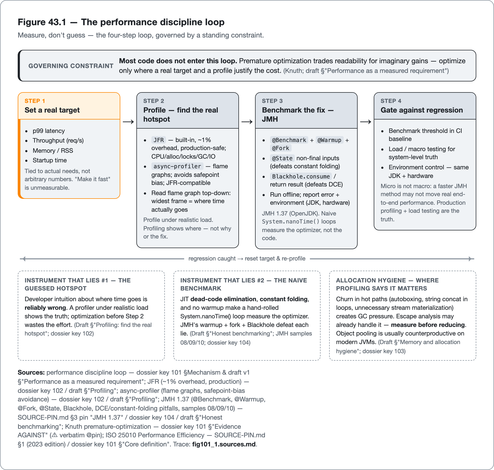

<!--
Dossier key: 101 (owner, leads, Part XIII umbrella) + folds 102 + 103 + (104⊕51 merged) — per 01-index/FINAL_INDEX.md Ch 43 (OPENS Part XIII — Performance & Observability)
Slug: 101_performance_profiling_memory_benchmarking (owner key 101)
Part / arc position: Part XIII — Performance & Observability, Chapter 43 (OPENS Part XIII; Ch 43-45)
Companion module: 08-companion-code/ (guessed-vs-profiled hotspot via JFR/async-profiler flame graph; an allocation-churn method profiled + reduced; a JMH benchmark done-wrong (DCE) vs done-right (Blackhole+warmup+fork) + GCProfiler) — EXAMPLE-BUILD = BUILT GREEN (mvn -B -Pquality verify on JDK 21.0.11: 12 tests, 0 Checkstyle, 0 SpotBugs; JMH 1.37 harness compiled — built, not run; see _EXAMPLE.md, PASS 2026-06-26); profiling/JMH *runs* stay toolchain+env-gated → REPRO PENDING-RUNTIME. Spec at foot.
Verified against SOURCE-PIN: 2026-06-20 (re-confirmed 2026-06-27 against the corrected pin — JMH 1.37 verified as a pinned row + green companion build). Sources (5 dossiers; Part XIII umbrella; the unifying spine = MEASURE-DON'T-GUESS + the-instruments-that-lie; JEPs/GC/JMH ⚠ verify at pin; Valhalla AHEAD-OF-PIN):
- Performance-as-quality-attribute (101, leads/umbrella): performance = ISO 25010 Performance Efficiency (time-behavior, resource-utilization, capacity; Ch 1 key 01) — but the quality axis most-optimized at the wrong time/place on guesses. STANCE: measure, target, gate like any quality attribute — WHEN IT MATTERS — while resisting premature optimization that trades readability (Ch 2 key 03) for imaginary gains. Performance is a REQUIREMENT not a vibe (targets: p99 latency/throughput/memory-RSS/startup tied to real needs; "make it fast" unmeasurable). Measure-before-optimizing: profile (§B) for the REAL hotspot; benchmark (JMH §D) the change; never on intuition (cause of most wasted perf work). Loop: set-target → profile → benchmark-the-fix → gate-against-regression (Ch 44 key 105). Knuth premature-optimization: optimizing before measuring / micro-optimizing cold paths adds complexity+bugs for no gain — a quality ANTI-pattern; "when it doesn't matter" = most code. Modern Java context (Ch 5/14 key 13/22): virtual threads reshape concurrency-perf; records/escape-analysis affect allocation (§C). LIMITS: premature/misplaced-optimization the DOMINANT failure (cold-code micro-opts cost readability for nothing); perf trades-against readability/maintainability/simplicity; microbenchmarks-lie (§D — macro/load Ch 44/§D + production profiling are the truth); performance ≠ whole-of-quality (fast-but-unmaintainable/incorrect ≠ high-quality); targets-must-be-real (arbitrary-number gates = vanity Ch 1 key 04).
- Profiling (102, §B, ⚠ niches): "where does time/allocation actually GO?" — prerequisite for any optimization. Developers' hotspot guesses routinely wrong; a profiler shows the truth. JFR (JDK Flight Recorder): built into the JVM, ~1% overhead, PRODUCTION-capable; records events (CPU/allocation/locks/GC/I/O) → analyze in JDK Mission Control / IDE plugins; default first reach (always-available + low-overhead); JEP 509 adds CPU-time profiling (experimental). async-profiler: low-overhead sampling → FLAME GRAPHS; strong CPU (perf_events)/allocation/lock; avoids safepoint-bias; JFR-compatible output. Flame graphs: width = time/samples in a call path; read top-down for widest/hottest frames. Commercial (YourKit/JProfiler — richer UI, paid). Profile under REALISTIC load (near production — JFR's strength). Sampling (low-overhead, statistical) vs instrumentation (exact, high-overhead, distorts) — prefer sampling for hotspots. LIMITS: shows WHERE not WHY/the-fix (interpretation + hypothesis + benchmark §D still required); sampling-is-statistical (short/rare events missed; misreading flame graph — inlined frames, wall-vs-CPU — misleads); profile-the-wrong-thing (microbench/unrealistic load → hotspots that don't matter); overhead/observer-effect (instrumentation distorts; even low overhead shifts latency-sensitive timing); ⚠ tool-niches (JFR=production/built-in / async-profiler=flame-graphs-CPU / commercial=UX — crown none).
- Memory/allocation hygiene (103, §C): on the JVM no manual memory mgmt, but allocation drives performance (GC pressure/pauses) + correctness (leaks→OOM). MEMORY HYGIENE = deliberate about what you allocate/retain; prevents a class of production incidents. Generational hypothesis: most objects die young; generational collectors (G1 default, ZGC low-latency, Parallel throughput) exploit this; allocation cheap, GARBAGE (short-lived churn) → GC pressure → pauses/latency; know your collector's trade-off. Allocation hygiene WHERE PROFILING (§B) SAYS IT MATTERS: avoid needless allocation in hot paths (per-request churn, autoboxing in loops, string-concat-in-loops → StringBuilder, unnecessary stream materialization); reuse where safe; size collections (avoid resize churn). MEASURE FIRST — don't micro-optimize cold code. Escape analysis/JIT: can stack-allocate/scalar-replace non-escaping objects — "allocation" ≠ always heap → another reason to MEASURE (JFR allocation profiling) not assume. Leak prevention (correctness): unbounded caches/collections, unremoved listeners, ThreadLocal not cleared (esp pooled/virtual threads Ch 14), unclosed resources (Ch 8 try-with-resources); heap dumps + JFR/leak tools diagnose; weak/soft refs + bounded caches prevent. Records/value-based (Ch 4/5 key 10/13): immutable small objects + (future) value types affect allocation — value classes AHEAD-OF-PIN. LIMITS: premature-allocation-micro-opt the trap (cold paths cost readability for nothing; JIT escape-analysis may already handle — profile first); object-pooling usually counterproductive on modern JVMs (cheap alloc + good GC — adds complexity+bugs; reserve for genuinely-expensive objects); GC-tuning deep+workload-specific (blind flag-tuning hurts; defaults + right-collector usually right, cargo-culted flags hurt — measure); leaks-subtle (slow leaks pass tests, surface in production — needs monitoring Ch 45 + heap analysis); memory-hygiene ≠ correctness/quality overall.
- Benchmarking honestly (104⊕51 merged, §D): measuring small Java code accurately is deceptively hard — JIT dead-code-elimination + constant-folding + no-warmup quietly invalidate a naive System.nanoTime() benchmark → confident lies. JMH (Java Microbenchmark Harness, OpenJDK, **1.37** — SOURCE-PIN §3 pinned row, ✅ confirmed 2026-06-27 + green companion build; jmh-core + jmh-generator-annprocess code-gen at build time, NOT reflection): controls for these. Why naive lies: JIT eliminates unused results (DCE), folds constants, inlines/optimizes loops; no warmup = JIT hasn't compiled; GC/JVM noise — a hand-rolled timer measures the OPTIMIZER not your code. JMH controls: @Benchmark; WARMUP (let JIT compile); FORK (fresh JVM/fork, avoid profile pollution); @State (shared, non-final inputs → defeats constant folding); Blackhole.consume / return result (defeats DCE); Mode (Throughput/AverageTime/SampleTime/SingleShotTime) + @OutputTimeUnit; report error/CI. Pitfalls (cite samples 08 DeadCode/09 Blackholes/10 ConstantFold/38 PerInvokeSetup): return-nothing (DCE), constants (folding), @Setup(Level.Invocation) ("almost always wrong" — 4 warnings: timestamp saturation/coordinated-omission/critical-path-sync/teardown-overlap; only >1ms, validate first), too-few warmup/forks, benchmarking trivial JIT-erased code. The IDE-final/inline quick-fix (Ch 9 key 36) actively BREAKS the benchmark (sample 10 warns) — author-tooling vs benchmark correctness conflict. Profilers (-prof GCProfiler/LinuxPerfAsm/Stack) turn a number into a diagnosis. Run: separate module/profile, offline (not the unit-test fast path), java -jar benchmarks.jar. LOUDEST CAVEAT: MICRO ≠ MACRO — a faster JMH method may not move (or may hurt) real end-to-end perf (cache/contention/I/O/real-data dominate); production profiling (§B) + load testing (Ch 44/§D macro) are the truth; JMH answers a NARROW question. LIMITS: micro≠macro; easy-to-misuse (DCE/fold/setup → confident-but-wrong; literature shows widespread bad practice — Costa et al. TSE); over-reading-small-diffs (1-3% within noise/overlapping CIs = nothing; report error); time-cost (warmup+forks slow — reserve for where micro-perf matters); hardware/JVM-specific (don't transfer across machines/JDKs — state environment).
⚠ verify-at-pin: Knuth premature-optimization quote/attribution; ISO 25010 Performance Efficiency sub-characteristics (Ch 1 key 01); JFR overhead (~1%) + JEP 509 status + async-profiler modes/versions + Mission Control; default GC (G1) + ZGC/Parallel trade-offs at pinned JDK + escape-analysis specifics; JMH default warmup/fork/measurement counts (defaults move between versions — module sets explicit counts, asserts no default) + Costa et al. TSE + Oracle pitfalls wording. [✅ RESOLVED 2026-06-27 — JMH **1.37** version + annotations/Mode/Scope/Level/Blackhole/@OutputTimeUnit confirmed: SOURCE-PIN §3 pinned row + green companion build (PricingBenchmark.java compiles the harness against 1.37).] ⚠ AHEAD-OF-PIN: value types (Valhalla) — never assert (Ch 4/5 key 10/13/14). SOURCE-PIN §7 canon: ISO 25010 + Knuth + JMH samples + Testing-pyramid (Cohn/Fowler) not pinned rows; JMH §3 = pinned row 1.37 (✅ resolved 2026-06-27).
Routes: ISO 25010/quality attributes → Ch 1 (01); readability trade-off → Ch 2 (03); smells/complexity → Ch 12 (19); modern Java/virtual threads → Ch 5/14 (13/22); resources (try-with-resources) → Ch 8 (16); caches → Ch 23 (around key 23); records/value types → Ch 4/5 (10/13); IDE inspections (the final quick-fix) → Ch 9 (36); annotation processors → Ch 18 (40); concurrency/locks → Ch 14 (20/24); flaky (hard-ns-assertion) → Ch 20 (49); mutation/coverage (necessary-not-sufficient sibling) → Ch 23 (47/48); load/macro testing → Ch 44/§D; PERF-REGRESSION GATE → Ch 44 (105); observability/monitor-leaks → Ch 45 (106/107/108); metrics/vanity (arbitrary targets) → Ch 1/38 (04); fitness functions (perf gate) → Ch 26 (56).
DRAFT v1 — gates manual; measure-dont-guess(the spine) + the-instruments-that-lie(profiling-defeats-guessed-hotspot + JMH-defeats-naive-benchmark) + performance-is-a-requirement-not-a-vibe + premature-optimization-is-the-dominant-failure/most-code-dont + micro≠macro + allocation-hygiene-where-it-matters/pooling-rarely-helps + escape-analysis-another-reason-to-measure + performance-trades-against-readability + performance≠whole-of-quality shapes; PART XIII OPENER/UMBRELLA. EXAMPLE-BUILD pending.
-->

# Measure, Don't Guess

*Performance as a quality attribute: setting targets, profiling the real hotspot, allocation hygiene where it matters, and honest benchmarking with JMH · 101 (folds 102, 103, 51, 104) · Part XIII (opener / umbrella)*

> A developer spends a week hand-optimizing the method they were sure was the bottleneck. The latency does not move — the real hotspot was elsewhere, the one a profiler would have found in five minutes. And the benchmark that "proved" the 10× speedup? The JIT had deleted the code being measured.

## Hook

A developer is certain they know the bottleneck. They spend a week hand-optimizing one method, adding a cache, inlining calls by hand, shaving allocations, making the code measurably worse to read. They ship it, and the p99 latency does not move at all. The real hotspot was a different method entirely, the one a profiler would have pointed at in five minutes. And it gets worse. The microbenchmark they used to "prove" the optimization showed a tenfold speedup that was pure **dead-code elimination**: the JIT compiler, seeing that the result was never used, had deleted the work they thought they were timing. Two lies, both classic, both expensive: the **guessed hotspot** and the **unguarded benchmark**. The week traded readability for nothing, justified by a number that measured the optimizer rather than the code.

This opening chapter of Part XIII is the discipline that defeats both lies, and it rests on a single principle: **measure, don't guess.** Performance is a real quality attribute. ISO 25010 names *Performance Efficiency* alongside the maintainability and reliability the book has covered, but it is the attribute most often optimized at the wrong time, in the wrong place, on intuition. The discipline replaces intuition with measurement at every step: set a *target* (not "make it fast"), *profile* to find the real hotspot (not guess it), reduce *allocation* where profiling says it matters (not everywhere), and benchmark the fix *honestly* with JMH (which defends against the JVM's lies). For most code, the discipline declines to optimize at all, because premature optimization trades readability for imaginary gains. The chapter has four movements: performance as a measured requirement, profiling, memory and allocation hygiene, and honest benchmarking. One spine unifies them, and so does one recurring villain, the *instrument that lies*, whether that instrument is developer intuition about where time goes or a naive timing loop that the JIT has quietly defeated.

## Overview

**What this chapter covers**

- **Performance as a quality attribute**: defining targets, the measure-then-optimize loop, and why premature optimization is the dominant failure.
- **Profiling**: JFR and async-profiler, flame graphs, and finding the *real* hotspot under realistic load.
- **Memory and allocation hygiene**: the generational hypothesis, allocation reduction where it matters, leak prevention, and why object pooling usually backfires.
- **Honest benchmarking**: how naive benchmarks lie (dead-code elimination, constant folding, no warmup), how JMH defends against it, and the loud caveat that micro ≠ macro.

**What this chapter does NOT cover.** The performance-regression *gate*, protecting measured performance in CI the way the gate protects correctness (the next chapter, with load/macro testing). Observability — logging, metrics, tracing — as runtime quality (the chapter after). Concurrency mechanics and virtual threads (Part III). ISO 25010 itself (Chapter 1). Modern-Java features (Chapter 5). The profiler tools are **niches, crowned none**; GC defaults, JFR overhead, and JMH versions/defaults are **verified at the pin**; and **value types (Valhalla) are AHEAD-OF-PIN — referenced, never asserted.**

**One idea to carry forward:** *performance is a quality attribute to measure, not guess at. Set a real target, profile to find the actual hotspot, reduce allocation only where profiling says it matters, and benchmark the fix honestly (JMH defeats the JVM's lies). Most code should not be optimized at all, because premature optimization trades readability for imaginary gains, and even a correct microbenchmark answers only a narrow question: micro is not macro.*

## How it works

The whole discipline fits one loop, shown in Figure 101.1: set a real target, profile to find the actual hotspot, benchmark the fix honestly with JMH, then gate the result against regression. The four sections below walk each step in turn. The loop's first lesson is the gate around it, since most code never enters the loop at all.

*Figure 101.1 — the "measure, don't guess" performance loop: set a real target, profile, benchmark the fix with JMH, gate against regression. Most code never enters the loop.*

### Performance as a measured requirement

Performance is an ISO 25010 quality characteristic, *Performance Efficiency* (time behavior, resource utilization, capacity), which means it can be specified, measured, and gated like any other quality attribute. The first discipline is to make it a *requirement, not a vibe*:

> **CONCEPT** *Performance is a requirement, not a vibe: measure before optimizing.* "Make it fast" is unmeasurable and ungateable; a *target* is neither. Define what actually matters: p99 latency, throughput, memory/RSS, startup time, each tied to a real need rather than an arbitrary number (an arbitrary perf target is a vanity metric, Chapter 38). Then the loop: *set the target → profile to find the real hotspot (next section) → benchmark the fix honestly (JMH) → gate against regression (next chapter).* Every step replaces a guess with a measurement, because the dominant failure of performance work is acting on intuition, and developers' intuitions about where time goes are routinely, dramatically wrong.

**Knuth's premature optimization** names the dominant failure. Optimizing before measuring, or micro-optimizing code that is not hot, adds complexity and bugs for no gain: a quality *anti*-pattern that trades the readability of Chapter 2 for imaginary speed. "When it does *not* matter" describes most code: the cold path, the startup-only method, the loop that runs ten times. Performance *trades against* readability, maintainability, and simplicity; that cost is worth paying only where a real target justifies it, and a fast but unmaintainable or incorrect system is not high-quality. Performance is one axis among several, not the whole of quality.

### Profiling: find the real hotspot

Optimization without profiling is the guessed-hotspot lie from the hook. **Profiling answers "where does the time and allocation actually go?"**, and the answer is reliably not where intuition points. The two mainstream Java profilers are low-overhead and complementary:

- **JDK Flight Recorder (JFR)** is built into the JVM, runs at roughly 1% overhead (verify at the pin), and is designed for *production* profiling. It records events (CPU, allocation, locks, GC, I/O) to a recording analyzed in JDK Mission Control or an IDE plugin. It is the default first reach precisely because it is always available and cheap enough to leave on. (JEP 509 adds experimental CPU-time profiling for more accurate attribution.)
- **async-profiler** is a low-overhead sampling profiler that produces **flame graphs**, strong for CPU (via `perf_events`), allocation, and lock profiling, and it avoids the safepoint bias of older samplers. Its output is JFR-compatible.

> **CONCEPT** *Read a flame graph, and profile the real thing.* A flame graph's width is time (or samples) in a call path; read it top-down and look for the *widest* frames, the places where the cycles actually go. Two disciplines make the reading trustworthy. Profile under *realistic load*, because a microbenchmark or a synthetic workload produces hotspots that do not exist in production (JFR's production-safety is exactly so the real workload can be profiled). And remember that profiling shows *where*, not *why* or *the fix*. The profiler localizes the problem; forming a hypothesis and *measuring the fix* (the benchmarking section) is still the engineer's job.

The honest limits: sampling is statistical, so short or rare events can be missed, and a misread flame graph (inlined frames, wall-clock versus CPU time) misleads; instrumentation profilers are exact but high-overhead and *distort* the timing they measure (the observer effect), which is why sampling is preferred for hotspots. The tools occupy niches. JFR covers built-in production profiling, async-profiler covers flame-graph CPU work, and commercial tools (YourKit, JProfiler) offer richer UIs. The book crowns none.

### Memory and allocation hygiene

On the JVM memory is not managed by hand, but *allocation behavior* drives both performance (GC pressure and pause latency) and correctness (leaks lead to OutOfMemoryError). **Memory hygiene**, being deliberate about what is allocated and retained, prevents a whole class of production incidents.

> **CONCEPT** *The generational hypothesis, and allocation churn as the cost.* Most objects die young, and generational garbage collectors (G1 by default, ZGC for low pause latency, Parallel for raw throughput; verify defaults at the pin) are built to exploit that. Allocation itself is cheap. The cost is *garbage*, the short-lived churn that creates GC pressure and therefore pauses and latency. So the hygiene lever, *where profiling says it matters*, is reducing needless allocation in hot paths: autoboxing in a tight loop, string concatenation in a loop (use `StringBuilder`), unnecessary stream materialization, per-request object churn, and unsized collections that pay for resize churn. The qualifier is everything. *Measure first*, because the next concept undercuts the naive version of this advice.

The companion module reduces a churning summary to a sized `StringBuilder`, but only where profiling says the churn matters and only after a test proves the answer is unchanged:

<!-- include: 101_performance_profiling_memory_benchmarking/src/main/java/org/acme/performance/OrderPricing.java#allocation-reduced -->

> **CONCEPT** *Escape analysis means "allocation" is not always heap allocation: another reason to measure.* The JIT can *stack-allocate* or *scalar-replace* objects that do not escape their method, so an allocation in source code may cost nothing at runtime. This is why guessing about allocation is as unreliable as guessing about hotspots, and why object pooling is *usually counterproductive* on modern JVMs. Allocation is cheap and the GC is good, so pooling typically adds complexity and bugs for no gain, and should be reserved for genuinely expensive objects. The recurring lesson is to measure (JFR allocation profiling) rather than assume.

The other half of memory hygiene is *leak prevention*, which is a correctness concern. The common Java "leaks" are unbounded caches and collections, unremoved listeners, `ThreadLocal`s never cleared (especially dangerous with pooled or virtual threads, Part III), and unclosed resources (try-with-resources, Chapter 10). These are subtle. A slow leak passes every test and surfaces only in production, so it needs monitoring (the observability chapter) and heap analysis, not only code review; weak/soft references and *bounded* caches prevent them. (Records and immutable small objects affect allocation too; value types remain AHEAD-OF-PIN and are not asserted here.) GC tuning, finally, is deep and workload-specific: blind flag-tuning usually hurts, while the right collector choice with sensible defaults is usually the right call. Measure.

### Honest benchmarking: JMH and the lies it defeats

Even after finding the real hotspot and forming a fix, measuring whether the fix *works* is deceptively hard, because **a naive Java benchmark lies.** The measurement apparatus shares a JVM with the thing being measured, and the JIT will quietly invalidate a hand-rolled `System.nanoTime()` loop:

> **CONCEPT** *Why naive benchmarks lie, and JMH's three defenses.* The JIT *eliminates* code whose result is never used (dead-code elimination), *folds* constant inputs to a precomputed answer (constant folding), and runs *cold, un-compiled* code when warmup is skipped. A hand-rolled timer therefore measures the optimizer, not the algorithm (the hook's phantom 10×). **JMH** (the OpenJDK Java Microbenchmark Harness) defends against exactly these. *Warmup* iterations let the JIT compile to steady state. *Forking* runs each benchmark in a fresh JVM so one does not pollute another's compilation profile. And the result is made *observable*: return it (or sink it through a `Blackhole`) so it cannot be eliminated, and read inputs from non-final `@State` fields so they cannot be constant-folded. JMH cannot stop the JIT optimizing; it provides the idioms that make the work *un-deletable*.

The companion module's benchmark reads its input from a non-final `@State` field populated once per trial, so the JIT cannot fold it to a constant:

<!-- include: 101_performance_profiling_memory_benchmarking/src/main/java/org/acme/performance/PricingBenchmark.java#state-setup -->

The lying form discards its result and uses a constant input, so the work can be eliminated and an absurd time reported; the honest form returns the result computed from the `@State` input:

<!-- include: 101_performance_profiling_memory_benchmarking/src/main/java/org/acme/performance/PricingBenchmark.java#lying-benchmark -->

<!-- include: 101_performance_profiling_memory_benchmarking/src/main/java/org/acme/performance/PricingBenchmark.java#honest-benchmark -->

The pitfalls are well-documented (JMH ships them as canonical samples): returning nothing (dead code), using constant inputs (folding), too few warmup iterations or forks, and `@Setup(Level.Invocation)`, a footgun JMH's own docs warn is "almost always wrong." Author tooling and benchmark correctness can even conflict directly: the IDE's suggestion to make a `@State` field `final` (Chapter 17's inspections) *silently breaks the benchmark* by re-enabling constant folding. Benchmarks belong in a *separate* run (their own module or profile, run offline), not the unit-test fast path, because honest results need slow warmup and multiple forks.

When a benchmark produces more than one value, returning one is not enough; each result is sunk through a `Blackhole` so none is eliminated:

<!-- include: 101_performance_profiling_memory_benchmarking/src/main/java/org/acme/performance/PricingBenchmark.java#blackhole-sink -->

> **CONCEPT** *Micro is not macro: the loudest caveat.* This is the benchmarking sibling of "coverage is not quality." A correct JMH microbenchmark answers a *narrow* question (how fast is this one method at steady state, in isolation), and a faster method there may not move, or may even hurt, real end-to-end performance, where caches, contention, I/O, and real data sizes dominate. *Production profiling and load testing are the truth; the microbenchmark is necessary-not-sufficient evidence about one component.* Do not over-read small differences: a 1–3% "win" inside overlapping confidence intervals is usually noise. Report the error, state the hardware and JDK (results do not transfer across machines or versions), and reserve the whole expensive exercise for code where micro-performance genuinely matters.

## Deep dive: the instrument that lies, and the discipline that earns the number

The four movements are one discipline (**measure, don't guess**), and the unifying difficulty is the **instrument that lies**. Performance is unique among the book's quality attributes in that the naive instruments for measuring it are *actively deceptive*, not merely incomplete. Developer intuition about where time goes lies confidently, specifically, and almost always, which is why the guessed hotspot wastes a week. A `System.nanoTime()` loop lies too: the JIT deletes the work and reports a phantom speedup. Even a flame graph reading can lie (inlined frames, wall versus CPU), and an assumption about allocation can lie (escape analysis already handled it). The entire discipline of this chapter is the set of *defended* instruments that do not lie: a profiler under realistic load instead of intuition, JMH with warmup and forks and blackholes instead of a hand-rolled timer, allocation profiling instead of assumption. A trustworthy performance number is not free; it is earned by using an instrument hardened against the specific ways the JVM makes naive measurement lie.

The same pattern runs through the book's other quality attributes. Coverage is a signal that is necessary-not-sufficient and mistaken for quality (Chapter 23); a maintainability index is a number mistaken for precision (Chapter 2); a metric becomes a target and stops measuring (Chapter 38). Performance has its own folklore (*the guessed hotspot* and *the green microbenchmark is the truth*), and the antidote is identical: treat the number as **evidence requiring a defended methodology, never as ground truth.** A benchmark result without warmup, forks, and a stated environment is exactly as worthless as a coverage percentage without assertions, and for the same structural reason: the cheap version of the measurement measures the wrong thing while looking authoritative. The performance engineer's discipline and the test engineer's discipline are one discipline (earn the signal, distrust the naive number, state the limits), applied here to a domain where the JVM makes the naive number lie more aggressively than almost anywhere else.

**The most important performance decision is usually not to optimize at all.** Every concept in this chapter is downstream of a target and a profile, and the reason is that optimization is *never free*: it trades the readability, simplicity, and maintainability that the rest of the book spends forty chapters defending, in exchange for speed that, for most code, no one needs and no user will feel. The premature-optimization anti-pattern is not a footnote; it is the governing constraint, because the cost of a misplaced optimization is paid twice: once in the wasted effort, and forever after in the complexity it leaves in code that did not need it. The discipline is not "here is how to make Java fast." It is "here is how to find the rare place where speed is a real requirement, prove it with measurement, fix it with the smallest change the numbers justify, and leave everything else readable." Performance, done as quality rather than as folklore, is mostly the judgment to *not* act, and, where action is warranted, the rigor to measure rather than guess at every step. That judgment, and not any profiler or harness, separates performance work that improves a system from performance work that makes the code harder to read while the latency stays exactly where it was.

## Limitations & when NOT to reach for it

- **Most code should not be optimized.** Premature and misplaced optimization is the dominant failure; it costs readability and adds bugs for no measurable gain. "When it does not matter" is most code, and the default is to leave it readable.
- **Never optimize on a guess.** Intuition about hotspots is reliably wrong; profile under realistic load first, or the wrong method gets optimized (the wasted week).
- **Performance trades against other attributes.** Speed costs readability, simplicity, and maintainability; that cost is worth paying only where a real, measured target justifies it. A fast but unmaintainable or incorrect system is not high-quality.
- **Profiling shows where, not why or the fix.** Sampling is statistical (rare events missed), flame graphs are misreadable, and instrumentation distorts timing. The profiler localizes; forming a hypothesis and measuring the fix is still the engineer's work.
- **Naive benchmarks lie.** Dead-code elimination, constant folding, and missing warmup make a hand-rolled timer measure the optimizer. Use JMH; even the IDE's `final` suggestion can break a benchmark.
- **Micro is not macro.** A faster microbenchmark may not move real-system performance; it is necessary-not-sufficient evidence about one component. Production profiling and load testing are the truth, so do not over-read a small diff, and state the environment.
- **Object pooling usually backfires.** On modern JVMs allocation is cheap and the GC is good; pooling adds complexity for no gain except for genuinely expensive objects. Measure before reducing allocation, because escape analysis may already handle it.
- **GC tuning is workload-specific.** Blind flag-tuning usually hurts; defaults plus the right collector are usually the right call; cargo-culted flags hurt. Measure.
- **Targets must be real.** A perf gate on an arbitrary number is a vanity metric; tie targets to actual needs (p99, throughput, RSS, startup).
- **Value types are AHEAD-OF-PIN.** Valhalla's allocation implications are referenced, not asserted; do not design on unreleased features.

## Alternatives & adjacent approaches

- **JFR vs async-profiler vs commercial:** built-in production profiling vs flame-graph CPU/allocation profiling vs richer paid UIs; niches chosen by need, crowned none.
- **Sampling vs instrumentation profiling:** low-overhead statistical vs exact-but-distorting; prefer sampling for hotspots, instrumentation only when exact counts are needed and the observer effect is tolerable.
- **Microbenchmark vs profiler vs load test:** complementary instruments at different levels. Profiler for *where* in a real workload, JMH for *how fast* one method is at steady state, load testing for *system behavior under demand* (next chapter). Use all three at the right level, not one for another's job.
- **Allocation reduction vs object pooling:** reduce churn where profiling shows it; pooling is the usually-counterproductive alternative, reserved for genuinely expensive objects.
- **JMH vs hand-rolled `nanoTime` loops:** the defended harness vs the trivially-available timer. The loop is fine for coarse order-of-magnitude checks and silently wrong for microbenchmarks. Crown neither; match precision to need.

These compose into the performance discipline: a real target, a profiler to find the hotspot under realistic load, allocation hygiene where it matters, an honest JMH benchmark of the fix, and load testing plus the regression gate (next chapter) for the system truth.

## When to use what

- **Before any optimization:** set a real target (p99/throughput/RSS/startup) and profile under realistic load; never optimize on a guess.
- **To find the hotspot:** JFR (built-in, production-safe) or async-profiler (flame graphs); read top-down for the widest frames.
- **To reduce a measured allocation hotspot:** cut needless churn (StringBuilder, sized collections, avoid autoboxing in loops), but only after profiling confirms it, and remembering escape analysis may already handle it.
- **To prevent leaks:** bounded caches, cleared ThreadLocals, try-with-resources (Chapter 10), and monitoring (next chapter) for the slow ones.
- **To measure whether a fix works:** JMH, with warmup, forks, Blackhole/return, and non-final `@State` inputs; in a separate run; report error and environment.
- **For system-level truth:** production profiling and load testing (next chapter), because micro is not macro.
- **For most code:** do not optimize. Keep it readable; performance is a quality attribute *where it matters*, and most code is where it does not.

## Hand-off to the next chapter

This chapter measured performance: it set a target, profiled the hotspot, benchmarked the fix. But a measured performance number, like a passing test, decays the moment the next commit lands: an innocent change adds an allocation to a hot path, a dependency upgrade regresses latency, and last quarter's p99 target silently slips. Correctness has a gate that catches regressions (the CI gate, Part IX); *performance needs the same thing.* The next chapter is the **performance-regression gate**, protecting measured performance in CI the way the quality gate protects correctness: load and macro testing for system-level behavior (the macro half of the micro-versus-macro story this chapter left open), benchmark and latency thresholds gated against a baseline, and the environment-control discipline that makes a performance number stable enough to gate on at all. Where this chapter found and fixed performance, the next one keeps it from regressing.

## Back matter — sources & traceability

- **Performance-as-quality-attribute** (key 101, leads/umbrella; ISO 25010 Performance Efficiency Ch 1 key 01; Knuth premature-optimization — ⚠ §7 canon rows @pin) — performance = a measurable quality axis, most-optimized-on-guesses. Requirement-not-vibe (targets: p99/throughput/RSS/startup, not arbitrary Ch 38 key 04). Loop: target → profile (§B) → benchmark (§D) → gate (Ch 44 key 105). Knuth: premature/cold-path optimization = anti-pattern; "when it doesn't matter" = most code; trades-against readability (Ch 2 key 03). Modern Java (Ch 5/14 key 13/22). *(LIMITS: premature-optimization-dominant-failure; trades-against-other-attributes; micro-lies §D; performance≠whole-of-quality; targets-must-be-real.)*
- **Profiling** (key 102, §B, ⚠ niches; JFR + JEP 509 + async-profiler — ⚠ overhead/status/versions @pin) — where-does-time/allocation-GO (guesses routinely wrong). JFR (built-in, ~1% overhead, production; CPU/alloc/locks/GC/IO → Mission Control; JEP 509 CPU-time experimental); async-profiler (sampling → FLAME GRAPHS, perf_events, no safepoint-bias, JFR-compatible); flame graphs (width=time, top-down); commercial (YourKit/JProfiler). Profile under REALISTIC load; sampling vs instrumentation. *(LIMITS: shows-where-not-why/the-fix; sampling-statistical; profile-the-wrong-thing; overhead/observer-effect; tool-niches crown-none.)*
- **Memory/allocation hygiene** (key 103, §C; GC docs G1/ZGC/Parallel + escape analysis + JFR alloc — ⚠ defaults/specifics @pin; Valhalla AHEAD-OF-PIN) — allocation drives perf (GC pressure→pauses) + correctness (leaks→OOM). Generational hypothesis; G1 default/ZGC low-latency/Parallel throughput; garbage-churn→pressure. Hygiene WHERE PROFILING SAYS (avoid hot-path churn: autoboxing/string-concat→StringBuilder/stream-materialization; size collections); MEASURE FIRST. Escape analysis (stack-alloc/scalar-replace → "allocation"≠heap → measure not assume). Leak prevention (unbounded caches/listeners/ThreadLocal-uncleared-with-virtual-threads Ch 14/unclosed-resources Ch 8; weak-soft-refs + bounded caches; heap dumps + monitoring Ch 45). Records/value (Ch 4/5 key 10/13; value AHEAD-OF-PIN). *(LIMITS: premature-alloc-micro-opt; object-pooling-usually-counterproductive; GC-tuning-deep/measure; leaks-subtle (monitoring Ch 45); ≠ correctness/quality overall.)*
- **Benchmarking honestly** (104⊕51 merged, §D; JMH OpenJDK **1.37** — SOURCE-PIN §3 pinned row ✅ confirmed 2026-06-27 + green companion build; samples 08/09/10/35/38 + Costa et al. TSE + Oracle pitfalls — ⚠ default counts/sample-wording @pin) — naive benchmarks LIE (JIT DCE + constant-folding + no-warmup → measures the optimizer). JMH (jmh-core + jmh-generator-annprocess code-gen; @Benchmark/Warmup/Fork/@State-non-final/Blackhole-or-return/Mode/@OutputTimeUnit; report error). Pitfalls (samples 08 DeadCode/09 Blackholes/10 ConstantFold/38 PerInvokeSetup-"almost-always-wrong"-4-warnings); IDE-final-quickfix breaks it (Ch 9 key 36); separate run, offline; -prof GCProfiler/LinuxPerfAsm. LOUDEST: MICRO≠MACRO (faster-method may-not-move real perf; production profiling §B + load testing Ch 44 = truth; narrow question). *(LIMITS: micro≠macro; error-prone-to-misuse (confident-but-wrong; Costa et al.); over-reading-small-diffs (report-error); time-cost; hardware/JVM-specific.)*
- **Routing** — ISO 25010 → Ch 1 (01); readability → Ch 2 (03); smells → Ch 12 (19); virtual threads → Ch 5/14 (13/22); resources → Ch 8 (16); records/value → Ch 4/5 (10/13); IDE inspections → Ch 9 (36); annotation processors → Ch 18 (40); locks → Ch 14 (20/24); flaky-ns-assertion → Ch 20 (49); coverage/mutation (necessary-not-sufficient sibling) → Ch 23 (47/48); load testing + PERF-REGRESSION GATE → Ch 44 (105); observability/monitor-leaks → Ch 45 (106/107/108); metrics/vanity → Ch 1/38 (04); fitness function (perf gate) → Ch 26 (56). SOURCE-PIN §7 canon: ISO 25010 + Knuth + JMH samples + testing-pyramid (still ⚠ canon/TO-PIN — not pinned rows); JMH version **1.37** = SOURCE-PIN §3 pinned row (✅ resolved 2026-06-27); Valhalla AHEAD-OF-PIN.

**Companion module (BUILT GREEN — `08-companion-code/101_performance_profiling_memory_benchmarking/`; `mvn -B -Pquality verify` on JDK 21.0.11: 12 tests, 0 Checkstyle, 0 SpotBugs; JMH 1.37 harness compiled (built, not run — benchmarks run offline); profiling/JMH *runs* remain toolchain+env-gated → REPRO PENDING-RUNTIME):** three demos on the flagship domain showing measure-don't-guess: (a) **profiling** — a workload with a *guessed* hotspot (`formatLineLabel`) and a *real* one (`tieredDiscountMinor`); a profiler under realistic load reveals the real hotspot (the guess was wrong) — read top-down (JFR/async-profiler runs are env-gated; the README documents the command); (b) **allocation** — a hot method with per-call string-concat churn (`summaryLineChurning`), then reduced (`summaryLine`: `StringBuilder` + sized buffer), with a test proving the answer is unchanged; (c) **benchmarking** — a JMH benchmark done *wrong* (`measureWrong()`: discards result + `final` constant input → DCE) beside *right* (`measureRight()`: non-final `@State` input + returns; `measureTwoResults()`: `Blackhole.consume`; `@Fork`/`@Warmup`/`@Measurement` + `@BenchmarkMode(Mode.AverageTime)`), runnable with `-prof gc`; a JUnit correctness test (perf ≠ correctness) and externalized dev/prod run profiles. **Honest edges (comments):** profile-before-optimizing (the guess was wrong); reduce allocation only where profiling says + escape-analysis-may-already-handle-it + pooling-usually-backfires; the lying benchmark reports a phantom speedup (DCE) — and SpotBugs flags it (reviewed suppression documents the beat); the IDE `final` quick-fix re-breaks it; micro ≠ macro (this is one method, not the system); state the JDK + hardware. Demonstrates measure-don't-guess + the-instruments-that-lie + premature-optimization-is-the-default-mistake.

Snippet tags: `allocation-reduced` (OrderPricing.java) · `state-setup`, `lying-benchmark`, `honest-benchmark`, `blackhole-sink` (PricingBenchmark.java).

