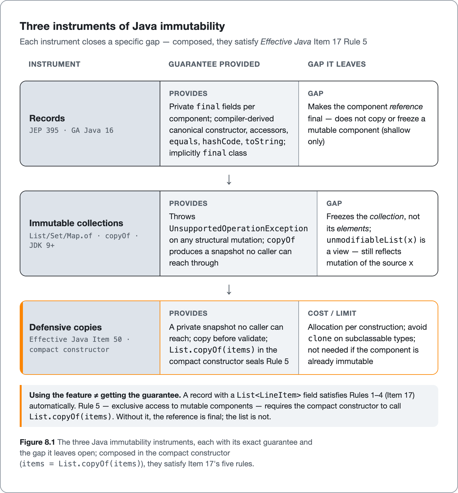

<!--
Dossier key: 10 (owner) + folds 15 — per 01-index/FINAL_INDEX.md Ch 8
Slug: 10_immutability_value_design
Part / arc position: Part II — Writing Quality Java, Chapter 8
Companion module: 08-companion-code/10_immutability_value_design/ — EXAMPLE-BUILD = BUILT (green at Java 21.0.11; `mvn -Pquality verify`). 7 snippet tags bound. Spec at foot.
Verified against SOURCE-PIN: 2026-06-20. Sources: JEP 395 (records, final Java 16); JEP 390 (value-based classes, Java 16); JEP 401 (value classes, PREVIEW — ⚠ AHEAD-OF-PIN); JDK 21 API (List/Set/Map.of+copyOf, Collections.unmodifiable*, Object equals/hashCode/toString contracts verbatim, Comparable.compareTo contract verbatim, Objects.hash/equals, Comparator combinators); Effective Java 3e (2018) Items 10/11/12/14/17/50; SonarQube java:S2384/S1206/S1210/S1244; PMD ImmutableField/ArrayIsStoredDirectly/MethodReturnsInternalArray/OverrideBothEqualsAndHashcode; Error Prone @Immutable/ImmutableChecker/EqualsHashCode/CompareToZero/EqualsGetClass; SpotBugs HE_*/EQ_*/CO_*; Checkstyle EqualsHashCode/CovariantEquals/EqualsAvoidNull.
⚠ verify-at-pin: copyOf version (Java 10); tool rule defaults/IDs; EJ verbatims; BigDecimal inconsistency; JEP numbers. ⚠ AHEAD-OF-PIN: JEP 401 value classes (preview at 25), Valhalla.
DRAFT v1 — gates manual; three-instruments + contract-card shapes; EXAMPLE-BUILD pending JDK.
-->

# Objects That Don't Change Their Mind

*Immutability, records, and the four contracts the language enforces in silence · 10 (folds 15) · Part II*

> The compiler will make a record's fields final for you. It will not make the list inside one stop changing.

## Hook

Write `record Order(String id, List<LineItem> items) {}` and the type feels safe: a record, records are immutable. Then a test does this:

```java
List<LineItem> lines = new ArrayList<>(List.of(apple));
Order order = new Order("A-1", lines);
lines.add(banana);          // mutate the list you handed in
assert order.items().size() == 1;   // fails — it's 2
```

The "immutable" order grew a line item after construction, and nobody called a setter. The record kept its *reference* to the list final (the reference cannot be reassigned), but it never copied or froze the list itself. The object changed its mind, silently, because something else still held the same list.

This chapter is about objects that genuinely do not change their state, and about the related promises Java enforces *in silence* — the `equals`, `hashCode`, `Comparable`, and `toString` contracts that the JDK's own collections depend on, and that silently break without ever raising a compile error. Immutability and these contracts are the same subject from two angles: an immutable value type is only trustworthy if it also answers "are these two equal?" correctly, and a correct `equals`/`hashCode` is only stable if the fields behind it cannot shift under it.

## Overview

**What this chapter covers**

- The three instruments of immutability (**records**, **immutable collections**, **defensive copies**) and the exact gap each one leaves open, which is where the hook's bug lives.
- *Effective Java* Item 17's five rules for an immutable class, and Item 50's defensive-copy discipline.
- The four JDK contracts that machines check (`equals`, `hashCode`, `Comparable.compareTo`, `toString`), stated as the spec writes them.
- The recurring contract violations (override `equals` but not `hashCode`; `int`-subtraction `compareTo`; `getClass` vs `instanceof`) and the analyzer rules that catch each.
- Where the modern language derives the behavior automatically (records derive correct `equals`/`hashCode`/`toString`) and where it cannot (ordering, array components, inheritance).

**What this chapter does NOT cover.** The thread-safety payoff of immutability (Chapter 14, safe publication), the analyzer internals (Part IV), record *patterns* and modern-feature readability (Chapter 5), null-safety tooling (Chapter 9), and allocation cost in hot paths (the performance part). This chapter owns the *design discipline* and the *contracts*; it links out for the tool mechanics.

The central idea: *using the feature is not the same as getting the guarantee.* A record gives immutability's intent, not its enforcement, for mutable components. Overriding `equals` without `hashCode` produces a value type that breaks the moment it meets a `HashMap`.

## How it works



*Three instruments of Java immutability — Each instrument closes a specific gap — composed, they satisfy Effective Java*


### Why immutability is the highest-leverage lever in Part II

An immutable object has exactly one state for its entire life. That single property cascades: it is **simple** to reason about (no "what is its state *now*?" question arises), **inherently thread-safe** (no two threads can race on state that never changes; see Chapter 14), and **safe to share, cache, and pass around** without defensive thought. *Effective Java* Item 17 states the default plainly: classes should be immutable unless there is a very good reason to make them mutable. Immutability does not *guard against* a category of bug (shared mutable state changing under code that assumed it would not) — it *removes the category*.

Item 17's five rules for an immutable class:

1. Do not provide mutators.
2. Ensure the class cannot be extended (typically `final`).
3. Make all fields `final`.
4. Make all fields `private`.
5. Ensure exclusive access to any mutable components: defensively copy them in and out so a client never gets a reference to a mutable internal.

Rules 1–4 are mechanical, and the language now helps with them. **Rule 5 is the one the language does not enforce.** That is exactly where the hook's bug lives.

### The three instruments, and the gap each leaves

Java provides three instruments for immutability. None is complete on its own; each leaves a specific gap the next one closes.

| Instrument | What it provides | The gap it leaves |
|---|---|---|
| **Records** (JEP 395) | final fields, derived ctor/accessors/`equals`/`hashCode`/`toString` | does *not* copy or freeze a mutable component (shallow) |
| **Immutable collections** (`List/Set/Map.of`, `copyOf`) | a structure that throws on mutation | freezes the *collection*, not its *elements* |
| **Defensive copies** (Item 50) | a private snapshot no caller can reach | costs an allocation; sharp edges with `clone` |

> **CONCEPT** *Using the feature ≠ getting the guarantee.* Each instrument carries immutability's intent but stops at a boundary. The skill is knowing where each stops and reaching for the next. A record's compact constructor calling `List.copyOf` is rules 1–4 (record) plus rule 5 (defensive copy of the collection) composed.

**Records (JEP 395, GA in Java 16).** A record is a transparent carrier for immutable data. For `record Range(int lo, int hi) {}` the compiler generates a private final field per component, a canonical constructor, an accessor per component (named `lo()`, `hi()`, no `get` prefix), and `equals`/`hashCode`/`toString` derived from the components. The record is implicitly `final`, extends `java.lang.Record` (so it cannot extend another class), and cannot declare extra instance fields. The seam for validation and defensive copying is the **compact canonical constructor**: the constructor body can validate and reassign the *parameters* (`if (hi < lo) throw new IllegalArgumentException(...)`), and the reassigned value is what gets stored. That is where `items = List.copyOf(items);` goes.

The pitfall the hook showed, stated precisely: a record makes the component *reference* final, but does **not** deep-copy or freeze a mutable component. `record Order(List<LineItem> items)` is *shallowly* immutable. The companion module keeps the leaky version runnable so a test can watch the order change underneath it:

<!-- include: 10_immutability_value_design/src/main/java/org/acme/immutability/OrderLeaky.java#leaky-record -->

The fix is a defensive copy in the compact constructor and, if the component type is still mutable, a copying accessor — `copyOf` already returns an unmodifiable list, so the accessor can hand the snapshot straight back:

<!-- include: 10_immutability_value_design/src/main/java/org/acme/immutability/Order.java#sealed-record -->

**Immutable collections (JDK 9+).** Keep two things separate:

- `List.of(...)`, `Set.of(...)`, `Map.of(...)`, and `copyOf(...)` return *conventionally immutable* collections: any `add`/`set`/`remove` throws `UnsupportedOperationException`. These factories are null-hostile (no null elements/keys/values), reject duplicates in `Set.of`/`Map.of` with `IllegalArgumentException`, and randomize iteration order across runs (intentionally, to surface order-dependent bugs).
- `Collections.unmodifiableList(x)` returns a read-only *view* over `x` — **not a copy**. If `x` is mutated, the view reflects it. Storing `unmodifiableList(someField)` over a retained mutable source still leaks mutation through the source.

The JDK doc's own line is the rule to remember: *an immutable collection of objects is not the same as a collection of immutable objects.* `List.of(mutableThings)` freezes the list, not the things in it. `List.copyOf(incoming)` is the defensive-copy primitive, returning an immutable snapshot (it may skip the copy if the argument is already an immutable JDK collection). The module shows the three factories side by side:

<!-- include: 10_immutability_value_design/src/main/java/org/acme/immutability/Catalog.java#immutable-collections -->

**Defensive copies (Item 50).** The manual seal for rule 5: copy each mutable parameter in the constructor and store the copy; copy *before* validating and validate the copy (so another thread cannot mutate the original between check and store); return copies from accessors. Avoid `clone` on a parameter whose type can be subclassed by untrusted code. The modern shortcut: prefer an immutable type in the first place. The classic mutable-`Date` field becomes an immutable `Instant`/`LocalDateTime`, and the copy disappears.

### The four contracts the language enforces in silence

An immutable value type is only trustworthy if it answers "are these equal?" and "how do these order?" correctly. Four `Object`/interface methods carry *machine-checked behavioral contracts*. Break them and the JDK's own collections misbehave silently, with code that compiles cleanly.

`equals(Object)` must implement an equivalence relation (verbatim, JDK 21 `Object` Javadoc): **reflexive** (`x.equals(x)` is true), **symmetric** (`x.equals(y)` iff `y.equals(x)`), **transitive**, **consistent** (repeated calls agree if no field changes), and **null-false** (`x.equals(null)` is false).

`hashCode()` must satisfy: equal objects have equal hash codes; the value is consistent within a run (need not survive across runs); unequal objects *may* share a hash but distinct hashes help hash-table performance. **Override `equals` ⇒ override `hashCode`** (Item 11), or two value-equal objects can land in different `HashMap` buckets and the map "loses" a key it contains.

`Comparable.compareTo(T)` must satisfy (verbatim, JDK 21 `Comparable` Javadoc): **signum anti-symmetry** (`signum(x.compareTo(y)) == -signum(y.compareTo(x))`), **transitivity**, and consistency. Only the *sign* is contractual — never a specific magnitude. Consistency with `equals` is *strongly recommended but not required*; a class that breaks it (like `BigDecimal`, where `compareTo` is 0 for `1.0` and `1.00` but `equals` is false — ⚠ verify @pin) should document "Note: this class has a natural ordering that is inconsistent with equals."

`toString()` has a weaker, recommended contract: a concise, informative, human-readable representation (Item 12 recommends overriding it for debuggability), with the caution that committing to a *parseable* format turns it into an API callers depend on.

### The recurring violations, and the rule that catches each

The contracts are formal enough that static analysis catches the common breaks reliably. This is the chapter's thesis made concrete: "code quality" becomes a property a machine checks.

| Violation | Symptom | Caught by (each cited to its own tool) |
|---|---|---|
| `equals` without `hashCode` (or vice versa) | `HashMap` loses the key | Sonar `java:S1206`; SpotBugs `HE_EQUALS_NO_HASHCODE`/`HE_HASHCODE_NO_EQUALS`; PMD `OverrideBothEqualsAndHashcode`; Checkstyle/EP `EqualsHashCode` |
| covariant `equals(MyType)` | collections still use identity equals | Checkstyle `CovariantEquals`; SpotBugs `EQ_SELF_NO_OBJECT` |
| `getClass` vs `instanceof` asymmetry | subclass never equals superclass / Liskov break | EP `EqualsGetClass`; SpotBugs `EQ_OVERRIDING_EQUALS_NOT_SYMMETRIC` |
| `equals` mishandles null/wrong type | NPE/`ClassCastException` instead of `false` | SpotBugs `NP_EQUALS_SHOULD_HANDLE_NULL_ARGUMENT` |
| caller checks `compareTo() == -1` | breaks for impls returning other magnitudes | EP `CompareToZero` |
| `int`-subtraction or `==`-on-floats `compareTo` | overflow / NaN; `sort` throws | SpotBugs `CO_COMPARETO_INCORRECT_FLOATING`; Sonar `java:S1244` |
| `compareTo`/`equals` inconsistent | `TreeSet` and `HashSet` disagree on membership | Sonar `java:S1210` |
| mutable member stored/returned directly | the hook's leak | Sonar `java:S2384`; PMD `MethodReturnsInternalArray`/`ArrayIsStoredDirectly` |

Tools are named here as *checkers of the same contracts*, not rivals; where two overlap, each is cited to its own docs and the choose-and-layer question is Chapter 17's.

### The modern answer: derive, do not write

The single most reliable way to get `equals`/`hashCode`/`toString` right is to not write them. A record derives all three component-by-component, consistent by construction (JEP 395). For the rare hand-written case, `Objects.hash(a, b, c)` is the recommended `hashCode` body and `Comparator.comparing(...).thenComparing(...)` is the overflow-safe way to implement ordering without manual subtraction. (Records do *not* auto-implement `Comparable`; ordering remains the developer's responsibility.) The module's `Money` is exactly this — a record for the derived contracts, with a `Comparator`-built `compareTo` added by hand:

<!-- include: 10_immutability_value_design/src/main/java/org/acme/immutability/Money.java#value-money -->

A test confirms the payoff the deriving buys: two value-equal instances are equal, share a hash code, and so resolve correctly as a map key — the property the next section shows a broken type losing.

<!-- include: 10_immutability_value_design/src/test/java/org/acme/immutability/ImmutabilityContractTest.java#contract-test -->

## Deep dive: why a HashMap loses a key

Walk the mechanism, because it is the clearest demonstration that these contracts are real machinery, not etiquette.

A `HashMap` stores an entry by computing `key.hashCode()`, reducing it to a bucket index, and placing the entry in that bucket. To *retrieve*, it does the same: compute the lookup key's `hashCode()`, find the bucket, then walk the bucket calling `equals` to confirm a match. Two steps, two methods, both required.

Suppose `Money` overrides `equals` (so `new Money(5, "USD")` equals another `new Money(5, "USD")`) but inherits `Object.hashCode` (identity-based). Two value-equal `Money` objects have *different* hash codes, so they reduce to *different* buckets. The companion module keeps this broken type alongside the correct `Money`, named `BrokenPrice` so the working value type stays untouched:

<!-- include: 10_immutability_value_design/src/main/java/org/acme/immutability/BrokenPrice.java#broken-hashcode -->

One instance goes in via `put` and a second equal instance is used with `get`:

```java
var map = new HashMap<Money, String>();
map.put(new Money(5, "USD"), "five");
map.get(new Money(5, "USD"));   // → null. The key is "in" the map, but in a different bucket.
```

`get` computes a bucket from the lookup key's identity hash, looks there, finds nothing, returns `null` — even though an `equals`-equal key is sitting in a different bucket. The map did not lose data; it looked in the wrong place, because the inherited `hashCode` signalled that equal objects live in different places. This is why Item 11 is not advice but a contract: `equals` and `hashCode` are two halves of one mechanism, and the analyzer rules above exist to prevent shipping half of it. The module's test asserts exactly this loss — the key is `equals` to one in the map, yet `get` returns `null`:

<!-- include: 10_immutability_value_design/src/test/java/org/acme/immutability/ImmutabilityContractTest.java#hashmap-loses-key -->

The cleanest fix is to make `Money` a record: derived `equals` and `hashCode` are guaranteed consistent, and the bug cannot occur. Immutability and the contracts converge on the same move — *describe the value once, let the language derive the behavior, and the silent failures disappear.*

## Limitations & when NOT to reach for it

- **Records are shallow, not deeply immutable.** The central caveat: a mutable component leaks unless the compact constructor and accessor copy it. "I used a record" is not "it's immutable."
- **`unmodifiable*` is a view, not a copy.** Wrapping a retained mutable field gives a read-only window that still changes when the source does. Use `copyOf` for a snapshot.
- **Immutability has an object-churn cost.** Item 17's own stated disadvantage: a separate object per distinct value. Multi-step transformations allocate intermediates (the `String`-concat-in-a-loop class of problem); the mitigation is a mutable companion like `StringBuilder`. Real cost on allocation-sensitive hot paths.
- **Records are constrained by design.** Records cannot extend a class, cannot add instance fields beyond components, and expose *all* components — wrong tool when hidden/derived state, inheritance, or a non-canonical field set is needed. Derived `equals` also uses array *identity* for array components and ignores nothing, so a record is wrong when array-content equality is required or when `equals` must skip a cache field.
- **`equals` + inheritance is genuinely unsolved.** No approach exists to extend an instantiable class, add a value component, and preserve the `equals` contract (Item 10). `instanceof` keeps symmetry but can break Liskov; `getClass` keeps subclass distinctness but breaks substitutability. No rule resolves this. Suppress the warning with a documented rationale and prefer composition over inheritance for value types.
- **`compareTo` consistency with `equals` is recommended, not required.** A rule flagging every inconsistency would false-positive on `BigDecimal`; the contract sanctions the exception with a documented note.
- **Static checks have false positives and negatives.** Historic gaps with anonymous classes and records (PMD), and a documented SpotBugs case where satisfying a rule can itself break the contract. This is the normal cost of analysis (Chapter 18), not tool failure.
- **`Objects.hash` allocates.** It boxes varargs and allocates an array per call. That is fine for most code, but measurable on a hot path, where a hand-written `hashCode` (or a cached one for an immutable, kept thread-safe) is the optimization. Over-engineering a cold-path `hashCode` is the opposite waste.
- **When NOT to make it immutable.** Identity-bearing entities (a JPA `@Entity` with a lifecycle and a mutable row), performance objects built around in-place mutation (buffers, accumulators), and builders mid-construction. Item 17's rule is "immutable *unless there's a very good reason* to be mutable"; these are the reasons.

## Alternatives & adjacent approaches

- **Hand-written immutable classes (Item 17's five rules):** still needed when a record's constraints (no inheritance, all-components-exposed) do not fit, with the analyzer rules on to verify the contracts.
- **Guava `ImmutableList`/`ImmutableMap`:** null-hostile immutable collections with a `copyOf` defensive-copy idiom; an alternative to the JDK factories with a richer API, at the cost of a dependency.
- **Error Prone `@Immutable` + `ImmutableChecker`:** annotate a type and have the compiler *verify* deep immutability. This is stronger than convention, at the cost of adopting Error Prone (Chapter 16's neighbour).
- **Value-based classes (JEP 390, Java 16):** the JDK's existing identity-free contract on library types (the boxed primitives, `java.time`, `Optional`). Do not synchronize on or `==`-compare them; use `equals`. This is GA and the stable story today.

> **AHEAD-OF-PIN** *Declaring your own* value classes (JEP 401, Project Valhalla) is a **preview** feature at JDK 25 — heap flattening for identity-free types. Treat it as a clearly-labelled horizon, not a settled idiom. The ship-today spine is records + immutable collections + defensive copies + the JEP 390 contract on library types.

These layer rather than compete: records for the common value type, immutable collections for the fields, defensive copies for the mutable components that remain, and the analyzer rules to verify the contracts on anything hand-written.

## When to use what

- **For a value type (money, a coordinate, a DTO):** make it a record; let it derive `equals`/`hashCode`/`toString`; those contracts cannot be wrong when the compiler derives them.
- **For a record with a collection or mutable component:** defensively copy in the compact constructor (`List.copyOf`) and, if the component stays mutable, in a custom accessor.
- **For a field that holds a collection:** prefer `List.of`/`copyOf` (a real immutable snapshot) over `unmodifiableList` (a view), except when a live read-only window over a retained source is the explicit intent.
- **For a hand-written value class:** apply Item 17's five rules, use `Objects.hash` and `Comparator.comparing`, and turn the contract analyzer rules on in CI.
- **For ordering:** implement `Comparable` (records do not derive it), check only the *sign* of `compareTo`, and document any intentional inconsistency with `equals`.
- **For a hot allocation path or an identity entity:** do not force immutability. Use a mutable companion or accept mutation, deliberately, for the stated reason.

## Hand-off to the next chapter

Value types that do not change their state and that answer equality and ordering correctly form the foundation every collection and algorithm in the JDK quietly assumes. The next chapter takes on the other silent failure mode in Java values: *absence*. Null is the value that is not there, and the same move applies — push the fact of possible-absence into the type (`Optional`, nullness annotations, JSpecify) so the compiler and the checker catch the missing case before a `NullPointerException` finds it at runtime.

## Back matter — sources & traceability

- **JEP 395** — records, final Java 16: transparent immutable carrier; generated members; implicitly final; compact canonical constructor; derived component-by-component `equals`/`hashCode`/`toString`.
- **JEP 390** — value-based classes, Java 16: identity-free contract; the eight wrappers + `java.time` + `Optional`; wrapper-constructor deprecation; javac sync/`==` warnings.
- **JEP 401** — value classes, **PREVIEW** (JDK 25) — ⚠ AHEAD-OF-PIN, not GA; Valhalla horizon only.
- **JDK 21 API** — `List/Set/Map.of` (Java 9), `copyOf` (Java 10 — ⚠ verify @pin); `Collections.unmodifiable*` (view, not copy); `Object.equals`/`hashCode`/`toString` contracts (verified verbatim); `Comparable.compareTo` contract (verified verbatim); `Objects.hash`/`equals`/`requireNonNull`; `Comparator.comparing`/`thenComparing`/`naturalOrder`.
- **Effective Java 3e** (Bloch, 2018) — Item 17 (minimize mutability, the five rules, the object-per-value cost), Item 50 (defensive copies, copy-before-validate, the `clone` caveat), Items 10/11/12/14 (the `equals`/`hashCode`/`toString`/`Comparable` canon). *(⚠ verbatim + pages verify @pin.)*
- **SonarQube** — `java:S2384` (mutable members stored/returned), `java:S1206` (equals/hashCode in pairs), `java:S1210` (equals when Comparable), `java:S1244` (float equality). *(⚠ defaults/titles @pin; some pages 403'd at research — re-confirm at SOURCE-VERIFY.)*
- **PMD** — `ImmutableField`, `ArrayIsStoredDirectly`, `MethodReturnsInternalArray`, `OverrideBothEqualsAndHashcode`(+`…OnComparable`), `CompareObjectsWithEquals`. *(⚠ category/casing/records-handling @pin.)*
- **Error Prone** — `@Immutable`/`ImmutableChecker`, `MixedMutabilityReturnType`, `EqualsHashCode`, `EqualsGetClass`, `EqualsIncompatibleType`, `CompareToZero`. *(⚠ severities/presence @pin.)*
- **SpotBugs** — `HE_EQUALS_NO_HASHCODE`/`HE_HASHCODE_NO_EQUALS`, `EQ_OVERRIDING_EQUALS_NOT_SYMMETRIC`, `EQ_COMPARING_CLASS_NAMES`, `CO_COMPARETO_INCORRECT_FLOATING`, `CO_COMPARETO_RESULTS_MIN_VALUE`, `NP_EQUALS_SHOULD_HANDLE_NULL_ARGUMENT`. **Checkstyle** — `EqualsHashCode`, `CovariantEquals`, `EqualsAvoidNull`. *(IDs cited; ⚠ versions @pin.)*

**Companion module (BUILT — green at Java 21.0.11):** `08-companion-code/10_immutability_value_design/` — a `Money` value record (correct, derived contracts, plus a `Comparator`-built `compareTo`) and a leaky `OrderLeaky(List<LineItem>)` shown first *without* a defensive copy (a test mutates the caller's list and watches the order change), then sealed in `Order` with a compact constructor `List.copyOf` + copying accessor. A seeded `BrokenPrice` overrides `equals` but not `hashCode`; a test puts it in a `HashMap` and shows `map.get(key) == null`. A `Catalog` shows `List.of`/`Map.ofEntries`/`copyOf`, and an `OrderBook` service carries the observability surface (`rejectedCount()`, `isReady()`) and the explicit failure path (typed `OrderRejectedException` on empty/mixed-currency orders). The opt-in `quality` Maven profile turns the contract rules into a build gate (Checkstyle `EqualsHashCode` + SpotBugs `HE_EQUALS_USE_HASHCODE`/`EI_EXPOSE_REP`/`EI_EXPOSE_REP2`); the two deliberate counter-examples carry narrowly-scoped, reasoned suppressions so the gate stays green while the violations remain visible. Snippet tags: `leaky-record`, `sealed-record`, `value-money`, `immutable-collections`, `broken-hashcode`, `hashmap-loses-key`, `contract-test`.

## Next chapter teaser

This chapter closed with value types that are *there* and equal. Next: the value that is *not* there. Null is Java's billion-dollar mistake, and the quality move is the same one applied twice here — lift "might be absent" out of runtime surprise and into the type system, where `Optional`, JSpecify annotations, and a null-checker can catch it before it throws.
