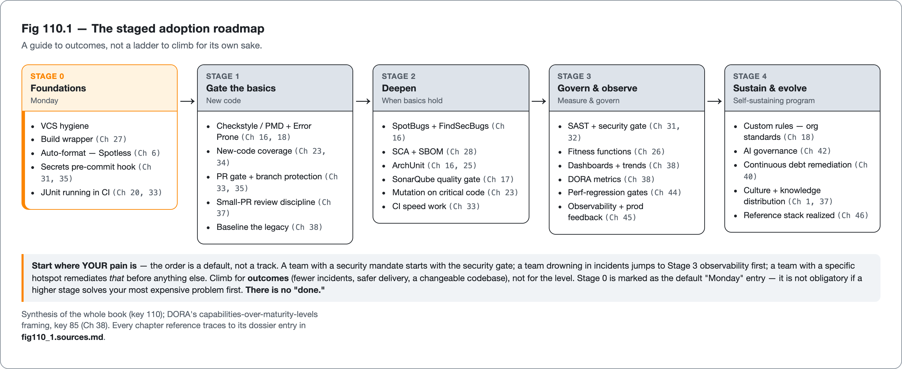

<!--
Dossier key: 110 (single key) — per 01-index/FINAL_INDEX.md Ch 47 (THE FINAL CHAPTER; closes Part XIV + the whole book)
Slug: 110_maturity_model_roadmap
Part / arc position: Part XIV — Capstone & Synthesis, Chapter 47 (FINAL; closes the book — no next chapter)
Companion artifact: 08-companion-code/110_maturity_model_roadmap/ — a runnable maturity-assessment model (the staged roadmap made code: it composes a team's per-dimension ratings into an overall level + one next step). Spec at foot. (The dossier's original "EXAMPLE-BUILD = N/A, roadmap artifact" call was revised at build time: the staged roadmap has a concrete, buildable composition — the same shape as the Ch 46 capstone peer, key 109 — so a module was built rather than a static table. Built green; see _EXAMPLE.md.)
Verified against SOURCE-PIN: 2026-06-27 (corrected pin). Sources (1 dossier; THE FINAL CHAPTER; synthesizes Ch 1 culture + Ch 38/40 adoption + Ch 46 stack + the WHOLE book into a staged roadmap; DORA capabilities-over-maturity-levels):
- Maturity model & adoption roadmap (110, closer): the book covers a lot; a team can't do it all at once. STAGED ROADMAP — a maturity model sequencing the book's practices from "first thing Monday" to "advanced governance" — PLUS the honest caveat: maturity models are a GUIDE not a LADDER to climb for its own sake (DORA Ch 38 key 85 deliberately favors CAPABILITIES + continuous-improvement over rigid maturity levels). Answers "where do I start, what's next?". THE STAGED ROADMAP (not a rigid ladder): Stage 0 — FOUNDATIONS (Monday): VCS hygiene; build w/ wrapper (Ch 27 key 62); format auto-fix (Spotless Ch 6 key 34) + secrets pre-commit (Ch 31/35 key 71/82); JUnit in CI (Ch 20/33 key 42/75). Cheapest/highest-ROI/low-controversy. Stage 1 — GATE THE BASICS (new code): Checkstyle/PMD + Error Prone (Ch 16/18 key 27/28/30); coverage on new code (Ch 23/34 key 48/80); PR gate + branch protection (Ch 33/35 key 76/81); small-PR review (Ch 37 key 84); baseline legacy (Ch 38 key 87). Stage 2 — DEEPEN: SpotBugs/FindSecBugs (Ch 16 key 29); SCA + SBOM (Ch 28 key 65/66); ArchUnit (Ch 16/25 key 33/55); SonarQube gate (Ch 17 key 35); mutation on critical code (Ch 23 key 47); CI speed (Ch 33 key 79). Stage 3 — GOVERN + OBSERVE: SAST + security gate (Ch 31/32 key 70/73); fitness functions (Ch 26 key 56); dashboards/trends (Ch 38 key 88); DORA metrics (Ch 38 key 85); perf-regression gates (Ch 44 key 105); observability + production feedback (Ch 45 key 106-108). Stage 4 — SUSTAIN + EVOLVE: custom rules encoding org standards (Ch 18 key 38); AI-governance (Ch 42 key 100); continuous remediation of debt (Ch 40 key 59/96); culture of quality + knowledge distribution (Ch 1/37 key 06/90); the reference stack realized (Ch 46 key 109). Context-driven NOT linear — start where the pain is (hotspots key 59), measure (Ch 38 key 04/85), improve continuously (DORA), skip what doesn't fit (when-NOT recurring). FOR: staged adoption the proven path (Ch 38/40 key 87/96 — incremental/new-code-first/value-aligned succeeds where big-bang fails); maps the whole book into a coherent order; DORA-grounded (continuous improvement + capabilities over vanity maturity-chasing). LIMITS (the CLOSING honesty): maturity-models-can-become-vanity-ladders ("we're Level 4" = a Goodhart trap Ch 1/38 key 04; DORA moved away from rigid levels → continuous improvement; climb for OUTCOMES not the badge); the-roadmap-is-a-default-not-your-plan (context — team size/domain/legacy/regulation — reorders; start where YOUR pain is, not Stage 0 dogmatically); tools/gates-without-culture-fail (Ch 1 key 06 — hardest parts sociotechnical not config; hostile culture games every stage); more-maturity≠more-value-past-a-point (over-governance ossifies Ch 26/33 key 56/76; stop adding gates when they stop paying); everything-here-is-DATED (tools/versions/stats move — the pin discipline; the PRINCIPLES outlast the SPECIFICS).
⚠ verify-at-pin: DORA "capabilities over maturity levels" framing (dora.dev Ch 38 key 85) — STILL deferred at VERIFY (2026-06-27): DORA is a web-hosted SaaS authority (SOURCE-PIN §5, pinned by date 2026-06-27), no local clone exists to diff this wording character-for-character; standing guard at 09-flags/85_dora_bands_space_dimensions_dashboard_specifics_verify_at_pin.md. The body asserts NO DORA performance band or statistic. All other atoms synthesize — each cited practice is verified in its own dossier, no new primary atom here.
Routes (the whole book): culture/economics/folklore-guard → Ch 1 (02/04/06); the techniques → Parts II-XIII (every chapter); adoption playbook → Ch 38/40 (87/96); the reference stack → Ch 46 (109); DORA/metrics/dashboards → Ch 38 (85/88); hotspots/debt → key 59; fitness functions/over-governance → Ch 26 (56). NO NEXT CHAPTER — closes the book; the teaser slot = a send-off.
DRAFT v1 — gates manual; the-staged-roadmap(Monday→governance) + start-where-your-pain-is-not-stage-0-dogmatically + maturity-is-for-outcomes-not-a-badge(Goodhart-on-maturity-chasing) + capabilities-over-rigid-levels(DORA) + tools-without-culture-fail + more-maturity≠more-value-past-a-point + principles-outlast-specifics + quality-is-a-continuous-practice-not-a-destination + the-book-closes-where-it-began(people-not-scripts) shapes; THE FINAL CHAPTER. EXAMPLE-BUILD: BUILT GREEN (the dossier's "N/A, roadmap artifact" call was revised at build time — the staged roadmap composes like the Ch 46 capstone peer, key 109; `08-companion-code/110_maturity_model_roadmap/`, `mvn -B -Pquality verify` BUILD SUCCESS, 12 tests / 0 Checkstyle / 0 SpotBugs at Java 21.0.11; see _EXAMPLE.md).
-->

# Where to Start, and How to Keep Going

*A staged adoption roadmap that turns the whole book into a plan — offered as a guide to outcomes, not a ladder to climb for its own sake · 110 · Part XIV (the final chapter)*

> A team proudly reports it has reached "Level 4 maturity": every gate, every tool, a dashboard of solid green. Its codebase is still miserable to work in, its best engineers are leaving, and Mondays are still dreaded. They climbed the ladder and arrived nowhere.

## Hook

A team proudly reports it has reached "Level 4 maturity." Every gate is in place, every tool from this book is installed, the dashboard is a wall of green. And the codebase is still miserable to work in, the strongest engineers are quietly leaving, and Monday morning is still met with dread. They climbed the ladder and arrived nowhere — because they chased the *badge*, not the *outcome*. They added every gate the maturity model listed without once asking whether each one made the code, or the work, actually better; they optimized "number of quality practices adopted," which is a vanity metric exactly like lines of code, and Goodhart did the rest. This is the trap this final chapter exists to prevent, and it's a fitting last warning for a book that has returned, again and again, to the difference between a green checkmark and real quality.

The book has reached its end. The *case* for quality is made (Part I), the *techniques* span a dozen parts, and, last chapter, a concrete *reference stack* stands assembled (Chapter 46). What remains is the most human question the book can answer: this is a lot, and no team can adopt it all at once, so where does a team actually start, and how does it keep going, without overwhelming itself or chasing a maturity badge that means nothing? This chapter is that roadmap: a staged sequence from the first thing on Monday to advanced governance, mapping the whole book into an order a team can act on. It is offered with the closing honesty the book has earned over forty-six chapters: **it is a guide to outcomes, not a ladder to climb for its own sake.** Start where the pain actually is, not at Stage 0 dogmatically; climb for results, not levels; remember that the hardest parts are people, not plugins; treat the whole thing as a continuous practice with no "done." Where the last chapter gave the destination, this one gives the road, then sends the reader off to walk it.

## Overview

**What this chapter covers**

- **The staged roadmap**: five stages from foundations (Monday) through gating, deepening, governing/observing, to sustaining — each mapped to the book's chapters.
- **Context over linearity**: starting where your pain is, not at Stage 0 dogmatically.
- **The closing honesty**: why maturity is for outcomes not a badge, why tools without culture fail, and why more isn't always better.
- **The send-off**: the book's central theses, one last time, and where your work begins.

**What this chapter does NOT cover.** New techniques — there are none here; this is pure *synthesis*, every practice cited to the chapter that covers it. The adoption mechanics of baseline-and-ratchet (Chapters 38, 40) and the reference stack itself (Chapter 46), which this sequences. This is the **final chapter; it crowns no tool** (it orders practices, naming the chapter for each), and its one new fact — DORA's deliberate move from maturity *levels* to *capabilities and continuous improvement* — is verified at the pin. Everything specific here is **dated**; the principles are what last.

**If you hold one idea**, hold this: *adopt the book as a staged roadmap — foundations, then gate the basics on new code, then deepen, then govern and observe, then sustain — but start where your pain actually is, climb for outcomes not a maturity badge (that's Goodhart), and remember the hardest parts are culture not config; there is no "done," only continuous improvement from wherever you honestly are.*

## How it works

### The staged roadmap

The book covers a lot, and a team that tries to adopt all of it at once will flood itself and revert (the adoption lesson of Chapters 38 and 40). The roadmap sequences the practices by cost and dependency — cheapest, highest-ROI, lowest-controversy first — so each stage builds on the last and the team is never overwhelmed:

> **CONCEPT** *Five stages, from Monday to governance — each mapped to the book.*
> **Stage 0 — Foundations (Monday).** Version-control hygiene; a build with the wrapper (Chapter 27); automatic formatting (Spotless, Chapter 6) and a secrets pre-commit hook (Chapters 31, 35); JUnit running in CI (Chapters 20, 33). The cheapest, highest-ROI, least-controversial things — do them first, today.
> **Stage 1 — Gate the basics, on new code.** Checkstyle/PMD and Error Prone (Chapters 16, 18); coverage on *new* code (Chapters 23, 34); a PR gate with branch protection (Chapters 33, 35); small-PR review discipline (Chapter 37); baseline the legacy (Chapter 38). Now the gate has teeth, and it's adoptable because it judges new code.
> **Stage 2 — Deepen.** SpotBugs with FindSecBugs (Chapter 16); SCA and SBOM (Chapter 28); ArchUnit (Chapters 16, 25); a SonarQube quality gate (Chapter 17); mutation testing on critical code (Chapter 23); CI speed work (Chapter 33). The fuller analyzer and security layers, once the basics hold.
> **Stage 3 — Govern and observe.** SAST and a security gate (Chapters 31, 32); fitness functions (Chapter 26); dashboards and trends (Chapter 38); DORA metrics (Chapter 38); perf-regression gates (Chapter 44); observability and production feedback (Chapter 45). The program becomes measured, governed, and connected to production.
> **Stage 4 — Sustain and evolve.** Custom rules encoding your org's standards (Chapter 18); AI governance (Chapter 42); continuous debt remediation (Chapter 40); a culture of quality and knowledge distribution (Chapters 1, 37); the reference stack fully realized (Chapter 46). The program is now self-sustaining and evolving.

The companion module makes the roadmap a runnable view — the five stages in their default, cheapest-first order, each carrying the practices it groups:

<!-- include: 110_maturity_model_roadmap/src/main/java/org/acme/maturity/Roadmap.java#roadmap-stages -->

*Figure 47.1 — The staged adoption roadmap: five stages, each with its practices and the chapter that covers them. A guide to outcomes, not a ladder; any stage can be the real starting point.*

The five stages are a coherent *default order*, but the next concept is what keeps the roadmap from becoming the very ladder it warns against.

> **CONCEPT** *Start where your pain is — the roadmap is context-driven, not linear.* The stages are a sensible default, not a track you must walk in order. A team drowning in production incidents should jump to observability and feedback (Stage 3) before perfecting its formatter; a team with a security mandate starts with the security gate; a team with a specific painful hotspot remediates *that* (Chapter 1's churn-times-pain) before anything else. The discipline is the one the whole book has taught: *measure* to find where the pain actually is (Chapters 38), start *there*, improve *continuously*, and *skip what doesn't fit your context*. The roadmap tells you what's available and roughly in what order it tends to make sense — it does not tell you to ignore your own most expensive problem because it's listed in "Stage 3."

The companion model encodes this directly. A team's overall level is the *lowest* dimension's stage, never an average — so a wall of green on five dimensions cannot hide a fire on the sixth:

<!-- include: 110_maturity_model_roadmap/src/main/java/org/acme/maturity/MaturityAssessment.java#overall-level -->

And the next step it recommends starts where the pain is — it works the lowest, most painful dimension, and refuses to recommend climbing when a dimension's outcomes have stalled:

<!-- include: 110_maturity_model_roadmap/src/main/java/org/acme/maturity/MaturityAssessment.java#recommend -->

### Why staged, new-code-first adoption works — and why DORA dropped the ladder

The staged approach is the proven path because it inherits everything the adoption chapters established: incremental adoption succeeds where big-bang floods and reverts, new-code-first makes gates adoptable on legacy without a wall of findings, and value-aligned sequencing (start where the pain is) concentrates effort where it returns. A roadmap is what makes the whole book *actionable* rather than overwhelming — it turns "here are a hundred practices" into "here is what to do first, and next."

> **CONCEPT** *Capabilities and continuous improvement, not maturity levels — climb for outcomes.* The single most important framing in this chapter, and the reason it's a *roadmap* and not a *maturity ladder*: the DORA research deliberately moved *away* from rigid maturity levels toward *capabilities* and *continuous improvement*, precisely because maturity levels become a target to chase for the badge rather than the outcome. "We're Level 4" is a Goodhart trap — the team optimizes the level, not the code, exactly as the hook's team did. The stages here are *capabilities you adopt because they solve a problem you have*, measured by whether outcomes improve (fewer incidents, faster safe delivery, a codebase people can change), never by how many boxes are ticked. Climb for the outcome; if a stage doesn't improve an outcome you care about, it isn't progress, whatever the model says.

This framing is the model's externalized policy: a `requireOutcomes` knob (on in prod) that discounts any dimension whose outcomes have not improved, and a `sustainAtStage` threshold past which the model stops recommending more — both tailored per profile, not compiled in:

<!-- include: 110_maturity_model_roadmap/src/main/java/org/acme/maturity/RoadmapPolicy.java#roadmap-policy -->

The recommendation is a sealed result, and its asymmetry carries the honesty — alongside the ordinary *advance* it has a *restore-outcomes* variant for the vanity-ladder case and a *sustain* variant for the past-the-point case:

<!-- include: 110_maturity_model_roadmap/src/main/java/org/acme/maturity/NextStep.java#next-step -->

## Deep dive: the road, and what the book has really been about

This roadmap is the book's last synthesis, and it encodes the same discipline as everything before it — which is the point of ending here rather than with the stack. The stages are not arbitrary; they're the book's recurring lessons in adoption form. *Cheapest-highest-ROI-first* (format and secrets before SAST) is the economics of quality (Chapter 1). *New-code-first* is clean-as-you-code (Chapter 34), the thing that makes any of it adoptable on a real legacy codebase. *Start where the pain is* is hotspot prioritization (Chapter 1) and the measure-don't-guess spine that ran through performance (Chapter 43) and metrics (Chapter 38). *Incremental, never big-bang* is the safe-change invariant of the whole refactoring part (Chapters 39, 40). The roadmap isn't new advice; it's the book's principles arranged as a sequence a team can walk — which is exactly what a final chapter should be: not more material, but the material you already have, organized into a first step and a next one.

And the closing honesty is the book's deepest theme stated one final time, now about the roadmap itself: **the maturity model is a guide to outcomes, and the moment it becomes a goal in its own right, it stops measuring quality and starts corrupting it.** This is Goodhart's law (Chapter 38) turned on the very chapter meant to help you — because a maturity model is the most seductive vanity metric of all, offering the comfort of a number ("we're Level 4") in place of the hard, unquantifiable question of whether the code is actually good and the team actually healthy. The book has warned about this green-checkmark trap at every layer: coverage that doesn't assert (Chapter 23), a dashboard that's a leaderboard (Chapter 38), a passing AI-generated test that pins a bug (Chapter 41), a gate that's bypassed (Chapter 35), and now a maturity level chased for the badge. They are all the same error — mistaking the proxy for the thing — and the roadmap is not exempt from it. The discipline, here as everywhere, is to keep your eyes on the outcome the proxy is supposed to indicate: not "how many practices have we adopted" but "is the code easier to change, are there fewer incidents, can a new engineer be productive in a week, do people want to work here." If a stage moves those, adopt it; if it doesn't, the model is wrong for you, not the other way around.

Which brings the book to the truth it began with and has circled the whole way through: **tools are necessary scaffolding, and quality is decided by people.** Every chapter has, in its own domain, drawn the same line — the machine handles the mechanical (the bug pattern, the style drift, the vulnerable dependency, the coverage floor, the regression) so that human attention is freed for the substantive (the design, the right abstraction, the review that catches the logic flaw, the decision about what the system is *for*). The roadmap's Stage 4 ends not on a tool but on *culture and knowledge distribution*, because that is where the whole journey has been heading: a stack with a hostile or indifferent culture games every gate and adopts every practice as theater, while a healthy culture with half the stack produces better software, because the people *want* the code to be good and the tools merely help them. The hardest parts of this roadmap — the ones no plugin installs — are sociotechnical: trust, blamelessness, the shared belief that quality is everyone's job and worth the effort. A book about Java code quality has to end by admitting that its subject is, in the end, not really about Java, or tools, or gates. It's about people choosing, sustainably and together, to do good work — and building the scaffolding that makes that choice easier, cheaper, and safer to keep making. The tools are how; the people are why, and whether.

## Limitations & when NOT to reach for it

- **A maturity level is a vanity metric.** "We're Level 4" is a Goodhart trap; DORA dropped rigid levels for capabilities and continuous improvement for exactly this reason. Climb for outcomes — fewer incidents, safer delivery, a changeable codebase — never for the badge.
- **The roadmap is a default, not your plan.** Team size, domain, legacy, and regulation reorder it; start where *your* pain is, not at Stage 0 dogmatically. A team with a fire jumps to the stage that puts it out.
- **Tools without culture fail.** The hardest parts are sociotechnical, not config; a hostile or indifferent culture games every stage. Stage 4 ends on culture because that's where quality is actually decided (Chapters 1, 37).
- **More maturity is not more value past a point.** Over-governance ossifies — gates that no longer pay their way slow delivery and breed bypass (Chapters 26, 33). Stop adding gates when they stop improving outcomes; subtract gates that don't.
- **Everything specific here is dated.** Tools, versions, and statistics move (the book's pin discipline); the *principles* — measure, automate the mechanical, crown nothing, improve continuously — outlast the *specifics*. Re-verify the tools; keep the principles.
- **There is no "done."** Quality is continuous improvement from wherever you are, not a finish line you cross. A team that thinks it has "finished" has stopped improving, which is the beginning of decline.

## Alternatives & adjacent approaches

- **Staged roadmap vs rigid maturity ladder** — capabilities adopted for outcomes and continuous improvement (DORA's current framing) versus levels climbed for a badge (the deprecated, Goodhart-prone model). The whole chapter is the former, warning against the latter.
- **Default order vs pain-first order** — the five-stage default versus starting where your most expensive problem is; the default is a teaching device, the pain-first order is what you actually do.
- **Full program vs deliberate subset** — the whole roadmap for a team that can sustain it versus a curated subset for a small team; incremental adoption (Chapters 38, 40) is the bridge.
- **Tools-led vs culture-led adoption** — installing the stack versus building the belief that quality is worth it; both are needed, but culture is the one that decides whether the tools are used or gamed.
- **Maturity self-assessment vs outcome metrics** — rating your "level" versus measuring DORA outcomes (delivery, stability) and codebase health; measure the outcome, not the level.

These compose into the honest adoption posture: a staged default you reorder by your own pain, adopted incrementally for measured outcomes, with culture as the deciding factor and continuous improvement as the only real destination.

## When to use what

- **On Monday, from zero:** Stage 0 — version control, the build wrapper, auto-format, secrets pre-commit, JUnit in CI. Cheapest and highest-ROI; start here unless a fire says otherwise.
- **To make the gate real:** Stage 1 — Checkstyle/Error Prone, new-code coverage, a PR gate with branch protection, small-PR review, baseline the legacy.
- **When the basics hold:** Stage 2 — SpotBugs, SCA/SBOM, ArchUnit, a SonarQube gate, mutation on critical code.
- **When you need to measure and govern:** Stage 3 — SAST/security gate, fitness functions, dashboards, DORA metrics, perf-regression gates, observability.
- **To sustain and evolve:** Stage 4 — custom rules, AI governance, continuous remediation, and above all culture and knowledge distribution.
- **Always:** start where your pain is, measure outcomes (not your "level"), improve continuously, and subtract gates that stop paying.
- **Never:** chase a maturity badge, adopt all stages at once, or believe that any stack substitutes for the culture that decides whether quality happens.

## Closing: where the book ends and your work begins

This is the last chapter, so it ends not with a hand-off but with a send-off, and with the book's central convictions, gathered one final time, to carry into the work ahead when the specific tools and versions in these pages have aged into history.

*Measure, don't guess* — about hotspots, about where to start, about whether anything is working. *Automate the mechanical so humans can do the substantive* — the through-line of every part, from analyzers to AI governance: the machine catches the bug pattern so the person can judge the design. *Every green checkmark is necessary, not sufficient* — coverage, a passing gate, a maturity level; the proxy is never the thing, and mistaking it for the thing is the error the book has named at every layer. *Crown nothing* — there is no best tool, only trade-offs you weigh in your context; the one recommendation the book made (the reference stack) it made as a worked example, not a throne. *Honest limitations everywhere* — every technique has a cost and a when-not-to, and a quality practice that can't name its own limits isn't mature, it's dogmatic. And the deepest one, the one this final chapter exists to land: *quality is a practice sustained by people, not a stack installed by a script.* The tools are scaffolding — necessary, valuable, the subject of forty-odd chapters — but they are scaffolding around the thing that actually builds quality, which is a team that chooses, continuously and together, to do good work, and an organization that makes that choice cheaper and safer to keep making.

So start where the pain is, with the cheapest thing that helps, on Monday. Measure whether it improved an outcome that matters. Then do the next thing. There is no finish line and no Level 5 to reach — only a codebase that gets a little easier to change, a team that dreads Mondays a little less, and a practice you keep, and improve, for as long as the software lives. That is what code quality is, in Java or any language: not a destination you arrive at, but a way of working you sustain. The book ends here. Your work begins — or, more likely, continues — tomorrow.

## Back matter — sources & traceability

- **Maturity model & adoption roadmap** (key 110, the book's closer; synthesizes Ch 1 culture + Ch 38/40 adoption + Ch 46 stack + the WHOLE book; DORA capabilities-over-maturity-levels Ch 38 key 85) — the book covers a lot; can't do it all at once → a STAGED ROADMAP (guide to outcomes, not a ladder for its own sake). **Stages**: 0 Foundations/Monday (VCS + wrapper Ch 27 key 62 + Spotless Ch 6 key 34 + secrets pre-commit Ch 31/35 key 71/82 + JUnit-in-CI Ch 20/33 key 42/75); 1 Gate-basics-new-code (Checkstyle/PMD + Error Prone Ch 16/18 key 27/28/30 + new-code coverage Ch 23/34 key 48/80 + PR gate/branch protection Ch 33/35 key 76/81 + small-PR review Ch 37 key 84 + baseline Ch 38 key 87); 2 Deepen (SpotBugs Ch 16 key 29 + SCA/SBOM Ch 28 key 65/66 + ArchUnit Ch 16/25 key 33/55 + Sonar gate Ch 17 key 35 + mutation Ch 23 key 47 + CI speed Ch 33 key 79); 3 Govern+observe (SAST/security gate Ch 31/32 key 70/73 + fitness functions Ch 26 key 56 + dashboards/DORA Ch 38 key 88/85 + perf-regression Ch 44 key 105 + observability Ch 45 key 106-108); 4 Sustain+evolve (custom rules Ch 18 key 38 + AI-governance Ch 42 key 100 + continuous remediation Ch 40 key 59/96 + culture/knowledge Ch 1/37 key 06/90 + reference stack Ch 46 key 109). Context-driven NOT linear — start where the pain is (key 59), measure (Ch 38 key 04/85), improve continuously, skip what doesn't fit. *(DORA capabilities-over-levels ⚠ @pin Ch 38 key 85 — STILL deferred at VERIFY 2026-06-27; DORA is web-hosted (SOURCE-PIN §5), no local clone to diff the wording, standing guard 09-flags/85_dora_bands_space_dimensions_dashboard_specifics_verify_at_pin.md; NO DORA band/statistic asserted. No new primary atoms — each practice verified in its own chapter. LIMITS (closing honesty): maturity-models-become-vanity-ladders (Goodhart Ch 1/38 key 04 — climb for OUTCOMES); roadmap-is-a-default-not-your-plan (start where YOUR pain is); tools-without-culture-fail (Ch 1 key 06 — sociotechnical); more-maturity≠more-value (over-governance ossifies Ch 26/33 key 56/76); everything-DATED (principles outlast specifics).)*
- **Routing (the whole book)** — culture/economics/folklore-guard → Ch 1 (02/04/06); the techniques → Parts II-XIII; adoption playbook → Ch 38/40 (87/96); reference stack → Ch 46 (109); DORA/metrics/dashboards → Ch 38 (85/88); hotspots/debt → key 59; fitness functions/over-governance → Ch 26 (56). SOURCE-PIN §5 + §7 canon: DORA (2025 report + *Accelerate* 2018) is a pinned authority row (pinned by date 2026-06-27); the specific "capabilities-over-rigid-levels" wording stays ⚠ verify-at-pin (web-hosted, no local clone) — see 09-flags/85. **NO NEXT CHAPTER — this closes the book.**

**Companion artifact (`08-companion-code/110_maturity_model_roadmap/` — BUILT, green):** a runnable **maturity-assessment model** (`org.acme.maturity`) — the staged roadmap made code. It rates a team across the book's recurring dimensions (`Dimension`) at the five stages (`Stage`), and `MaturityAssessment` composes those ratings into an overall level + one `NextStep`, under an externalized `dev`/`prod` `RoadmapPolicy`. The chapter's closing honesty is encoded in the model, not just its comments: the overall level is the **lowest** dimension's stage (never an average that hides a fire); a high stage whose **outcomes have stalled is discounted** (the Goodhart / vanity-ladder guard) and triggers a `RestoreOutcomes` recommendation rather than more climbing; the next step **starts where the pain is** (the lowest dimension); and past the policy's threshold the model recommends `Sustain` (subtract gates that stop paying — more maturity ≠ more value), with `CULTURE_KNOWLEDGE` a first-class dimension (tools without culture fail). JDK-only; `mvn -B -Pquality verify` green. *(The dossier originally marked EXAMPLE-BUILD = N/A as "a roadmap artifact, not a buildable module"; revised at build time — the staged roadmap composes exactly like the Ch 46 capstone peer (key 109), so it was built rather than left a static table. Demonstrates the-staged-roadmap + start-where-your-pain-is + maturity-is-for-outcomes-not-a-badge + more-maturity≠more-value + tools-without-culture-fail.)*

**Snippet tags:** `Roadmap.java#roadmap-stages` (the five stages, cheapest-first view); `MaturityAssessment.java#overall-level` (the lowest dimension, never an average); `MaturityAssessment.java#recommend` (start where the pain is; refuse to climb on a stalled outcome); `RoadmapPolicy.java#roadmap-policy` (the externalized require-outcomes + sustain-at-stage policy); `NextStep.java#next-step` (the sealed advance / restore-outcomes / sustain result).

## The book is complete

This is the forty-seventh and final chapter. From the case for quality through the techniques, the stack, and this roadmap, the book has tried to do one thing: make the practice of Java code quality something a real team can understand, adopt, and sustain — honestly, in their own context, for outcomes that matter. It crowned no tool, hid no limitation, and ends where it began — with people, choosing to do good work, and the scaffolding that helps them keep choosing it. Start where your pain is. Measure. Improve continuously. There is no finish line; there is only the next, slightly better, commit.
