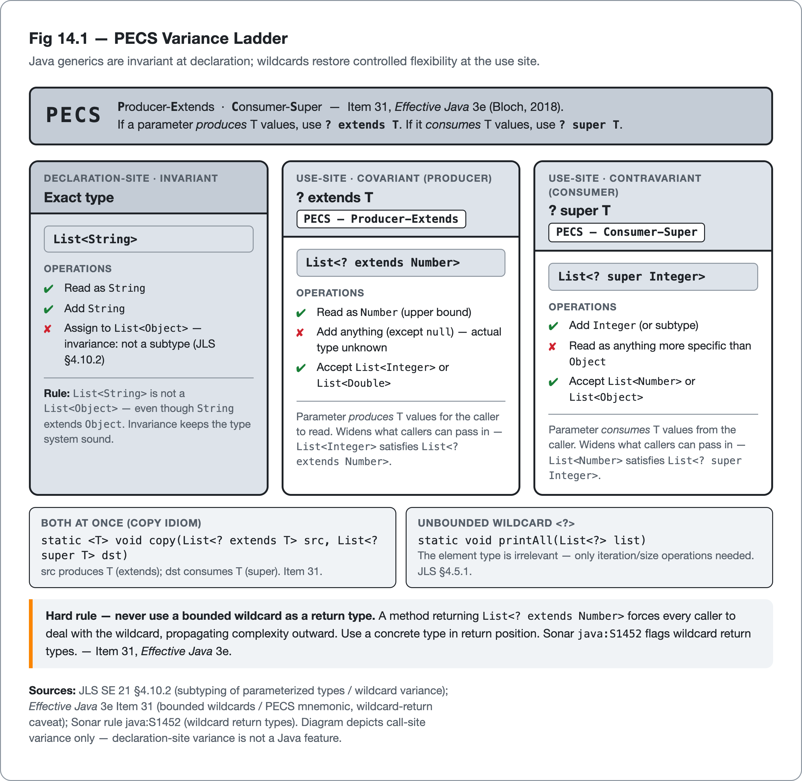
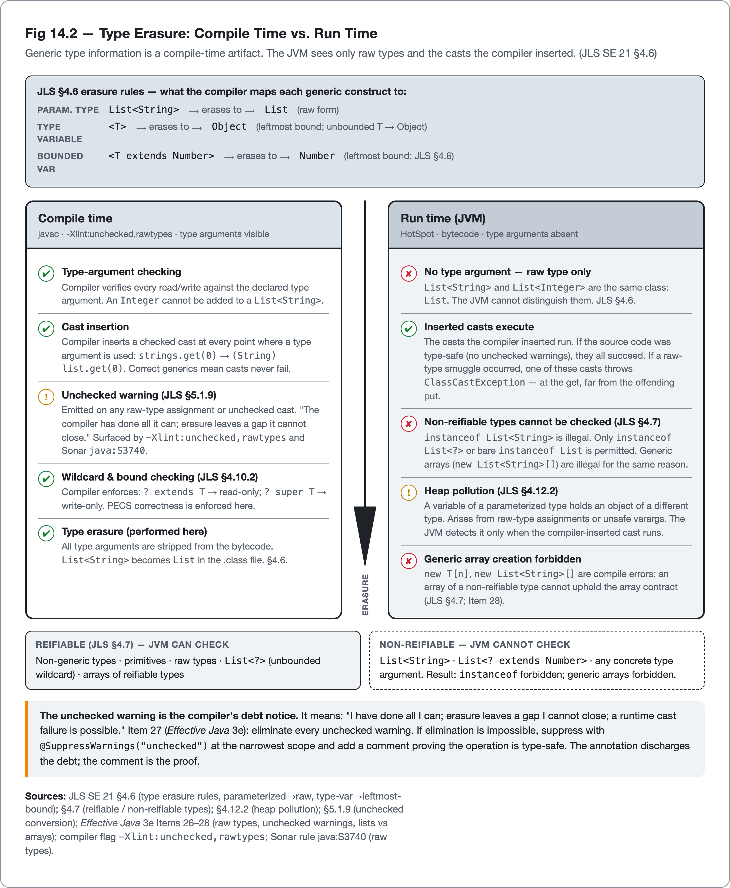

<!--
Dossier key: 14 (owner, single key) — per 01-index/FINAL_INDEX.md Ch 11
Slug: 14_generics_type_safety
Part / arc position: Part II — Writing Quality Java, Chapter 11 (Part II = Ch 5-12; Ch 12 closes it)
Companion module: 08-companion-code/14_generics_type_safety/ — ⚠ EXAMPLE-BUILD = PENDING-RUNTIME (no JDK). Spec at foot.
Verified against SOURCE-PIN: 2026-06-20. Sources: JLS SE 21 §4.5 (parameterized types), §4.6 (type erasure — verbatim), §4.7 (reifiable types — verbatim list), §4.8 (raw types + §4.8-1 example), §4.10.2 (subtyping/variance), §5.1.9 (unchecked conversion), §4.12.2 (heap pollution), §9.6.4.7 (@SafeVarargs); Effective Java 3e (2018) Items 26-33 (titles verified); JEP 213 (Milling Project Coin — diamond on anon, @SafeVarargs on private, Java 9); diamond + @SafeVarargs (Java SE 7); var (JEP 286, Java 10); record patterns JEP 440 / pattern-switch JEP 441 (Java 21); tool rules Sonar java:S3740 (raw types)/java:S1452 (wildcard returns), PMD UseDiamondOperator/LooseCoupling, Error Prone TypeParameterUnusedInFormals, Checker Framework.
⚠ verify-at-pin: tool rule IDs/defaults/severities; Sonar RSPEC pages (ECONNREFUSED at research); EJ verbatims; JLS §§ re-confirm; JEP 440/441 numbers. ⚠ AHEAD-OF-PIN: Project Valhalla reified/specialized generics (NOT in 21/25 — flag, never assert).
DRAFT v1 — gates manual; PECS-variance-ladder + erasure-timeline + earned-assertion + item-to-rule shapes; EXAMPLE-BUILD pending JDK.
-->

# Let the Compiler Carry It

*Generics, type erasure, and writing code where a runtime cast can never occur · 14 · Part II*

> The unchecked warning is the compiler's report that it has done all it can. The rest of the proof belongs to the developer.

## Hook

```java
List<String> strings = new ArrayList<>();
List raw = strings;          // unchecked warning here — ignored
raw.add(42);                 // an Integer, into a list of Strings
String s = strings.get(0);   // ClassCastException — and the 42 is nowhere in sight
```

The exception is thrown on the last line, at a cast the compiler inserted when it expanded `strings.get(0)`. But the *bug* is on the third line, where an `Integer` entered a `List<String>` through a raw reference. And the compiler flagged it: line two raised an unchecked warning, the one most teams have trained their eyes to skip. The crash is far from its cause, the value that broke it is invisible at the crash site, and the warning that would have stopped it was discarded.

Generics encode element and parameter types in the type system, so the compiler inserts and *verifies* the casts that hand-written code placed by convention — moving a `ClassCastException` from run time, where it surfaces far from its cause, to compile time, where it sits on the offending line. The discipline, in one sentence from the canon: use generics so the compiler is a collaborator, and treat every unchecked warning as an unproven obligation still outstanding.

## Overview

**What this chapter covers**

- **Type erasure** (the build-time fact everything else follows from) and the reifiable / non-reifiable line it draws.
- **Raw types** and the **unchecked warning**: what it means, and why "eliminate every one" is the load-bearing rule.
- **Variance**: invariance, `? extends`/`? super` wildcards, and **PECS** (Producer-Extends, Consumer-Super).
- **Bounded type parameters**, recursive bounds, and generic methods.
- The sharp edges where generics meet **arrays and varargs**: heap pollution and the earned `@SafeVarargs` assertion.
- The analyzer rules that enforce all of this (`-Xlint`, Sonar `java:S3740`/`S1452`, PMD, Error Prone, Checker Framework).

**What this chapter does NOT cover.** Null-safety annotations and pluggable checkers in depth (Chapter 9), the modern features (`var`, record patterns) that interact with generics in their own right (Chapter 5), and the analyzer internals (Part IV). This chapter owns the *type-safety craft*; it cites the rules but configures none of them.

**The one idea to hold**: *generic type information exists only at compile time, so type-safety is a debt paid to the compiler before the program runs — and an unchecked warning is the compiler reporting that debt as unpaid.*

## How it works



*Fig 14.1 — PECS Variance Ladder — Java generics are invariant at declaration; wildcards restore controlled flexibility at the use site.*



*Fig 14.2 — Type Erasure: Compile Time vs. Run Time — Generic type information is a compile-time artifact. The JVM sees only raw types and the casts the compiler inserted. (JLS SE 21 §4.6)*


### Erasure: the one fact everything follows from

Generics are a *compile-time* mechanism. At run time, `List<String>` and `List<Integer>` are the same class — plain `List`. This is **type erasure** (JLS §4.6): the compiler maps a parameterized type `G<T>` to its raw form, and a type variable to the erasure of its leftmost bound (an unbounded `<T>` erases to `Object`). The generic information is checked, used to insert casts, and then thrown away.

That single design choice (chosen so generics add *no* runtime overhead and stay backward-compatible with pre-2004 code) is the source of every sharp edge in the chapter. Because the type argument is gone at run time:

- `List<String>` and `List<Integer>` are **non-reifiable**: the JVM cannot tell them apart.
- `new T[]`, `new List<String>[]`, `T.class`, and `instanceof List<String>` are illegal or limited (only the unbounded `instanceof List<?>` is allowed).
- A bad value can be smuggled into a collection through a raw reference and the JVM does not notice until a cast fails somewhere else — the hook.

> **CONCEPT** *Reifiable vs non-reifiable (JLS §4.7).* A type is *reifiable* if its full type information survives to run time: non-generic types, primitives, raw types, an unbounded-wildcard parameterized type (`List<?>`), and arrays of reifiable types. Everything with a concrete type argument (`List<String>`, `List<? extends Number>`) is *non-reifiable*. This line governs what `instanceof`, casts, arrays, and varargs are allowed to do — every restriction below traces back to it.

### Raw types and the unchecked warning

A **raw type** (JLS §4.8) is a generic type used with no type argument (`List` instead of `List<E>`). On a raw reference, the compiler can no longer prove that what goes in matches what comes out, so it emits an **unchecked warning** (JLS §5.1.9): a precise message that it has done what it can, and that erasure has left a gap it cannot close, where a runtime failure is possible. The hook's `raw.add(42)` is exactly that gap.

The rule the canon draws here is unambiguous: *Effective Java* Item 26, "Don't use raw types," and Item 27, "Eliminate every unchecked warning." A warning that cannot be eliminated by fixing the code is suppressed with `@SuppressWarnings("unchecked")` at the **narrowest possible scope** (a single local, never a whole method or class) and accompanied by a comment that proves why the operation is in fact type-safe. The suppression discharges the obligation the compiler could not close: the warning said "I can't prove this," and the comment says "here is the proof."

Two distinctions matter and are often missed:

- **`List<Object>` is not the raw `List`.** `List<Object>` is fully type-checked, explicitly opting into "a list of any object." Raw `List` opts *out* of all checking. The first is safe; the second is the hook.
- **Raw types remain legal in exactly two places** (Item 26): class literals (`List.class` is legal; `List<String>.class` is not) and `instanceof` (because generics are erased, `o instanceof List` is the only form the JVM can check; prefer the explicit `o instanceof List<?>`). A blanket "never write a bare type name" rule is wrong here.

The compiler makes this enforceable today with `-Xlint:unchecked,rawtypes`, which surfaces every warning; a quality build treats those as errors. Sonar `java:S3740` flags raw types as well.

### Variance: invariance, wildcards, and PECS

Java generics are **invariant**: `List<String>` is *not* a subtype of `List<Object>`, even though `String` is a subtype of `Object`. The invariance is what keeps the type system sound — if `List<String>` *were* a `List<Object>`, an `Integer` could be added through the wider reference (exactly the array bug below). Flexibility is added deliberately at the *use site* with a bounded wildcard:

| Wildcard | Variance | Role | Operations permitted |
|---|---|---|---|
| `? extends T` | covariant | **producer** — reads `T`s out | read as `T`; cannot add (except `null`) |
| `? super T` | contravariant | **consumer** — puts `T`s in | add `T`; reads come back as `Object` |
| `?` (unbounded) | — | type is irrelevant | the reifiable wildcard form |

The mnemonic is **PECS: Producer-Extends, Consumer-Super** (Item 31): if a parameter *produces* `T` values, type it `<? extends T>`; if it *consumes* `T` values, type it `<? super T>`. A method that copies from a source to a destination wants both, as in `copy(List<? extends T> src, List<? super T> dst)`, and the wildcards make it accept the widest possible range of caller types without ever permitting an unsound write.

> **CONCEPT** *PECS has a hard exception: not on return types.* Item 31's own caveat: *do not* use a bounded wildcard as a method's return type. A `List<? extends Number>` return forces every caller to deal with a wildcard in their own code, propagating the awkwardness outward instead of containing it. Sonar `java:S1452` flags exactly this (and is itself contested, because interface contracts sometimes mandate a wildcard return, which makes the rule a strong default rather than a law).

### Bounds and generic methods

A **bounded type parameter** constrains the argument and unlocks the bound's members: `<T extends Number>` lets the body call `intValue()`. Multiple bounds are written class-first: `<T extends Foo & Comparable<T>>`. The **recursive bound** `<T extends Comparable<T>>` ("a type comparable to itself") is the idiom behind `max(Collection<? extends T>)` and self-typed builders. A **generic method** (Item 30) parameterizes the method rather than the class, as in `static <E> Set<E> union(Set<E> a, Set<E> b)`, with `E` inferred at the call site; the type argument rarely needs to be written explicitly.

### The diamond and `var`

Type inference removes most of the boilerplate. The **diamond** `<>` (Java 7) infers a constructor's type arguments: `List<String> l = new ArrayList<>();`. JEP 213 (Java 9) extended it to anonymous classes. PMD `UseDiamondOperator` flags redundant explicit type arguments. And `var` (Java 10) interacts with generics in one trap worth naming: `var l = new ArrayList<String>()` keeps the full type, but `var l = new ArrayList<>()` infers `ArrayList<Object>` because the diamond has nothing on the left to infer from, so it widens silently (Chapter 5).

## Deep dive: where generics meet arrays and varargs

The most error-prone corner of generics is where they touch arrays. **Arrays and generics have opposite semantics**, and the language cannot fully reconcile them.

Arrays are **covariant and reified**: `String[]` *is* a `Object[]`, and the array remembers its real element type at run time. That combination is unsafe, and the JVM patches it with a runtime check:

```java
Object[] objects = new Long[1];
objects[0] = "I am not a Long";   // compiles fine; throws ArrayStoreException at run time
```

Generics are the opposite — **invariant and erased**: `List<String>` is not a `List<Object>`, and the element type is gone at run time. Because the two models cannot coexist, `new List<String>[]` is a compile error: an array of a non-reifiable type cannot keep the promise arrays make. *Effective Java* Item 28 — "prefer lists to arrays" — follows directly: lists surface the compile-time failure (the type error appears where the bad code is); arrays surface the run-time failure (`ArrayStoreException`, far away).

Where this turns subtle is **varargs**, because a varargs parameter is an array under the hood. A method like `static <T> List<T> asList(T... elements)` secretly creates a `T[]` — a generic array, which the language otherwise forbids. So the compiler allows it but warns: the method can leak that array or store into it, producing **heap pollution** (JLS §4.12.2) — a variable of a parameterized type pointing at an object that is not of that type, the same corruption as the hook, now arising from an array the compiler generated.

`@SafeVarargs` is best understood as an **earned assertion**. The annotation (Java 7; extended to private instance methods by JEP 213 in Java 9) suppresses the warning by promising that the method body does nothing unsafe with the array — it never stores into it and never lets a reference to it escape. *Effective Java* Item 32 is precise: apply `@SafeVarargs` *only* when that promise actually holds. A method that returns the varargs array, or stashes it in a field, is genuinely unsafe, and the warning is correct. Silencing it with `@SafeVarargs` ships the heap pollution to a caller. The annotation is not "make the warning go away"; it is "I have personally verified this is safe" — and that verification must be done before the annotation goes on.

At every turn (the raw type, the wildcard, the generic array) the compiler is willing to carry the type-safety burden, but only as far as erasure lets it see. The unchecked warning marks the exact line where its sight ends and the developer's obligation begins. Quality generic code is code where that obligation is always, visibly, discharged.

## Limitations & when NOT to reach for it

- **Erasure is permanent, not a bug to be fixed.** `new T[n]`, `T.class`, `instanceof List<String>`, and overloading on `List<String>` versus `List<Integer>` (which erase to the same signature) are all unavailable. These are accepted constraints; the craft is the workaround: a `Class<T>` type token (the typesafe heterogeneous container, Item 33) when the runtime type is genuinely needed, and a justified `@SuppressWarnings` otherwise.
- **Wildcards cost readability.** PECS makes APIs flexible but signatures harder to read; a deeply nested `Map<? extends K, ? super List<? extends V>>` actively hurts comprehension (Chapter 2). And the firm rule: never put a wildcard in a return type — it leaks outward to every caller.
- **Do not over-genericize.** A type parameter that appears *only* in the return position — `<T> T get()` — is an Error Prone bug (`TypeParameterUnusedInFormals`): the compiler cannot infer `T` from any argument, so it silently inserts an unchecked cast at every call site. If the compiler cannot constrain `<T>` from the arguments, it does not belong.
- **`@SafeVarargs` is an earned assertion.** Applying it to a method that stores or leaks the varargs array hides a real heap-pollution risk. When the body is genuinely unsafe, the warning is right — fix the method, do not annotate over it.
- **Raw types are correct in two places.** Class literals and `instanceof` legitimately use the bare name; a "no raw types ever" lint configured without those exceptions produces false positives.
- **The analyzers disagree by design.** Pattern-matching tools (Checkstyle, PMD) catch raw types and missing diamonds cheaply but carry false positives (PMD's `UseDiamondOperator` has had Java-21 inference false positives; `LooseCoupling` a generics one). Error Prone runs *inside* the compiler and can auto-fix. The Checker Framework offers a soundness guarantee for annotated code at the cost of annotation effort and build time. Sonar `java:S1452` is community-contested for firing on interface-mandated wildcard returns. Each fits a different point on the cost/coverage curve; none is the answer for every team (Chapter 17 owns the layering choice).
- **Legacy boundaries force unchecked conversions.** Pre-generics libraries return raw types; the discipline is to wrap and adapt at the seam, confining the suppression to the boundary class, rather than let raw types spread inward.

> **AHEAD-OF-PIN** Reified or specialized generics (Project Valhalla) are *not* in Java 21 or 25. "Java is getting reified generics" is a recurring claim stated as imminent fact; it is exploratory work, not a shipped feature — treat it as direction, never as anchor reality.

## Alternatives & adjacent approaches

- **`Class<T>` type tokens / typesafe heterogeneous containers (Item 33):** when the runtime type that erasure removed is genuinely required (e.g. a `Map<Class<?>, Object>` keyed by type), a `Class<T>` parameter carries it explicitly. The accepted way to "get the type back," at the cost of passing the token.
- **The Checker Framework:** pluggable compile-time type qualifiers that go beyond what `javac` checks (including nullness, Chapter 9). A heavier, sound layer for codebases that want a guarantee.
- **Record patterns and pattern matching for `switch`** (Java 21): deconstructing a generic record with a pattern infers its type arguments and removes the unchecked cast that would otherwise be written by hand, improving type-safety *without* touching erasure (Chapter 5).
- **Sealed hierarchies** (Chapter 10's `Result` model): sometimes a closed set of concrete types is clearer than a single generic one, trading parametric flexibility for exhaustiveness.

These layer rather than compete: write generic APIs with PECS and bounds, let the diamond and inference remove the noise, reach for a type token only where erasure genuinely blocks you, and add a sound checker if the codebase warrants the investment.

## When to use what

- **On any container or algorithm over a varying type:** parameterize it; never reach for raw types or `Object` plus casts.
- **On a parameter that produces values:** `<? extends T>` (producer). **On a parameter that consumes values:** `<? super T>` (consumer). **On a return type:** a concrete type, never a wildcard.
- **On a method whose type is independent of the class:** a generic method (`<E>`), letting inference fill in `E` at the call.
- **When the compiler warns:** fix the code first; suppress only at the narrowest scope with a proof comment; turn `-Xlint:unchecked,rawtypes` on so none slips by.
- **On a generic varargs method:** apply `@SafeVarargs` only after verifying the body neither stores nor leaks the array — otherwise leave the warning and reconsider the design.
- **When the runtime type is needed:** a `Class<T>` token (Item 33), not a cast asserted by convention.

## Hand-off to the next chapter

Across Part II the code has been made trustworthy method by method: clear names, honest contracts, safe values, no nulls, resilient failure paths, and now type-safety the compiler enforces. The next chapter steps back from the individual method to the *shapes* code falls into: the recurring **code smells** that signal trouble, the **design patterns** that name good structures, and the **anti-patterns** that name bad ones, read through a modern-Java lens where a record or a sealed type often replaces a pattern the Gang of Four had to build by hand. That chapter assembles Part II as a vocabulary of recognizable forms, and it closes the part.

## Back matter — sources & traceability

- **JLS SE 21** — §4.5 (parameterized types), §4.6 (type erasure: parameterized→raw, type var→leftmost-bound erasure — verified verbatim), §4.7 (reifiable-types list — verified), §4.8 (raw types + the §4.8-1 unchecked-warning example), §4.10.2 (variance via wildcards), §5.1.9 (unchecked conversion), §4.12.2 (heap pollution), §9.6.4.7 (`@SafeVarargs`). *(§§ verified against ch.4 text; re-confirm at pin.)*
- **Effective Java 3e** (Bloch, 2018) — Ch. 5, Items 26 (don't use raw types), 27 (eliminate unchecked warnings), 28 (prefer lists to arrays), 29/30 (favor generic types/methods), 31 (bounded wildcards / PECS), 32 (generics + varargs), 33 (typesafe heterogeneous containers). *(item titles verified; ⚠ verbatim/pages @pin.)*
- **JEPs / language levels** — generics GA Java SE 5.0 (2004, JSR-14); diamond `<>` + `@SafeVarargs` (Java SE 7); JEP 213 Milling Project Coin (diamond on anonymous classes; `@SafeVarargs` on private instance methods, Java 9); `var` (JEP 286, Java 10); record patterns (JEP 440) + pattern matching for `switch` (JEP 441), Java 21. *(⚠ confirm JEP numbers @pin.)*
- **Tool rules** — compiler `-Xlint:unchecked,rawtypes`; Sonar `java:S3740` (raw types), `java:S1452` (wildcard return types); PMD `UseDiamondOperator`, `LooseCoupling`; Error Prone `TypeParameterUnusedInFormals`; Checker Framework (pluggable type qualifiers). *(IDs cited to each tool; ⚠ defaults/severities @pin; Sonar RSPEC pages ECONNREFUSED at research — re-fetch @pin.)*
- **⚠ AHEAD-OF-PIN** — Project Valhalla reified/specialized generics: not in Java 21/25; never asserted as shipped.

**Companion module (spec — ⚠ EXAMPLE-BUILD = PENDING-RUNTIME, no JDK):** `08-companion-code/14_generics_type_safety/` — a type-safe `Stack<E>` with a PECS pair: `pushAll(Iterable<? extends E>)` (producer-extends) and `popAll(Collection<? super E>)` (consumer-super), a narrowest-scope `@SuppressWarnings("unchecked")` carrying a proof comment (Item 27), and a deliberately **unsafe** varargs method (stores/leaks the array) contrasted with a genuinely safe `@SafeVarargs` one. Built with `-Xlint:unchecked,rawtypes` so a raw type fails the build. **Failure path / TRY-IT:** introduce a raw-type assignment and a wildcard-return method → the compiler `unchecked` warning + Sonar `java:S3740`/`java:S1452` fire; the unsafe-varargs demo shows the heap-pollution warning. **Tests:** `pushAll` accepts a `List<Integer>` into a `Stack<Number>`; `popAll` drains into a `List<Object>` (PECS proven by compilation + behavior). Snippet tags: `pecs-pushall`, `pecs-popall`, `suppress-justified`, `unsafe-varargs`.

## Next chapter teaser

Part II closes by naming what it has been teaching. The next chapter covers code smells, design patterns, and anti-patterns: the recognizable shapes of good and bad structure, read through modern Java, where records, sealed types, and lambdas have quietly retired some of the Gang of Four's hand-built patterns and sharpened the smells worth chasing.
