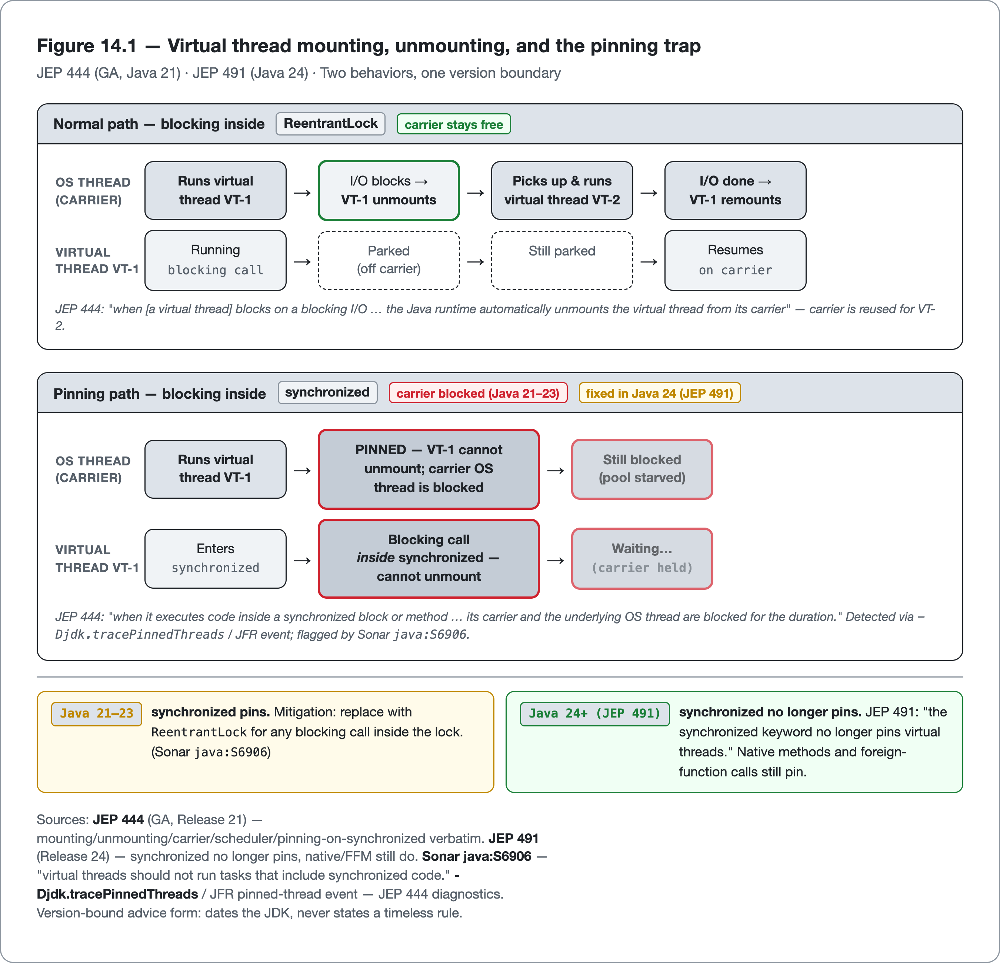
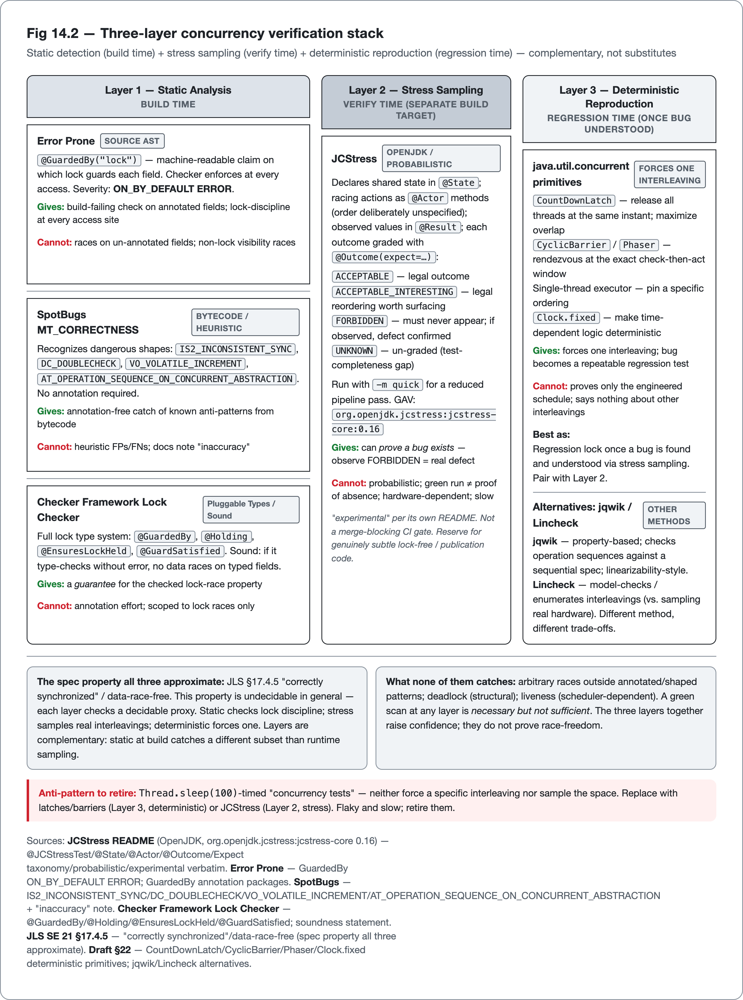

<!--
Dossier key: 22 (owner) + folds 24 + 25 — per 01-index/FINAL_INDEX.md Ch 14 (CLOSES Part III)
Slug: 22_virtual_threads_structured_concurrency
Part / arc position: Part III — Concurrency & Correctness, Chapter 14 (closes Part III; Part IV = Static Analysis, Ch 15+)
Companion module: 08-companion-code/22_virtual_threads_structured_concurrency/ — EXAMPLE-BUILD GREEN on the pinned JDK 21.0.11 (mvn -B -Pquality verify: 10 tests pass, 0 Checkstyle, 0 unsuppressed SpotBugs). Spec at foot; 7 snippet tags bound into the prose above.
Verified against SOURCE-PIN: 2026-06-20. Sources (JEP Release/Status via curl): JEP 444 Virtual Threads (GA, Release 21 — carrier/scheduler/pinning/pooling/thread-locals verbatim); JEP 491 Synchronize Virtual Threads without Pinning (Release 24 — synchronized no longer pins); JEP 453 Structured Concurrency (Preview, 21) → JEP 505 (Fifth Preview, 25) → JEP 525 (Sixth Preview, 26) — all PREVIEW, API shape changed 21(ShutdownOnFailure/ShutdownOnSuccess ctors)→25(open(Joiner...) static factories) — AHEAD-OF-PIN; JEP 506 Scoped Values (final, Release 25 — AHEAD-OF-PIN @21); JEP 425/436 VT preview history (19/20); JLS SE 21 ch.17 (JMM unchanged by VTs); JCStress (OpenJDK, experimental harness — @JCStressTest/@State/@Actor/@Arbiter/@Signal/@Outcome/@Result/Expect{ACCEPTABLE,ACCEPTABLE_INTERESTING,FORBIDDEN,UNKNOWN}/Mode{Continuous,Termination}; -m quick; org.openjdk.jcstress:jcstress-core 0.16 latest); deterministic primitives (CountDownLatch/CyclicBarrier/Phaser, single-thread executor, Clock.fixed); jqwik/Lincheck (neutral alternatives); Error Prone GuardedBy(ON_BY_DEFAULT ERROR)/Immutable(ERROR)/ThreadSafe(exp)/DoubleCheckedLocking/SynchronizeOnNonFinalField/WaitNotInLoop/LockNotBeforeTry/StaticGuardedByInstance/ThreadLocalUsage; SpotBugs MT_CORRECTNESS (IS2_INCONSISTENT_SYNC/IS_FIELD_NOT_GUARDED/DC_*/VO_VOLATILE_INCREMENT/AT_OPERATION_SEQUENCE_ON_CONCURRENT_ABSTRACTION/LI_LAZY_INIT_*/DL_SYNCHRONIZATION_ON_*/NN_NAKED_NOTIFY/etc); Checker Framework Lock Checker (sound: @GuardedBy/@Holding/@EnsuresLockHeld/@GuardSatisfied); Sonar java:S6906/S6881; JCIP (2006, dated); JEP 444 JFR pinned-thread / jdk.tracePinnedThreads.
⚠ verify-at-pin: flag/property names (jdk.virtualThreadScheduler.parallelism, jdk.tracePinnedThreads post-491); JLS §17 §§; tool versions/severities/SpotBugs ranks (rules.sonarsource.com offline — RSPEC repo); JCStress version (not yet SOURCE-PIN row); Sonar S6906/S6881 titles; Lincheck unpinned. ⚠ AHEAD-OF-PIN: structured concurrency (preview 21→25), scoped values (GA @25), JEP 491 no-pinning (@24).
DRAFT v1 — gates manual; GA-vs-preview-discipline + version-bound-advice + prove-a-bug-exists + approximation-of-a-spec-property shapes; EXAMPLE-BUILD pending JDK.
-->

# Cheap Threads, Same Rules

*Virtual threads, structured concurrency (still preview), and how you actually verify concurrent code · 22 (folds 24, 25) · Part III*

> A thread per request became cheap. Every obligation the memory model imposed on it stayed exactly as expensive.

## Hook

A team rips out a tangle of `CompletableFuture` chains, written years ago purely so a request would not tie up a scarce OS thread, and replaces them with plain, blocking, top-to-bottom code running on **virtual threads**. The service reads like a tutorial again: call, wait, call, return. Throughput holds. Everyone is satisfied.

Then, under production load, latency spikes and the carrier pool stalls. The cause is four characters long: a `synchronized` block around a blocking call. On Java 21, a virtual thread that blocks inside `synchronized` **pins** its carrier — the OS thread it is mounted on cannot be reused — and at scale the pool starves. Swap the `synchronized` for a `ReentrantLock` and the stall vanishes. Move to Java 24 and the pin is gone entirely (the JDK fixed it). Same code, three different behaviors across the LTS window.

The line that closes Part III: **threads got cheap; correctness did not.** Virtual threads (GA in Java 21) make the simple, debuggable thread-per-request style scale again (a real readability win), but every rule from the last chapter still applies, plus new sharp edges: pinning, pooling, thread-local blow-up. Because concurrency bugs are invisible to ordinary tests, the chapter's second half covers how to *verify* concurrent code: stress-testing with JCStress, forcing the race deterministically, and catching lock-discipline errors at build time with static analysis.

## Overview

**What this chapter covers**

- **Virtual threads** (GA, JEP 444): mounting, carriers, the scheduler, and why blocking code is the readable default again.
- The **pinning** trap and its version boundary (`synchronized` pins at Java 21; JEP 491 removes that at Java 24), the no-pooling rule, and thread-local blow-up.
- **Structured concurrency** (JEP 453→505): still **preview** through Java 25, with an API that changed shape across previews; taught as direction, never as a stable idiom.
- **Concurrency testing** (JCStress): stress-sampling interleavings and grading them, plus deterministic reproduction; and the `Thread.sleep` anti-pattern to retire.
- **Static concurrency detection** in depth: the three approaches (Error Prone `@GuardedBy`, SpotBugs MT patterns, the Checker Framework Lock Checker) and the spec property they each approximate.

**What this chapter does NOT cover.** The Java Memory Model itself (Chapter 13, assumed), `java.util.concurrent` building blocks (Chapter 13), and the general theory of static analysis (Chapter 15 opens Part IV; this chapter uses the concurrency *slice* of those tools).

**The one idea to hold** is the epigraph: *cheap threads change the scale, not the rules.* Its corollary for status: **virtual threads are GA and may be relied on; structured concurrency is preview and must not be.**

## How it works

*Fig 22.1 — Virtual thread mounting, unmounting, and the pinning trap — JEP 444 (GA, Java 21) · JEP 491 (Java 24) · Two behaviors, one version boundary*

*Fig 22.2 — Three-layer concurrency verification stack — Static detection (build time) + stress sampling (verify time) + deterministic reproduction (regression time) — complementary, not substitutes*

### Virtual threads: mounting, carriers, the scheduler

A virtual thread is a `java.lang.Thread` that is *not* bound one-to-one to an OS thread. JEP 444's own words: virtual threads "are lightweight threads that dramatically reduce the effort of writing, maintaining, and observing high-throughput concurrent applications." Many virtual threads are multiplexed onto a small pool of OS **platform** threads. A virtual thread runs by being **mounted** on a platform thread (its **carrier**), and when it hits a blocking I/O or `java.util.concurrent` operation, the JDK **unmounts** it (freeing the carrier for other work) and remounts it later when the operation completes. The carrier is never idle-blocked. The scheduler is "a work-stealing `ForkJoinPool` that operates in FIFO mode," distinct from the common pool used by parallel streams.

The quality argument is *readability*, which is why this is a code-quality chapter, not a performance one. The historic answer to the thread-per-request scaling wall was to stop writing thread-per-request code and adopt asynchronous/reactive styles, trading away the platform's debuggability for scale. Virtual threads restore the simple style JEP 444 calls "easy to understand, easy to program, and easy to debug and profile" *and* preserve scale: the blocking call that once wasted a precious OS thread now parks a cheap virtual one. The convoluted callback chains adopted purely to avoid blocking become straight-line code again.

> **CONCEPT** *GA vs preview — the status discipline.* Two features in this chapter are constantly conflated and must not be: **virtual threads are GA in Java 21** (JEP 444, Closed/Delivered) — state them as fact, no flag. **Structured concurrency is preview** at both Java 21 and Java 25 (JEP 453→505) — `--enable-preview`, API still changing — teach it as direction only. The book's discipline is to anchor every feature on its JEP `Release`/`Status`, not on a blog's "since Java X."

### The pinning trap — and its version boundary

The chapter's central pitfall. A virtual thread is **pinned** to its carrier in two cases (JEP 444): "When it executes code inside a `synchronized` block or method, or when it executes a native method or a foreign function." When a pinned virtual thread then performs a *blocking* operation, "its carrier and the underlying OS thread are blocked for the duration of the operation" — defeating the whole scaling benefit and, under load, starving the carrier pool.

The fix is version-dependent, and this is the cleanest example in the book of why concurrency advice must be *dated*:

- **At Java 21:** `synchronized` around a blocking call pins. The documented mitigation is to replace it with a `java.util.concurrent.locks.ReentrantLock`, which does not pin. (Sonar `java:S6906` flags exactly "virtual threads should not run tasks that include `synchronized` code"; pinning events surface in JDK Flight Recorder.)
- **At Java 24 (JEP 491):** "the `synchronized` keyword no longer pins virtual threads, but we will retain it for other pinning situations." Native methods and foreign-function calls still pin; `synchronized` no longer does.

So "prefer `ReentrantLock` over `synchronized` in virtual-thread code" is true on Java 21–23 and unnecessary on Java 24–25. A book that stated it as a timeless rule would be wrong by the forward LTS. State the JDK level with the advice.

The companion module holds both shapes side by side, dated to the Java 21 anchor. The trap is a blocking call inside `synchronized`:

<!-- include: 22_virtual_threads_structured_concurrency/src/main/java/org/acme/vthreads/PinningDemo.java#pinning-trap -->

and the mitigation guards the same critical section with a `ReentrantLock`, which does not pin:

<!-- include: 22_virtual_threads_structured_concurrency/src/main/java/org/acme/vthreads/PinningDemo.java#pinning-fix -->

> **CONCEPT** *Version-bound advice.* The *same* code's quality behavior can change across the LTS window with no code change, as `synchronized`-pinning illustrates (pins at 21, fixed at 24). Any concurrency recommendation must carry the JDK version it applies to. This is a recurring shape, not a one-off.

### Do not pool them; mind thread-locals

Two more virtual-thread pitfalls follow from "they are cheap":

- **Do not pool virtual threads.** Pooling exists to amortize the high cost of creating a platform thread. Virtual threads are cheap to create, so a fixed virtual-thread pool is an anti-pattern. The correct idiom is one virtual thread per task: `Executors.newVirtualThreadPerTaskExecutor()`. (Pooling them, per JEP 444, "does not increase the total number of threads" and gains nothing.) The companion module's I/O fan-out is exactly this idiom — one virtual thread per target, opened in try-with-resources so the block joins every task on close:

<!-- include: 22_virtual_threads_structured_concurrency/src/main/java/org/acme/vthreads/FanOutFetcher.java#vthread-fanout -->
- **Thread-locals can balloon.** Virtual threads always support thread-locals, but at millions of threads, per-thread copies of expensive resources multiply memory. On Java 21 this is a real cost to watch (Error Prone `ThreadLocalUsage` nudges thread-locals toward `static`). On Java 25, **scoped values** (JEP 506, GA at 25) are the documented answer: an immutable, cheaper way to "share immutable data both with its callees within a thread, and with child threads." (Scoped values are GA only at 25, past the Java 21 anchor; this is a forward note, not anchor advice.)

And virtual threads give *no* benefit for CPU-bound work — they help when tasks spend most of their time *blocked* on I/O. Pure computation still belongs on a bounded platform-thread pool sized to the cores.

### Structured concurrency — preview through 25

Structured concurrency is the next idea: treat a group of related concurrent subtasks as a single unit of work with a bounded lifetime, so a failure or cancellation propagates predictably and no subtask is leaked. JEP 453's summary: it "treats groups of related tasks running in different threads as a single unit of work, thereby streamlining error handling and cancellation, improving reliability, and enhancing observability." When it lands, a leaked or orphaned subtask becomes structurally impossible — the scope's lifetime bounds every fork, a failing fork cancels its siblings, and the parent-child relationship shows up in thread dumps.

But it is **preview** at both ends of this book's window, and its API *changed shape* across previews — Java 21 (JEP 453) opened a `StructuredTaskScope` via constructors with `ShutdownOnFailure`/`ShutdownOnSuccess` policies; Java 25 (JEP 505, Fifth Preview) opens it via static factories `StructuredTaskScope.open(...)` taking a `Joiner`. Because the public surface has churned every preview, no production or companion code may depend on it as stable. Teach the *concept* (the leak-proof structure the unstructured `ExecutorService` + `Future` style cannot give); flag the *API* as preview.

So the companion module depends on none of the preview API: it shows the bounded-lifetime *concept* in stable APIs, where the try-with-resources block bounds every fork and a failing fork surfaces on `get()`, with the preview `StructuredTaskScope` flagged in a comment rather than compiled:

<!-- include: 22_virtual_threads_structured_concurrency/src/main/java/org/acme/vthreads/StructuredConceptDemo.java#structured-preview -->

### The JMM is unchanged

The load-bearing correctness point, and the bridge from Chapter 13: virtual threads are *threads*. Every visibility, ordering, and atomicity rule of the Java Memory Model (JLS ch.17) applies to them identically. A data race on shared mutable state is exactly as broken on a virtual thread as on a platform thread. The dangerous belief to defuse is "threads are cheap now, so I can be careless with shared state." Cheapness changes the scale of sharing (and thus *raises* the value of immutability and safe publication), not the obligations. Which is precisely why the rest of the chapter is about *verifying* that the rules were followed.

## Deep dive: verifying concurrent code

Concurrency bugs are non-deterministic — they surface only under a particular interleaving on particular hardware, often never on the developer's own machine. Single-threaded testing cannot drive them out. Two complementary disciplines close the gap (run it many ways, or force the one bad way), and a third layer catches a subset before the code even runs.

### Testing the race: stress, deterministic, and the anti-pattern

**Stress testing with JCStress.** The OpenJDK Java Concurrency Stress harness is the instrument built to surface reordering bugs. You declare shared state in a `@State` class, write the racing actions as `@Actor` methods (each run by one thread, exactly once per state instance, with inter-actor order *deliberately unspecified*), capture the observed values in a `@Result`, and grade every observed outcome with `@Outcome(..., expect = ...)`. The grade taxonomy maps directly onto the JMM question "is this outcome permitted?":

| `Expect` | Meaning |
|---|---|
| `ACCEPTABLE` | a legal outcome (not required to appear) |
| `ACCEPTABLE_INTERESTING` | legal but highlighted — the reordering worth surfacing (e.g. `r1=1, r2=0`) |
| `FORBIDDEN` | must never appear; if observed, the JMM was violated or the code is broken |
| `UNKNOWN` | an un-graded outcome — a test-completeness gap |

The harness runs many iterations, collects a histogram of observed tuples, and reports them. This is the rare kind of test that can prove a bug *exists* — observe a `FORBIDDEN` tuple and a real defect is demonstrated. But it is, by its own README, *experimental* and *probabilistic*: a green run means the forbidden outcome was not *observed* on this hardware in the time given, not that it cannot happen. It proves presence far more reliably than absence; results are hardware-dependent (a reordering the JMM permits may never appear on strongly-ordered x86 yet appear on weakly-ordered ARM), and the README itself warns a failure must be triaged (test-grading errors and hardware bugs are "usual suspects"). It is a design-correctness microscope, not a CI gate. The `-m quick` flag exists for a reduced pipeline run.

The companion module names the `@State` and `@Actor` roles so its harness and a JCStress test describe the same shape — one counter, raced by many incrementing actors:

<!-- include: 22_virtual_threads_structured_concurrency/src/main/java/org/acme/vthreads/RaceHarness.java#jcstress-state-actors -->

**Deterministic reproduction.** Where stress *samples* interleavings, deterministic testing *forces* one so a bug becomes a repeatable regression test. Use pure `java.util.concurrent`: a `CountDownLatch` to release all threads at the same instant and maximize overlap, a `CyclicBarrier`/`Phaser` to rendezvous threads at the exact check-then-act window, a single-thread executor to pin an ordering, an injected `Clock.fixed` to make time-dependent logic deterministic. These force *one* interleaving. They prove the bug for the schedule engineered, and say nothing about others, so they are best as the *regression lock* once a bug is found and understood, paired with stress sampling.

In the companion module, a single `CountDownLatch` gates every racing virtual thread and releases them at the same instant, which forces the racing window the unguarded counter loses an update in:

<!-- include: 22_virtual_threads_structured_concurrency/src/main/java/org/acme/vthreads/RaceHarness.java#deterministic-latch-test -->

**The anti-pattern to retire.** `Thread.sleep(100)`-timed "concurrency tests" neither force a specific interleaving nor sample the space; they trade a real signal for flakiness (Chapter 20's testing material). Replace them with latches/barriers (deterministic) or JCStress (stress). Property-based tools like jqwik check operation sequences against a sequential spec, strong for linearizability-style checks; Lincheck takes a model-checking approach that *enumerates* interleavings rather than sampling real hardware. Different methods, each with its trade-off, neither crowned.

### Catching it at build time: three static approaches

Static analysis moves a *subset* of concurrency defects left, to build time, by reasoning about the program text instead of waiting for an unlucky interleaving. All three approaches approximate the same spec property (JLS §17.4.5's "correctly synchronized" / data-race-free), which is undecidable in general, so each checks a *decidable proxy*, and the proxy choice is both its strength and its blind spot.

| Approach | Reasons over | Annotations? | Gives | Cannot give |
|---|---|---|---|---|
| **Error Prone `GuardedBy`** (source AST, ERROR @ compile) | declared lock discipline | yes (`@GuardedBy("lock")`) | a build-failing check on annotated fields | races on un-annotated fields; non-lock visibility races |
| **SpotBugs MT_CORRECTNESS** (bytecode, heuristic) | known dangerous shapes | no (reads them if present) | annotation-free catch of many anti-patterns | heuristic FPs/FNs (its own docs note "inaccuracy") |
| **Checker Framework Lock Checker** (pluggable type system, sound) | full lock typing | yes (rich set) | a *guarantee* for the checked property | annotation effort; scoped to lock races |

> **CONCEPT** *Approximation of a spec property.* A static concurrency tool never "proves the program race-free" — it checks a tractable proxy for the JLS property. `@GuardedBy("lock")` is the spine: a machine-readable claim of *which lock guards which field*, which Error Prone (on by default, severity ERROR) verifies at every access, failing the build on a violation. SpotBugs needs no annotation; it recognizes dangerous bytecode *shapes* (`IS2_INCONSISTENT_SYNC`, `DC_DOUBLECHECK`, `VO_VOLATILE_INCREMENT`, the non-atomic check-then-act `AT_OPERATION_SEQUENCE_ON_CONCURRENT_ABSTRACTION`). The Checker Framework types locks *soundly* — "if the Lock Checker type-checks your program without errors, then your program will not have data races caused by unsynchronized accesses to shared mutable fields" — at the cost of annotating the code.

The companion module carries that shape as a deliberate counter-example: a counter whose field is documented `@GuardedBy("this")`, written only under the lock by `synchronized` methods, but read once without it. Error Prone's `@GuardedBy` rejects that read at compile time; SpotBugs reports it as `IS2_INCONSISTENT_SYNC` — a finding it grades low-confidence, which the module surfaces by lowering its SpotBugs threshold and then suppresses by name with a reason, the detector left on for every other class:

<!-- include: 22_virtual_threads_structured_concurrency/src/main/java/org/acme/vthreads/InconsistentlySyncedCounter.java#guardedby-failure -->

A note on the `@GuardedBy` annotation itself, because it is a trap: the *same spelling* exists in four packages with different semantics: `net.jcip.annotations` (the 2006 *Java Concurrency in Practice* documentation-only origin), `javax.annotation.concurrent` (JSR-305), `com.google.errorprone.annotations.concurrent` (Error Prone-enforced), and `org.checkerframework.checker.lock.qual` (sound). SpotBugs reads the first two; Error Prone reads the last three; the Checker Framework uses its own. Always name the package.

The honest framing across all of it: static detection is *necessary but not sufficient*. It catches lock-discipline errors and known anti-patterns, not arbitrary races, and most deadlock and all liveness problems are out of scope. That is exactly why the runtime layer (JCStress) exists: static and dynamic are complementary detection-times, not substitutes. Error Prone, SpotBugs, and the Checker Framework take different approaches to the same problem; a team may run more than one, and none is crowned.

## Limitations & when NOT to reach for it

- **Pinning is version-specific.** On Java 21, `synchronized` + blocking pins the carrier and can starve the pool at scale; mitigate with `ReentrantLock`, or move to Java 24+ where JEP 491 fixed it (native/FFM still pin). Always state the JDK.
- **Do not pool virtual threads, and do not use them for CPU-bound work.** A fixed virtual-thread pool gains nothing; pure computation belongs on a bounded platform pool. Over-parallelizing does not shrink a downstream connection pool; back-pressure still matters.
- **Thread-locals do not scale to millions of threads.** Per-thread copies multiply memory; prefer scoped values (GA at 25) for read-only context, or hold expensive resources elsewhere.
- **Virtual threads do not make concurrency safe.** The JMM is unchanged. Every data race is identical. Cheap threads tempt more sharing, raising the value of immutability and safe publication, not lowering the bar.
- **Structured concurrency is preview through 25, with a churning API.** Never present `StructuredTaskScope` as stable or put it in production/companion code as-is; its shape changed every preview (`ShutdownOnFailure` ctors → `open(Joiner...)` factories). Teach the concept, flag the API.
- **JCStress is probabilistic and experimental.** A green run is not proof of correctness — only that the forbidden outcome was not observed on this hardware in the time given. The harness is hardware-dependent, slow, a separate build target, and not a merge-blocking gate. Reserve it for genuinely subtle lock-free/publication code.
- **Deterministic latch tests force one interleaving** — they prove the bug for the schedule engineered, not the ones left unexplored. Best as a regression lock, paired with sampling.
- **`Thread.sleep`-timed tests** neither force nor sample; they are flaky and slow. Retire them.
- **Static detectors check proxies, not the full property.** Error Prone `@GuardedBy` only covers annotated fields and only lock discipline; SpotBugs MT patterns are heuristic with documented FPs/FNs; the Checker Framework's soundness costs annotation effort and is scoped to lock races. None catches arbitrary races, deadlock, or liveness. A green static scan is necessary, not sufficient.

> **AHEAD-OF-PIN** Three features here are past the Java 21 anchor and must be dated, never asserted as anchor reality: structured concurrency (`StructuredTaskScope`, JEP 453→505 — *preview* at 21 and 25), scoped values (JEP 506 — *GA at 25*), and JEP 491 (no `synchronized` pinning — *Java 24*).

## Alternatives & adjacent approaches

- **Platform-thread pools** (bounded `ThreadPoolExecutor`): still the right tool for CPU-bound work and for back-pressure where concurrency must be capped. A different shape from virtual threads' massive I/O fan-out, not a worse one.
- **Reactive/async frameworks** (CompletableFuture pipelines, reactive streams): non-blocking composition that predates virtual threads; virtual threads remove much of the *reason* to adopt them for blocking I/O, but reactive back-pressure and stream operators remain their own model.
- **Unstructured `ExecutorService` + `Future`**: GA and stable, but leaves subtask lifetime and cancellation to the caller; structured concurrency's leak-proofing is the (still-preview) successor.
- **Lincheck** for concurrency testing: model-checks/enumerates interleavings and checks linearizability, where JCStress samples real hardware. Overlapping problems, different methods.
- **`ThreadLocal`** vs **`ScopedValue`**: thread-locals are mutable and GA at 21; scoped values are immutable, cheaper at scale, GA at 25.

These layer rather than compete: virtual threads for blocking I/O fan-out, platform pools for CPU work, the static detectors at build time, JCStress and deterministic tests at verify time. The choice follows the shape of the work and the JDK in use.

## When to use what

- **For blocking, I/O-bound, request-per-task work:** virtual threads via `newVirtualThreadPerTaskExecutor()` — one per task, never pooled, and (at Java 21) prefer `ReentrantLock` over `synchronized` around the blocking calls.
- **For CPU-bound work:** a bounded platform-thread pool sized to the cores; virtual threads add nothing.
- **For sharing read-only context across tasks:** `ScopedValue` (Java 25) over `ThreadLocal` at scale; on Java 21, `ThreadLocal` with the memory caveat.
- **For structured fork/join:** the concept of structured concurrency now, the `StructuredTaskScope` API only behind `--enable-preview` and never as a stable dependency.
- **For verifying concurrent code:** static detectors (`@GuardedBy` + SpotBugs MT) in CI as a build-time floor; JCStress for genuinely subtle lock-free/publication code; deterministic latch tests as regression locks once a bug is understood — never a `Thread.sleep` test.

## Hand-off to Part IV

That closes Part III. Across Chapters 13 and 14, concurrent code has been made *correct*: the memory model reasoned through, shared state published safely, the right `java.util.concurrent` building block chosen, virtual threads adopted without abandoning the rules, and correctness verified with stress tests, deterministic reproduction, and static detection. That last layer (tools that read source code and flag defects before it runs) has appeared throughout Parts II and III as a supporting actor: Error Prone, SpotBugs, the Checker Framework, Sonar rules, the `@GuardedBy` and `@Nullable` checkers. Part IV makes static analysis the subject. It opens by lifting the hood on how a linter actually parses, models, and reasons about code (ASTs, data-flow, taint), then surveys the tools and how to run a layered stack of them without drowning in findings. The detectors used throughout become the thing to understand and tune.

## Back matter — sources & traceability

- **JEP 444 — Virtual Threads** (GA, Release 21): carrier/mounting, work-stealing FIFO `ForkJoinPool` scheduler, pinning on `synchronized`/native, don't-pool, thread-locals-always-supported, "monitored and observable" — verbatim. **JEP 491 — Synchronize Virtual Threads without Pinning** (Release 24): `synchronized` no longer pins (native/FFM still do).
- **Structured concurrency** — JEP 453 (Preview, Release 21; `ShutdownOnFailure`/`ShutdownOnSuccess` ctors) → JEP 505 (Fifth Preview, Release 25; `open(Joiner...)` static factories) → JEP 525 (Sixth Preview, Release 26). **PREVIEW throughout — AHEAD-OF-PIN.** **JEP 506 — Scoped Values** (final, Release 25 — AHEAD-OF-PIN @21). JEP 425/436 = VT preview history (19/20). *(`Release`/`Status` verified by curl; ⚠ flag/property names + JLS §§ @pin.)*
- **JLS SE 21 ch.17** — the JMM, unchanged by virtual threads (a virtual thread is a `Thread`). *(§§ verify @pin.)*
- **JCStress** (OpenJDK, `org.openjdk.jcstress:jcstress-core`, 0.16 latest — ⚠ not yet a SOURCE-PIN row): `@JCStressTest`/`@State`/`@Actor`/`@Arbiter`/`@Signal`/`@Outcome`/`@Result`; `Expect` {ACCEPTABLE, ACCEPTABLE_INTERESTING, FORBIDDEN, UNKNOWN}; `Mode` {Continuous, Termination}; `-m quick`; "experimental"/"probabilistic" + triage warning — verbatim from README + annotation source. **Deterministic primitives:** `CountDownLatch`/`CyclicBarrier`/`Phaser`, single-thread executor, `Clock.fixed` (JDK). **jqwik** (property-based) / **Lincheck** (model-checking — neutral alternatives; Lincheck unpinned).
- **Static detection** — Error Prone `GuardedBy` (ON_BY_DEFAULT ERROR, 3 annotation packages), `Immutable` (ERROR), `ThreadSafe` (experimental), `DoubleCheckedLocking`/`SynchronizeOnNonFinalField`/`WaitNotInLoop`/`LockNotBeforeTry`/`StaticGuardedByInstance`/`ThreadLocalUsage` (WARNING); SpotBugs MT_CORRECTNESS catalogue (`IS2_INCONSISTENT_SYNC` "≤⅓ accesses unsync, writes ×2" + "various sources of inaccuracy", `IS_FIELD_NOT_GUARDED`, `DC_DOUBLECHECK`/`DC_PARTIALLY_CONSTRUCTED`, `VO_VOLATILE_INCREMENT`, `AT_OPERATION_SEQUENCE_ON_CONCURRENT_ABSTRACTION`, `LI_LAZY_INIT_*`, `DL_SYNCHRONIZATION_ON_*`, `NN_NAKED_NOTIFY`); Checker Framework Lock Checker (sound; `@GuardedBy`/`@Holding`/`@EnsuresLockHeld`/`@GuardSatisfied`); Sonar `java:S6906` (no synchronized in VT tasks)/`java:S6881`. *(IDs/severities cited to each tool; ⚠ versions/defaults/SpotBugs ranks @pin; rules.sonarsource.com offline — RSPEC repo.)* `@GuardedBy` = four packages, four semantics — name the package.
- **Goetz et al., *Java Concurrency in Practice* (2006)** — origin of `@GuardedBy`/`@Immutable`/`@ThreadSafe`; dated (predates virtual threads, structured concurrency, scoped values).

**Companion module (built — EXAMPLE-BUILD GREEN on the pinned JDK 21.0.11):** `08-companion-code/22_virtual_threads_structured_concurrency/` — a `newVirtualThreadPerTaskExecutor()` I/O fan-out (the GA, stable surface) with a back-pressure cap and a per-call timeout as its explicit failure path; a deliberately **pinning** variant (`synchronized` around a blocking call) dated to Java 21, with the `ReentrantLock` fix (and the note that Java 24+ removes the pin via JEP 491); a counter whose field is documented `@GuardedBy("this")`, written under `synchronized` methods and read once unguarded — the shape Error Prone `@GuardedBy` rejects (ERROR) and SpotBugs reports as `IS2_INCONSISTENT_SYNC` (the build lowers its SpotBugs threshold to surface that low-confidence finding, then suppresses it by name with a reason), beside the race-free `AtomicLong` fix; a `@State`/`@Actor`-shaped harness whose roles mirror a JCStress test, driven by a `CountDownLatch` that forces the racing window deterministically (jcstress itself is not pinned in `SOURCE-PIN.md`, so the harness uses stable JDK primitives rather than an unpinned dependency, with the real `@JCStressTest` instrument named in comments). **Failure paths:** the fan-out's per-call timeout cancels a slow fetch instead of hanging (tested); the unguarded `@GuardedBy` access fails the build when the suppression is removed; the structured-concept demo fails the whole unit when a fork throws (tested). Structured concurrency appears only as the bounded-lifetime *concept* in stable APIs, with the preview `StructuredTaskScope` flagged in comments and never compiled (preview through Java 25, `⚠ AHEAD-OF-PIN`). Snippet tags (all bound into the prose above): `vthread-fanout`, `pinning-trap`, `pinning-fix`, `guardedby-failure`, `jcstress-state-actors`, `deterministic-latch-test`, `structured-preview`.

## Next chapter teaser

The tools have been everywhere in this book — Error Prone failing a build on an unguarded lock, SpotBugs flagging a `volatile++`, a `@Nullable` checker catching an NPE before it threw. Part IV makes them the subject. The next chapter opens the hood: how static analysis actually works — parsing source to an abstract syntax tree, tracking values through data-flow, following tainted input across a program — so that when a linter flags (or misses) something, the reader understands why, and can tell a real finding from a false positive.
