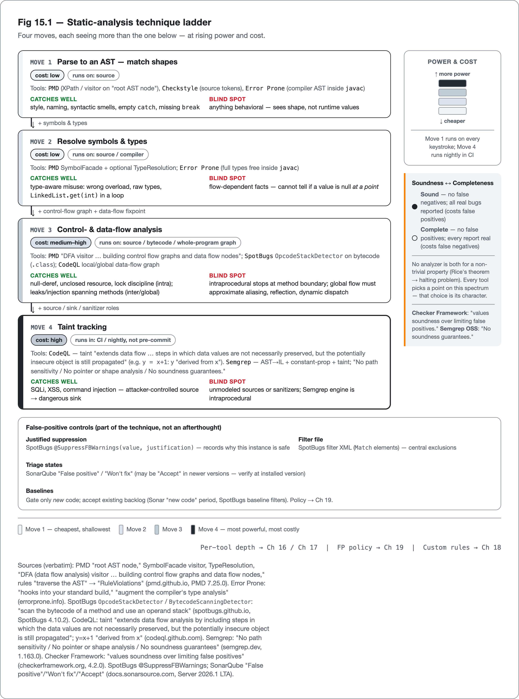

<!--
Dossier key: 26 (owner, single key) — per 01-index/FINAL_INDEX.md Ch 15 (OPENS Part IV)
Slug: 26_how_static_analysis_works
Part / arc position: Part IV — Static Analysis, Linting & Formatting, Chapter 15 (opens Part IV; Part III = Ch 13-14)
Companion module: 08-companion-code/26_how_static_analysis_works/ — EXAMPLE-BUILD green (JDK 21.0.11, `mvn -B -Pquality verify` SUCCESS). Spec at foot.
Verified against SOURCE-PIN: 2026-06-20. Sources (each technique illustrated by a tool's OWN docs, cited; verdict routed to Ch 17): PMD how-PMD-works (root AST node / SymbolFacade / TypeResolution / "DFA visitor … control flow graphs and data flow nodes" / traverse AST → RuleViolations / analyzes source — verbatim); Error Prone homepage ("hooks into your standard build" / "augment the compiler's type analysis" — verbatim; runs in javac); SpotBugs OpcodeStackDetector/BytecodeScanningDetector (bytecode + operand stack; FindBugs→SpotBugs); CodeQL about-data-flow-analysis (data-flow graph "models the way data flows through the program at runtime" / local vs global / taint "extends data flow analysis by including steps in which the data values are not necessarily preserved, but the potentially insecure object is still propagated" / y=x+1 "derived from x" — verbatim); Semgrep dataflow-overview (AST→IL / constant-prop + taint / intraprocedural / "No path sensitivity"/"No pointer or shape analysis"/"No soundness guarantees" — verbatim); Checker Framework manual ("values soundness over limiting false positives" / "unsound in a few places where a conservative analysis would issue too many false positive warnings" / suppression voids guarantee — verbatim); FP controls: SpotBugs filter file (Match) + @SuppressFBWarnings(value, justification), SonarQube "False positive"/"Won't fix" (may be "Accept"); Rice's theorem / halting problem (undecidability — VERIFIED via WebSearch/WebFetch 2026-06-28 against the primary citation: H. G. Rice, "Classes of recursively enumerable sets and their decision problems," Trans. AMS 74(2), 1953, 358–366; every non-trivial semantic property of programs is undecidable, generalizing the halting problem, proved by reduction from it).
⚠ verify-at-pin: tool versions/GAVs/API paths; verbatim quotes re-confirm; SonarQube resolution labels (Won't fix→Accept?); Semgrep OSS-vs-Pro interprocedural boundary. (Undecidability primary-text citation RESOLVED — Rice 1953, Trans. AMS 74(2), 358–366.) No AHEAD-OF-PIN items. Routes: per-tool depth → Ch 16/17; cross-tool verdict → Ch 17 (key 37); FP-policy/baselines → Ch 19 (key 39); custom rules → Ch 18.
DRAFT v1 — gates manual; technique-ladder + soundness-quadrant + illustrate-here-verdict-there shapes; EXAMPLE-BUILD GREEN (built — see _EXAMPLE.md).
-->

# Wrong in Both Directions

*How a linter actually reads a program (AST, data-flow, taint), and why no tool can be perfect · Part IV*

> A static analyzer is a machine that approximates an unanswerable question. Its false alarms and its blind spots are not bugs in the tool. They are mathematics.

## Hook

A developer dismisses the linter: it flagged a "null dereference" on a line that is provably safe, the third false alarm this week, so they stop reading its output. Two sprints later a real null bug ships, on a path the *same* linter never flagged. Both reactions feel like the tool failed. Neither is the tool's fault.

A static analyzer reasons about a program **without running it**, and the questions worth asking (*can this ever be null here? is this resource always closed? can attacker input reach this query?*) are, in the general case, **undecidable**. No terminating analysis can answer them exactly. Every tool must *approximate*, and there are exactly two ways to be wrong: cry wolf (a **false positive**) or miss a real bug (a **false negative**). A tool can be tuned to avoid one only by accepting more of the other. Being wrong in both directions is not a defect to be patched out. It is the permanent condition of the technique.

Part IV opens here by lifting the hood. The chapter has two jobs: show *how* analyzers actually work (the ladder from parsing source into a tree, to tracking values through the program, to following tainted input to a dangerous sink) and show *why* they are imperfect, so that when a tool flags (or misses) something, the reason is legible and a real finding can be separated from noise. Every per-tool chapter that follows is one rung of this ladder; this is the map.

## Overview

**What this chapter covers**

- The four moves every Java analyzer is built from, in rising order of power and cost: **parse to an AST** (an *abstract syntax tree*, the program rendered as a tree of language constructs), **resolve symbols and types**, **model control- and data-flow** (how values move through the code), and **track taint** (follow attacker-controlled values to dangerous operations).
- Where each move runs (source, compiler AST, bytecode, whole-program graph) and what it can and cannot see.
- The **false-positive problem**: why undecidability (Rice's theorem) makes false positives and false negatives unavoidable, and the **soundness vs completeness** trade-off every tool chooses a point on.
- The **controls** that make an imperfect tool usable: suppression with justification, and baselines that gate only new code.

**What this chapter does NOT cover.** The per-tool depth (Checkstyle, PMD, SpotBugs, Error Prone, SonarQube, IDE inspections, and the layered stack) is Chapter 16 and Chapter 17. The cross-tool "which to choose" verdict is Chapter 17. False-positive *policy* (baselines, ratcheting, what breaks the build) is Chapter 19. Writing custom rules is Chapter 18. Here, each tool appears only to *illustrate a technique*, cited to its own docs; the verdicts live downstream.

**The one idea to hold**: *every analyzer is a chosen point on the soundness↔completeness spectrum, and that choice is the source of both its value and its noise.* Understanding that choice is understanding the tool.

## How it works

Static analysis is four moves, layered. Figure 15.1 sets them out as a ladder, from parsing source into a tree at the top to following tainted input to a dangerous sink at the bottom, with the cost and the characteristic blind spot of each rung.

*Figure 15.1 — Static-analysis technique ladder — Four moves, each seeing more than the one below — at rising power and cost.*

Each rung sees more than the one above it, and costs more as you descend.

### Move 1 — Parse to an AST (matching shapes)

A parser reads the program and produces an **Abstract Syntax Tree**: a tree whose nodes are language constructs (a class declaration, a method, an `if`, a binary expression) stripped of layout and comments (hence *abstract*). Rules match *shapes* on this tree. PMD documents its own pipeline exactly: it parses to "the root AST node," runs a "SymbolFacade" visitor that "builds scopes, finds declarations and usages," optionally a "TypeResolution" visitor, and then rules "traverse the AST" and emit "RuleViolations" over source files. Two authoring styles sit on the tree: declarative XPath expressions and visitors written in Java.

Error Prone takes the same tree from inside the compiler. Its own description: it "hooks into your standard build, so all developers run it without thinking" and is used "to augment the compiler's type analysis" to "catch more mistakes before they cost you time." Running *inside* `javac` over the compiler's own AST means it has full type information and can fail compilation. Checkstyle works the same structural way on source tokens.

**AST/pattern matching is cheap, fast, and local**, ideal for style, naming, and syntactic anti-patterns (an empty `catch`, a missing `break`). It sees *shape*, not *behavior*. It cannot tell whether a value is null at a point, only whether the code *looks* a certain way. The companion module makes the shape concrete: an empty catch is the canonical tree pattern a rule matches, regardless of what the surrounding code does.

<!-- include: 26_how_static_analysis_works/src/main/java/org/acme/staticanalysis/AstSmellDemo.java#ast-smell -->

### Move 2 — Resolve symbols and types

A bare AST cannot tell two identically-spelled identifiers apart. **Symbol resolution** binds each name to its declaration through scopes; **type resolution** attaches Java types. This is the difference between a rule guessing from a token spelled `Date` and a rule *knowing* it is `java.util.Date`. PMD runs symbol resolution always and type resolution when a rule needs it; Error Prone gets both for free by living in the compiler. With types, a rule can say "this is `LinkedList.get(int)` called inside a loop" (an O(n) trap), a semantically-aware check rather than a syntactic guess. This is the foundation the behavioral moves build on. The module's worked case is a call that compiles but can never do what it looks like: searching a `List<Long>` for an `int` that boxes to `Integer` and so equals no element.

<!-- include: 26_how_static_analysis_works/src/main/java/org/acme/staticanalysis/TypeMisuseDemo.java#type-misuse -->

### Move 3 — Control- and data-flow analysis (reasoning about behavior)

To answer "can this be null *here*?" or "is this resource always closed?", the analyzer builds a **control-flow graph** (basic blocks joined by the program's possible execution edges) and runs **data-flow analysis**: it propagates *facts* (a lattice of abstract values) along the graph until they reach a fixpoint. PMD exposes exactly this: a "DFA (data flow analysis) visitor" for "building control flow graphs and data flow nodes."

Where the flow runs matters:

- **SpotBugs** runs data-flow over compiled **bytecode** (`.class` files), via detectors like `OpcodeStackDetector` that "scan the bytecode of a method and use an operand stack." Analyzing bytecode sees what the compiler actually emitted after desugaring, catching defects invisible in source, at the cost of source-distance in its messages. (SpotBugs is the maintained successor to the dead FindBugs; never cite FindBugs as current.)
- **CodeQL** builds a **data-flow graph** that, in its own words, "does not reflect the syntactic structure of the program, but models the way data flows through the program at runtime." It distinguishes **local data flow** (within one function) from **global data flow** (between functions). That distinction is the **intraprocedural vs interprocedural** axis.

> **CONCEPT** *Intraprocedural vs interprocedural: the reach/cost axis.* Reasoning *within* a method is fast and precise. Reasoning *across* methods (global flow) reaches defects the local view cannot, at a far higher cost, and must approximate aliasing, reflection, and dynamic dispatch. Most behavioral findings that emerge day-to-day are intraprocedural; whole-program leaks and injection need global flow, which is why those analyses run in CI or nightly, not on every keystroke.

The module plants the resource question this move answers: a reader opened and read but never closed on any path, the leak SpotBugs reports from the bytecode (`OS_OPEN_STREAM`).

<!-- include: 26_how_static_analysis_works/src/main/java/org/acme/staticanalysis/ResourceLeakDemo.java#dataflow-leak -->

### Move 4 — Taint tracking (data-flow for security)

**Taint analysis** is data-flow where the propagated fact is "this value is attacker-controlled." It models four roles: a **source** (where untrusted data enters, such as an HTTP parameter), a **sink** (a dangerous operation such as a SQL query or a shell command), a **sanitizer/barrier** (a step that makes the value safe, such as a parameterized query or an encoder), and the **flow steps** that spread taint. The defining extension over plain data-flow, in CodeQL's words: taint tracking "extends data flow analysis by including steps in which the data values are not necessarily preserved, but the potentially insecure object is still propagated." In `y = x + 1`, plain data-flow tracks only `x`, but taint marks `y` because it is "derived from `x`."

Semgrep illustrates the same technique and is candid about its bounds: it builds an AST "translated into an analysis-friendly intermediate language," offers constant propagation and taint tracking, and states plainly that its engine is intraprocedural with "No path sensitivity," "No pointer or shape analysis," and "No soundness guarantees." Taint tracking is the technique behind modern SAST (the security part), which is why the field separates SAST-grade flow tools from lint-grade pattern tools.

The module carries the four roles as a before/after. The tainted form takes an untrusted parameter (the source) and concatenates it straight into the command (a flow step) that reaches the query (the sink).

<!-- include: 26_how_static_analysis_works/src/main/java/org/acme/staticanalysis/TaintFlowDemo.java#taint-flow -->

The sanitized counterpart binds the same value as a parameter, so it stays data rather than command text. That binding is the barrier that breaks the source-to-sink path and clears the finding.

<!-- include: 26_how_static_analysis_works/src/main/java/org/acme/staticanalysis/TaintFlowDemo.java#taint-fixed -->

### The ladder in one view

| Move | Reasons over | Cost | Catches well | Characteristic blind spot |
|---|---|---|---|---|
| AST / pattern match | source tree shape | cheap | style, naming, syntactic smells | anything behavioral |
| + symbols & types | names → declarations + types | low | type-aware misuse (wrong overload, raw types) | flow-dependent facts |
| control-/data-flow (intraprocedural) | one method's value flow | medium | null / resource / lock within a method | cross-method facts |
| interprocedural / global flow | whole-program value flow | high | leaks/injection spanning methods | scalability; aliasing; reflection |
| taint tracking | attacker-controlled source → sink | high | injection (SQLi, XSS, command) | unmodeled sources/sanitizers |

No tool is crowned here. Each later chapter is one or two rungs of this table, and the "compose which of these for which team" verdict is Chapter 17's.

## Deep dive: why no analyzer can be perfect

Why every tool in Part IV is read and used the way it is comes down to one fact. The imperfection is not an engineering limitation that better tools will fix. It is a theorem.

### Undecidability, soundness, and completeness

Take any non-trivial *semantic* property of programs ("does this ever dereference null?", "does this always terminate?", "can tainted data reach this sink?"). A *semantic* property is one about the program's behavior rather than its syntax; *non-trivial* means it holds for some programs but not all. Deciding such a property in general is **undecidable** — this is **Rice's theorem**, which generalizes the undecidability of the halting problem, and the standard proof is a reduction from it: an algorithm that decided the property could be used to decide halting. A terminating analyzer that must give an answer for every program is therefore forced to *approximate*. There are precisely two directions of error:

- A **false positive**: the tool reports a problem that is not real.
- A **false negative**: a real problem the tool fails to report.

And two ideals, which cannot be combined:

- A **sound** analysis has *no false negatives*. It catches every real instance of the property, at the cost of false positives.
- A **complete** analysis has *no false positives*. Every report is real, at the cost of false negatives.

> **CONCEPT** *No analyzer is both sound and complete for a non-trivial property.* Every tool picks a point on the spectrum, and that point *is* its character. A tool tuned toward soundness (catch everything) will cry wolf more; a tool tuned toward completeness (only report real bugs) will stay quiet about more real bugs. The hook's two failures, a false alarm and a missed bug, are not contradictions. They are the same tool sitting at one point on this spectrum.

This is a deliberate, documented design choice, not folklore. The Checker Framework states it outright: it is "designed for analyses that value soundness over limiting false positives," and is "by default, unsound in a few places where a conservative analysis would issue too many false positive warnings." A tool can even choose *unsoundness in specific spots* to cut noise, and it says so explicitly. Reading any analyzer's docs for *where it sits on this spectrum* is how to calibrate trust in its output.

### Living with imperfection — the controls

Because false positives are inevitable, the worst outcome is a *noisy gate*: developers learn to ignore it, disable it, or rubber-stamp its output, and real findings drown with the false ones (the culture cost from Chapter 4). The controls for handling false positives are *part of the technique*, not an afterthought. The discipline is to *suppress with a reason*, never to disable a whole rule:

- **Per-site suppression with justification.** SpotBugs' `@SuppressFBWarnings` takes both a `value` (which pattern) and a **`justification`** (why this instance is safe), so the annotation records the human judgment next to the code.
- **Filter files.** SpotBugs filter XML (`Match` elements) excludes patterns or locations centrally, for findings that do not fit a per-site annotation.
- **Triage states.** SonarQube lets a reviewer resolve an issue as "False positive" or "Won't fix" (relabeled "Accept" in newer versions; verify at the installed version) rather than deleting the rule, keeping the rule live for future code.
- **Baselines.** The standard way to adopt a tool on a large legacy codebase: accept the existing backlog and gate only *new* code (Sonar's "new code" period, SpotBugs baseline filters), so a first run does not produce a flood that gets ignored. The *policy* (what breaks the build, baseline versus full-gate) is Chapter 19's.

The companion module shows the per-site form on a finding that is genuinely safe in context. The annotation names the pattern and records *why*, next to the code, instead of silencing the rule.

<!-- include: 26_how_static_analysis_works/src/main/java/org/acme/staticanalysis/SuppressionDemo.java#justified-suppression -->

Static analysis is *necessary but not sufficient*. It reasons over all paths but only an *approximation* of behavior; dynamic analysis (tests, Part V) runs the program and sees real values but only on executed paths. They are complementary, never substitutes, and neither makes the undecidability go away.

## Limitations & when NOT to reach for it

- **AST/pattern rules see shape, not behavior.** They flag a shape that is fine in context (false positive) and miss a bug in a different shape (false negative). Do not use pattern lint for null-safety, resource leaks, or injection; those need flow analysis.
- **Intraprocedural data-flow stops at the method boundary.** Facts that cross methods are invisible (Semgrep's engine is explicitly intraprocedural with "No soundness guarantees"). For whole-program leaks/injection, use a global engine and accept its cost.
- **Interprocedural/global flow and taint trade precision and time for power.** They must approximate aliasing, reflection, and dynamic dispatch, producing both false positives (an unseen sanitizer) and false negatives (an unrecognized source), and they are the slowest layer (minutes, not seconds). Run them in CI/nightly, not pre-commit; they degrade on reflection-heavy code.
- **Sound checkers carry an annotation/false-positive tax.** Choosing soundness means more false positives unless the code is annotated to the checker's satisfaction, and the guarantee evaporates if suppression is misused. They pay off on long-lived critical libraries, not prototypes.
- **The false-positive problem is structural, not a bug to be fixed.** Undecidability means no tool catches all real bugs with zero false alarms. A clean static scan is *not* proof of correctness; it is the absence of findings the tool's chosen point can see.
- **A noisy, un-triaged gate erodes trust.** The mitigation is technique (justified suppression, filters, triage states, baselines), not turning rules off wholesale.
- **More tools is not more quality without de-duplication and tuned rulesets.** Overlapping tools produce duplicate findings and combined build-time cost; composing a coherent stack is a deliberate decision (Chapter 17), and ruleset tuning is its own discipline (Chapter 19).

## Alternatives & adjacent approaches

- **Dynamic analysis** (tests, fuzzing, runtime instrumentation; Part V): runs the program, sees real values, but only on executed paths. It complements static's all-paths-but-approximate reasoning.
- **Compiler warnings** (`javac -Xlint`): the lowest-friction static analysis, already in the build. Turn it on before adding any tool.
- **Type systems as analysis** (generics, sealed types, JSpecify nullness; Chapters 9, 11): the strongest *sound* checks are the ones the language enforces at compile time. Pushing properties into the type system is static analysis that cannot be suppressed or ignored.
- **LLM-assisted review and triage:** an emerging layer for ranking or explaining findings. It is not a pinned technique here, and not a substitute for the deterministic analyses above.

These layer rather than compete: compiler warnings as the floor, pattern lint for style, flow analysis for behavior, taint for security, dynamic tests for the rest, each seeing what the others cannot.

## When to use what

- **For style, naming, and syntactic smells:** AST/pattern tools (Checkstyle, PMD), cheap, fast, run on every commit.
- **For type-aware mistakes at the earliest moment:** a compile-integrated checker (Error Prone) that fails the build like a compiler error.
- **For behavioral defects (null, resource leaks, lock discipline):** data-flow tools (SpotBugs on bytecode, flow rules), intraprocedural for fast feedback, global where the defect spans methods.
- **For injection and attacker-controlled-data bugs:** taint-tracking SAST (the security tools), in CI/nightly, not pre-commit.
- **For a soundness guarantee on a critical property:** a sound checker (the Checker Framework), accepting the annotation cost.
- **For every finding:** read *why* the tool sits where it does on the soundness/completeness spectrum. Handle false positives with justified suppression and baselines, never by silently disabling rules.

## Hand-off to the next chapter

The map of Part IV is now in hand: the four-move ladder every analyzer climbs, and the undecidability that makes all of them approximate. The next chapter descends from technique to tools: the four workhorse bug-finders of the Java ecosystem — **Checkstyle** and **PMD** (AST/pattern analysis on source), **SpotBugs** (data-flow on bytecode), and **Error Prone** (type-aware analysis inside the compiler). Each covers one or two rungs of the ladder above, with its own rule catalogue, its own place in the build, and its own characteristic point on the soundness/completeness spectrum. The chapter shows how to read each tool's findings knowing exactly what kind of analysis produced them.

## Back matter — sources & traceability

- **PMD** — how-PMD-works: "root AST node," SymbolFacade visitor, optional TypeResolution, "DFA (data flow analysis) visitor … building control flow graphs and data flow nodes," rules "traverse the AST" → "RuleViolations," analyzes source. *(verbatim; ⚠ re-confirm @pin.)*
- **Error Prone** — "hooks into your standard build," "augment the compiler's type analysis," "catch more mistakes before they cost you time"; runs inside `javac`. *(verbatim.)*
- **SpotBugs** — `OpcodeStackDetector`/`BytecodeScanningDetector` ("scan the bytecode of a method and use an operand stack"); bytecode data-flow; maintained successor to FindBugs. *(API names ⚠ path @pin.)*
- **CodeQL** — data-flow graph "models the way data flows through the program at runtime"; local vs global; taint "extends data flow analysis by including steps in which the data values are not necessarily preserved, but the potentially insecure object is still propagated"; `y=x+1` "derived from `x`." *(verbatim.)*
- **Semgrep** — AST → "analysis-friendly intermediate language"; constant propagation + taint; intraprocedural; "No path sensitivity," "No pointer or shape analysis," "No soundness guarantees." *(verbatim; OSS-vs-Pro interprocedural boundary ⚠ @pin.)*
- **Checker Framework** — "values soundness over limiting false positives"; "by default, unsound in a few places where a conservative analysis would issue too many false positive warnings"; suppression voids the guarantee. *(verbatim.)*
- **False-positive controls** — SpotBugs filter file (`Match`) + `@SuppressFBWarnings(value, justification)`; SonarQube "False positive"/"Won't fix" resolutions (may be "Accept" — verify @pin); baseline / "new code" (policy → Chapter 19).
- **Theory** — Rice's theorem: every non-trivial semantic (extensional) property of programs is undecidable; it generalizes the undecidability of the halting problem and is proved by reduction from it ⇒ no terminating analyzer can be both sound and complete for such a property. Primary source: H. G. Rice, "Classes of recursively enumerable sets and their decision problems," *Transactions of the American Mathematical Society* **74**(2) (1953), 358–366. *(VERIFIED — primary citation.)*
- **Routing** — per-tool depth → Ch 16/17; cross-tool "which to choose" verdict → Ch 17 (key 37); false-positive policy/baselines/ratcheting → Ch 19 (key 39); custom-rule authoring → Ch 18; lifecycle placement → Ch 3 (the toolchain map).

**Companion module (built — EXAMPLE-BUILD green at JDK 21.0.11, `mvn -B -Pquality verify` SUCCESS):** `08-companion-code/26_how_static_analysis_works/` — one analyzer-target per technique, each a small runnable shape beside the form that resolves it: an AST/style smell (empty `catch`, `AstSmellDemo`) the kind PMD `EmptyCatchBlock` / Checkstyle `EmptyBlock` match on the tree; a type-incompatible call (`List<Long>.contains(int)`, `TypeMisuseDemo`) the kind Error Prone flags inside `javac` as `CollectionIncompatibleType` and SpotBugs reports as `GC_UNRELATED_TYPES`; an unclosed-resource leak (`ResourceLeakDemo`) SpotBugs finds on the bytecode as `OS_OPEN_STREAM`; and an untrusted-param (source) → query (sink) taint flow (`TaintFlowDemo`) beside its parameter-bound, sanitized counterpart. A fifth element: a flagged-but-safe construct carrying a justified `@SuppressFBWarnings(value, justification)` (`SuppressionDemo`, a load-bearing `EI_EXPOSE_REP`). The module dogfoods the chapter's gate (Checkstyle + SpotBugs) and stays green: the two findings the gate raises (`GC_UNRELATED_TYPES`, `OS_OPEN_STREAM`) carry narrow reviewed suppressions with reasons, the rest sit below the gate's chosen point — the false-negative half shown in code. **TRY-IT:** run `mvn -Pquality verify` and watch which technique catches which target; remove a `Match` from `config/spotbugs/spotbugs-exclude.xml` and watch the corresponding finding break the build; bind the taint value (the `taint-fixed` form) and watch the source-to-sink path clear. **Failure path:** the taint sink degrades to an empty result for an unknown category rather than throwing, and the resource leak is the defect the data-flow analysis names — fixed by the try-with-resources form. Snippet tags: `ast-smell`, `type-misuse`, `dataflow-leak`, `taint-flow`, `taint-fixed`, `justified-suppression`.

## Next chapter teaser

Technique in hand, the workhorses follow. The next chapter covers the four bug-finders that do most of the day-to-day work in a Java pipeline (Checkstyle, PMD, SpotBugs, and Error Prone), each implementing a rung of the ladder above: where each runs in the build, what its rule catalogue covers, and how to read its findings knowing whether they came from a shape match, a type check, or a data-flow analysis.
