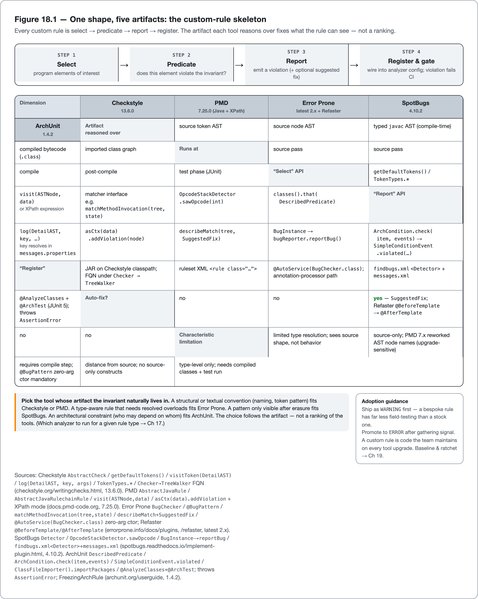

<!--
Dossier key: 38 (owner, leads) + folds 40 — per 01-index/FINAL_INDEX.md Ch 18
Slug: 38_custom_rules_codegen_lombok (owner key 38)
Part / arc position: Part IV — Static Analysis, Linting & Formatting, Chapter 18 (Part IV = Ch 15-19)
Companion module: 08-companion-code/ (one house invariant five ways + a codegen comparison) — EXAMPLE-BUILD = BUILT GREEN 2026-06-26 (JDK 21.0.11 / Maven 3.9.16; Tests run: 14, 0 Checkstyle, 0 SpotBugs; see _EXAMPLE.md). Spec at foot.
Verified against SOURCE-PIN: 2026-06-20. Sources (each tool cited to its OWN docs; the "which analyzer to run" verdict stays with Ch 17):
- Custom rules (38): shared shape select→predicate→report→register/gate over five artifacts.
  * Checkstyle (source token AST): AbstractCheck; getDefaultTokens/getAcceptableTokens/getRequiredTokens; visitToken(DetailAST); log(DetailAST,key,args); TokenTypes.*; findFirstToken; messages.properties; AbstractFileSetCheck.processFiltered; registered by FQN under Checker→TreeWalker; custom-check JAR as maven-checkstyle-plugin <dependency> in <build>. No full type resolution.
  * PMD (source node AST): AbstractJavaRule / AbstractJavaRulechainRule(buildTargetSelector, no recurse); visit(ASTNode,data)+super.visit; ASTMethodDeclaration/ASTFieldDeclaration/ASTVariableId/ASTIfStatement; asCtx(data).addViolation/addViolationWithMessage; definePropertyDescriptor(PropertyFactory)/getProperty; OR XPath rule (declarative, no compile). 7.x API churn.
  * Error Prone (typed javac AST, compile-time, AUTO-FIX): BugChecker; @BugPattern(name,summary,severity,linkType); MethodInvocationTreeMatcher.matchMethodInvocation(tree,state)→Description; describeMatch + SuggestedFix; @AutoService(BugChecker.class) ServiceLoader on annotation-processor path; zero-arg ctor required (optional ErrorProneFlags ctor); GAV error_prone_check_api/error_prone_annotation(s). Refaster @BeforeTemplate/@AfterTemplate (com.google.errorprone.refaster.annotation) → .refaster; canonical equals("")→isEmpty().
  * SpotBugs (compiled bytecode): Detector; BytecodeScanningDetector/OpcodeStackDetector(sawOpcode, operand stack)/AnnotationDetector; BugInstance+bugReporter.reportBug; findbugs.xml <Detector reports= speed=>/<BugPattern type= category=>; messages.xml ShortDescription/LongDescription({0})/Details(HTML); spotbugs-archetype; BugInstanceMatcher tests. Bytecode distance from source.
  * ArchUnit (imported class graph, JUnit test): DescribedPredicate<JavaClass>.test; ArchCondition<JavaClass>.check(item,ConditionEvents)→SimpleConditionEvent.violated; classes().that(pred).should(cond); ClassFileImporter().importPackages→JavaClasses; rule.check(classes) throws AssertionError; @AnalyzeClasses/@ArchTest; FreezingArchRule.freeze + archunit.properties (baseline). Type-level only, needs compiled classes + test run.
- Codegen + Lombok (40): boilerplate-as-quality-problem (hand-equals forgets a field = latent bug). JSR 269 round model: Processor SPI via META-INF/services/javax.annotation.processing.Processor; AbstractProcessor; @SupportedAnnotationTypes/@SupportedSourceVersion; rounds (process→Filer writes NEW files→feed next round→stop when none); RoundEnvironment "query about a round" / Filer "creation of new files" verbatim SE21; Messager; NO documented mutate-existing-type method. record (JEP 395, final JDK 16) = compiler-derived transparent carrier (no processor). Three approaches by relation-to-contract: record (compiler derives, no file) / AutoValue(@AutoValue→AutoValue_*)+Immutables(@Value.Immutable→Immutable*)+MapStruct(@Mapper→*Impl) (inside contract, new file, visible) / Lombok (past contract, edits annotated class via com.sun.tools.javac.* internal AST). Lombok mech: SPI lombok.launch.AnnotationProcessorHider$AnnotationProcessor; ShadowClassLoader (.SCL.lombok); lombok.javac.apt.LombokProcessor; HandlerLibrary/HandleX/@HandlerPriority; forces a round via dummy file + patches Filer. Stable @Getter/@Setter/@ToString/@EqualsAndHashCode/ctors/@Data/@Value/@Builder/@NonNull/@SneakyThrows/@Slf4j/val/var; experimental @SuperBuilder/@UtilityClass/@Accessors/@Delegate/etc. delombok (java -jar lombok.jar delombok src -d out) = escape hatch. lombok.config addLombokGeneratedAnnotation=true → @lombok.Generated → JaCoCo ≥0.8.1 excludes. Maven: provided scope + annotationProcessorPaths (MANDATORY @ JDK 23); internal-API access needs --add-opens (jdk.compiler not exporting com.sun.tools.javac.* since JDK 16); lombok-mapstruct-binding orders Lombok before MapStruct.
✅ verified-at-pin (corrected 2026-06-27 + BUILT GREEN, see _EXAMPLE.md): error_prone_annotations 2.36.0 (@RestrictedApi(explanation,link,allowlistAnnotations) + @CheckReturnValue) and ArchUnit 1.4.2 (DescribedPredicate/ArchCondition/SimpleConditionEvent.violated/ClassFileImporter/FreezingArchRule) — both are SOURCE-PIN §2 rows and compile in 08-companion-code/38; record Money(BigDecimal,Currency) compact ctor (JEP 395, GA JDK 16) compiles on the Java-21 anchor. ⚠ verify-at-pin (STILL DEFERRED — unpinned SDKs / no pinned spec clone): the analyzer custom-rule authoring SDK versions/GAVs/severities (Checkstyle/PMD/SpotBugs/Error Prone check_api — none a §2 row); PMD 7.x AST node renames + XPath wrapper class; javac -proc:* default change; JDK-23 annotationProcessorPaths-mandatory wording; --add-opens package set + JDK-16 export change; @lombok.Generated+JaCoCo min-versions; JSR 269 RoundEnvironment/Filer verbatim spans + JEP 395 verbatim (page 403s). ⚠ AHEAD-OF-PIN: JDK 25 preview node shapes (e.g. JEP 507 primitive type patterns 3rd preview) — custom rules must not assume. SOURCE-PIN gaps: Lombok/AutoValue/Immutables/MapStruct not yet §2 rows (09-flags/38_codegen_tools_not_pinned.md). @Generated trap: lombok.Generated ≠ jakarta/javax Generated — name the package.
Routes: which-analyzer-to-run/layering → Ch 17 (do NOT crown here); analyzers over generated code → Ch 15/16; FP policy/baselines/FreezingArchRule → Ch 19; coverage gating + @Generated → metrics/coverage chapter; records as language feature → Ch 5/8; equals/hashCode contract → Ch 7/8.
DRAFT v1 — editorial gates (VERIFY/CLARITY/AUDIT) manual/pending; select→predicate→report→register (shared-shape-five-realizations) + relation-to-the-standard-contract + substrate (carried from Ch 17) shapes; EXAMPLE-BUILD = BUILT GREEN 2026-06-26 (see _EXAMPLE.md).
-->

# Teaching the Build Your Rules

*Writing custom analyzer rules, and the compile-time codegen that writes the boilerplate — including the Lombok debate · 38 (folds 40) · Part IV*

> Every team has rules that live in review comments and tribal memory. The ones the build cannot see get broken the week the person who knows them is on vacation.

## Hook

"Money is always `BigDecimal`, never `double`." "No controller calls a repository directly." "That deprecated client must never come back." Every codebase has a handful of these — invariants that are true of *this* project, enforced today by a senior reviewer's memory and a comment on pull request #4471. They hold right up until the reviewer is on vacation, and then a `double price` slips in, ships, and rounds someone's invoice wrong in production.

The stock rulesets from the last three chapters cannot help here. Checkstyle, PMD, SpotBugs, and Sonar ship *general* Java wisdom (naming, complexity, the classic bug patterns) because that is all they can know about a codebase they have never seen. The project-specific invariant lives only in the team's head. This chapter is about getting it into the build, two ways. First, **custom rules**: every analyzer the book surveys ships a first-class extension point, and a project convention written as a custom check becomes a machine-checked, build-failing gate that never forgets and never goes on vacation. Second, the related compile-time machinery next door: **annotation processors and code generation**, the mechanism that writes the boilerplate those conventions generate, and the long-running **Lombok debate** about *how far* a tool should reach into the compiler to do it. Both halves are the same move, teaching the build to do mechanically and every time what a team would otherwise do by hand and memory.

## Overview

**What this chapter covers**

- The **shared shape** of every custom rule (*select → predicate → report → register/gate*) and the five tools that realize it over five different artifacts (Checkstyle, PMD, Error Prone, SpotBugs, ArchUnit).
- When a custom rule earns its keep, and the trap of writing one for something a stock rule (or a code review) already handles.
- **Compile-time code generation**: the JSR 269 round model, `record` as the language-level answer, and the generate-new-files processors (AutoValue, Immutables, MapStruct).
- **The Lombok debate**: how it works (it edits the compiler's own *abstract syntax tree*, the AST), its strongest case (terseness and breadth), and its hardest objection (dependence on non-standard compiler internals), framed neutrally.

**What this chapter does NOT cover.** *Which* analyzer should own a given rule, or how to layer them: that verdict is Chapter 17's. How the analyzers behave over generated code in depth (Chapters 15–16). False-positive policy, baselines, and ratcheting, including ArchUnit's `FreezingArchRule` (Chapter 19). Coverage gating and the `@Generated` exclusion mechanics (the metrics/coverage chapter). `record` as a language feature in full (Chapters 5 and 8). Each tool here is cited to its own docs; **no tool and no codegen approach is crowned**.

**One idea to hold**: *a custom rule and a code generator are both ways to extend the build. One extends what it checks; the other extends what it writes. Each is leverage the team now owns and must maintain.*

## How it works

*Fig 18.1 &mdash; One shape, five artifacts: the custom-rule skeleton — Every custom rule is select &rarr; predicate &rarr; report &rarr; register. The artifact each tool reasons over fixes what the rule can see &mdash; not a ranking.*

*Fig 18.2 &mdash; Codegen approaches by relation to the JSR&nbsp;269 standard contract — Three positions on one spectrum: compiler-derived &rarr; new-file processor (inside contract) &rarr; AST-edit processor (past contract). Each states its trade-off; none is crowned.*

### The shared shape of a custom rule

Strip away the API differences and every custom rule, in every tool, is the same four steps:

1. **Select** the program elements of interest — a token type, an AST node, a method-invocation tree, a bytecode opcode, a set of classes.
2. **Predicate** — decide whether a selected element violates the invariant.
3. **Report** — emit a violation with a message (and, where the tool allows, a suggested fix).
4. **Register & gate** — wire the rule into the analyzer's config and the build so a violation fails CI.

What changes between tools is the *artifact* each reasons over, and that, exactly as in Chapter 17, fixes what the rule can see and when it runs. The same invariant ("no `double` money") is straightforward to express against one artifact and awkward against another:

| Tool | Reasons over | "Select" | "Report" | Auto-fix? | Runs at |
|---|---|---|---|---|---|
| Checkstyle | source token AST | `getDefaultTokens()` / `TokenTypes.*` | `log(ast, key, …)` | no | source pass |
| PMD (Java) | source node AST | `visit(ASTNode, data)` | `asCtx(data).addViolation(…)` | no | source pass |
| PMD (XPath) | source node AST | an XPath expression | XPath match = violation | no | source pass |
| Error Prone | typed `javac` AST | `match*` matcher | `describeMatch` + `SuggestedFix` | **yes** | compile |
| SpotBugs | compiled bytecode | opcode / annotation visit | `BugInstance` → `reportBug` | no | post-compile |
| ArchUnit | imported class graph | `classes().that(pred)` | `ArchCondition.check` → `violated` | no | test phase |

> **CONCEPT** *One shape, five artifacts.* A custom rule inherits its host's substrate and moment — and so its strengths and blind spots. Pick the tool whose artifact the invariant naturally lives in: a *textual/structural* convention fits Checkstyle/PMD; a *type-aware* rule fits Error Prone; a *bytecode-only* pattern fits SpotBugs; an *architectural* law (who may depend on whom) fits ArchUnit. The choice follows the artifact, not a ranking.

### Three realizations, briefly

**Checkstyle (source tokens).** Extend `AbstractCheck`, declare the tokens of interest via `getDefaultTokens()`/`getAcceptableTokens()`/`getRequiredTokens()`, and implement `visitToken(DetailAST ast)`, navigating with `findFirstToken(int)` and reporting through `log(DetailAST, messageKey, args)`, where the key resolves against a `messages.properties` bundle (i18n for free). Compile it into a JAR, declare that JAR as a **plugin dependency** of `maven-checkstyle-plugin`, and register the check by fully-qualified class name under `Checker → TreeWalker`. Its limit is its artifact: token-level source, with limited type resolution. It sees that a field is named `price` and typed `double`, but "is this *the* `java.util.Date`, not a same-named local class?" is awkward to answer reliably.

**Error Prone (typed `javac` AST, compile-time, with auto-fix).** A custom check extends `BugChecker`, carries an `@BugPattern(name, summary, severity, …)`, and implements a matcher interface such as `MethodInvocationTreeMatcher`. Its `matchMethodInvocation(tree, state)` returns a `Description` (`NO_MATCH`, or `describeMatch(tree, fix)`). It is discovered off the annotation-processor path via `@AutoService(BugChecker.class)` and **must have a zero-arg constructor**. The distinctive capability: a `Description` can carry a `SuggestedFix`, so the check both detects *and rewrites* the code, and `@BugPattern(severity = ERROR)` makes it a compile error. For pure expression rewrites there is **Refaster**: write a `@BeforeTemplate` (the pattern) and an `@AfterTemplate` (the replacement) with matching signatures, and the compiler rewrites matches; the canonical example turns `string.equals("")` into `string.isEmpty()`.

**ArchUnit (the imported class graph, as a unit test).** Beyond its fluent DSL, ArchUnit exposes two extension points: a `DescribedPredicate<JavaClass>` (the filter; override `test(JavaClass)`) and an `ArchCondition<JavaClass>` (the constraint; override `check(item, events)` and add `SimpleConditionEvent.violated(origin, message)`). Combine them: `classes().that(myPredicate).should(myCondition)`. The rule runs as a JUnit test (`@AnalyzeClasses` + `@ArchTest`) and **throws `AssertionError` on violation**, like any failing test. (PMD adds a second authoring mode worth knowing: a rule can be a Java `AbstractJavaRule` visitor *or* a declarative **XPath** expression in the ruleset XML; XPath needs no compilation but hits an expressive ceiling. SpotBugs detectors, working on bytecode at the opcode level via `OpcodeStackDetector`, are the lowest-level and most effortful, reserved for patterns only visible after compilation.)

The honest first question before writing any of them: *does a stock rule with tuned config already cover this, or is this really a review judgment?* A custom rule is code the team now owns — tested, documented, and re-validated on every tool upgrade. Ship it as a `WARNING` first to gather signal, then promote to `ERROR`; a bespoke rule has had far less field-testing than a stock one, and a noisy custom gate teaches the team to ignore the gate (Chapter 19).

### Compile-time codegen: the boilerplate conventions generate

The conventions above often *create* boilerplate. "Every value type overrides `equals`/`hashCode`/`toString`" is a fine rule — and a hand-written `equals` that forgets a newly added field is a classic latent bug (Chapter 8). Boilerplate is a quality problem twice over: it is volume that hides intent, and it rots out of sync with the fields it mirrors. **Compile-time code generation** removes the toil by deriving the mechanical code from a declaration during compilation. The JDK's own mechanism is **JSR 269**, the Pluggable Annotation Processing API, built into `javac` since Java 6.

Its model is **rounds**. `javac` discovers processors via the SPI (`META-INF/services/javax.annotation.processing.Processor`), then loops: each round, it calls every processor's `process(...)` with the annotations present and a `RoundEnvironment` to "query for information about a round of annotation processing"; a processor may write **new files** through the `Filer` (which "supports the creation of new files by an annotation processor"); those generated sources feed the next round; processing ends when a round generates nothing. The load-bearing constraint is that the standard API lets a processor *create* files. It offers **no documented way to modify the body of an already-declared type.** That constraint is the one the whole Lombok debate turns on.

> **CONCEPT** *Relation to the standard contract.* The cleanest way to place any codegen approach is by how it relates to that JSR 269 contract: `record` sidesteps it at the language level (the *compiler* derives members, no processor); AutoValue/Immutables/MapStruct work *inside* it (write a new file); Lombok extends *past* it (edits the annotated type via compiler internals). That relation is simultaneously each approach's strongest case and its hardest limitation.

The three non-Lombok answers:

- **`record`** (final in JDK 16): for an immutable data carrier, the compiler derives the canonical constructor, accessors, `equals`, `hashCode`, and `toString` — no dependency, no processor, no generated file. It covers the value-carrier slice and only that: a record is a transparent carrier, cannot extend a class, and is shallowly immutable, so builders, mutable entities, mappers, and loggers are out of scope.
- **Generate-new-files processors**: AutoValue (`@AutoValue` → an `AutoValue_Foo` subclass), Immutables (`@Value.Immutable` → an `ImmutableFoo`), MapStruct (`@Mapper` → a `FooMapperImpl` of compile-time, reflection-free mapping code). The generated class is ordinary, inspectable Java that every IDE and analyzer already understands. The cost: the caller references a *generated* symbol that is not the type originally declared, and a clean build needs the generated-sources directory on the source path.

### The Lombok debate

Lombok is the most widely deployed of these, and the most contested, because of *how* it generates. It registers as a JSR 269 processor (via a deliberately package-private `lombok.launch.AnnotationProcessorHider$AnnotationProcessor`, with a `ShadowClassLoader` that isolates its internals in `.SCL.lombok` files), but then it does what the standard API does not offer: the element objects `javac` hands a processor are *the compiler's actual internal AST nodes*, so Lombok casts them to `com.sun.tools.javac.tree.*` types and **edits the annotated class in place**, injecting methods and fields, forcing extra compiler rounds (it generates a dummy file, then patches `javac`'s `Filer` to discard it). After processing, `javac` emits bytecode from the *modified* AST. That single mechanism is the whole value proposition and the whole controversy.

**Its strongest case**, cited to its own docs: maximal terseness across a broad surface. One `@Data` or `@Builder` collapses dozens of lines. Lombok reaches well past value types (`@Slf4j` for a logger, `@SneakyThrows`, `@Synchronized`, `@Cleanup` for ARM, the full family of constructors) with first-class Maven/Gradle and IDE support. For a team whose pain is *volume of boilerplate across many shapes*, that breadth is the draw.

**Its hardest objection**, also from its own behavior:

- *Dependence on non-standard compiler internals.* The same edit-the-AST move couples Lombok to `com.sun.tools.javac.*` — packages the `jdk.compiler` module does not export. Since JDK 16 this requires `--add-opens`/`--add-exports`, and each JDK can change those internals, so every new JDK is a compatibility event (Lombok ships the incantations so supported versions keep working, but the *dependence* is the point).
- *Invisibility and tool friction.* Because the generated members exist only in the mutated AST, the source the developer reads is not the code that runs: IDEs need a Lombok plugin to resolve the members, other annotation processors may not see Lombok's changes (hence the `lombok-mapstruct-binding` ordering dependency), and coverage/analysis tools need the `@lombok.Generated` marker (enabled by `lombok.addLombokGeneratedAnnotation = true`, which JaCoCo honors to skip generated members) to avoid distortion. The documented remedy is `delombok`, which pretty-prints the transformed AST back to standard Java source — or a committed form, to drop the dependency.
- *The records overlap.* For the value-object slice that `@Value`/`@Data` historically served, `record` now offers a language-level answer with no dependency — the live question of whether a project still needs Lombok for that slice.

Framed neutrally: `record`, the generate-new-files processors, and Lombok are **different approaches to the same boilerplate problem**, and a codebase may use several at once (records for DTOs, MapStruct for mapping, Lombok for logging). Each states its trade-off; none is crowned. (One build-wiring fact teams hit: registering processors via `annotationProcessorPaths` becomes **mandatory at JDK 23**; before that, a processor on the plain classpath was discovered implicitly.)

## Deep dive: one invariant, enforced and generated

Both techniques meet on a single real convention: *money is always `BigDecimal`, never `double`.*

As a **custom rule**, that invariant can be enforced at every artifact at once, and watching it do so makes the substrate idea concrete. A Checkstyle check flags a `double` field whose name matches a money pattern (source tokens). A PMD rule does the same on the source node tree (and the equivalent XPath rule shows the declarative mode). An Error Prone `@BugPattern(severity = ERROR)` fails the *compile* when money is built from a `double`, and ships a `SuggestedFix`; a Refaster template rewrites the precision trap `new BigDecimal(aDouble)` into `BigDecimal.valueOf(aDouble)`. A SpotBugs detector catches it in the *bytecode*. An ArchUnit condition asserts that no domain type *exposes* floating-point money on its public API. `FreezingArchRule` allows adoption on a legacy codebase by recording today's violations and failing only on new ones (Chapter 19).

The companion module realizes this with only the dependencies the book has pinned. The hand-written guard refuses to build money from anything but an exact decimal:

<!-- include: 38_custom_rules_codegen_lombok/src/main/java/org/acme/storefront/money/MoneyGuards.java#hand-written-guard -->

The same four steps — select, predicate, report — written over the reflection artifact stand in for a source-AST or bytecode custom check:

<!-- include: 38_custom_rules_codegen_lombok/src/main/java/org/acme/storefront/money/MoneyApiInspector.java#reflective-inspector -->

The Error Prone-style form needs no runtime code at all: the banned floating-point factory is annotated so a compile-time check flags every caller not on the allowlist. The factory returns a value rather than mutating state, so `@CheckReturnValue` rides alongside `@RestrictedApi` to forbid silently discarding that result.

<!-- include: 38_custom_rules_codegen_lombok/src/main/java/org/acme/storefront/money/LegacyMoneyFactory.java#errorprone-annotation-fence -->

The architectural form is a custom ArchUnit predicate and condition — the filter and the constraint — combined into a rule that runs as an ordinary test:

<!-- include: 38_custom_rules_codegen_lombok/src/test/java/org/acme/storefront/money/MoneyArchRules.java#archunit-predicate -->

<!-- include: 38_custom_rules_codegen_lombok/src/test/java/org/acme/storefront/money/MoneyArchRules.java#archunit-condition -->

<!-- include: 38_custom_rules_codegen_lombok/src/test/java/org/acme/storefront/money/MoneyArchTest.java#archunit-rule -->

The reason Chapter 17's layering matters is that **each rule only sees its own artifact**. Smuggle a `double` in through a surface a given tool cannot see (reflection, or a generic erased before SpotBugs reads the bytecode) and that tool goes quiet. No single custom rule is a complete fence; the coverage comes from composing them, exactly as the stock analyzers compose.

As **codegen**, the same `Money` is best expressed as a `record Money(BigDecimal amount, Currency currency)`. The compiler derives the value semantics, no processor, no dependency, and the type is impossible to construct with a `double` amount because the component type *is* `BigDecimal`:

<!-- include: 38_custom_rules_codegen_lombok/src/main/java/org/acme/storefront/money/Money.java#record-money -->

Where the convention needs more than a carrier (a mapper between the domain `Money` and a wire DTO), a MapStruct `@Mapper` generates a visible, reflection-free `*Impl`. The custom rule *forbids* the wrong representation; the right representation, generated by the compiler, makes the wrong one hard to write in the first place. A good rule and a good generator push from opposite sides toward the same invariant.

A custom rule and a code generator both *extend the build*: one extends what it checks, the other what it writes, and both are leverage the team now owns. The bill is upkeep: a custom rule is re-validated on every tool upgrade, and a generator ties the build to a processor or a language level. They earn their keep on invariants that are project-specific, frequently relevant, and cheaply machine-handled. Nowhere else.

## Limitations & when NOT to reach for it

- **A custom rule is code the team maintains forever.** Every authoring API is tool-version-bound (PMD's 7.x line reworked its AST node names and rule model — custom PMD rules are the most upgrade-sensitive). An un-maintained custom rule rots into false positives and gets disabled. When NOT: for a one-off that will never be re-checked, or a convention a stock rule already covers with config.
- **False positives cost trust fast.** A bespoke rule has little field-testing; ship `WARNING`, then promote to `ERROR`. A noisy custom gate trains the team to route around the gate.
- **Some invariants are not machine-checkable.** "Is this abstraction the right one?" is a review judgment no AST can make. Do not force a semantic call into a syntactic rule.
- **Each rule sees only its own artifact.** Checkstyle/PMD miss what is only in bytecode; SpotBugs misses source-only constructs; ArchUnit sees type-level structure, not statement-level logic. Coverage comes from composition (Chapter 17), not from one heroic rule.
- **Codegen adds machinery between the declared source and the running code.** Generate-new-files processors add a generated symbol to reference and a build step; `record` covers only the transparent-carrier slice (no inheritance, shallow immutability, no builders/entities/mappers); processor *ordering* is unspecified, so multi-processor builds need explicit care (`lombok-mapstruct-binding`).
- **Lombok's trade is specific.** It depends on non-standard compiler internals (`--add-opens` since JDK 16; a compatibility event each JDK), and the source the developer reads is not the code that runs (IDE plugin required; other processors may not see its edits; `@lombok.Generated` needed so coverage is not distorted). When NOT: a codebase that wants zero dependence on compiler internals or zero IDE-plugin requirement, or a value layer `record` already covers. Where it fits: broad boilerplate across many shapes where terseness is the priority and the team accepts the trade and configures the exclusion.
- **Generated ≠ reviewed.** Generated code is only as correct as its generator; the `@Generated` exclusion hides it from coverage but does not test it. Name the marker precisely — `lombok.Generated` is a different annotation from `jakarta.annotation.Generated`.

## Alternatives & adjacent approaches

- **Tune a stock rule instead of writing one** (Chapters 15–16): many "we need a custom rule" needs are a stock rule with adjusted thresholds or an added pattern.
- **Code review and architecture tests** for judgments that resist syntactic rules — ArchUnit covers the structural ones; the rest stay human.
- **OpenRewrite / large-scale refactoring tools** (a later chapter) for cross-codebase rewrites beyond what a Refaster expression template expresses.
- **`record` (and sealed types)** as the language-level answer that removes the need for a generator in the value/data slice (Chapters 5, 8).
- **Sonar custom rules / custom inspections** to push a house rule into the platform or the IDE first line (Chapter 17), so it surfaces where developers already look.

These compose with custom rules rather than replacing them: language features remove boilerplate, generators write what remains, stock rules cover the general case, and custom rules fence the few invariants that are unique to the project.

## When to use what

- **For a project-specific, frequently-relevant, machine-checkable invariant:** a custom rule — in the tool whose artifact the invariant lives in (structural → Checkstyle/PMD; type-aware → Error Prone; bytecode-only → SpotBugs; architectural → ArchUnit).
- **For a rule that should also fix the code:** Error Prone `SuggestedFix` / Refaster (expression-shaped rewrites).
- **For adopting a rule on a legacy codebase:** introduce it as `WARNING`, or freeze existing violations (ArchUnit `FreezingArchRule`) and gate only new ones (Chapter 19).
- **For an immutable data carrier:** a `record` — no generator needed.
- **For value types with builders, mappers, or many optional fields:** a generate-new-files processor (AutoValue/Immutables/MapStruct) — visible, inspectable output.
- **For broad boilerplate across many shapes, accepting the trade:** Lombok, with `@lombok.Generated` configured and `delombok` available as the exit.
- **When a stock rule or a code review already covers it:** do not write a custom rule.

## Hand-off to the next chapter

Custom rules and generators both add findings and machinery to the build, which sharpens the problem the next chapter solves. Every analyzer in Part IV, stock or custom, produces false positives; every gate accumulates findings faster than a team can fix them; and a rule introduced on a million-line codebase cannot demand a day-one cleanup. The final chapter of Part IV is **living with findings**: false-positive triage and *reasoned* suppression (`// NOSONAR`, `@SuppressWarnings`, SpotBugs exclude filters), **baselines** that accept today's debt while stopping new debt (the `FreezingArchRule` idea, generalized), and **ratcheting** a gate tighter over time. That is how everything wired across Chapters 15–18 stays credible instead of getting disabled.

## Back matter — sources & traceability

- **Custom rules** (each cited to its own pinned doc): Checkstyle `AbstractCheck`/`getDefaultTokens`/`visitToken(DetailAST)`/`log`/`TokenTypes.*`/`messages.properties`/`Checker→TreeWalker` FQN registration (`checkstyle.org/writingchecks.html`); PMD `AbstractJavaRule`/`AbstractJavaRulechainRule`/`visit(ASTNode,data)`/`asCtx(data).addViolation`/`definePropertyDescriptor` + XPath mode (`docs.pmd-code.org` writing-java-rules / xpath); Error Prone `BugChecker`/`@BugPattern`/`MethodInvocationTreeMatcher.matchMethodInvocation`/`describeMatch`+`SuggestedFix`/`@AutoService`/zero-arg-ctor + Refaster `@BeforeTemplate`/`@AfterTemplate` (`errorprone.info/docs/plugins`,`/refaster`); SpotBugs `Detector`/`OpcodeStackDetector.sawOpcode`/`BugInstance`+`reportBug`/`findbugs.xml`+`messages.xml`/`spotbugs-archetype` (`spotbugs.readthedocs.io/implement-plugin`); ArchUnit `DescribedPredicate`/`ArchCondition.check`/`SimpleConditionEvent.violated`/`ClassFileImporter`/`rule.check` throws `AssertionError`/`@AnalyzeClasses`+`@ArchTest`/`FreezingArchRule` (`archunit.org/userguide`). *(API identity verified; ArchUnit 1.4.2 GAV/API ✅ pinned + built green (`08-companion-code/38`, SOURCE-PIN §2); the Checkstyle/PMD/SpotBugs/Error Prone custom-rule authoring-SDK versions/GAVs/severities and PMD 7.x node renames + XPath wrapper class remain ⚠ @pin — those SDKs are not SOURCE-PIN rows, `09-flags/38_tool_versions_and_apis_unverified.md` + `38_pmd_api_churn_unverified.md`.)*
- **Codegen** — JSR 269 `javax.annotation.processing` (SE 21 package summary): `Processor` SPI via `META-INF/services`; `AbstractProcessor`; rounds; `RoundEnvironment` "query … about a round" + `Filer` "creation of new files"; `Messager`; no documented mutate-existing method. *(API identity verified; the two double-quoted `RoundEnvironment`/`Filer` spans are attributed-verbatim SE 21 Javadoc but the character-for-character match is ⚠ @pin — not confirmable without the pinned SE 21 doc clone; `09-flags/38_tool_versions_and_apis_unverified.md`.)* `record` (JEP 395, final JDK 16): the JEP number + GA-at-JDK-16 + compiler-derived value semantics are ✅ verified — `record Money(BigDecimal,Currency)` compiles on the Java-21 anchor in `08-companion-code/38`; the **verbatim JEP 395 text** (page 403s) remains ⚠ @pin. AutoValue (`@AutoValue`→`AutoValue_*`, `github.com/google/auto`); Immutables (`@Value.Immutable`→`Immutable*`, `immutables.github.io`); MapStruct (`@Mapper`→`*Impl`, `mapstruct.org`) — none a SOURCE-PIN row, prose-only (`09-flags/38_codegen_tools_not_pinned.md`).
- **Lombok** (`projectlombok.org`): SPI `lombok.launch.AnnotationProcessorHider$AnnotationProcessor`; `ShadowClassLoader`(`.SCL.lombok`); `lombok.javac.apt.LombokProcessor`; `HandlerLibrary`/`HandleX`/`@HandlerPriority`; AST-edit + forced round (dummy file + `Filer` patch); stable `@Data`/`@Value`/`@Builder`/`@Slf4j`/`@SneakyThrows`/`@Cleanup`/…; `delombok` (`java -jar lombok.jar delombok src -d out`); `lombok.config` `addLombokGeneratedAnnotation=true` → `@lombok.Generated` → JaCoCo (≥0.8.1) exclude; Maven `provided` + `annotationProcessorPaths` (mandatory @ JDK 23); `--add-opens` for `com.sun.tools.javac.*` (jdk.compiler not exporting since JDK 16, issues #2681/#3719); `lombok-mapstruct-binding`. *(class/feature identity verified; all versions/GAVs/flag-matrix ⚠ @pin; Lombok/AutoValue/Immutables/MapStruct not yet SOURCE-PIN §2 rows; `@Generated` package-name trap noted.)*
- **Routing** — which-analyzer/layering verdict → Ch 17 (not crowned here); analyzers over generated code → Ch 15/16; FP policy/baselines/`FreezingArchRule` → Ch 19; coverage gating + `@Generated` → metrics/coverage chapter; records as language feature → Ch 5/8; `equals`/`hashCode` contract → Ch 7/8.

**Companion module (BUILT — EXAMPLE-BUILD green 2026-06-26; toolchain JDK 21.0.11 / Maven 3.9.16):** `08-companion-code/38_custom_rules_codegen_lombok/` — the *one invariant ("money is a dedicated value type, never raw `double`/`float`"), five ways* demo, built with **only SOURCE-PIN-pinned dependencies**: (1) a hand-written runtime guard (`MoneyGuards`, JDK), (2) a `record` compact constructor (`Money`, JDK), (3) an Error Prone-style declarative fence (`LegacyMoneyFactory` with `@RestrictedApi` from the pinned `error_prone_annotations 2.36.0`), (4) a custom ArchUnit `DescribedPredicate` + `ArchCondition` (+ `FreezingArchRule` baseline, ArchUnit 1.4.2), and (5) a reflective API inspector (`MoneyApiInspector`) that realizes the same select→predicate→report→gate shape *without* an unpinned analyzer SDK — the runnable stand-in for the Checkstyle/PMD/SpotBugs custom checks, whose authoring SDKs are **not** SOURCE-PIN rows and so are described in the prose above rather than built. Each is exercised by a JUnit test asserting it fires on the bad fixture (`legacy.LegacyOrderLine`, which exposes `double` money) and is silent on the good one (`catalog.PricedItem`, which uses `Money`). Codegen comparison: hand-written value boilerplate (`HandWrittenMoney`) versus the compiler-derived `record` (`Money`), with a test asserting they agree value-for-value; the new-file processors (AutoValue/Immutables/MapStruct) and **Lombok stay prose-only because none is a SOURCE-PIN row** (flag: `09-flags/38_codegen_tools_not_pinned.md`). **Failure path:** the seeded `double` breach is reported by every realization — the reflective inspector and the source-style rule flag it, the ArchUnit condition throws `AssertionError`, the hand-written guard refuses to build it, and an Error Prone build (described, not wired) flags the fenced caller. **Honest edge, shown in code:** the reflective inspector is silent on a `double` reached only through an erased generic — each rule sees only its own artifact, which is why layering (Ch 17) matters. **Observability:** `MoneyPolicyHealth` (readiness probe + reported-breach count). **Externalized config:** `money-policy.properties` with `dev` (WARNING) / `prod` (ERROR) profiles.

**Snippet tags:** `MoneyGuards.java#hand-written-guard` · `Money.java#record-money` · `LegacyMoneyFactory.java#errorprone-annotation-fence` · `MoneyApiInspector.java#reflective-inspector` · `MoneyArchRules.java#archunit-predicate` · `MoneyArchRules.java#archunit-condition` · `MoneyArchTest.java#archunit-rule` — all seven resolve to ≤9-line tag regions in compiling files (verified by `check_snippets.sh`).

## Next chapter teaser

A stack wired to catch a great deal is exactly the problem the last chapter of Part IV confronts. A gate that reports five hundred findings, most of them false or pre-existing, gets switched off within a month. Next: how to live with findings — triage and suppress with a *reason*, baseline a legacy codebase so the gate guards new code without demanding an impossible cleanup, and ratchet the bar tighter as the team pays the debt down. The difference between a quality gate that lasts and one the team learns to ignore.
