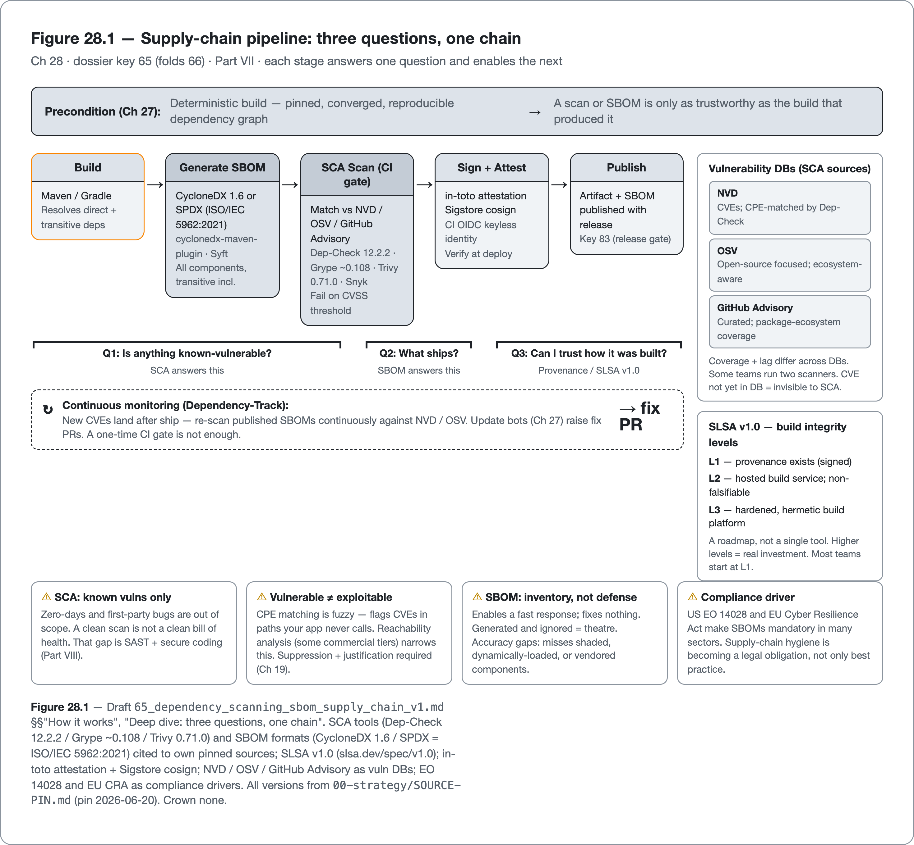

<!--
Dossier key: 65 (owner, leads) + folds 66 — per 01-index/FINAL_INDEX.md Ch 28
Slug: 65_dependency_scanning_sbom_supply_chain (owner key 65)
Part / arc position: Part VII — Build, Dependencies & Supply Chain, Chapter 28 (Part VII = Ch 27-29)
Companion module: 08-companion-code/65_dependency_scanning_sbom_supply_chain/ (CycloneDX 1.6 SBOM generated on verify; OWASP Dependency-Check 12.2.2 gate in an opt-in -Pscan profile + reviewed suppression; in-code SCA gate + failure path) — ✅ EXAMPLE-BUILD built green (mvn -B -Pquality verify: 9 tests, 0 Checkstyle, 0 SpotBugs, bom.json written; JDK 21.0.11 / Maven 3.9.16). The live dependency scan needs the NVD DB → REPRO PENDING-RUNTIME. Spec at foot.
Verified against SOURCE-PIN: 2026-06-27 (re-pin: CycloneDX 1.6, OWASP Dependency-Check 12.2.2, SPDX = ISO/IEC 5962:2021, SLSA v1.0, Grype/Trivy/Snyk rows confirmed §4). Sources (concise main-loop dossiers; ⚠ SCA multi-tool + SPDX/CycloneDX crown neither, each cited to own docs):
- SCA / vuln scanning (65, ⚠): Software Composition Analysis = "do my dependencies contain KNOWN vulnerabilities?" — distinct from SAST (your code, Part VIII). Deps are most of an app (Ch 27); Log4Shell-class incidents live in TRANSITIVE deps → core security gate. Mechanism: inventory deps (direct+transitive) → match vs vuln DBs (NVD CVEs, OSV open-source-focused, GitHub Advisory) → findings (CVE id, CVSS severity, affected/fixed versions). Tools (each its case, crown none): OWASP Dependency-Check (OSS Maven/Gradle plugin; CPE matching vs NVD; fail build on CVSS threshold; known FPs from fuzzy CPE), OWASP Dependency-Track (server; consumes CycloneDX SBOMs; continuous monitoring NVD/OSV), Grype (Anchore; fast SBOM/image; pairs w/ Syft), Trivy (Aqua; broad — deps/images/IaC/secrets; gen SBOMs), Snyk (commercial; dev-focused fix advice; reachability some tiers). Where: build/CI gate (fail on severity) + continuous monitoring (CVEs disclosed AFTER ship — Track) + update bots (Ch 27 key 64) raise fix PRs. Suppression: reviewed suppression file w/ justification (key 39 discipline). LIMITS: false positives (CPE-based fuzzy matching; unmanaged → gate ignored; needs suppression process); "vulnerable" ≠ "exploitable" (CVE in a dep your code never calls; reachability some commercial tiers; don't treat every finding as a fire); DB lag/coverage (CVE not yet in DB invisible; OSV vs NVD differ → some run two); ONLY known vulns (zero-days + your own bugs out of scope → SAST key 70 + secure coding key 69); tool choice contextual.
- Supply chain / SBOM (66, ⚠ SPDX/CycloneDX): supply-chain attacks (compromised deps, build tampering) target what you SHIP not what you write. Defenses: SBOM (Software Bill of Materials = complete component inventory → "am I affected?" in minutes); provenance/attestation (prove how artifact built); SLSA (build-integrity maturity framework). SBOM formats (⚠ both legit): CycloneDX (OWASP; security-focused — components/services/vulns/licenses) / SPDX (Linux Foundation; ISO/IEC 5962:2021; broad licensing/provenance). Generate from build: Maven/Gradle CycloneDX plugins, or Syft (outputs both). Consume/monitor: OWASP Dependency-Track. Provenance: in-toto attestation (build inputs/steps); Sigstore cosign (signs artifacts/attestations); GitHub Actions OIDC (keyless signing identity); verify at deploy. SLSA (Supply-chain Levels for Software Artifacts): tiered (hardened build platform, provenance generation, non-falsifiable attestations) — roadmap not a tool. Where: build → SBOM → scan (key 65) → sign + attest → publish SBOM w/ release (key 83) → continuous re-scan. Compliance: US EO 14028, EU Cyber Resilience Act make SBOMs mandatory in sectors. LIMITS: SBOM = inventory NOT defense (enables response, fixes nothing; generated-and-ignored = theatre); accuracy gaps (misses dynamically-loaded/shaded/vendored; "adherence gap"); SLSA higher levels costly (hardened hermetic builds + attestation infra; most start low); format choice (CycloneDX security vs SPDX licensing/ISO; some need both, crown neither); signing key/identity mgmt own burden.
CONFIRMED @pin (2026-06-27, SOURCE-PIN §4): CycloneDX 1.6 spec (verified in the built module's target/bom.json: specVersion 1.6); OWASP Dependency-Check 12.2.2 (resolved in the build log + failBuildOnCVSS/suppressionFiles config parses); SPDX = ISO/IEC 5962:2021; SLSA v1.0 (build/source/dependencies tracks, roadmap-not-tool); CycloneDX (OWASP, security-focused) vs SPDX (Linux Foundation, licensing/provenance); Grype (Anchore) / Trivy (Aqua) / Snyk (commercial, SaaS) vendor+line rows. ⚠ STILL verify-at-pin (NOT in the pin table — leave marked, flagged): cyclonedx-maven-PLUGIN version literal (only the spec is pinned → 09-flags/65_cyclonedx_depcheck_plugin_versions_unpinned.md); Syft + Dependency-Track + exact Snyk version (no own version pin); in-toto / Sigstore cosign / GitHub Actions OIDC specifics; EO 14028 / EU Cyber Resilience Act legal text (→ 09-flags/65_supply_chain_prose_atoms_not_pinned.md). NVD/OSV/GitHub-Advisory roles + CPE-matching are mechanism-level (databases, not pinned-version authorities). REPRO: the live NVD scan needs DB download/network → REPRO PENDING-RUNTIME where offline.
Routes: dependency hygiene/pinning/currency → Ch 27 (63/64); SAST (your code) → Part VIII (70); secure coding → Part VIII (69); reproducible builds → Ch 29 (67); license compliance (SBOM also inventories licenses) → Ch 29 (68); security gate → key 73; release/publish SBOM → key 83; suppression discipline → Ch 19 (39). SOURCE-PIN §4 (2026-06-27): tool rows PINNED (CycloneDX 1.6 / Dependency-Check 12.2.2 / SPDX = ISO/IEC 5962:2021 / SLSA v1.0 / Grype / Trivy / Snyk); residual unpinned prose atoms (cyclonedx-maven-plugin, Syft, Dependency-Track, in-toto/cosign/OIDC, EO 14028 / EU CRA legal text) flagged.
DRAFT v1 — gates manual; SCA-vs-SAST-distinction + three-questions-about-other-peoples-code (known-vulnerable?/what's-in-it?/can-I-prove-it?) + multi-tool-crown-none + two-SBOM-formats-crown-none + inventory-not-defense + vulnerable≠exploitable shapes; Log4Shell hook. EXAMPLE-BUILD ✅ built green (mvn -B -Pquality verify: 9 tests, 0 Checkstyle, 0 SpotBugs, real CycloneDX 1.6 target/bom.json; JDK 21.0.11 / Maven 3.9.16 — see _EXAMPLE.md). Live OWASP scan = REPRO PENDING-RUNTIME (opt-in -Pscan, needs NVD DB).
-->

# Knowing What You Ship

*Scanning dependencies for known vulnerabilities, inventorying what you ship with an SBOM, and proving how it was built · 65 (folds 66) · Part VII*

> When the next Log4Shell drops, the question is not "how do we fix it?" — that is a version bump. It is "where are we even using it?" Most teams cannot answer for days.

## Hook

December 2021: a remote-code-execution flaw in Log4j (Log4Shell) became the most urgent security incident in a decade. The fix was straightforward: bump the version. The hard part, the part that consumed weeks across the industry, was a different question entirely: *where are we using it?* Log4j was rarely a direct dependency; it sat four levels deep in the transitive tree of frameworks teams had pinned and forgotten. Organizations with hundreds of services grepped build files by hand, service by service, trying to assemble an inventory they should have had all along. The teams that answered in minutes instead of weeks had two things: a scanner that already flagged the vulnerable Log4j, and a **bill of materials** that listed every component in every service, transitive included.

That gap is the subject of this chapter, the security half of Part VII. The last chapter made the dependency tree *deterministic* (pinned, converged, current). This chapter makes it *securable*, by answering three distinct questions about the code no one on the team wrote. **Is anything in it known to be vulnerable?** That is **software composition analysis** (SCA): scanning dependencies against vulnerability databases. **Do I even know what's in it?** That is the **SBOM**, a complete component inventory that turns "am I affected?" into a query. **Can I trust how it, and the build itself, was assembled?** That is **provenance and SLSA**, attesting the integrity of the supply chain. The three build on each other: a scanner cannot check what has not been inventoried, and an inventory that cannot be trusted is theatre. All of it rests on the deterministic tree of the last chapter. A graph that resolves differently on every build cannot be meaningfully scanned or inventoried.

## Overview

**What this chapter covers**

- **Software composition analysis (SCA)**: matching dependencies against vulnerability databases (OWASP Dependency-Check, Dependency-Track, Grype, Trivy, Snyk), as a build gate and continuous monitor.
- The honest limits: false positives, *vulnerable* versus *exploitable*, and known-only coverage.
- **SBOMs** (CycloneDX, SPDX): inventorying what ships, and why the SBOM is the Log4Shell answer.
- **Provenance and SLSA**: attesting how an artifact was built, and the compliance drivers making this mandatory.

**What this chapter does NOT cover.** Dependency pinning and currency (the previous chapter, the precondition). SAST (analyzing code the team wrote for vulnerabilities) and secure coding (Part VIII). Reproducible builds and license compliance, the next chapter (the SBOM also inventories licenses; reproducibility is what makes provenance trustworthy). The security *gate* policy and release/publish mechanics (later). SCA tools and the two SBOM formats are presented **neutrally, crowning none**; each is cited to its own source.

**The one idea to hold:** *SCA identifies which dependencies are known-vulnerable, the SBOM records what ships at all, and provenance attests whether to trust how it was built. Three answers to "the code no one here wrote," none of which fixes anything by itself; each enables a fast, honest response.*

## How it works

The three questions form a pipeline, not a checklist: each stage answers one of them and feeds the next. Figure 28.1 lays out that chain, from inventorying the components, to scanning the inventory, to attesting how the whole thing was built. The sections that follow walk it one stage at a time.

*Figure 28.1 — Supply-chain pipeline: three questions, one chain — Ch 28 · dossier key 65 (folds 66) · Part VII · each stage answers one question and enables the next*

### SCA: is anything known-vulnerable?

**Software composition analysis** answers one precise question: do the project's dependencies contain *known* vulnerabilities? It is distinct from SAST (Part VIII), which analyzes first-party code; SCA analyzes third-party dependencies, which constitute most of a modern Java application and where Log4Shell-class incidents live. It is, dollar for dollar, the highest-ROI security control in Java, because the majority of breaches exploit known, unpatched CVEs in dependencies rather than novel attacks.

The mechanism is matching. A scanner inventories the project's dependencies (direct *and* transitive) and matches each component against vulnerability databases (**NVD**, the National Vulnerability Database of CVEs; **OSV**, open-source-focused; and **GitHub Advisory**), emitting findings with a CVE identifier, a CVSS severity, and the affected and fixed version ranges. The tools take different approaches; the book crowns none:

| Tool | Approach | Note |
|---|---|---|
| **OWASP Dependency-Check** | OSS Maven/Gradle plugin; CPE matching against NVD | fails the build on a CVSS threshold; CPE matching is fuzzy → false positives |
| **OWASP Dependency-Track** | server platform consuming CycloneDX SBOMs | continuous monitoring against NVD/OSV |
| **Grype** (Anchore) | fast SBOM/image scanner | pairs with Syft |
| **Trivy** (Aqua) | broad scanner — deps, images, IaC, secrets | generates SBOMs too |
| **Snyk** | commercial, developer-focused | fix advice; reachability in some tiers |

> **CONCEPT** *Point-in-time scanning is not enough.* A dependency that is clean today gets a CVE disclosed tomorrow — for code already shipped. SCA therefore runs in two places: as a **build/CI gate** (fail on a severity threshold) and as **continuous monitoring** (a platform like Dependency-Track re-scans shipped SBOMs as new CVEs land). The update bots from the last chapter close the loop by raising the fix PR. A scan that runs only at build time and never again would have missed Log4Shell entirely for anything already in production.

SCA's honest limits are sharp and must be taught, because mishandled they get the whole gate ignored. **False positives** are common: CPE-based matching is fuzzy and flags CVEs that do not apply, so a reviewed suppression file (with a recorded justification, the discipline of Chapter 19) is mandatory, not optional. **"Vulnerable" is not "exploitable"**: most tools flag a CVE in a dependency even if the application never calls the affected path; *reachability* analysis (some commercial tiers) narrows this, but it is not universal, so not every finding warrants immediate action. **Database lag and coverage** vary: a CVE not yet in the database is invisible, and OSV and NVD do not cover identically, which is why some teams run two scanners. And SCA only catches *known* vulnerabilities. Zero-days and bugs in first-party code are out of scope, which is what SAST and secure coding (Part VIII) address.

In the companion module, OWASP Dependency-Check is wired to fail the build above a chosen CVSS threshold:

<!-- include: 65_dependency_scanning_sbom_supply_chain/pom.xml#depcheck-gate -->

A reviewed false positive is removed by an entry that records its justification, scoped to one finding rather than disabling the gate:

<!-- include: 65_dependency_scanning_sbom_supply_chain/config/dependency-check/suppressions.xml#depcheck-suppression -->

### SBOM: do I know what's in it?

SCA can only scan what it can see. The artifact that makes "what's in it" answerable (by a scanner, by an auditor, or by an on-call engineer at 2am during the next Log4Shell) is the **SBOM** (Software Bill of Materials): a complete, machine-readable inventory of every component that ships, transitive dependencies included. Its value is incident response speed: "are we affected by CVE-X?" becomes a *query* over the SBOM rather than an archaeology project across hundreds of build files. There are two standard formats, both legitimate, and the book crowns neither:

- **CycloneDX** (OWASP) — security-focused: components, services, vulnerabilities, and licenses, designed for the SCA/supply-chain use case.
- **SPDX** (Linux Foundation; standardized as **ISO/IEC 5962:2021**) — broader scope, with deep licensing and provenance emphasis.

Generate an SBOM from the build using the Maven or Gradle CycloneDX plugins, or **Syft** (which outputs both formats), and consume or monitor it with a platform like Dependency-Track. Some organizations need both formats (CycloneDX for security tooling, SPDX for license/compliance reporting), and the choice is by emphasis, not quality. The companion module generates one on `verify` with the CycloneDX Maven plugin, pinned to the 1.6 spec:

<!-- include: 65_dependency_scanning_sbom_supply_chain/pom.xml#cyclonedx-sbom -->

> **CONCEPT** *An SBOM is an inventory, not a defense.* It *enables* a fast response; it fixes nothing. A generated-and-ignored SBOM is theatre: the value is realized only when something queries it (a scanner, an incident responder). And SBOMs have accuracy gaps: tools miss dynamically-loaded, shaded, or vendored components, and there is a documented "adherence gap" between what the standards specify and what tools actually capture. Trust the inventory, but verify its completeness — an SBOM that silently omits a shaded Log4j manufactures false confidence, the most dangerous state of all.

That query — "are we affected by this component?" — is the SBOM's whole point, modelled in the companion module as a lookup over the inventory:

<!-- include: 65_dependency_scanning_sbom_supply_chain/src/main/java/org/acme/supplychain/ComponentInventory.java#inventory-not-defense -->

### Provenance and SLSA: can I trust how it was built?

The deepest supply-chain question is not what ships but whether the artifact that ships is the one the source actually produced, because supply-chain attacks increasingly target the *build system*, swapping a compromised artifact for the legitimate one. The defenses are **provenance** and **attestation**: an **in-toto attestation** records the build's inputs and steps; **Sigstore's cosign** signs the artifact and the attestation; and CI identity (e.g. GitHub Actions OIDC) supplies keyless signing, so the signature proves *which build* produced the artifact. Verify that provenance at deploy time, and a swapped artifact fails verification.

**SLSA** (Supply-chain Levels for Software Artifacts) frames this as a maturity ladder: tiered levels of build integrity, from "provenance exists" up through "hardened, non-falsifiable, hermetic builds." It is a roadmap, not a single tool, and the higher levels are a real investment (hardened build platforms and attestation infrastructure), so most teams start low and climb as the stakes warrant. The whole supply-chain pipeline composes: build → generate SBOM → scan it (SCA) → sign the artifact and attest its provenance → publish the SBOM with the release → continuously re-scan. The build-gate and inventory portion of that chain is a few CI steps — generate, scan, publish:

<!-- include: 65_dependency_scanning_sbom_supply_chain/ci/supply-chain.yml#ci-scan-step -->

And increasingly this is not optional: the US Executive Order 14028 and the EU Cyber Resilience Act make SBOMs a *compliance requirement* in many sectors, turning supply-chain hygiene from best practice into a legal obligation.

## Deep dive: three questions, one chain, on a deterministic foundation

The three techniques are not a menu. They are a chain, each enabling the next, and understanding the dependencies between them is what turns "run some security tools" into a coherent supply-chain practice.

Start from the Log4Shell question and work backward. To answer "are we affected by this CVE?" a team needs to *scan* (SCA), but a scanner can only check components it can *see*, so it also needs a complete *inventory* (SBOM); and an inventory is only trustworthy if it can be *attested* as reflecting what was actually built (provenance/SLSA). The chain runs inventory → scan → attest, and each link fails without the one beneath it: SCA on an incomplete inventory reports false confidence (the shaded Log4j was never seen), and an SBOM with no provenance can be quietly swapped along with the artifact it describes. The teams that answered Log4Shell in minutes had the whole chain: an SBOM that listed transitive Log4j, a scanner that matched it to the CVE within hours of disclosure, and continuous monitoring that flagged already-shipped services.

The whole chain rests on the last chapter's foundation. A scan or an SBOM is only as trustworthy as the build that produced it: if the dependency graph resolves differently on every build (unpinned versions, ranges), then the generated SBOM describes a build that may never ship, and a cleared CVE might reappear in a different resolution. *Determinism is the precondition for securability.* That is exactly why the previous chapter came first, and why the next one (reproducible builds) tightens the foundation further: a *trustworthy* attestation of how an artifact was built requires a build that can be reproduced.

Shared across all three techniques is the same humility as every gate in the book: each is **necessary but not sufficient, and each enables rather than fixes**. SCA catches *known* vulnerabilities; it is blind to zero-days and to bugs in first-party code (Part VIII's job). An SBOM is an inventory; it makes a team *fast*, not *safe*. Provenance proves *integrity of assembly*, not that the assembled components are good. None of them, alone or together, makes the software secure; they make a team *able to know and respond*. The discipline is to wire them as a chain that runs automatically: scan on every build and continuously, generate and publish the SBOM with every release, attest provenance, and route fixes through the update bots. When the next Log4Shell drops, "where are we using it?" is then a query completed before lunch rather than an archaeology project that costs a week. That readiness, not the absence of vulnerable dependencies (which is impossible), is what supply-chain security actually delivers.

## Limitations & when NOT to reach for it

- **SCA only catches *known* vulnerabilities.** Zero-days and bugs in first-party code are out of scope (SAST and secure coding, Part VIII). A clean SCA scan is not a clean bill of health.
- **False positives erode the gate.** CPE-based matching flags CVEs that do not apply; without a reviewed suppression process (Chapter 19), the noise gets the whole gate ignored. Record a justification for every suppression.
- **"Vulnerable" ≠ "exploitable."** A CVE in a code path the application never calls is not an emergency; reachability analysis (some commercial tiers) helps, but absent it, triage by actual exposure rather than treating every finding as a fire.
- **Database coverage varies and lags.** A CVE not yet in NVD/OSV is invisible, and the two databases differ; high-assurance teams run more than one scanner and accept that point-in-time scanning misses post-ship disclosures (hence continuous monitoring).
- **An SBOM is an inventory, not a defense.** It enables response; it fixes nothing. Generated and ignored, it is theatre. The value is realized only when something queries it.
- **SBOMs have accuracy gaps.** Tools miss dynamically-loaded, shaded, and vendored components; verify completeness rather than trusting the inventory blindly.
- **SLSA's higher levels are costly.** Hardened, hermetic builds and attestation infrastructure are real investment; a small internal app rarely justifies the top tiers. Start low and climb with the stakes.
- **The format choice and signing infrastructure are real overhead.** CycloneDX versus SPDX is by emphasis, not quality (some orgs need both), and signing-key/identity management is its own operational burden.

## Alternatives & adjacent approaches

- **The SCA tools** (Dependency-Check, Grype, Trivy, Snyk, Dependency-Track) — OSS versus commercial, speed versus reachability, point-in-time versus continuous; choose by context, run more than one where coverage matters.
- **CycloneDX vs SPDX** — security-emphasis versus licensing/ISO-emphasis; Syft generates both, so the choice need not be exclusive.
- **The update bots** (Chapter 27) — the remediation arm: SCA *finds* the vulnerable version, the bot *raises the fix PR* through the gates.
- **SAST and secure coding** (Part VIII) — the complementary controls for first-party code and for zero-days that SCA structurally cannot see.
- **Reproducible builds** (next chapter) — the foundation that makes an SBOM and a provenance attestation trustworthy.

These compose into one supply-chain program: a deterministic, reproducible build produces a complete SBOM, SCA scans it at build time and continuously, provenance attests it, the bots remediate, and SAST covers the remainder.

## When to use what

- **"Is anything in the dependency tree known-vulnerable?":** SCA — a build gate on a severity threshold *plus* continuous monitoring of shipped SBOMs.
- **"Are we affected by this newly-disclosed CVE?":** query the SBOM — which is why one is generated on every build, transitive dependencies included.
- **A false-positive finding:** a reviewed suppression with a recorded justification — never silent, never blanket.
- **Triaging real findings:** by exposure (reachability) and severity, not first-come; not every CVE is an emergency.
- **"Can we prove this artifact is the one we built?":** provenance — in-toto attestation signed with cosign, verified at deploy.
- **Raising build integrity over time:** SLSA as a ladder — start at provenance generation, climb to hardened builds as the stakes warrant.
- **For first-party code vulnerabilities and zero-days:** SAST and secure coding (Part VIII) — SCA will not see them.

## Hand-off to the next chapter

This chapter assumed that the build which produced the scanned, inventoried, attested artifact is *trustworthy*: that the SBOM describes what actually ships and the provenance attests a build that can be defended. That assumption only holds if the build is **reproducible**. If rebuilding the same source produces a bit-for-bit identical artifact, an attestation means something; if it does not, provenance is a signature over a moving target. The next chapter makes that foundation explicit: **reproducible builds** (the discipline and the Java tooling that deliver byte-identical outputs), paired with the other thing the SBOM already inventories — **license compliance**, the obligations and incompatibilities hiding in the dependency tree's licenses (SPDX license identifiers, automated license checks). Together they finish Part VII's account of the build and the tree it assembles: deterministic, secure, reproducible, and legally clear.

## Back matter — sources & traceability

- **SCA / vulnerability scanning** (key 65, ⚠ multi-tool) — SCA = "do my dependencies contain known vulnerabilities?" (vs SAST = your code). Inventory deps (direct+transitive) → match vs **NVD** (CVEs) / **OSV** (open-source) / **GitHub Advisory** → findings (CVE id, CVSS, affected/fixed). Tools (crown none, each own docs): **OWASP Dependency-Check** (OSS Maven/Gradle plugin, CPE matching vs NVD, fail-on-CVSS, fuzzy-CPE FPs), **OWASP Dependency-Track** (server, consumes CycloneDX SBOMs, continuous monitoring), **Grype** (Anchore, +Syft), **Trivy** (Aqua, broad), **Snyk** (commercial, reachability some tiers). Build/CI gate + continuous monitoring + update-bot fix PRs (Ch 27). Suppression = reviewed file + justification (Ch 19). *(mechanism verified; OWASP Dependency-Check **12.2.2** confirmed @pin SOURCE-PIN §4 (2026-06-27) and resolved in the built module; `failBuildOnCVSS` + `suppressionFiles` config parses in the green build. Grype/Trivy/Snyk vendor+line rows confirmed §4. Residual ⚠ @pin: Snyk/Dependency-Track exact version + CPE-matching exact wording — see 09-flags/65_supply_chain_prose_atoms_not_pinned.md.)*
- **Supply chain / SBOM** (key 66, ⚠ SPDX/CycloneDX) — supply-chain attacks target what you ship/build, not what you write. SBOM = complete component inventory → "am I affected?" in minutes. Formats: **CycloneDX** (OWASP, security-focused) / **SPDX** (Linux Foundation, **ISO/IEC 5962:2021**, licensing/provenance). Generate: Maven/Gradle CycloneDX plugins or **Syft** (both); consume: Dependency-Track. Provenance: **in-toto** attestation + **Sigstore cosign** signing + CI OIDC keyless identity, verified at deploy. **SLSA** = tiered build-integrity framework (roadmap not tool). Pipeline: build→SBOM→scan→sign+attest→publish→re-scan. Compliance: **US EO 14028**, **EU Cyber Resilience Act** mandate SBOMs (general; legal text not quoted). *(scope verified; CONFIRMED @pin SOURCE-PIN §4 (2026-06-27): **CycloneDX 1.6** (verified in the built module's `target/bom.json`: `specVersion 1.6`), **SPDX = ISO/IEC 5962:2021**, **SLSA v1.0** (build/source/dependencies tracks, roadmap-not-tool). Residual ⚠ @pin (NOT in the pin table): Syft version, in-toto/Sigstore-cosign/GitHub-OIDC specifics, and EO 14028 / EU CRA legal-text specifics — see 09-flags/65_supply_chain_prose_atoms_not_pinned.md.)*
- **Routing** — dependency pinning/currency → Ch 27 (63/64); SAST (your code) + secure coding → Part VIII (70/69); reproducible builds → Ch 29 (67); license compliance → Ch 29 (68); security gate → later (73); release/publish SBOM → later (83); suppression → Ch 19 (39). SOURCE-PIN §4 (2026-06-27): tool + standards rows PINNED (CycloneDX 1.6 / Dependency-Check 12.2.2 / SPDX = ISO/IEC 5962:2021 / SLSA v1.0 / Grype / Trivy / Snyk); residual unpinned prose atoms (cyclonedx-maven-plugin, Syft, Dependency-Track, in-toto/cosign/OIDC, EO 14028 / EU CRA legal text) flagged → 09-flags/. REPRO: the live NVD scan needs DB download/network → PENDING-RUNTIME offline.

**Companion module (`08-companion-code/65_dependency_scanning_sbom_supply_chain/` — EXAMPLE-BUILD built green; the live scan is REPRO PENDING-RUNTIME):** a module whose load-bearing artifact is its `pom.xml` and the config files beside it. It generates a **CycloneDX** SBOM (1.6 spec) on `verify` with the `cyclonedx-maven-plugin` — a real `target/bom.json` listing the resolved components — and wires the **OWASP Dependency-Check** Maven plugin (12.2.2) as an opt-in `-Pscan` gate that fails the build above a CVSS threshold, with a **reviewed suppression** entry (with justification, scoped to one finding) for the false-positive discipline. SBOM generation and the static-analysis gate run fully offline; the dependency scan downloads the NVD database on first run, so the live scan result is network-gated (REPRO PENDING-RUNTIME). **Failure path:** the gate is a hard event, modelled in code by `VulnerabilityGate.evaluate` throwing `UnsuppressedHighSeverityFindingException` (the in-code analogue of `failBuildOnCVSS`), and configured for real in the `-Pscan` profile. **Honest edge:** the gate separates *vulnerable* from *exploitable* (an unreachable finding is triaged, not a fire) and honours reviewed suppressions; the SBOM is the Log4Shell-answer inventory but is "an inventory, not a defense" — stated in code (`ComponentInventory.isInventoryNotDefense`), not only in prose. Provenance/SLSA (the third question) needs signing/attestation infrastructure the module does not stand up, so it is described, not faked. Snippet tags: `cyclonedx-sbom`, `depcheck-gate`, `depcheck-suppression`, `ci-scan-step`, `inventory-not-defense`.

## Next chapter teaser

Everything in this chapter assumed the build that produced the scanned, inventoried artifact is one a team can stand behind. A provenance attestation over a build that produces a different artifact every time is a signature on a moving target. The next chapter makes the foundation solid: reproducible builds that yield byte-for-byte identical outputs from the same source (the discipline, and the Java tooling that delivers it), paired with license compliance — the obligations and incompatibilities the SBOM's license data already exposes. It is the last piece of Part VII's account of the build and the dependency tree it assembles.
