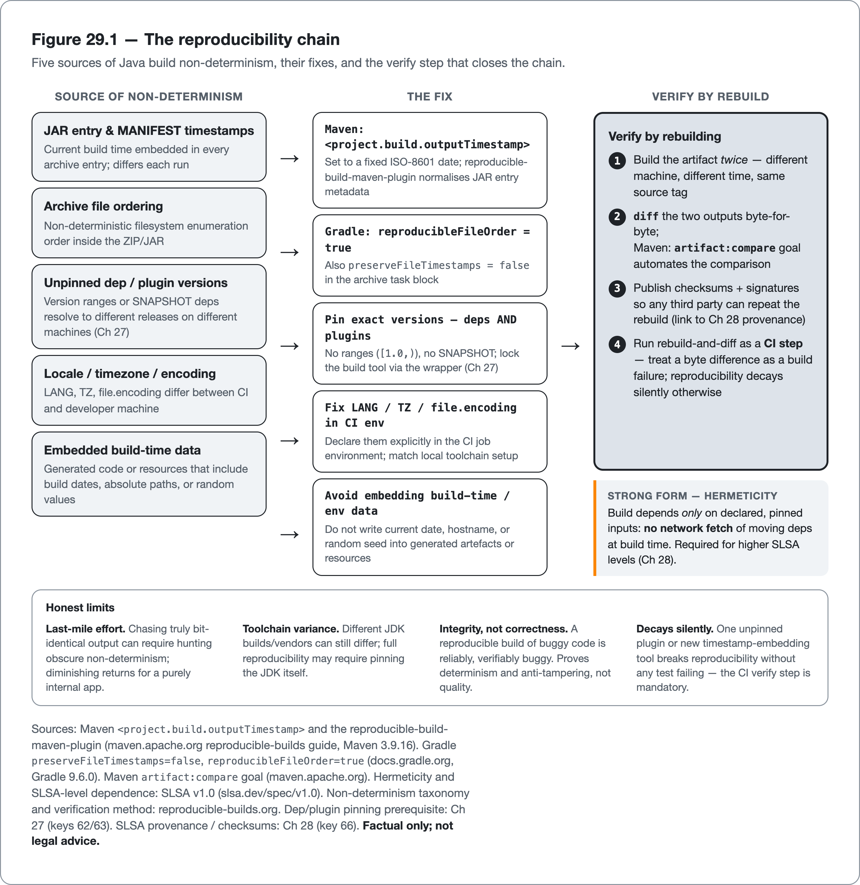

<!--
Dossier key: 67 (owner, leads) + folds 68 — per 01-index/FINAL_INDEX.md Ch 29 (CLOSES Part VII; Ch 30 opens Part VIII — Security & SAST)
Slug: 67_reproducible_builds_license_compliance (owner key 67)
Part / arc position: Part VII — Build, Dependencies & Supply Chain, Chapter 29 of 27-29 (CLOSER)
Companion module: 08-companion-code/ (project.build.outputTimestamp + plugins → build-twice-diff bit-identical; license-maven-plugin allow-list fail-on-banned + THIRD-PARTY NOTICE gen) — EXAMPLE-BUILD = BUILT GREEN 2026-06-26 (mvn -B -Pquality verify; JDK 21.0.11, Maven 3.9.16; reproducibility PROVED: two builds → byte-identical jar, same SHA-256; license gate passes; THIRD-PARTY generated — see _EXAMPLE.md). reproducible-build-maven-plugin / license-maven-plugin version literals NOT pinned in SOURCE-PIN → held as properties + flagged (09-flags/67_repro_license_plugin_versions_unpinned.md). Spec at foot.
Verified against SOURCE-PIN: 2026-06-20. Sources (concise main-loop dossiers; license = factual NOT legal advice per LEGAL-IP-RULES):
- Reproducible builds (67): bit-for-bit identical artifact from same source, independent of when/where/by-whom. Quality property (determinism — works-on-my-machine dies) + security property (verify published artifact matches source = anti-tampering, heart of SLSA Ch 28). Java non-determinism sources: timestamps in JAR entries + MANIFEST; file ordering in archive; absolute paths; locale/timezone/encoding; non-pinned dep/plugin versions or ranges (Ch 27); generated code w/ embedded dates; build-time variability. Fixes: Maven <project.build.outputTimestamp> (JAR timestamps) + reproducible-build-maven-plugin / Gradle reproducible-archives (preserveFileTimestamps=false, reproducibleFileOrder=true); PIN everything (deps + plugins + build-tool via wrapper Ch 27); fixed LANG/TZ/encoding; avoid embedding build-time data. Verify: build twice (different machine/time) + diff; Maven artifact:compare; publish checksums/signatures (→ SLSA provenance Ch 28). Hermeticity (strong form): builds depend only on declared pinned inputs (no network fetch of moving deps) — basis for higher SLSA levels. LIMITS: last-mile effort (chase obscure non-determinism, diminishing returns for internal-only); toolchain variance (different JDK builds/vendors differ; may pin JDK); doesn't prove correctness; ongoing discipline (one unpinned plugin breaks it → CI verify step).
- License compliance (68): every dep carries a license; wrong license wrong place = real liability (copyleft obligations, redistribution restrictions, attribution). Quality of the dependency graph; rides same machinery as SCA/SBOM (Ch 28 — inventory exists, read the license field). Identify: license → SPDX identifiers (Apache-2.0/MIT/GPL-3.0-only/LGPL-2.1); SBOM carries; license plugins extract from POM/scan source. Categorize by obligation: permissive (Apache/MIT/BSD — attribution only), weak copyleft (LGPL/MPL/EPL — file/library-level share-alike), strong copyleft (GPL/AGPL — derivative-work; AGPL reaches NETWORK/SaaS use). Risk depends on HOW you distribute (SaaS vs shipped binary). Policy gate: allow/deny policy (ban GPL in proprietary shipped); license-maven-plugin/FOSSA/ScanCode check vs policy + FAIL build = a fitness function (Ch 26) for legal risk. Produce attributions: THIRD-PARTY/NOTICE file (aggregated) permissive licenses require — automatable. ⚠ NOT LEGAL ADVICE (prominent): tools detect DECLARED licenses, don't interpret YOUR obligations; strategy needs legal counsel; book stays factual. LIMITS: not-legal-advice; detection imperfect (missing/ambiguous/multi-license/relicensed/dual-licensed; POM-declared ≠ actual); obligation depends on use (fine internal, problem redistributed; blanket deny-list blocks harmless — tune); transitive surprises (permissive direct pulls copyleft transitive — scan full graph Ch 27); license ≠ security (permissive dep still vulnerable Ch 28).
VERIFIED at build (2026-06-26, _EXAMPLE.md): project.build.outputTimestamp (in pom, drives the proven bit-identical jar) + the build-twice-and-diff / artifact:compare verification mechanism (demonstrated offline: two builds, same SHA-256). STILL ⚠ verify-at-pin (unconfirmable — SOURCE-PIN does not separately pin these; all flagged → 09-flags/67_repro_license_plugin_versions_unpinned.md): reproducible-build-maven-plugin GAV (0.17) + license-maven-plugin GAV/config (2.7.1); individual SPDX license-id specifics (SPDX = ISO/IEC 5962:2021 pinned, full id sub-tree pending); Gradle archive flags (preserveFileTimestamps/reproducibleFileOrder — Maven-only module, not exercised); SLSA-level dependence on reproducibility/hermeticity (SLSA v1.0 pinned, the level-mapping is synthesized, not traced to a section); obligation summaries (LGPL/MPL/GPL/AGPL) — state factually + "not legal advice", confirm vs license texts/SPDX. SOURCE-PIN: reproducible-builds.org / Maven repro guide / SPDX / license tools rows TO-PIN.
Routes: build (host) → Ch 27 (62); pin deps → Ch 27 (63); SLSA/provenance/SBOM → Ch 28 (66); SCA → Ch 28 (65); fitness-function gate → Ch 26 (56); release/publish → key 83; the book's OWN IP rules → LEGAL-IP-RULES.md.
DRAFT v1 — gates manual; build-integrity-two-facets(technical-reproducible + legal-license) + non-determinism-source→fix-table + obligation-spectrum-by-distribution-mode + reproducibility-makes-provenance-meaningful + not-legal-advice shapes; PART VII CLOSER (hand-off opens Part VIII — Security & SAST, Ch 30 keys 69+72+74). EXAMPLE-BUILD built green 2026-06-26 (reproducibility proved live; two unpinned plugin GAVs flagged).
-->

# A Build You Can Stand Behind

*Reproducible builds that prove the artifact matches the source, and the licenses hiding in the dependency tree · Part VII (closer)*

> The build's provenance was signed last chapter. But a signature over an artifact means nothing if rebuilding the same source produces a different artifact — the attestation covers a moving target.

## Hook

The last chapter produced a software bill of materials (an SBOM, the itemized list of every component in the build), scanned it, and signed a provenance attestation: a cryptographic statement that *this artifact* came from *this build*. Then someone rebuilds from the exact tagged source, on a different machine, a week later, and gets a *different* binary. The bytes do not match. Which artifact does the attestation describe? Neither, really: a signature over an artifact is only meaningful if "the artifact" is a stable, reproducible thing, and a build that emits different bytes each time has no single correct output to attest. The provenance proves nothing, because there is nothing fixed for it to prove.

That is the first of two ways a build can betray a project even when the code is correct, and together they are the subject of this final chapter of Part VII. The first is **technical integrity**: a **reproducible build** produces a bit-for-bit identical artifact from the same source, which is both a quality property (determinism, where "works on my machine" finally dies) and the security property that makes provenance and SLSA actually mean something. The second is **legal integrity**: every dependency in the tree carries a **license**, and a permissive-looking direct dependency can pull a strong-copyleft transitive that quietly imposes obligations on a proprietary product, discovered in legal review the week before a release, when it is too late. Both are integrity properties of the build and the tree it assembles, invisible to every correctness gate in the book, and both read off the same pinned tree and SBOM the last two chapters built. The license material in this chapter is *factual, not legal advice*. Tools detect declared licenses; interpreting specific obligations needs counsel.

## Overview

**What this chapter covers**

- **Reproducible builds**: what bit-for-bit reproducibility is, the Java-specific sources of non-determinism, the fixes, and how to verify.
- Why reproducibility is the foundation under provenance and SLSA (Chapter 28).
- **License compliance**: SPDX identifiers, the obligation spectrum (permissive → copyleft), the policy gate, and generated attributions.
- The honest limits of both, and why license tooling is *not legal advice*.

**What this chapter does NOT cover.** The build as gate host and dependency pinning (Chapter 27, the precondition). SBOMs, SCA, and provenance/SLSA mechanics (Chapter 28, which this chapter makes trustworthy). The book's *own* intellectual-property rules (the project's legal-IP rules, separate). Release and publish mechanics (later). Reproducible-build tooling and license tooling are presented neutrally; the licensing content is **factual, explicitly not legal advice**.

**The central idea:** *a reproducible build makes the artifact a pure function of pinned source, so provenance can attest a fixed thing rather than a moving target — and the same pinned tree carries licenses whose obligations must be known and gated on, because both technical and legal build integrity are invisible to correctness tests and discovered late if not automated.*

## How it works

The chapter has two mechanisms, and two figures map them. Figure 29.1 traces the reproducibility chain: the five sources of Java build non-determinism, the fix for each, and the verify step that closes the loop.

*Figure 29.1 &mdash; The reproducibility chain — Five sources of Java build non-determinism, their fixes, and the verify step that closes the chain.*

Figure 29.2 maps the second mechanism: the license-obligation spectrum read against distribution mode, showing how the same SPDX license carries a different obligation depending on how the artifact ships.

*Figure 29.2 &mdash; The license-obligation spectrum, by distribution mode — The same SPDX license carries a different obligation depending on how the artifact is distributed &mdash; tune the policy gate to the distribution mode. Categories are factual; tools report declared*

### Reproducible builds: the artifact as a pure function of source

A **reproducible build** produces a **bit-for-bit identical** artifact from the same source, independent of *when*, *where*, or *by whom* it is built. That single property does two jobs. As a **quality** property, the artifact becomes a pure function of source plus pinned inputs, which kills an entire class of "works on my machine" build bugs. As a **security** property, anyone can rebuild from source and confirm the published artifact was not tampered with, the verification that gives Chapter 28's provenance and SLSA their meaning. Without reproducibility, "this source produced this artifact" is unfalsifiable; with it, the claim is checkable by anyone.

The obstacle is that a naive Java build embeds non-determinism in several specific places:

| Source of non-determinism | The fix |
|---|---|
| Timestamps in JAR entries and `MANIFEST` | Maven `<project.build.outputTimestamp>` (a fixed date); Gradle `preserveFileTimestamps = false` |
| File ordering inside the archive | the reproducible-build plugin / Gradle `reproducibleFileOrder = true` |
| Unpinned dependency/plugin versions or ranges | pin exact versions — deps *and* plugins (Chapter 27) |
| Locale / timezone / encoding differences | fix `LANG`/`TZ`/encoding in the build environment |
| Absolute paths, embedded build dates in generated code | avoid embedding build-time/environment data |

The first two fixes are a fixed build timestamp and a plugin that strips the rest. In the companion module's `pom.xml`, the timestamp is one inherited property:

<!-- include: 67_reproducible_builds_license_compliance/pom.xml#repro-timestamp -->

and the reproducible-build plugin removes the residual variability (archive entry order, volatile manifest stamps) that the timestamp alone does not cover:

<!-- include: 67_reproducible_builds_license_compliance/pom.xml#repro-plugin -->

> **CONCEPT** *Verify by rebuilding.* Reproducibility is not assumed — it is *checked*: build the artifact twice, on a different machine or at a different time, and `diff` the outputs (Maven's `artifact:compare` automates the comparison). Publishing checksums and signatures then lets others perform the same verification, which is the link to Chapter 28's provenance: a reproducible build is what lets a third party confirm a signed artifact genuinely came from the claimed source.

That check (build twice, compare the bytes) is a digest comparison, modelled in the companion module's `ReproducibleArtifact`:

<!-- include: 67_reproducible_builds_license_compliance/src/main/java/org/acme/repro/ReproducibleArtifact.java#repro-verify -->

The strong form is **hermeticity**: a build that depends *only* on declared, pinned inputs, with no network fetch of moving dependencies at build time. Hermeticity is the basis for the higher SLSA levels. The honest limits are real. Achieving truly bit-identical output can require chasing obscure non-determinism (a plugin that embeds a timestamp undetected), with diminishing returns for a purely internal app that no one will independently verify. Different JDK builds and vendors can still produce different bytes, so full reproducibility may mean pinning the JDK itself. Reproducibility proves *integrity and determinism*, not *correctness*: a reproducible build of buggy code is still buggy. And it is ongoing discipline: one unpinned plugin or a new timestamp-embedding tool silently breaks it, which is why reproducibility needs its own verify step in CI to *stay* reproducible.

### License compliance: the obligations in the tree

The same dependency tree carries a second kind of integrity concern, and it reads off the same inventory. Every dependency has a **license**, and the wrong license in the wrong place is a genuine liability: copyleft obligations, redistribution restrictions, attribution requirements. License compliance is a *quality of the dependency graph*, and it rides the machinery the last two chapters built: the SBOM already inventories every component, so license checking reads the license field directly. The four steps:

- **Identify.** Normalize every component's license to its **SPDX identifier**, the standardized short code that names a license unambiguously (`Apache-2.0`, `MIT`, `GPL-3.0-only`, `LGPL-2.1`), extracted from POM metadata or scanned from source; the SBOM (Chapter 28) carries this.
- **Categorize by obligation.** Licenses fall on a spectrum: **permissive** (Apache, MIT, BSD: attribution only), **weak copyleft** (LGPL, MPL, EPL: file- or library-level share-alike), and **strong copyleft** (GPL, AGPL: derivative-work obligations, with AGPL notably reaching *network/SaaS* use, not just shipped binaries).
- **Gate on policy.** Define an allow/deny policy (e.g. ban GPL in a proprietary shipped product), and a tool (`license-maven-plugin`, FOSSA, ScanCode) checks every dependency's license against it and **fails the build** on a violation. This is a fitness function (Chapter 26) for legal risk, run in the same build as every other gate.
- **Produce attributions.** Permissive licenses require attribution; the `THIRD-PARTY`/`NOTICE` file (aggregated from the same license data) is automatable from the inventory.

In the companion module's `pom.xml`, the `license-maven-plugin` does the gate-and-attribute step in one execution — fail on a license outside the allow-list, and write the `THIRD-PARTY` file:

<!-- include: 67_reproducible_builds_license_compliance/pom.xml#license-gate -->

The allow-list itself is externalized, reviewable config — a list of permitted SPDX identifiers tuned to the product's distribution mode:

<!-- include: 67_reproducible_builds_license_compliance/config/license/allowed-licenses.txt#license-allow-list-file -->

> **CONCEPT** *Obligation depends on how the product is distributed — and this is not legal advice.* The *same* license can be fine in one context and a problem in another: GPL in an internal tool that is never distributed is low-risk; GPL in a proprietary SDK that ships is a serious obligation; AGPL reaches even a SaaS deployment. A blanket deny-list therefore blocks harmless dependencies, and the policy must be tuned to *how the product is distributed*. Critically, license tools detect *declared* licenses; they do **not** interpret specific legal obligations. The book states the categories factually; license *strategy* is a question for legal counsel, not a build plugin.

The limits compound the "not legal advice" caution. Detection is imperfect: missing, ambiguous, multi-licensed, relicensed, and dual-licensed components confuse scanners, and a POM-declared license is sometimes not the actual one, so high-risk findings need human verification. The dangerous case is the **transitive surprise**: a permissive *direct* dependency pulling a copyleft *transitive* one. That is why the policy must scan the full graph (Chapter 27), not just direct dependencies. License is also orthogonal to security: a permissively-licensed dependency can still be vulnerable (Chapter 28) or unmaintained; a clean license report is not a clean dependency.

The decision the gate makes on each component is a single check against that tuned set, modelled in the companion module's `LicensePolicy`:

<!-- include: 67_reproducible_builds_license_compliance/src/main/java/org/acme/repro/LicensePolicy.java#license-allow-list -->

## Deep dive: two facets of one integrity, both read off the pinned tree

Reproducibility and license compliance look like unrelated topics (one about bytes, one about law), but they are two facets of a single idea that closes Part VII: **the integrity of the build and the tree it assembles, beyond the correctness of the code**. Every gate before Part VII asked "is the code right?" Part VII asked a different question across three chapters: "can the *build* and its *dependency tree* be trusted?" This chapter supplies the last two answers. Technical integrity: the build is reproducible, so the artifact is a fixed, verifiable thing. Legal integrity: the tree's licenses are known and within policy, so shipping it is defensible. Neither is about whether the code computes the right answer; both are about whether the artifact can be *stood behind at ship time*.

What unifies them mechanically is that both ride the determinism the previous two chapters established. Reproducibility is the *culmination* of pinning: Chapter 27 pinned versions so the build resolves the same inputs every time; this chapter pins timestamps, ordering, locale, and the JDK so those identical inputs produce identical *bytes*. The progression is pinned inputs → deterministic resolution → bit-identical output, and only at the end of that chain can a provenance attestation (Chapter 28) mean anything. That ordering is why reproducibility had to come after pinning and alongside provenance, not before. License compliance, meanwhile, is almost free because the SBOM already exists: knowing the complete transitive component set (the hardest part of license checking) was solved by the inventory built for security scanning. The same artifact, the SBOM, answers "am I affected by this CVE?" and "do I have a GPL obligation?"; generate it once and read two different fields.

The honest center, shared with every gate in the book, is that both are **necessary, not sufficient, and neither proves correctness**. A reproducible build of buggy code is reliably, verifiably buggy. A license-clean dependency tree can be riddled with vulnerabilities. These are integrity and compliance properties, not quality-of-logic properties; they make the artifact *trustworthy to ship and verify*, not *correct*. Both demand ongoing discipline rather than a one-time setup: a single unpinned plugin silently breaks reproducibility, a single new transitive dependency can introduce a copyleft obligation, so both belong in CI as continuously-checked fitness functions, not as a checklist done once. That is what Part VII delivers as a whole: a build that hosts the gates (Chapter 27), a dependency tree that is pinned and current (27), securable against known vulnerabilities and inventoried and attested (28), and reproducible enough to verify and legally clear enough to ship. A build a team can stand behind: deterministic, secure, reproducible, and licensed.

## Limitations & when NOT to reach for it

- **Reproducibility is last-mile effort with diminishing returns.** Chasing truly bit-identical output can mean hunting obscure non-determinism; a purely internal app no one will independently verify may not justify the full chase. Invest proportional to the verification need.
- **Toolchain variance limits it.** Different JDK builds and vendors can still differ; full reproducibility may require pinning the JDK itself, not just the dependencies.
- **Reproducibility proves integrity, not correctness.** A bit-identical build of buggy code is still buggy; it verifies determinism and anti-tampering, nothing about quality.
- **Reproducibility decays silently.** One unpinned plugin or a new timestamp-embedding tool breaks it without a test failing — it needs its own CI verify step (build-twice-and-diff) to stay reproducible.
- **License tooling is not legal advice.** Tools detect *declared* licenses; they do not interpret specific obligations. License strategy needs counsel; the book is factual only.
- **License detection is imperfect.** Missing, ambiguous, multi-licensed, relicensed, and dual-licensed components confuse scanners, and a POM-declared license may not be the actual one. Verify high-risk findings by hand.
- **Obligation depends on distribution mode.** The same license is fine internally and a problem when shipped (AGPL even reaches SaaS); a blanket deny-list blocks harmless dependencies — tune the policy to the product's distribution mode.
- **Transitive surprises and the security/license split.** A permissive direct dependency can pull a copyleft transitive — scan the full graph; and a license-clean dependency can still be vulnerable or unmaintained (license ≠ security).

## Alternatives & adjacent approaches

- **Hermetic builds** — the strong form of reproducibility (only declared, pinned inputs, no build-time network), required for the higher SLSA levels; more setup, stronger guarantee.
- **`artifact:compare` / build-twice-and-diff** — the verification step that turns claimed reproducibility into checked reproducibility; pair with published checksums.
- **License tools** (`license-maven-plugin`, FOSSA, ScanCode) — OSS plugin versus hosted scanner; choose by depth of detection and reporting needs, all reading SPDX identifiers.
- **The SBOM** (Chapter 28) — already carries license data, so license compliance is incremental value on an inventory the team generates for security scanning anyway.
- **Legal counsel** — the irreplaceable complement: tools surface declared licenses; only counsel interprets obligations and sets policy.

These compose into build integrity: pin and resolve deterministically (Chapter 27), reproduce bit-for-bit and verify by rebuild (here), attest provenance over the reproducible artifact (Chapter 28), and gate licenses off the SBOM with a counsel-set policy.

## When to use what

- **For a publicly released or independently-verified artifact:** a reproducible build (`project.build.outputTimestamp`, pinned plugins, fixed locale/TZ), verified by build-twice-and-diff.
- **For the higher SLSA levels:** hermetic builds — only declared, pinned inputs, no build-time network.
- **To keep reproducibility from decaying:** a CI step that rebuilds and diffs; treat a byte difference as a build failure.
- **To know the tree's licenses:** read SPDX identifiers off the SBOM; categorize permissive / weak-copyleft / strong-copyleft.
- **To stop a banned license shipping:** a `license-maven-plugin` allow/deny policy gate, tuned to the product's distribution mode, scanning the full transitive graph.
- **To meet attribution obligations:** auto-generate the `THIRD-PARTY`/`NOTICE` file from the inventory.
- **For obligation interpretation and policy:** legal counsel — the tools surface facts; they do not give advice.

## Hand-off to the next part

Part VII secured the *build and the tree it assembles* — pinned, current, scanned, inventoried, attested, reproducible, and licensed. Every one of those controls concerns code that was *not* written in-house (the dependencies) or the artifact being *shipped* (the build). Not one of them looks at the vulnerabilities in the code a team *does* write: the SQL injection in a query-builder, the unsafe deserialization in an endpoint, the broken access control in authorization logic, the crypto API reached for and misused. Software composition analysis is blind to all of it by construction — it scans dependencies, not application source. **Part VIII: Security & SAST** turns the lens inward: secure coding against the OWASP Top 10, the injection and deserialization classes that have haunted Java for decades, the Java cryptography APIs and how they are misused, and the static-analysis security testing (SAST) that finds these flaws in application source. The next chapter opens it with secure coding and the OWASP Top 10 for Java — the vulnerabilities teams introduce themselves.

## Back matter — sources & traceability

- **Reproducible builds** (key 67; `reproducible-builds.org`; Maven reproducible-builds guide; Gradle reproducibility docs): bit-for-bit identical artifact from same source, independent of when/where/who — quality (determinism) + security (verifiable anti-tampering, SLSA foundation Ch 28). Java non-determinism: JAR/`MANIFEST` timestamps, archive file ordering, absolute paths, locale/TZ/encoding, unpinned dep/plugin versions/ranges (Ch 27), embedded build dates. Fixes: Maven `<project.build.outputTimestamp>` + reproducible-build-maven-plugin / Gradle `preserveFileTimestamps=false`+`reproducibleFileOrder=true`; pin deps+plugins+build-tool (wrapper); fixed `LANG`/`TZ`/encoding. Verify: build-twice-and-diff / `artifact:compare` + published checksums/signatures. Hermeticity = only declared pinned inputs (higher SLSA). *(concept verified; `project.build.outputTimestamp` + the build-twice-and-diff / `artifact:compare` verification VERIFIED at build 2026-06-26 — two builds, byte-identical jar, same SHA-256; companion built green via `mvn -B -Pquality verify`. Still ⚠ @pin (flagged, `09-flags/67_repro_license_plugin_versions_unpinned.md`): the two plugin GAVs (`reproducible-build-maven-plugin` 0.17, `license-maven-plugin` 2.7.1), the Gradle archive flags (Maven-only module), and the SLSA-level dependence mapping.)*
- **License compliance** (key 68; `spdx.org/licenses`; `license-maven-plugin`/FOSSA/ScanCode; SBOM license data Ch 28) — ⚠ **NOT LEGAL ADVICE** (factual only; per the book's legal-IP rules): every dep has a license = a quality of the graph, read off the SBOM. Identify → SPDX identifiers (`Apache-2.0`/`MIT`/`GPL-3.0-only`/`LGPL-2.1`). Obligation spectrum: permissive (Apache/MIT/BSD — attribution) / weak copyleft (LGPL/MPL/EPL — file/library share-alike) / strong copyleft (GPL/AGPL — derivative-work; AGPL reaches network/SaaS). Risk depends on distribution mode (internal/SaaS/shipped). Policy gate: allow/deny via `license-maven-plugin`/FOSSA/ScanCode, fail-build = fitness function (Ch 26). Attributions: `THIRD-PARTY`/`NOTICE` auto-generated. *(VERIFIED at build 2026-06-26: the allow-list gate PASSES against the permissive Apache-2.0 `commons-lang3` and the `THIRD-PARTY` attribution is generated listing it (`-Pquality verify`). Still ⚠ @pin (flagged, `09-flags/67_repro_license_plugin_versions_unpinned.md`): the individual SPDX license-id specifics + the `license-maven-plugin` GAV/config (2.7.1) + the obligation summaries (LGPL/MPL/GPL/AGPL) — categories stated factually, NOT legal advice, confirm vs license texts/SPDX. detection-imperfect + transitive-surprise + license≠security limits stand.)*
- **Routing** — build host + pinning → Ch 27 (62/63); SLSA/provenance/SBOM/SCA → Ch 28 (66/65); fitness-function gate → Ch 26 (56); release/publish → later (83); the book's own IP rules → the legal-IP-rules file. SOURCE-PIN: reproducible-builds.org / Maven repro guide / SPDX / license tools rows TO-PIN.

**Companion module (`08-companion-code/67_reproducible_builds_license_compliance/` — EXAMPLE-BUILD built green; reproducibility demonstrated live):** a module whose load-bearing artifact is its `pom.xml` and the config files beside it. It sets `<project.build.outputTimestamp>` to a fixed date and runs the `reproducible-build-maven-plugin` on every build, then **builds the artifact twice and compares the SHA-256** — the two jars are **bit-identical**, demonstrated offline (not merely configured). The `-Pquality` build adds the `license-maven-plugin` enforcing an externalized **allow-list** of permitted SPDX identifiers (`failOnBlacklist` fails the build on a license outside policy) and **generating a `THIRD-PARTY` NOTICE** from the resolved tree's declared licenses; with the permissive, Apache-2.0 `commons-lang3` on the path the gate passes and the attribution lists it. A small `org.acme.repro` package gives both facets an in-code analogue a test drives. **Failure path:** the license gate is a hard event, modelled in code by `LicensePolicy.evaluate` throwing `DisallowedLicenseException` (the in-code analogue of `failOnBlacklist`) — shown in code rather than by seeding a real copyleft dependency, which would be non-deterministic and an IP concern. **Honest edge:** reproducibility proves integrity, not correctness — stated in code (`ReproducibleArtifact.isIntegrityNotCorrectness`), a reproducible build of buggy code is reliably, verifiably buggy; and the license material is **factual, not legal advice** (in the config, the code, and the README). Snippet tags: `repro-timestamp`, `repro-plugin`, `repro-verify`, `license-gate`, `license-allow-list-file`, `license-allow-list`.

## Next chapter teaser

Everything in Part VII concerned code that was not written in-house or the artifact being shipped — not one control looked at the vulnerabilities in the code a team *does* write. Software composition analysis scans dependencies; it is blind by construction to the SQL injection in application queries, the unsafe deserialization in an endpoint, the crypto API misused in production. Part VIII turns the lens inward: secure coding against the OWASP Top 10, the injection and deserialization classes that have shaped Java's security history, the cryptography APIs and their misuse, and the SAST tools that find these flaws in application source.
