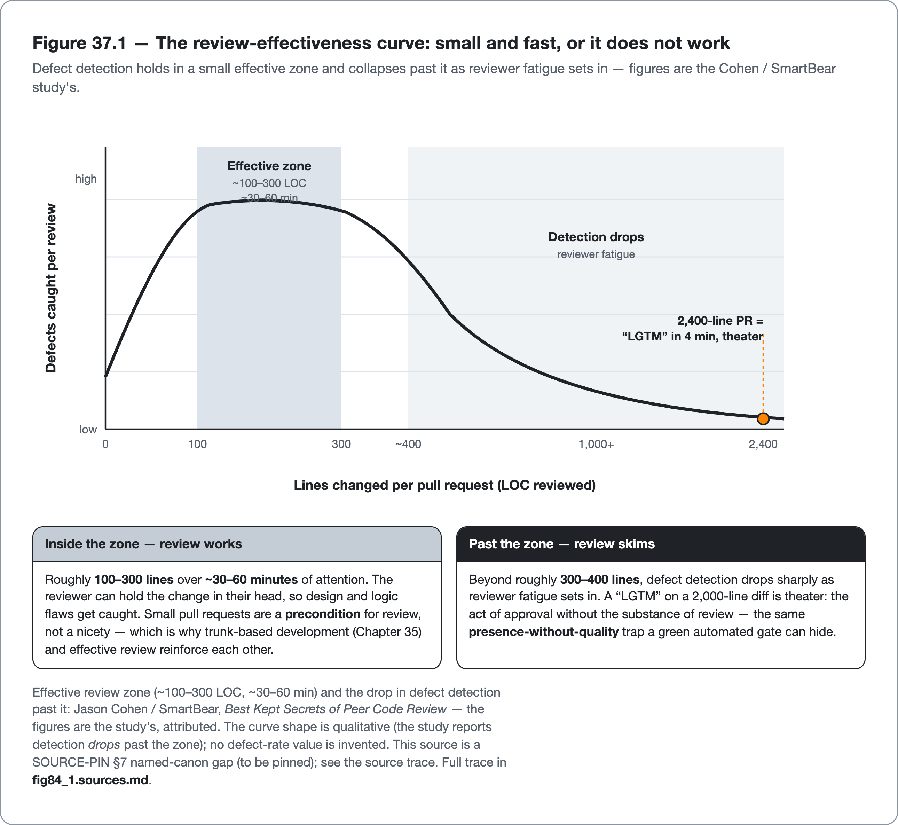

<!--
Dossier key: 84 (owner, leads) + folds 86 + 89 — per 01-index/FINAL_INDEX.md Ch 37 (OPENS Part X — Process, People & Metrics)
Slug: 84_code_review_standards_documentation (owner key 84)
Part / arc position: Part X — Process, People & Metrics, Chapter 37 (OPENS Part X; Ch 37-38)
Companion module: 08-companion-code/84_code_review_standards_documentation/ (PR template + CODEOWNERS + review-checklist + ADR; a Checkstyle Javadoc-presence ruleset enforcing the documentation standard; a Javadoc-as-contract exemplar + observability surface + README) — ✅ EXAMPLE-BUILD GREEN (JDK 21.0.11, mvn -B -Pquality verify SUCCESS; 0 Checkstyle, 0 SpotBugs reported, 5 tests). Spec + Snippet tags at foot.
Verified against SOURCE-PIN: 2026-06-27 (corrected pin; Checkstyle Javadoc rules + GAVs traced to the BUILT module engine). Sources (3 concise dossiers; tool/config atoms verified, named-canon figures still ⚠ verify-at-pin; the HUMAN side Part IX automation can't replace; bot-does-mechanical/human-does-substantive division):
- Code review (84, ⚠ contested): the human gate that catches what tools CANNOT — design problems, wrong abstractions, missing edge cases, "is this even the right change?" — + spreads knowledge (key 90). The catch for the logic flaw that defeated Part IX's pipeline (Ch 36). Effectiveness depends on HOW. Size & time (strongest finding, Cohen/SmartBear Best Kept Secrets of Peer Code Review): effective zone ~100-300 LOC + ~30-60 min; beyond → defect-detection drops (reviewer fatigue) → small PRs (trunk-based Ch 35 key 81). Focus (Google eng-practices Code Review Developer Guide): design/functionality/complexity/tests/naming/comments/docs/style in ~that priority; overarching standard "does this improve overall code health?"; lightweight + fast (low latency keeps velocity). Checklists improve consistency (security/error-handling/tests/edge-cases); tie to standards (§B); encode mechanical parts as automated checks (Ch 16/34/78). Defect detection PRIMARY (Microsoft survey Bacchelli & Bird) + knowledge transfer + shared ownership (key 06/90) secondary. Bot/human division (Ch 34 key 78): bots style/lint/coverage, humans design/logic/correctness; over-relying-on-either degrades review. Tone/culture: review the code not the person; generative culture (Ch 1 key 06). LIMITS: large PRs defeat review (past ~400 LOC skim+approve; small PRs a precondition not a nicety); review→bottleneck/rubber-stamp (slow stalls Ch 35; pro-forma adds latency without catching); static analysis only a slice (PMD ~16% of manual-review issues — complementary, neither sufficient); bias & politics (checklists + code-not-person mitigate not eliminate); practices contested ⚠ (pair-programming-vs-review, async-vs-sync, mandatory-vs-optional — crown none).
- Coding standards/style guides (86, ⚠ style subjective): shared agreement on how the team's Java looks/structures. Value = CONSISTENCY (Ch 2 key 03): lowers reading cost + removes style from review (key 84) so reviewers focus on substance. HONEST CORE: the specific style matters far less than PICKING ONE + AUTOMATING it. Adopt vs author: adopt existing (Google Java Style Guide — complete readability/uniformity/maintainability definition) not bikeshed; customize minimally; Oracle Code Conventions dated (don't cite current). Document where devs look (short CONTRIBUTING pointing at formatter config + ruleset — config IS the canonical standard, DRY). Enforce automatically (key move): FORMATTER (Spotless/google-java-format Ch 6 key 34 — spotless:apply fixes, CI spotless:check fails on drift) + CHECKSTYLE (Ch 16 key 27 — naming/Javadoc-presence/import-order a formatter doesn't). Wire build + pre-commit + CI gate (Ch 33/35). Take style OUT of review (once formatter canonical, reviewers never comment formatting — major review-quality win + end of style arguments). Org-wide: shared parent POM/config module. LIMITS: style partly subjective ⚠ (tabs/spaces, braces, line-length, var — no objective best; win = agreement+automation, crown no style); standards-as-PDF-not-automated ignored (config = source of truth, machine-enforced); over-strict conventions friction (noise + suppressions key 39); migrating existing codebase = big reformat (ratchetFrom/format-on-touch not mega-commit Ch 19/key 87); standard ≠ quality (perfectly-formatted can be badly-designed; floor not ceiling).
- Documentation quality (89, ⚠ docs-vs-self-documenting overlaps comments debate Ch 2 key 17): code says WHAT/HOW; docs capture the WHY + how-to-operate code can't. Maintainability lever (key 01): right docs (ADR/Javadoc-contract/runbook) save hours; wrong docs (stale/redundant/"what") actively mislead. Doc-level complement to in-code comments (Ch 2 key 17). Match doc type to purpose (Diátaxis: tutorials/how-to/reference/explanation — conflating = bad docs). High-value Java doc types: Javadoc-as-CONTRACT (on PUBLIC API — what/params/returns/@throws/pre-postconditions/nullability; the contract callers rely on key 60; NOT "what" narration), ADRs (Nygard — short immutable point-in-time decision+context+consequences; an ADR LOG preserves WHY for future teams, avoids re-litigating settled decisions; in-repo docs/adr/, reviewed like code), README (what/build/run/test via wrapper Ch 27; front door for onboarding key 90), runbooks (operational how-to for incidents → Ch 36/Part XIII). Keep docs ALIVE (hard part): docs-as-code (in-repo/reviewed/versioned-with-code); generate what you can (Javadoc from source; OpenAPI); link don't duplicate; DELETE stale (stale docs WORSE than none); some checks automatable (Javadoc presence via Checkstyle, link-checking). Contested overlap ⚠ (self-documenting vs docs — docs capture why/decisions/operation even perfect code can't, but redundant "what" docs rot; crown neither extreme). LIMITS: stale-docs-worse-than-none (actively mislead — write only docs you'll maintain); redundant-"what"-docs-drift; diminishing-returns (focus public contracts/decisions/operations); automatable-only-partially (Checkstyle enforces PRESENCE not QUALITY — present-but-useless Javadoc passes, key 04 vanity); contested team/context-dependent.
BUILD-VERIFIED (resolved against the BUILT module engine, no longer ⚠): the Checkstyle Javadoc check identities + property keys used in the module — MissingJavadocType/MissingJavadocMethod (scope), JavadocMethod (accessModifiers, validateThrows), SummaryJavadoc, AtclauseOrder, NonEmptyAtclauseDescription (checkstyle 10.26.1; confirmed live by strip-and-rebuild — deleting a public method's Javadoc fails with MissingJavadocMethod); the plugin/engine GAVs (maven-checkstyle-plugin:3.6.0, spotbugs-maven-plugin:4.9.3.0, spotbugs-annotations:4.9.3). Engine note: house engine 10.26.1 trails the SOURCE-PIN §2 pin (Checkstyle 13.6.0) — all Javadoc checks exist on both lines; re-build at re-pin (runbook step 4). The CODEOWNERS routing + PR template + review checklist + Javadoc-as-contract exemplar are present and built green.
⚠ verify-at-pin (named-canon figures — SOURCE-PIN §7 has no rows; never asserted as the book's fact, flagged to 09-flags/84_code_review_canon_figures_and_engine_delta.md): Cohen/SmartBear figures (100-300 LOC, 30-60 min, defect-rate); Google eng-practices focus list + "code health" wording; Bacchelli & Bird citation + ~16% PMD figure; Google Java Style specifics (2-space, 100-col) + google_checks.xml; Nygard ADR template + adr.github.io; Diátaxis four-type framing; CODEOWNERS exact hosted/SaaS pattern-matching syntax; Checkstyle Javadoc-rule default values. SOURCE-PIN §7 canon gaps: Cohen/SmartBear, Google eng-practices, Bacchelli&Bird, Google Java Style, Nygard ADR, Diátaxis not pinned rows.
Routes: culture/shift-left → Ch 1 (06); PR automation (bot layer) → Ch 34 (78); small PRs/trunk-based → Ch 35 (81); knowledge/bus-factor → key 90; AI-assisted review → key 98; consistency/readability → Ch 2 (03); naming/format craft → Ch 6 (07); Checkstyle → Ch 16 (27); formatters → Ch 6 (34); migrating standard (ratchet) → Ch 19/key 87; in-code comments (self-documenting debate) → Ch 2 (17); API compat (Javadoc contract) → key 60; nullability docs → Ch 9 (11/18); runbooks/observability → Ch 36/Part XIII (83/108); org-wide config → Ch 18/27 (38/63); metrics (does review/standards work) → Ch 38 (85).
DRAFT v1 — gates manual; human-catches-what-tools-miss + review-size/time-effectiveness-curve + bot/human-division + pick-one-and-automate-it + config-is-source-of-truth + why-not-what + ADR-preserves-rationale + floor-not-ceiling/present-but-useless + two-schools shapes; PART X OPENER. EXAMPLE-BUILD GREEN (JDK 21.0.11, mvn -B -Pquality verify SUCCESS; 0 Checkstyle, 0 SpotBugs, 5 tests) — process/config artifacts; Javadoc-presence Checkstyle rule verified load-bearing (deleting a public method's Javadoc fails with MissingJavadocMethod).
-->

# The Part the Machine Can't Do

*Code review that catches what tools miss, coding standards that take style off the table, and documentation that records the why · 84 (folds 86, 89) · Part X (opener)*

> The logic bug that slipped every automated gate reaches a human reviewer — the one safety net the pipeline could not provide. It gets a "LGTM" in four minutes, because it is buried in a 2,400-line pull request nobody actually read.

## Hook

The last chapter's defect (well-formed, idiomatic, fully covered, and *wrong*) reaches the one gate the automated pipeline could not be: a human reviewer who understands the intent and could notice the code does the wrong thing. And it gets approved in four minutes with a "LGTM," because it is buried in a 2,400-line pull request the reviewer skimmed. The human gate failed too, not because code review does not work, but because review done *that way* does not. The largest study of code review (Cohen/SmartBear) found defect detection collapses past roughly 300–400 lines: beyond that, reviewers skim and approve. The reviewer was not lazy; the *process* was broken, and a broken human gate fails exactly as silently as a skipped automated one.

That is the territory of Part X: the human side of quality that automation cannot replace, and the disciplines that make the human practices actually work. Part IX automated everything that can be automated: the analyzers, the tests, the gates, the delivery. This part is about the irreducibly human part, and it opens with the three practices closest to the code: **code review** (the human catch for the design and logic flaws no tool sees), **coding standards** (the shared agreement that lets humans read each other's code, automated so it is not a review burden), and **documentation** (the *why* and *how-to-operate* that code itself cannot express). The organizing thread, carried from the PR-automation chapter, is the **bot/human division of labor**: automate the mechanical relentlessly (style, lint, coverage, Javadoc *presence*) so that scarce human attention goes only to the substantive — design, the right abstraction, the *why* a decision was made. Each practice in this chapter is an application of that one move: take the mechanical off the human's plate, and spend the human on what only a human can do.

## Overview

**What this chapter covers**

- **Code review**: the size and time limits that decide whether review catches defects or rubber-stamps, what to focus on, and the bot/human division.
- **Coding standards**: adopt-do-not-author, the config as the source of truth, and automating style out of review entirely.
- **Documentation**: the high-value doc types (Javadoc-as-contract, ADRs, README, runbooks), the why-not-what principle, and keeping docs from rotting.
- The thread through all three: automate the mechanical, reserve humans for the substantive; and the floor-not-ceiling trap each one shares.

**What this chapter does NOT cover.** PR automation tooling (the bot layer review sits on, Chapter 34). The formatters and Checkstyle that *enforce* standards (Chapters 6, 16). In-code comments and the self-documenting-code debate (Chapter 2 owns *comments*; this chapter owns *documentation*). Knowledge sharing and bus-factor (a later chapter). AI-assisted review (a later chapter). Metrics for whether any of this works (the next chapter). All three topics are **contested** (review practices, style, and docs-vs-self-documenting) and are presented with trade-offs, **crowning no doctrine**; named-study figures are verified at the pin.

**The one idea to hold:** *automate the mechanical so humans review the substantive — keep PRs small enough that review actually catches defects, make the formatter the canonical standard so style never reaches review, and document the why (decisions, contracts, operations) the code cannot say — because each practice's automation enforces presence, never quality, and the quality is the human judgment.*

## How it works

*Figure 37.1 &mdash; The review-effectiveness curve: small and fast, or it does not work — Defect detection holds in a small effective zone and collapses past it as reviewer fatigue sets in &mdash; figures are the Cohen / SmartBear study's.*

*Figure 37.2 &mdash; One move, three practices: automate the mechanical, reserve humans for the substantive — Review, standards, and documentation each take a category of mechanical work off the human&rsquo;s plate &mdash; so scarce human attention goes only to what only a human can do.*

### Code review: the human catch, done the way that works

Code review is the human quality gate that catches what tools structurally cannot: design problems, wrong abstractions, missing edge cases, broken authorization, and the question no analyzer asks — *is this even the right change?* It is the catch for the logic flaw that defeated Part IX's pipeline, and a major channel for knowledge transfer and shared ownership. Its effectiveness depends entirely on *how* it is done, and the evidence is unusually concrete:

> **CONCEPT** *Small and fast, or it does not work.* The largest code-review study (Cohen/SmartBear) found an effective review zone of roughly **100–300 lines** per review and **30–60 minutes** of attention; past that, defect detection drops sharply as reviewer fatigue sets in. A "LGTM" on a 2,000-line PR is theater. So *small PRs are a precondition for review, not a nicety* — which is why trunk-based development (Chapter 35) and effective review reinforce each other: small frequent changes are exactly what review can actually catch defects in. (The figures are the study's; verified at the pin.)

What reviewers should focus on, per Google's published engineering practices, is roughly: design, functionality, complexity, tests, naming, comments, documentation, then style; the overarching standard is *"does this change improve the overall code health of the system?"* Reviews should be lightweight and *fast*, because slow review stalls delivery and turns into a bottleneck. A short, maintained **checklist** (security, error handling, tests, edge cases) improves consistency over ad-hoc reading, and its mechanical items should be *encoded as automated checks* (Chapters 16, 34) so the human never spends attention on them.

That checklist, kept in-repo and versioned with the code, reserves its items for the substantive:

<!-- include: 84_code_review_standards_documentation/docs/CODE_REVIEW_GUIDELINES.md#review-checklist-item -->

The same items front the pull-request template, where they meet the author and reviewer on every change:

<!-- include: 84_code_review_standards_documentation/.github/pull_request_template.md#pr-checklist-item -->

A `CODEOWNERS` file routes the right reviewer to the right change automatically — the mechanical half of *who* reviews, with the contract surface and the decision log given a stricter owner:

<!-- include: 84_code_review_standards_documentation/.github/CODEOWNERS#codeowners-rule -->

> **CONCEPT** *Bots do the mechanical; humans do the substantive.* Flowing from Chapter 34's PR automation, automated checks handle style, lint, and coverage; the human reviewer focuses on design, logic, correctness, and whether the change is the right one. Over-relying on *either* degrades review — bots alone miss the logic flaw, humans alone waste their scarce attention on formatting a formatter should have fixed. Automating the mechanical frees the human for the part only a human can do.

The honest limits are real and the practices contested. Large PRs defeat review (the precondition again); review can decay into either a *bottleneck* (slow, stalling delivery) or a *rubber stamp* (pro-forma approvals that add latency without catching anything); both are common. Static analysis covers only a slice: research notes a tool like PMD addresses on the order of ~16% of issues found in manual review — complementary, neither sufficient. Review can be weaponized by bias or politics, which a code-not-the-person culture (Chapter 1) and checklists mitigate but do not eliminate. The *practices* are genuinely debated (pair programming instead of review, async versus synchronous, mandatory versus optional) and are presented as trade-offs, crowning none.

### Coding standards: pick one, automate it, take style off the table

A coding standard is the team's shared agreement on how its Java looks and is structured, and its quality value is **consistency** (Chapter 2): a uniform codebase lowers the cognitive cost of reading anyone's code, and it *removes style from review* so reviewers spend their scarce attention on substance. The honest core, and the thing most teams get backwards: **the specific style matters far less than picking one and automating it.**

The moves follow from that. **Adopt, do not author** — take a complete, vetted standard (the Google Java Style Guide) rather than bikeshedding a house variant, and customize minimally (Oracle's old Code Conventions are dated; do not cite them as current). **Document it where developers look**, as a short pointer to the *config* — because the formatter config and ruleset *are* the canonical standard (a standard as a separate PDF nobody enforces drifts immediately). And the key move, **enforce it automatically**: a formatter (Spotless / google-java-format, Chapter 6) makes style non-negotiable and non-manual (`spotless:apply` fixes it, CI `spotless:check` fails on drift), while Checkstyle (Chapter 16) enforces the convention rules a formatter does not (naming, Javadoc presence, import order). Wire both into the build, pre-commit, and the CI gate.

> **CONCEPT** *A canonical formatter ends style arguments.* Once a deterministic formatter is the source of truth, reviewers *never comment on formatting*, because formatting is not a choice anymore — it is applied automatically. That is a major review-quality win: it reclaims human attention for substance and ends the team's style debates. The standard is the floor, not the ceiling: perfectly-formatted code can be badly designed (style is subjective at the edges — tabs, braces, line length, `var` — and the win is *agreement plus automation*, not the specific choice), so the standard takes a class of trivia off the table without claiming to make the code good.

The limits: an un-automated standard is ignored (config must be the machine-enforced source of truth); over-strict conventions create noise and suppressions (Chapter 19); and migrating an existing codebase to a new standard is a big, blame-churning reformat — use format-on-touch / `ratchetFrom` (the ratchet idea from Chapter 19) rather than a mega-commit.

### Documentation: record the why the code can't say

Code says *what* and *how*; documentation captures the *why* and the *how-to-operate* that code structurally cannot — and good documentation is a real maintainability lever, while bad documentation (stale, redundant, restating the obvious) actively misleads. It is the doc-level complement to the in-code-comments debate (Chapter 2). The skill is matching the doc type to its purpose (the Diátaxis lens distinguishes tutorials, how-to guides, reference, and explanation — conflating them produces bad docs), and four Java doc types earn their keep:

- **Javadoc as contract** — on the *public* API: what it does, parameters and returns, `@throws`, pre/postconditions, and nullability — the contract callers rely on (the API-compatibility concern of a later chapter). Not "what" narration of obvious code.
- **ADRs** (Architecture Decision Records, Nygard) — short, immutable, point-in-time records of a decision with its context and consequences. An ADR *log* preserves the *why* for future teams, so settled decisions are not re-litigated and re-broken; they live in-repo (`docs/adr/`) and are reviewed like code.
- **README** — what the project is and how to build, run, and test it (the wrapper command, Chapter 27); the front door for onboarding.
- **Runbooks** — operational how-to for incidents (tied to release and observability, Chapter 36 / Part XIII).

The first of those is the one a tool can partly help with. A Javadoc-as-contract on a public method states the contract callers depend on — inputs (including nullability), the guarantee on the output, and the exceptions raised — without restating the body:

<!-- include: 84_code_review_standards_documentation/src/main/java/org/acme/review/RefundPolicy.java#javadoc-contract -->

> **CONCEPT** *Document the why; let the code say the what — and delete stale docs.* The dividing line is that documentation should capture what code *cannot*: the decision behind the design (ADR), the contract a caller depends on (Javadoc), how to operate it (runbook). Restating *what the code does* in prose is the redundant "what" documentation that drifts out of sync and becomes a lie. And the hard part is keeping docs *alive*: docs-as-code (in-repo, reviewed, versioned with the code), generate what the build produces (Javadoc from source, API docs from OpenAPI), link rather than duplicate, and **delete stale docs — stale documentation is more dangerous than no documentation**, because it actively misleads with the authority of being written down. Write only the docs the team will maintain.

The limits sharpen the why-not-what line. Redundant "what" docs drift; documentation effort has diminishing returns (exhaustively documenting private internals rarely pays; focus on public contracts, decisions, and operations); and automation is only partial. Checkstyle can enforce Javadoc *presence*, not *quality*, so a present-but-useless Javadoc passes the check: the same vanity-metric trap as everywhere. The broader question of how much to document, and whether self-documenting code renders explicit docs unnecessary, is contested and team-dependent; the book crowns neither extreme.

The mechanical floor that *can* be automated is exactly that — presence and well-formedness on the public API, never the prose's truth:

<!-- include: 84_code_review_standards_documentation/config/checkstyle/checkstyle.xml#javadoc-presence-rule -->

## Deep dive: separate the mechanical from the substantive, everywhere

The three practices look like separate topics (a review section, a style section, a docs section), but they are three instances of one move, and naming it is what turns "do code review and write docs" into a coherent discipline. The move is: **separate the mechanical (automatable) from the substantive (human), automate the mechanical relentlessly, and spend human attention only on the substantive.** The pattern recurs. In review: bots check style and lint and coverage; humans judge design and "is this the right change." In standards: the formatter applies style mechanically; humans never debate it. In docs: Checkstyle enforces Javadoc *presence* mechanically; humans write the *contract* and the *why* that presence-checking cannot evaluate. Every one of the three takes a category of mechanical work *off the human's plate*, and the reason that matters is direct: **human attention is the scarcest and most valuable quality resource, and it collapses under load.** A reviewer drowning in formatting nits and a 2,400-line diff catches nothing; a reviewer handed a small, auto-formatted PR with the mechanical findings already triaged by bots can actually think about the design. Automating the mechanical is not about the mechanical — it is about *protecting the human's capacity for the substantive*.

All three share the same failure mode: **automation enforces presence, never quality, and quality is the human judgment that presence-checking cannot replace.** A coverage gate confirms tests *exist*, not that they assert anything (Chapter 23); a formatter confirms style is *consistent*, not that the design is good; a Javadoc-presence check confirms a comment is *there*, not that it says anything true; and a *required* review confirms someone *clicked approve*, not that they read it. Each is a floor, not a ceiling: necessary, automatable, and worthless if mistaken for the quality it gestures at. The "LGTM" on the 2,400-line PR, the perfectly-formatted God class, the present-but-stale Javadoc: each is the *presence* without the *substance*, a green check over an empty act. The discipline is to use the automation for exactly what it is good at (cheaply enforcing presence and consistency at scale) while never letting the green check substitute for the human judgment (the design review, the right-abstraction call, the decision rationale) that is the actual quality. The machine handles the mechanical floor so the human can build the substantive ceiling, and confusing the floor for the ceiling is the error that makes a quality program theater.

That framing also resolves the apparent tension between this part and the last. Part IX automated aggressively; this part is about human judgment. They are not opposed; they are *complementary by design*. The more automation covers the mechanical (Parts IV–IX), the more human attention is freed for the substantive (Part X). Automation and human judgment are not competing for the quality budget; they are a division of labor where each does what the other cannot. A team with no automation burns its reviewers on formatting and its docs on restating code; a team with no human review ships well-formatted, well-tested, well-documented code that does the wrong thing. The mature program runs both halves and keeps the line between them clear: automate everything mechanical, and protect the human attention that remains for everything that is not.

## Limitations & when NOT to reach for it

- **Large PRs make review theater.** Past ~300–400 lines, defect detection collapses; a "LGTM" on a huge diff catches nothing. Small PRs are a precondition for review, not a nicety — pair with trunk-based development (Chapter 35).
- **Review can become a bottleneck or a rubber stamp.** Slow review stalls delivery; pro-forma review adds latency without catching defects. Both are common failure modes; keep reviews fast, small, and substantive.
- **Static analysis covers only a slice.** Tools find a fraction of what manual review finds (and vice versa); they are complementary, neither sufficient. Do not treat a green automated gate as a substitute for review, or review as a substitute for the gate.
- **Review practices are contested.** Pair programming vs review, async vs synchronous, mandatory vs optional — trade-offs, not a one-size answer; the book crowns none.
- **Style is subjective at the edges, and the standard is a floor.** Tabs, braces, line length, `var` have no objective best; the win is *agreement + automation*, not the choice. Perfectly-formatted code can be badly designed.
- **An un-automated standard is ignored, and migration is costly.** A PDF nobody enforces drifts; the config must be the machine-enforced source of truth. Migrating an existing codebase is a blame-churning reformat — use format-on-touch/ratchet, not a mega-commit.
- **Stale docs are more dangerous than no docs.** They mislead with written authority; write only docs the team will maintain, and delete the rest. Redundant "what" docs drift; documentation has diminishing returns past public contracts, decisions, and operations.
- **Automation enforces presence, not quality.** Javadoc-presence checks, coverage gates, required-review clicks — all confirm the act happened, not that it was substantive. The green check is never the quality.

## Alternatives & adjacent approaches

- **Pair / mob programming** — continuous review-as-you-write instead of after-the-fact PR review; a trade-off (synchronous cost vs immediate feedback), crowned neither.
- **PR automation** (Chapter 34) — the bot layer that handles the mechanical findings so review is substantive; the complement, not the substitute.
- **AI-assisted review** (a later chapter) — an emerging layer between bots and humans for some substantive findings; with its own limits.
- **Adopt vs author a standard** — Google Java Style and other vetted guides versus a house standard; adopt-and-customize-minimally over bikeshedding from scratch.
- **ADRs vs tribal memory / wiki** — in-repo, reviewed, immutable decision records versus a separate wiki that rots; the docs-as-code choice that keeps rationale close to the code.

These compose into the human-side program: small PRs reviewed for substance, the mechanical automated off the review table, an adopted auto-enforced standard, and living docs (contracts, decisions, operations) reviewed like code.

## When to use what

- **To catch design and logic flaws no tool sees:** human code review — small PRs (≤~300 lines), focused on design and "is this the right change," fast, code-not-person.
- **To keep review substantive:** automate the mechanical (style, lint, coverage) so humans never spend attention on it; a short checklist for the rest.
- **For consistency without review nagging:** adopt a vetted style guide (Google Java Style), make the formatter config the source of truth, and enforce it in build + pre-commit + CI.
- **To migrate an existing codebase to a standard:** format-on-touch / ratchet, not a mega-reformat.
- **To record a decision:** an ADR (in-repo, reviewed) — so it is not re-litigated.
- **To make a public API usable and enforceable:** Javadoc-as-contract (params, `@throws`, pre/post, nullability) — not "what" narration.
- **For onboarding and operations:** a README (build/run/test) and runbooks; docs-as-code, and delete what the team will not maintain.

## Hand-off to the next chapter

These human practices — review, standards, documentation — leave a question every one of them raises: *is it working?* Are reviews actually catching defects, or rubber-stamping? Is the team's quality improving, or merely generating activity? Are the gates and practices built across this entire book moving the outcomes that matter, or producing the appearance of quality? The next chapter answers that with **metrics** — the DORA and SPACE measures that capture delivery and team effectiveness, the dashboards that make quality visible, and the *rolling-out* discipline (baselines, ratchets, adoption) that introduces a quality program to a real team without it being rejected. It also carries the sharpest warning in the book about measurement itself — the vanity-metric and Goodhart traps that turn a number meant to reveal quality into a target that corrupts it. Where this chapter addressed the human practices, the next addresses whether they, and everything before them, actually work.

## Back matter — sources & traceability

- **Code review** (key 84, ⚠ contested) — the human gate for what tools can't (design/logic/wrong-abstraction/right-change) + knowledge spread (key 90); the Ch 36 logic-flaw catch. **Cohen/SmartBear** *Best Kept Secrets of Peer Code Review*: effective zone ~100-300 LOC + ~30-60 min, detection drops past it → small PRs (Ch 35 key 81). **Google eng-practices** Code Review Developer Guide: focus design/functionality/complexity/tests/naming/comments/docs/style; "does this improve overall code health?"; lightweight+fast. Checklists; encode mechanical → automated (Ch 16/34/78). **Bacchelli & Bird** Microsoft survey: defect-detection primary + knowledge/ownership secondary. Bot/human division (Ch 34 key 78). Code-not-person culture (Ch 1 key 06). *(figures ⚠ @pin: Cohen LOC/time, Google focus list + "code health", Bacchelli&Bird + ~16% PMD; §7 canon gaps. LIMITS: large-PRs-defeat-review; bottleneck/rubber-stamp; static-only-a-slice; bias/politics; practices-contested-crown-none.)*
- **Coding standards** (key 86, ⚠ style subjective) — value = consistency (Ch 2 key 03) + style-out-of-review. CORE: pick-one + AUTOMATE-it (specific style matters less). Adopt **Google Java Style Guide** (not author/bikeshed; Oracle Code Conventions dated). Config = canonical standard (DRY). Enforce: **Spotless/google-java-format** (Ch 6 key 34) + **Checkstyle** (Ch 16 key 27), wired build+pre-commit+CI (Ch 33/35). Formatter canonical → reviewers never comment formatting. Org-wide parent POM/config. *(Google Java Style specifics + google_checks.xml ⚠ @pin; §7 canon gap. LIMITS: style-subjective (crown no style); un-automated-ignored; over-strict-friction; migration=reformat (ratchet Ch 19/key 87); standard≠quality floor-not-ceiling.)*
- **Documentation** (key 89, ⚠ overlaps comments Ch 2 key 17) — code=what/how, docs=why/how-to-operate (maintainability key 01). Diátaxis (tutorials/how-to/reference/explanation). Types: **Javadoc-as-contract** (public API: params/@throws/pre-post/nullability — key 60; not "what"), **ADRs** (Nygard `adr.github.io`: immutable decision+context+consequences; ADR-log preserves why; in-repo reviewed), **README** (build/run/test via wrapper Ch 27; onboarding key 90), **runbooks** (incidents → Ch 36/Part XIII). Keep alive: docs-as-code, generate (Javadoc/OpenAPI), link-not-duplicate, **DELETE stale (a net negative)**; Checkstyle enforces presence-not-quality. *(Nygard ADR template + Diátaxis four-type framing ⚠ @pin; §7 canon gaps [flagged 09-flags/84]. Checkstyle Javadoc check identities + property keys build-verified against the module engine [checkstyle 10.26.1], not ⚠. LIMITS: stale-worse-than-none; redundant-"what"-drifts; diminishing-returns; presence≠quality (vanity); contested.)*
- **Routing** — culture → Ch 1 (06); PR automation → Ch 34 (78); small PRs/trunk-based → Ch 35 (81); knowledge/bus-factor → key 90; AI review → key 98; consistency → Ch 2 (03); naming/format → Ch 6 (07); Checkstyle → Ch 16 (27); formatters → Ch 6 (34); migrate standard → Ch 19/key 87; comments (self-documenting) → Ch 2 (17); API compat → key 60; nullability → Ch 9 (11/18); runbooks/observability → Ch 36/Part XIII (83/108); org config → Ch 18/27 (38/63); metrics (does it work?) → Ch 38 (85). SOURCE-PIN: Cohen/Google-eng-practices/Bacchelli&Bird/Google-Java-Style/Nygard-ADR/Diátaxis §7 canon rows TO-PIN (flagged 09-flags/84_code_review_canon_figures_and_engine_delta.md). Tool/config atoms (Checkstyle Javadoc checks + GAVs) build-verified against the module engine.

**Companion module (built — EXAMPLE-BUILD green at JDK 21.0.11, `mvn -B -Pquality verify` SUCCESS; 0 Checkstyle violations, 0 SpotBugs findings reported, 5 tests pass):** `08-companion-code/84_code_review_standards_documentation/` — the human-side artifacts as reviewable, checked files: (a) a **review checklist** in a `.github/pull_request_template.md` and a docs-as-code `docs/CODE_REVIEW_GUIDELINES.md` (security, error handling, tests, edge cases, "does this improve code health?") plus a PR-size guideline (~300 LOC) and a review SLA, and a **`CODEOWNERS`** routing the contract surface and decision log to stricter owners; (b) a **Checkstyle** ruleset that enforces the documentation standard — `MissingJavadocType`/`MissingJavadocMethod`/`JavadocMethod`/`SummaryJavadoc` on the public API (the config *is* the standard), held to the `-Pquality` gate; (c) a sample **ADR** (Nygard template — the flagship's "JDK-only runtime" decision), a **Javadoc-as-contract** exemplar (`RefundPolicy#refundCents`: `@param`/`@return`/`@throws`/nullability/pre-post), an observability surface (`ReviewThroughputHealth`), and a **README** (build/run/test via the wrapper). **Honest edge, made executable:** the Javadoc-presence rule is verified load-bearing (deleting a public method's Javadoc fails the build with `MissingJavadocMethod`), yet a *present, well-formed, false* Javadoc passes the Checkstyle gate while `RefundPolicyTest` catches the lie — presence is the mechanical floor a tool enforces, truth is the substantive ceiling the test and the human reviewer hold. The `Spotless`/`google-java-format` wiring the prose describes is covered by the Chapter 6/27 modules and is not re-built here (the module stays JDK-only per its own ADR); this module carries the documentation-enforcement half. Demonstrates "automate the mechanical, reserve humans for the substantive." Snippet tags: `review-checklist-item`, `pr-checklist-item`, `codeowners-rule`, `javadoc-contract`, `javadoc-presence-rule`.

## Next chapter teaser

Every human practice in this chapter raises one question: is it working? Are reviews catching defects or rubber-stamping; is the quality program moving the outcomes that matter or generating the appearance of activity? The next chapter answers it with metrics — DORA and SPACE for delivery and team effectiveness, dashboards that make quality visible, and the rolling-out discipline (baselines, ratchets, adoption) that introduces a quality program to a real team. It also carries the book's sharpest warning about measurement: the vanity-metric and Goodhart traps that turn a number meant to reveal quality into a target that corrupts it.
