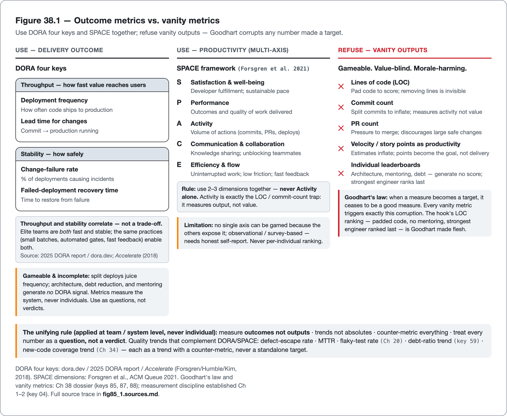

<!--
Dossier key: 85 (owner, leads) + folds 87 + 88 — per 01-index/FINAL_INDEX.md Ch 38 (CLOSES Part X; Ch 39 opens Part XI — Refactoring & Legacy)
Slug: 85_metrics_rollout_dashboards (owner key 85)
Part / arc position: Part X — Process, People & Metrics, Chapter 38 of 37-38 (CLOSER)
Companion module: 08-companion-code/85_metrics_rollout_dashboards/ (DoraMetrics four keys + CounterMetric pairing + RolloutPolicy baseline+ratchet + DashboardSpec no-leaderboard + externalized config) — ✅ EXAMPLE-BUILD = BUILT GREEN (mvn -B -Pquality verify on JDK 21.0.11; 11 tests, 0 Checkstyle, 0 SpotBugs; JDK-only). Spec at foot.
Verified against SOURCE-PIN: 2026-06-20. Sources (3 concise dossiers; the measurement capstone — applies Ch 1/2 Goodhart discipline at program level; the book's sharpest warning about measurement):
- Metrics that matter (85, ⚠ metrics misuse): apply measurement discipline (signal-vs-vanity, Goodhart, counter-metrics — Ch 1/2 key 04) at the team/delivery level. DORA four keys: deployment-frequency + lead-time-for-changes = THROUGHPUT; change-failure-rate + failed-deployment-recovery-time = STABILITY; throughput+stability NOT a trade-off, they CORRELATE (elite do both; bands ⚠ verify vs pinned State-of-DevOps edition). SPACE (Forsgren et al. 2021): productivity multi-dimensional — Satisfaction&well-being / Performance / Activity / Communication&collaboration / Efficiency&flow; no single axis gamed; use 2-3 together, never Activity alone. VANITY to avoid: LOC, commit count, PR count, raw velocity/story-points-as-productivity, individual leaderboards (all gameable, none measure value — Goodhart). Quality trend metrics: defect-escape-rate, MTTR, flaky-test-rate (Ch 20 key 49), debt-ratio trend (key 59), new-code coverage trend (Ch 34 key 80) — as TRENDS with counter-metrics, NOT targets. Rules: outcomes-over-outputs; trends-over-absolutes; counter-metric-everything; team/system-level NEVER individual; metrics-are-questions-not-verdicts. LIMITS (central): even DORA gameable+incomplete (split deploys juice frequency; highest-value work — architecture/debt/mentoring — generates NO DORA signal; no dashboard complete); metrics-measure-the-SYSTEM-not-people (ranking individuals harmful — state firmly); survey/observational (DORA = association not guaranteed causation; SPACE needs honest self-report); vanity persists because easy (arm reader to push back); context matters (bands differ by domain).
- Rolling out quality (87): every tool easy greenfield, HARD on million-line legacy that lights up w/ thousands of findings. Adoption PLAYBOOK: introduce gates/standards w/o a demoralizing work-blocking wall — via baselines + ratcheting. Answer to "turned on SonarQube, got 40,000 issues, now what?". BASELINE (accept past, gate future): snapshot existing findings accepted, only NEW fail. SpotBugs baseline/exclude, Checkstyle suppressions, Sonar clean-as-you-code/new-code (Ch 16/17/19/34). Legacy debt RECORDED not ignored (key 59). RATCHET (only-improve): thresholds move better-direction only — coverage may-not-drop (Ch 34 key 80), new-issue count zero, complexity ceilings tighten. Converges upward w/o big-bang. New-code focus: devs own what they touch; Boy Scout Rule (Ch 1 key 06) cleans legacy opportunistically. SEQUENCE: format (low-controversy auto-fixable Ch 6 key 34) → fast linters at WARN → promote to BLOCK on new code → heavier analysis/security → tighten ratchets; warn-then-block builds trust. Targeted paydown: high-churn hotspots (key 59) + automated fixes (OpenRewrite key 94) — not fix-everything. Bring the team (Ch 1 key 06): explain WHY, fast gate (Ch 33 key 79), low-FP (Ch 19 key 39), celebrate the trend (§C); adoption is a PEOPLE problem. LIMITS: baselines can become permanent AMNESTY (never-paid-down = formalized ignoring key 59 → pair w/ paydown plan + ratchet); big-bang fails (floods → reverted; staged honest default); suppression sprawl (over-baselining hides real issues key 39 → review + expiry); new-code-focus leaves legacy hotspots untouched if not edited (combine deliberate hotspot paydown); adoption can't be mandated into hostile culture (sociotechnical not just config).
- Quality dashboards (88): single point-in-time number = noise; the TREND = signal. Dashboards make quality observable over time (debt-ratio/coverage/complexity/DORA up-down) → team sees if improving + lead makes the case for investment. Apply metric discipline (Ch 1/2 key 04) to the PRESENTATION layer. Thesis: visualize TRENDS + counter-metrics on NEW code, not vanity absolutes on a leaderboard. Show (trends, paired): new-code coverage trend (Ch 34 key 80), debt-ratio/maintainability trend (Ch 17/key 59), complexity distribution (key 58), defect-escape + flaky-test rate (Ch 20 key 49), DORA four keys (key 85) — each over time + counter-metric. Tools: SonarQube dashboards + portfolio/aggregate views (Ch 17 key 35); CI coverage/build-time trends; DORA dashboards; generic BI. New-code lens (clean-as-you-code Ch 34): show RECENT work prominently — reward improving-from-here not punish inherited legacy. Audience-fit: developer view (actionable on my code) vs lead/portfolio view (trends/risk-hotspots/where-to-invest). Feedback loop NOT scoreboard: prompt action (pay down hotspot, fix flaky suite), tied to adoption playbook (§B). LIMITS (central): dashboards WEAPONIZE easily (individual leaderboards → Goodhart + morale harm — team/system trends NEVER individual ranking); vanity-on-a-screen (LOC/commits look busy mean nothing — wrong-metrics-to-display is the main failure); absolute whole-repo numbers mislead (mix legacy+new → lead w/ new-code trends); dashboard fatigue (nobody acts = theatre); green dashboard ≠ quality (proxies trending; design/correctness still need review Ch 37 key 84).
DORA four-key definitions + throughput/stability-correlate finding = VERIFIED at pin (SOURCE-PIN §5 2025 DORA report + §7 Accelerate 2018; corrected 2026-06-27) and runnable+tested in the companion module (DoraMetrics). ⚠ verify-at-pin (stays flagged → 09-flags/85_*): DORA current performance bands (elite/high/medium/low thresholds — never asserted as fact, year matters); DORA key wording "failed-deployment recovery time" vs "time to restore service" (paraphrase, confirm at pinned edition); SPACE five dimensions verbatim (Forsgren et al. ACM Queue 2021 — NOT a pinned SOURCE-PIN row); SpotBugs baseline/Checkstyle-suppressions/Sonar-new-code specifics + clean-as-you-code wording (see flags 27/35); SonarQube dashboard/portfolio feature names + editions (see flag 35).
Routes: measurement discipline foundation (Goodhart/vanity/counter-metrics) → Ch 1/2 (04); economics (speed/stability) → Ch 1 (02); flaky/MTTR → Ch 20 (49); debt/hotspots → key 59; new-code coverage/clean-as-you-code → Ch 34 (80); baseline tools → Ch 16/17/19 (27/29/35/39); OpenRewrite bulk paydown → key 94; SonarQube dashboards/portfolios → Ch 17 (35); review (green-dashboard≠quality) → Ch 37 (84); culture → Ch 1 (06); maturity model → key 110; remediation → key 96.
DRAFT v1 — gates manual; outcomes-over-vanity(DORA/SPACE) + Goodhart-the-sharpest-warning + metrics-measure-the-system-not-people + baseline+ratchet-adoption-playbook + warn-then-block-rollout + baseline-without-paydown=amnesty + trends-not-leaderboards + green-dashboard≠quality shapes; PART X CLOSER (hand-off opens Part XI — Refactoring & Legacy, Ch 39 keys 91+92+93+95). EXAMPLE-BUILD = BUILT GREEN (mvn -B -Pquality verify on JDK 21.0.11; 11 tests, 0 Checkstyle, 0 SpotBugs; JDK-only — see _EXAMPLE.md).
-->

# Knowing Whether It Works

*Measuring a quality program so it helps rather than harms — outcome metrics over vanity, a rollout that adoption survives, and dashboards that show trends, not leaderboards · 85 (folds 87, 88) · Part X (closer)*

> A VP asks "how do we measure developer productivity?" A lead stands up a dashboard ranking engineers by lines of code and commits. A month later the strongest engineer — who spends her days on architecture and unblocking others — ranks dead last, and the whole team is gaming the number.

## Hook

A VP asks the question every quality program eventually faces: "how do we measure developer productivity?" A well-meaning lead stands up a dashboard ranking engineers by lines of code and commit count. Within a month the effects arrive: developers split commits to inflate the count, pad code rather than simplify it, stop doing the refactoring work that *removes* lines, and quietly stop helping teammates because helping earns no individual credit. And the strongest engineer on the team — the one who spends her days on architecture decisions, mentoring, and unblocking everyone else, generating almost no lines of her own — ranks dead last. The dashboard did not measure productivity. It corrupted the team, optimizing them toward the proxy and away from the value. That is Goodhart's law made flesh: *when a measure becomes a target, it ceases to be a good measure* — and it is the trap every measurement program walks into.

This closing chapter of Part X answers the question the last chapter raised ("is it working?") and delivers the book's sharpest, most concentrated warning about measurement itself. Three parts structure it: **which metrics** to use (outcome measures, DORA and SPACE, that capture whether value reaches users safely, not the vanity metrics leaders reach for); **how to roll a quality program out** onto a real, legacy codebase (baselines and ratchets, so adoption is possible and the trend improves rather than the team being buried under forty thousand findings on day one); and **how to make progress visible** (dashboards that show team-level trends with counter-metrics, never individual leaderboards). The discipline running through all three, from the book's measurement foundation: *measure outcomes not outputs, trends not absolutes, counter-metric everything, at the team and system level — and the instant a number becomes a target or a ranking, it stops measuring quality and starts destroying it.*

## Overview

**What this chapter covers**

- **Metrics that matter**: DORA's four keys and the SPACE framework as outcome measures, and the vanity metrics (LOC, commits, velocity, individual leaderboards) to refuse.
- **Rolling out quality**: the adoption playbook for a legacy codebase: baseline, ratchet, new-code focus, warn-then-block, hotspot paydown.
- **Dashboards**: trend-and-counter-metric presentation, the new-code lens, and the never-a-leaderboard rule.
- The unifying discipline (Goodhart-aware measurement) and the honest center: metrics measure the system, not people; a green dashboard is not quality.

**What this chapter does NOT cover.** The measurement *discipline* itself (Goodhart, signal-versus-vanity, counter-metrics) was established earlier (Chapters 1–2). The baseline/suppression *tools* are in Chapters 16, 17, 19. New-code coverage strategy and SonarQube dashboards are in depth in Chapters 17 and 34. OpenRewrite bulk paydown and the maturity model are in later chapters. The human practices being measured are in Chapter 37. Metrics misuse is the contested core; the DORA performance bands are deferred to the pinned edition rather than asserted (the year matters), and the chapter **crowns no metric as a verdict** — every one is a question.

Hold this: *measure a quality program by outcomes (DORA/SPACE), not vanity (LOC/velocity); roll it out with baselines and ratchets so adoption survives and the trend climbs; show team-level trends with counter-metrics, never individual leaderboards — and the moment any number becomes a target, Goodhart corrupts both the number and the team.*

## How it works

*DORA and SPACE outcome measures to adopt, versus vanity metrics to refuse — anchored by Goodhart's law.*

### Metrics that matter: outcomes, not vanity

The measurement discipline established earlier (signal versus vanity, Goodhart, counter-metrics) applies at the team and delivery level here, and the central distinction is **outcomes versus outputs**. An *output* is activity (lines written, commits made, story points burned); an *outcome* is value safely delivered. The best-evidenced outcome measures are **DORA's four keys**:

- **Deployment frequency** and **lead time for changes** (*throughput*): how fast value reaches users.
- **Change-failure rate** and **failed-deployment recovery time** (*stability*): how safely.

> **CONCEPT** *Throughput and stability are not a trade-off — they correlate.* The most counterintuitive DORA finding: elite teams are *both* fast and stable, because the practices that make change safe (small batches, automated gates, fast feedback) are the same ones that make it frequent. Speed and quality are not opposed; well-run teams get both. (The exact performance bands are version-specific, verified against the pinned State of DevOps edition, since the year matters.)

A stability key is computed from deployment records by its definition — the fraction that caused a failure — and nothing more; no performance band is baked in.

<!-- include: 85_metrics_rollout_dashboards/src/main/java/org/acme/metrics/DoraMetrics.java#change-failure-rate -->

**SPACE** (Forsgren et al.) corrects the single-metric distortion that wrecked the hook's team: productivity is multi-dimensional (**S**atisfaction and well-being, **P**erformance, **A**ctivity, **C**ommunication and collaboration, **E**fficiency and flow), and the framework is explicitly designed so that *no single axis can be gamed*. The rule is to use two or three dimensions together, *never Activity alone* (Activity is exactly the LOC/commit-count trap). Alongside these sit quality-specific *trend* metrics: defect-escape rate, MTTR, flaky-test rate (Chapter 20), debt-ratio trend, new-code coverage trend (Chapter 34), used as trends with counter-metrics, never as targets. The vanity metrics to refuse outright are lines of code, commit count, PR count, raw velocity or story points as a productivity measure, and individual leaderboards — all gameable, none measuring value.

> **CONCEPT** *Even DORA is gameable and incomplete, and metrics measure the system, not people.* No dashboard is complete: a team can split deploys to juice deployment frequency, and the highest-value work — architecture, debt reduction, mentoring — *generates no DORA signal at all* (the hook's best engineer). Metrics are *questions, not verdicts*. DORA and SPACE measure the **system**, never the individual. Using them to rank people triggers exactly the Goodhart gaming and morale collapse the hook showed — they are team and delivery measures, and ranking individuals with them is harmful, full stop.

### Rolling out quality: baseline, ratchet, and bring the team

Every tool in this book is easy to adopt on a greenfield project and brutal on a million-line legacy codebase that lights up with tens of thousands of findings the moment it is enabled. The adoption playbook is the practical answer to "we enabled SonarQube and got forty thousand issues — now what?", and its core is two mechanisms:

- **Baseline** — *accept the past, gate the future*. Snapshot the existing findings as an accepted baseline (SpotBugs baseline/exclude filters, Checkstyle suppressions, Sonar's new-code definition) so only *new* violations fail the build. The legacy debt is *recorded* (Chapter 59's tracking), not ignored, but it does not block today's work.
- **Ratchet** — *only improve*. Thresholds move in the better direction only: coverage may not drop, the new-issue count must be zero, complexity ceilings tighten over time. The codebase converges upward without a big-bang cleanup project.

The baseline gate compares the current finding count to the accepted baseline and blocks only the *new* findings above it; the legacy past passes untouched.

<!-- include: 85_metrics_rollout_dashboards/src/main/java/org/acme/metrics/RolloutPolicy.java#baseline-gate -->

This is clean-as-you-code (Chapter 34) as an adoption strategy: developers own the quality of what they *touch*, and the Boy Scout Rule cleans legacy opportunistically as files are edited. The rollout is *sequenced*: start with formatting (low-controversy, auto-fixable, Chapter 6), add fast linters at *warn*, promote them to *block on new code*, then layer in heavier analysis and security, then tighten the ratchets, landing each gate as warn-then-block to build trust. Debt gets paid down deliberately, in high-churn hotspots and via automated fixes (OpenRewrite, a later chapter), not by trying to fix everything at once.

> **CONCEPT** *A baseline without a paydown plan is formalized ignoring, and adoption is a people problem.* The baseline's danger is permanent amnesty: if the baselined debt is never reduced, the debt has not been managed; it has been officially ignored (Chapter 59). A baseline must be paired with a ratchet and a paydown plan. The deepest limit: a quality rollout *cannot be mandated into a hostile culture* (Chapter 1). It is sociotechnical, not just config. Explain the *why*, make the gate fast (Chapter 33) and low-false-positive (Chapter 19), and celebrate the improving trend (next section). A big-bang rollout of every gate at full strength floods the team and gets reverted; staged, trust-building adoption is the honest default.

### Dashboards: trends, not leaderboards

A single point-in-time quality number is noise; the **trend** is the signal. Dashboards make quality observable *over time* (debt ratio, coverage, complexity, the DORA keys moving up or down), so a team can see whether it is improving and a lead can make the case for investment. This is the measurement discipline applied to the *presentation* layer: visualize **trends with counter-metrics on new code**, never vanity absolutes on a leaderboard.

What to show: new-code coverage trend (Chapter 34), debt-ratio and maintainability trend, complexity distribution, defect-escape and flaky-test rates (Chapter 20), and the DORA four keys — each over time, each paired with a counter-metric. The tools are SonarQube dashboards and portfolio/aggregate views (Chapter 17), CI-emitted coverage and build-time trends, and DORA dashboards from VCS/CI data. Two framing choices matter: the **new-code lens** (show the quality of *recent* work prominently, so the dashboard rewards "improving from here" rather than punishing inherited legacy) and **audience-fit** (a developer view of actionable findings on their code, versus a lead or portfolio view of trends, risk hotspots, and where to invest).

> **CONCEPT** *A dashboard is a feedback loop, not a scoreboard — and never an individual leaderboard.* The dashboard's job is to *prompt action* (pay down this hotspot, fix this flaky suite), tied to the adoption playbook, not to keep score. Turned into an individual leaderboard, a dashboard triggers Goodhart gaming and harms morale exactly as the LOC ranking did. Team and system trends, never individual ranking. Choosing the *wrong metrics to display* (LOC, commit counts) produces a dashboard that looks busy and means nothing: vanity on a screen.

A dashboard specification can enforce both rules at the point a tile is added, refusing a vanity metric and refusing any individual-scoped tile rather than trusting discipline.

<!-- include: 85_metrics_rollout_dashboards/src/main/java/org/acme/metrics/DashboardSpec.java#dashboard-no-leaderboard -->

The honest limits compound: absolute whole-repo numbers mislead (they mix legacy and new; lead with new-code trends instead); a dashboard nobody acts on is theater (the vanity-metric trap); and a green dashboard is not quality — it shows *measured proxies trending*, while design and correctness still need human review (Chapter 37).

## Deep dive: measurement helps only under discipline

The three sections are one discipline applied three ways. The discipline, established as the book's measurement foundation and concentrated here at the program level, is: **measure outcomes not outputs, trends not absolutes, counter-metric everything, at the team and system level, and treat every number as a question, not a verdict.** Each section applies that discipline in a different register. *Which metrics*: outcomes (DORA/SPACE) over vanity (LOC/velocity), the outputs-versus-outcomes rule. *How to roll out*: baseline-and-ratchet so the metric the gate targets (new-code quality) is fair and improving, the trends-over-absolutes rule made adoptable. *How to present*: trends with counter-metrics, never a leaderboard, the team-not-individual and counter-metric-everything rules at the presentation layer. The same five principles, three surfaces.

All three sections are governed by the one law that ruins measurement programs when ignored: **Goodhart's law.** The moment a number becomes a target, it stops measuring what was wanted and starts being optimized for its own sake. The hook demonstrates this at the individual-ranking surface (LOC leaderboard: padded code, no mentoring). It recurs everywhere this chapter touches: gate on coverage percentage and assertion-free tests appear (Chapter 23); gate on DORA deployment frequency and deploys get split; rank by velocity and estimates inflate. The defenses are the discipline's own rules. *Counter-metrics*: pair throughput with stability, coverage with mutation score, so gaming one shows up in the other. *Trends not absolutes*: a direction is harder to game than a threshold. *System not individual*: a team trend cannot be weaponized into a personal ranking. The discipline is not optional bureaucracy: it is the specific, hard-won set of guardrails that keep Goodhart from turning a quality-revealing number into a quality-destroying target. A measurement program without these guardrails does not merely fail to help; it actively harms, optimizing the team toward the proxy and away from the value — which does more damage than not measuring at all.

A counter-metric can be made structural: a metric bound to its opposite, with a report method that hands back both values together so the primary is never read without the measure that catches its gaming.

<!-- include: 85_metrics_rollout_dashboards/src/main/java/org/acme/metrics/CounterMetric.java#counter-metric -->

**Measurement is necessary but never sufficient, and it is the servant of judgment, not its replacement.** DORA indicates that delivery is healthy; it does not indicate whether the architecture is sound (it generates no signal for it). A dashboard shows debt trending down on new code; it does not indicate whether the design is right. That is review, Chapter 37. The metrics, the rollout, and the dashboards make a quality program *visible and improvable*: they answer "is it working?" with evidence rather than opinion, which is genuinely valuable. But they measure *proxies for* quality, never quality itself. The human judgment of Chapter 37 — the review that catches the logic flaw, the design call no metric captures, the mentoring that generates no DORA signal — remains the thing the numbers point *at* and cannot contain. The mature program measures rigorously, presents honestly, refuses to rank people, treats every metric as a question, and never lets the green trend substitute for the judgment it can only gesture toward. That is how a quality program is known to work without the knowing-process corrupting the work.

## Limitations & when NOT to reach for it

- **Goodhart corrupts any metric made a target.** Gate or rank on a number and the team optimizes the proxy, not the value (the LOC leaderboard, split deploys, assertion-free tests). Counter-metric everything; treat metrics as questions, not targets.
- **Metrics measure the system, never people.** Using DORA, SPACE, or any quality metric to rank individuals triggers gaming and harms morale — state it firmly and refuse it. They are team and delivery measures.
- **Even DORA is gameable and incomplete.** It generates no signal for the highest-value work (architecture, debt, mentoring); no dashboard is complete, and association is not guaranteed causation. Do not over-claim what the numbers prove.
- **Vanity metrics persist because they are easy.** LOC, commits, and velocity are seductive to leadership; a team lead must be armed to push back with outcome measures and counter-metrics.
- **A baseline without paydown is formalized ignoring.** If baselined debt is never reduced, the team has officially decided to ignore it; pair every baseline with a ratchet and a paydown plan, and watch for suppression sprawl.
- **Big-bang rollout fails.** Turning on every gate at full strength floods the team and gets reverted; staged, warn-then-block adoption is the honest default — and it cannot be mandated into a hostile culture.
- **New-code focus leaves cold legacy untouched.** Files never edited never improve under the Boy Scout Rule alone; combine with deliberate hotspot paydown.
- **A green dashboard is not quality.** It shows measured proxies trending; design and correctness still need human review (Chapter 37). A dashboard nobody acts on is theater, and the wrong metrics on a screen are vanity.

## Alternatives & adjacent approaches

- **DORA vs SPACE** — delivery-outcome metrics versus a multi-dimensional productivity frame; complementary (DORA for delivery health, SPACE to avoid single-axis distortion), not either/or.
- **Outcome metrics vs vanity metrics** — the core choice: measure value safely delivered, not activity; refuse LOC/commits/velocity-as-productivity.
- **Baseline + ratchet vs big-bang cleanup** — incremental adoption that survives versus a flag-day reformat that gets reverted; the legacy-adoption choice.
- **New-code focus vs whole-repo gating** — clean-as-you-code makes adoption possible and the dashboard fair; whole-repo absolutes block work and mix legacy with new.
- **Dashboards vs leaderboards** — team-level trends that prompt action versus individual rankings that corrupt; the presentation choice that decides whether measurement helps or harms.

These compose into a measurement program: outcome metrics with counter-metrics, rolled out via baseline-and-ratchet onto a real codebase, shown as team-level new-code trends that drive paydown — all treated as questions, never verdicts.

## When to use what

- **To measure delivery health:** DORA's four keys (throughput + stability), with the bands from the pinned edition — paired, never split.
- **To measure productivity without distorting it:** SPACE — two or three dimensions together, never Activity alone, never per individual.
- **To refuse a bad metric:** push back on LOC, commit count, velocity-as-productivity, and individual leaderboards — gameable, value-blind, morale-harming.
- **To adopt gates on a legacy codebase:** baseline the past, gate new code, ratchet thresholds, sequence warn-then-block, pay down hotspots deliberately.
- **To keep a baseline honest:** pair it with a ratchet and a paydown plan; review and expire suppressions.
- **To make progress visible:** a dashboard of team-level new-code trends with counter-metrics, audience-fit, that prompts specific action — never an individual leaderboard.
- **For what no metric captures:** human judgment and review (Chapter 37) — the architecture, the design call, the mentoring the numbers cannot see.

## Hand-off to the next part

The metrics, rollout, and dashboards of this chapter keep pointing at one thing they measure but do not perform: the *improvement* of code that already exists. The adoption playbook baselines legacy debt and ratchets it down; the dashboards trend debt downward; the metrics ask whether quality is improving. But *how* existing code is actually improved — its structure changed without changing its behavior, on a codebase with no tests, in increments small enough to stay safe — is a craft this book has referenced throughout and now turns to directly. **Part XI: Refactoring & Legacy** is that craft: disciplined refactoring (Fowler's behavior-preserving transformations under a test net), working with legacy code that has no tests (Feathers' seams and characterization), the strangler-fig pattern for replacing systems incrementally, and migrating across Java versions. Where this chapter measured whether the codebase is improving, the next part is the hands-on craft of making it better, safely.

## Back matter — sources & traceability

- **Metrics that matter** (key 85, ⚠ misuse) — apply measurement discipline (Goodhart/vanity/counter-metrics, Ch 1/2 key 04) at team/delivery level. **DORA four keys** (`dora.dev`/Accelerate State of DevOps): deployment-frequency + lead-time (throughput), change-failure-rate + recovery-time (stability); throughput+stability CORRELATE not trade-off; bands ⚠ @pin (year matters). **SPACE** (Forsgren et al. 2021, ACM Queue): Satisfaction/Performance/Activity/Communication/Efficiency; 2-3 together, never Activity alone. **Vanity** to refuse: LOC/commits/PR-count/velocity-as-productivity/individual-leaderboards. Quality trends: defect-escape/MTTR/flaky-rate (Ch 20 key 49)/debt-ratio (key 59)/new-code-coverage (Ch 34 key 80) — trends + counter-metrics not targets. Rules: outcomes>outputs, trends>absolutes, counter-metric-all, team-not-individual, questions-not-verdicts. *(DORA four-key definitions + correlate-finding = pinned SOURCE-PIN §5 [2025 DORA report] + §7 [Accelerate 2018]; DORA performance bands NOT asserted, ⚠ @pin [year matters]; SPACE dimensions ⚠ @pin [Forsgren et al. ACM Queue 2021 — not a pinned row, flagged 09-flags/85]. LIMITS: DORA-gameable+incomplete (no signal for architecture/debt/mentoring); measures-system-not-people; survey/observational; vanity-persists; context-matters.)*
- **Rolling out quality** (key 87) — easy greenfield, hard legacy ("40,000 issues, now what?"). **Baseline** (accept past/gate future: SpotBugs/Checkstyle/Sonar new-code, Ch 16/17/19/34; debt recorded key 59) + **Ratchet** (only-improve: coverage-no-drop Ch 34 key 80, new-issues-zero, complexity-tightens). New-code focus + Boy Scout Rule (Ch 1 key 06). Sequence: format (Ch 6 key 34) → linters-at-warn → block-on-new → heavier → tighten; warn-then-block. Hotspot paydown (key 59) + OpenRewrite (key 94). Bring the team (Ch 1 key 06): why + fast (Ch 33 key 79) + low-FP (Ch 19 key 39) + celebrate-trend. *(baseline tools + clean-as-you-code wording ⚠ @pin. LIMITS: baseline-without-paydown=amnesty; big-bang-fails; suppression-sprawl; new-code-leaves-cold-legacy; can't-mandate-into-hostile-culture.)*
- **Quality dashboards** (key 88) — point-in-time=noise, TREND=signal; presentation layer of the measurement discipline (Ch 1/2 key 04). Show TRENDS + counter-metrics on NEW code: new-code coverage (Ch 34), debt/maintainability (Ch 17/key 59), complexity (key 58), defect-escape/flaky (Ch 20 key 49), DORA (key 85). Tools: SonarQube dashboards + portfolio (Ch 17 key 35), CI trends, DORA dashboards. New-code lens + audience-fit (dev vs lead/portfolio). Feedback-loop-not-scoreboard. *(SonarQube dashboard/portfolio features ⚠ @pin. LIMITS: weaponize-easily (NEVER individual leaderboard — Goodhart+morale); vanity-on-a-screen; whole-repo-misleads; dashboard-fatigue; green-dashboard≠quality (review Ch 37 key 84).)*
- **Routing** — measurement discipline → Ch 1/2 (04); economics → Ch 1 (02); flaky/MTTR → Ch 20 (49); debt/hotspots → key 59; new-code coverage → Ch 34 (80); baseline tools → Ch 16/17/19 (27/29/35/39); OpenRewrite → key 94; SonarQube dashboards → Ch 17 (35); review → Ch 37 (84); culture → Ch 1 (06); maturity → key 110; remediation → key 96. SOURCE-PIN: DORA = pinned (§5 2025 DORA report + §7 Accelerate 2018, corrected 2026-06-27); SPACE (Forsgren et al. ACM Queue 2021) remains a §7 canon gap, TO-PIN (flagged 09-flags/85).

**Companion module (`08-companion-code/85_metrics_rollout_dashboards/` — ✅ EXAMPLE-BUILD = BUILT GREEN, JDK-only):** the measurement program made runnable: (a) **DORA's four keys** computed from deployment records by their definitions (`DoraMetrics`), reported throughput-beside-stability and asserting *no* performance band (the bands are edition-specific, verified at the pin); (b) a **counter-metric** type (`CounterMetric`) that hands back the primary and its opposite together, never one alone; (c) a **baseline + ratchet** rollout policy (`RolloutPolicy`) that accepts the legacy past and blocks only new findings / threshold regressions, returning a typed `RolloutDecision`; (d) a **"good dashboard" spec** (`DashboardSpec`) where every tile carries a counter-metric and a new-code lens, and a vanity tile or an individual-scoped tile is refused at the point it is added; (e) **externalized config** (`metrics-dev`/`metrics-prod`) for the warn-then-block rollout phase. **Honest edges (in code):** baselined debt stays visible (`remainingBaselineDebt` — not amnesty); a `DeploymentRecord` has no author (system, not people); the refusal of a leaderboard and of a regression are the tested failure paths; the green dashboard ≠ quality (design needs review Ch 37). Demonstrates outcomes-over-vanity + trends-not-leaderboards + baseline-then-ratchet. Built green via `mvn -B -Pquality verify` on JDK 21.0.11 (11 tests, 0 Checkstyle, 0 SpotBugs).

> Snippet tags: `DoraMetrics.java#change-failure-rate` · `CounterMetric.java#counter-metric` · `RolloutPolicy.java#baseline-gate` · `DashboardSpec.java#dashboard-no-leaderboard` (all ≤9 lines, resolved by `check_snippets.sh`).

## Next chapter teaser

This part measured whether the codebase is *improving* — baselining legacy debt, ratcheting it down, trending it on a dashboard — but never performed the improvement itself. Changing existing code without breaking it (restructuring without altering behavior, working safely in a codebase with no tests, replacing a system incrementally, migrating across Java versions) is the craft Part XI turns to: disciplined refactoring under a test net (Fowler), legacy code and its seams (Feathers), the strangler-fig pattern, and version migration. Where this chapter asked whether the code is getting better, the next part is the hands-on craft of making it better, safely.
