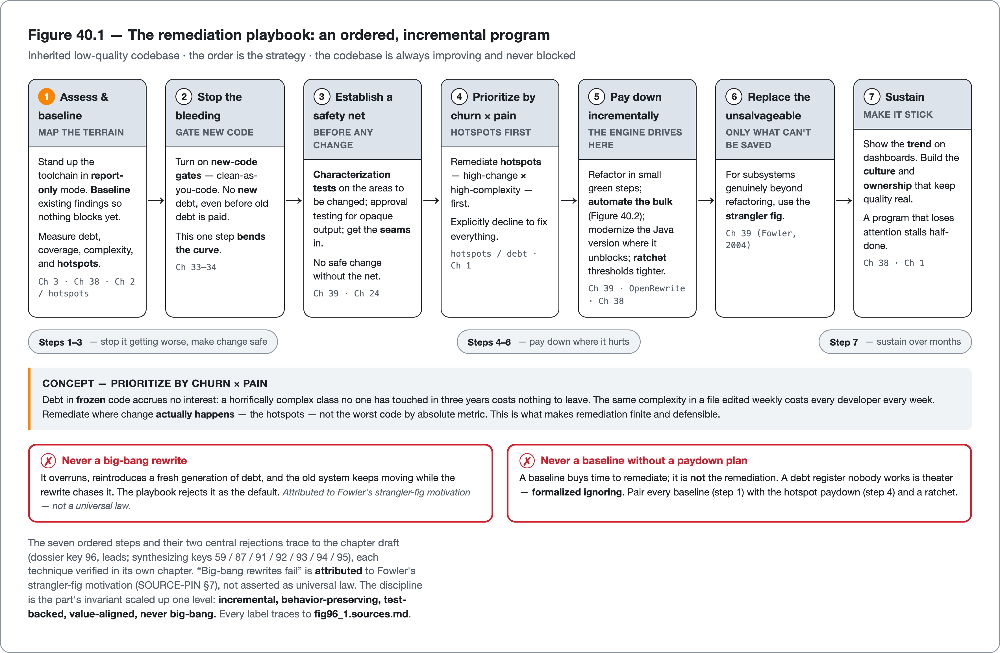
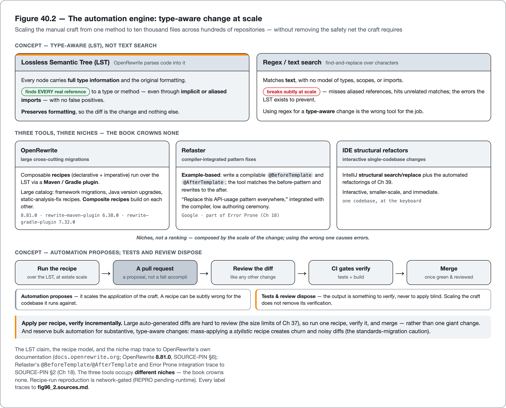

<!--
Dossier key: 96 (owner, leads) + folds 94 — per 01-index/FINAL_INDEX.md Ch 40 (CLOSES Part XI; Ch 41 opens Part XII — AI-Era Code Quality)
Slug: 96_remediation_playbook_automated_change (owner key 96)
Part / arc position: Part XI — Refactoring & Legacy, Chapter 40 of 39-40 (CLOSER / capstone)
Companion module: 08-companion-code/ (a 30/60/90-day remediation plan artifact applying the ordered steps; the remediation-prioritization helper + before/after pair runnable+tested) — ✅ EXAMPLE-BUILD = BUILT GREEN (JDK 21.0.11; 14 tests, 0 Checkstyle, 0 SpotBugs — see _EXAMPLE.md). The OpenRewrite recipe RUN is opt-in (`-Prewrite`) + network-gated → REPRO PENDING-RUNTIME. Spec at foot.
Verified against SOURCE-PIN: 2026-06-20. Sources (2 dossiers; Part XI capstone — the ordered PLAYBOOK + the automation ENGINE that scales Ch 39's manual craft to a whole estate):
- Remediation playbook (96, leads): you've inherited a large, low-quality, under-tested Java codebase — what do you DO, in what order, without stopping feature delivery or demoralizing the team? Sequences the book's techniques into a coherent program. Thesis: incremental, measured, value-aligned remediation — NEVER a big-bang rewrite — driven by where change actually happens. ORDERED PLAYBOOK: (1) ASSESS & BASELINE: tools (Ch 3 key 05) report-only; baseline existing findings (Ch 38 key 87) so nothing blocks; measure debt/coverage/complexity/hotspots (Ch 2/key 04/58/59). (2) STOP THE BLEEDING (gate new code): new-code gates clean-as-you-code (Ch 33/34 key 76/80) — no NEW debt before old paid; bends the curve alone. (3) SAFETY NET: characterization tests (Ch 39 key 92) on areas you'll change; approval (Ch 24 key 52) for opaque output; seams in. (4) PRIORITIZE by CHURN × PAIN: remediate HOTSPOTS (high-change × high-complexity) first — debt in frozen code accrues no interest (key 59/Ch1 02); don't fix everything. (5) PAY DOWN incrementally: refactor small green steps (Ch 39 key 91); automate bulk (OpenRewrite §B key 94); modernize Java version where it unblocks (Ch 39 key 95); ratchet (Ch 38 key 87). (6) REPLACE the unsalvageable: strangler-fig (Ch 39 key 93). (7) SUSTAIN: dashboards/trends (Ch 38 key 88); culture + ownership (Ch 1 key 06/90); maturity model (key 110). LIMITS (central): big-bang-rewrite = classic failure (overruns, reintroduces debt, old system keeps moving — playbook rejects it as default, Fowler strangler motivation Ch 39 key 93 — state loudly); needs sustained funding + culture (stalls when attention moves — half-strangled key 93; gamed/abandoned w/o buy-in Ch 1 key 06); baseline-without-paydown = formalized ignoring (debt register nobody works = theatre key 59); not-all-debt-worth-paying (frozen/throwaway Ch 1 key 02 — remediate where change happens); metrics-can-mislead (Goodhart Ch 1/38 key 04 — chase trend honestly w/ counter-metrics); some-codebases-genuinely-beyond-incremental-repair (rare but honest — when strangler/rewrite is right, say so).
- Automated change/OpenRewrite (94, engine, ⚠ niches): manual refactoring (Ch 39) doesn't scale to "change this pattern in 5,000 files across 200 repos"; automated TYPE-AWARE transformation does. At-scale arm of refactoring + engine behind version migration (Ch 39 key 95) + debt paydown (key 59/87). OpenRewrite: parses code → Lossless Semantic Tree (LST) — every node carries full TYPE INFO, so transforms find EVERY reference without false positives (even implicit/aliased imports) + preserve formatting. RECIPES (composable declarative+imperative); Maven/Gradle plugin; huge catalog (framework migrations, Java upgrades, static-analysis-fix recipes); composite recipes (UpgradeToJava25 ⊇ 21). Refaster (Wasserman/Google; part of Error Prone Ch 18 key 30): EXAMPLE-BASED — compilable @BeforeTemplate/@AfterTemplate; matches before, rewrites after; "replace this API-usage pattern everywhere". IDE structural refactors (IntelliJ structural search/replace + automated refactorings Ch 39) — interactive, smaller scale. Niches (⚠ not ranks): OpenRewrite = large cross-cutting migrations; Refaster/Error Prone = pattern-level fixes compiler-integrated; IDE = interactive single-codebase. Crown none. WORKFLOW: run recipe → review the diff (a normal PR) → CI gates verify (tests/build Ch 33 key 75/42) → merge. AUTOMATION PROPOSES, TESTS + REVIEW DISPOSE. LIMITS: automation-still-needs-review+tests (recipe can be subtly wrong — output is a PR to verify not blind-apply; large auto-diffs hard to review tension w/ Ch 37 size limits → apply per-recipe verify incrementally); semantic-edge-cases (common cases handled; unusual code manual follow-up — recipes "don't cover all changes"); recipe-authoring learning curve (custom LST visitors non-trivial; Refaster eases simple); niches-differ (wrong-one = errors); over-automation-risk (mass-applying a stylistic recipe → churn/noise Ch 37 key 86).
⚠ verify-at-pin: OpenRewrite recipe names + plugin GAVs + LST claim + composite-recipe behavior; Refaster @BeforeTemplate/@AfterTemplate + Error Prone integration; "big-bang rewrites fail" attribution (Fowler/Spolsky not universal law). SOURCE-PIN §7 canon gaps: Feathers/Fowler (cross-ref Ch 39). REPRO: OpenRewrite recipe run network-gated → REPRO PENDING-RUNTIME.
Routes: toolchain map → Ch 3 (05); baseline/ratchet/adoption → Ch 38 (87); new-code gates/clean-as-you-code → Ch 33/34 (76/80); characterization/seams → Ch 39 (92); approval → Ch 24 (52); refactoring discipline → Ch 39 (91); strangler-fig → Ch 39 (93); version migration → Ch 39 (95); debt/hotspots/churn → key 59; Error Prone/Refaster → Ch 18 (30); CI gates → Ch 33 (75); review (diff verify + size) → Ch 37 (84); style-churn caution → Ch 6/37 (86); metrics/dashboards/Goodhart → Ch 38 (85/88/04); culture → Ch 1 (06); maturity model → key 110.
DRAFT v1 — gates manual; ordered-remediation-playbook(assess→gate-new→net→hotspots→strangle→sustain) + automation-is-the-engine-not-the-strategy + type-aware-LST-vs-regex + automation-proposes-tests-dispose + never-big-bang + baseline-without-paydown=amnesty + remediate-where-change-happens shapes; PART XI CLOSER (hand-off opens Part XII — AI-Era Code Quality, Ch 41 keys 97+99). EXAMPLE-BUILD built green (14 tests, 0 Checkstyle, 0 SpotBugs, JDK 21.0.11); OpenRewrite recipe RUN opt-in + REPRO PENDING-RUNTIME (network-gated).
-->

# Taming the Inherited Disaster

*An ordered, incremental remediation playbook for a low-quality codebase — and the type-aware automation engine that scales the craft from one method to ten thousand files · 96 (folds 94) · Part XI (closer)*

> A million-line, under-tested codebase: forty thousand findings on the first scan, a flaky twenty-minute build, a backlog of features due Monday. Fixing everything is impossible, rewriting is the two-year cancellation, and ignoring it compounds. What is the right move?

## Hook

An inherited decade-old, million-line Java codebase: under-tested, forty thousand static-analysis findings on the first scan, a flaky twenty-minute build, and a backlog of features that were due last week. Three instincts arrive immediately, and all three are wrong. *Fix everything* — and feature delivery stops, and the team burns out trying. *Rewrite it*: the two-year cancellation from the last chapter, the big-bang that discards working behavior and chases a moving target. *Ignore it*, and the debt compounds, the build gets slower, and the upgrade cliff steepens until the system is unmaintainable. The inherited disaster is the situation every senior engineer eventually faces. The question is not *which tool* but *what to do Monday morning, in what order, without halting delivery or demoralizing the team*.

Two answers follow. The **remediation playbook** is an ordered, incremental, value-aligned program that sequences every technique in this book into a coherent plan: assess and baseline, stop the bleeding, build a safety net, pay down where it hurts, replace what cannot be saved, and sustain. The **automation engine** that powers it is OpenRewrite and Refaster, type-aware transformations that scale the manual craft of the last chapter from one method to ten thousand files across hundreds of repositories. The playbook is the *what and in what order*; the automation is the *how at scale*. Both serve the same discipline the whole part has argued: incremental, never big-bang; behavior-preserving, test-backed; and the capstone honesty that *automation proposes, tests and review dispose*, because scaling the craft does not remove the safety net the craft requires.

## Overview

**What this chapter covers**

- **The remediation playbook**: the ordered steps — assess/baseline → gate new code → safety net → hotspot paydown → strangle the unsalvageable → sustain.
- **Hotspot prioritization**: remediating by churn × pain, because debt in frozen code accrues no interest.
- **Automated large-scale change**: OpenRewrite (type-aware LST recipes), Refaster (example-based templates), and IDE structural refactors — the engine, and their niches.
- The discipline throughout: never big-bang, baseline-with-paydown, and automation-proposes-tests-dispose.

**What this chapter does NOT cover.** The individual techniques the playbook sequences — refactoring, characterization/seams, strangler-fig, version migration (the previous chapter); baselines/ratchets/adoption (Chapter 38); new-code gates (Chapters 33–34); characterization/approval (Chapter 24). The toolchain itself (Chapter 3). This chapter is the **synthesis** — the order and the engine — citing each technique to its own chapter. OpenRewrite/Refaster/IDE are **niche tools, crowned none**; recipe names are verified at the pin, and "big-bang rewrites fail" is attributed (Fowler), not asserted as universal law.

**The one idea to carry forward**: *tame a low-quality codebase with an ordered, incremental playbook — baseline the past, gate new code, build a safety net, pay down hotspots by churn × pain, strangle the unsalvageable, sustain the trend — powered by type-aware automation (OpenRewrite) that scales the craft; never big-bang, never baseline-without-paydown, and automation proposes while tests and review dispose.*

## How it works

*Figure 40.1 — The remediation playbook: an ordered, incremental program — Inherited low-quality codebase &middot; the order is the strategy &middot; the codebase is always improving and never blocked*

*Figure 40.2 — The automation engine: type-aware change at scale — Scaling the manual craft from one method to ten thousand files across hundreds of repositories &mdash; without removing the safety net the craft requires*

### The playbook: an ordered, incremental program

Reaching for techniques at random does not tame an inherited disaster; the *order* is the strategy. The remediation playbook sequences the book's techniques so the codebase improves without delivery stopping or the team burning out:

1. **Assess and baseline.** Stand up the toolchain (Chapter 3) in *report-only* mode and **baseline** the existing findings (Chapter 38) so nothing blocks yet — then measure where the codebase stands: debt ratio, coverage, complexity, and the *hotspots* (Chapter 2 / the metrics chapters). Remediation cannot be planned without a map of the terrain.
2. **Stop the bleeding.** Turn on **new-code gates** — clean-as-you-code (Chapters 33–34): no *new* debt, even before any old debt is paid. This single step bends the curve, because the codebase stops getting worse while the team decides what to fix.
3. **Establish a safety net.** Before changing anything, get **characterization tests** (Chapter 39) on the areas to be changed — approval testing (Chapter 24) for opaque output — and the **seams** that make them possible. No safe change without the net.
4. **Prioritize by churn × pain.** Remediate **hotspots** (code that is both *high-change* and *high-complexity*) first.
5. **Pay down incrementally.** Refactor in small green steps (Chapter 39), automate the bulk (the next section), modernize the Java version where it unblocks work (Chapter 39), and ratchet the thresholds tighter (Chapter 38).
6. **Replace the unsalvageable.** For subsystems genuinely beyond refactoring, use the **strangler fig** (Chapter 39).
7. **Sustain.** Show the trend on dashboards (Chapter 38), and build the culture and ownership (Chapter 1) that make quality stick. A remediation program that loses attention stalls half-done.

The companion module declares this sequence as the order it validates plans against, so a plan that pays down before gating new code is a detectable error rather than a matter of taste:

<!-- include: 96_remediation_playbook_automated_change/src/main/java/org/acme/remediation/PlaybookStep.java#playbook-order -->

> **CONCEPT** *Prioritize by churn × pain — debt in frozen code accrues no interest.* The single most important prioritization rule: remediate where change *actually happens*. A horrifically complex class that no one has touched in three years carries no interest — its debt accrues no cost, because the team never pays to read or change it. The same complexity in a file edited weekly costs every developer every week. Target the *hotspots* (high churn × high complexity), not the worst code by absolute metric, and explicitly decline to fix everything. This is what makes remediation finite and defensible: effort concentrates exactly where it returns.

The companion module's prioritizer ranks the debt inventory by that interest, and the selection step drops frozen code even when the budget has room — the decline-to-fix-everything rule, made executable:

<!-- include: 96_remediation_playbook_automated_change/src/main/java/org/acme/remediation/RemediationPrioritizer.java#churn-pain-rank -->

<!-- include: 96_remediation_playbook_automated_change/src/main/java/org/acme/remediation/RemediationPrioritizer.java#frozen-no-interest -->

The playbook's central rejection: **never a big-bang rewrite.** It overruns, it reintroduces a fresh generation of debt, and the old system keeps moving while the rewrite chases it (the last chapter's two-year cancellation, Fowler's original motivation for the strangler fig). The playbook's quiet failure mode is equally important: **a baseline without a paydown plan is formalized ignoring.** A debt register nobody works is theater. The baseline buys time to remediate; it is not the remediation. The companion module makes that rejection a real error path: constructing a plan that baselines the past without committing to pay it down throws, with a message that says why.

<!-- include: 96_remediation_playbook_automated_change/src/main/java/org/acme/remediation/RemediationPlan.java#reject-big-bang -->

### The engine: type-aware automation at scale

Steps 5 and 6 of the playbook need leverage that manual work cannot provide: hand-refactoring a deprecated API across five thousand files in two hundred repositories is not a viable path. **Automated, type-aware code transformation** is the engine, and the at-scale arm of the last chapter's manual craft.

> **CONCEPT** *Type-aware (LST), not text search.* OpenRewrite parses code into a **Lossless Semantic Tree**, where every node carries full type information and the original formatting. That is what makes it correct at scale: a transformation finds *every* genuine reference to a type or method (even through implicit or aliased imports) without the false positives a regex or text search produces, and it preserves formatting so the diff is the change and nothing else. The practical difference is between "rename this method everywhere" working reliably across a huge codebase and a find-and-replace that breaks subtly. The companion module carries one such behavior-preserving transformation as a before/after pair — the verbose mutable-list idiom a recipe matches, and the `List.of` form it rewrites to — and a test asserts the two are equivalent:

<!-- include: 96_remediation_playbook_automated_change/src/main/java/org/acme/remediation/legacy/LegacyReleaseNotes.java#before -->

<!-- include: 96_remediation_playbook_automated_change/src/main/java/org/acme/remediation/Modernized.java#after -->

The three tools occupy different niches; the book crowns none:

- **OpenRewrite** runs **recipes** (composable, declarative and imperative) over the LST via a Maven/Gradle plugin, with a large catalog: framework migrations, Java version upgrades (the migration recipes from the last chapter), and static-analysis-fix recipes. Composite recipes build on each other. The niche is *large cross-cutting migrations*. The companion module ships a declarative composite recipe that composes the Java 21 migration over its legacy package, run opt-in and verified incrementally:

<!-- include: 96_remediation_playbook_automated_change/config/rewrite/rewrite.yml#rewrite-recipe -->
- **Refaster** (Google; part of Error Prone, Chapter 18) is **example-based**: write a compilable `@BeforeTemplate` and `@AfterTemplate`, and the tool matches the before-pattern and rewrites it to the after. The niche is "replace this API-usage pattern everywhere," integrated with the compiler, with low authoring ceremony.
- **IDE structural refactors** (IntelliJ structural search/replace plus the automated refactorings of Chapter 39) are interactive, smaller-scale, and immediate.

> **CONCEPT** *Automation proposes; tests and review dispose.* An automated recipe produces a *pull request*, not a fait accompli — and that PR runs through the full quality gate (tests, build, review) exactly like any other change. A recipe can be subtly wrong for the codebase it runs against; the output is something to *verify*, never to apply blind. The workflow is: run the recipe → review the diff → CI gates verify → merge — and because large auto-generated diffs are hard to review (the size limits of Chapter 37), apply *per recipe* and verify incrementally rather than in one giant change. Automation scales the *application* of the craft; it does not remove the *verification* the craft requires.

The honest limits follow: automation still needs the review and tests (a wrong recipe is still a wrong change); recipes handle the common cases and leave semantic edge cases for manual follow-up (the migration recipes "don't cover all changes"); custom recipe authoring (LST visitors) has a learning curve (Refaster eases the simple cases); the niches genuinely differ (using regex for a type-aware change causes the errors the LST exists to prevent); and mass-applying a *stylistic* recipe creates churn and noisy diffs (the migration caution from the standards chapter).

## Deep dive: the playbook is the order, the engine is the leverage, the discipline is unchanged

The two halves of this chapter fit together as *strategy* and *power*, and the relationship is what makes the capstone cohere. The playbook is the **order**: it answers "what to do, and in what sequence" so that an overwhelming inherited disaster becomes a finite, staged program where the codebase is always improving and never blocked. The engine is the **leverage**: it answers "how to apply a change at the scale of an estate" so that step 5's paydown and the last chapter's migration are not gated by how fast engineers can edit files. Neither suffices alone. The engine without the playbook is a powerful tool applied in the wrong order (automating a stylistic cleanup before gating new code, churning the whole repository before there is a safety net). The playbook without the engine is a sound plan that stalls because the paydown is too slow to keep up with the new debt. Strategy needs power, and power needs strategy.

Both are governed by the discipline this entire part has built: **incremental, behavior-preserving, test-backed, value-aligned, never big-bang.** Every step of the playbook is incremental (baseline, then gate, then net, then hotspot-by-hotspot); every transformation the engine applies is behavior-preserving and verified (automation proposes, tests dispose); the prioritization is value-aligned (churn × pain, not fix-everything); and the whole thing rejects the big-bang at the program scale exactly as the last chapter rejected it at the technique scale. The invariant is the same (*preserve behavior, verify with tests, move in small reversible steps*), scaled up one final level from a single change to an entire remediation program. The remediation of a million-line codebase is not a different kind of activity from refactoring a method; it is the same discipline, sequenced and automated and sustained over months.

**Remediation is a sociotechnical program, not a technical task, and it succeeds or fails on sustained commitment far more than on tooling.** A small observability surface in the companion module makes the difference legible — a program below its committed paydown pace reports `STALLING`, not green-by-default, so a stalled program shows up instead of being mistaken for a healthy one:

<!-- include: 96_remediation_playbook_automated_change/src/main/java/org/acme/remediation/ProgramHealth.java#program-health -->

The tools and the engine are necessary, but the playbook's hardest steps are the human ones: a baseline without the *will* to pay it down is formalized ignoring; a remediation program that loses funding stalls in the half-strangled state, the worst of both worlds; metrics chased without honesty (Goodhart, Chapter 38) optimize a number into a worse codebase; and adoption mandated into a hostile culture (Chapter 1) is gamed or abandoned. The technique is the tractable part; the book has spent forty chapters on it. The hard part is the *commitment* to run the program over months without the attention wandering, the *judgment* to remediate where change happens rather than everywhere, and the *honesty* to admit when a codebase is genuinely beyond incremental repair. That is rare, but real: when the strangler or even the rewrite is the right call, say so. Taming an inherited disaster is, in the end, less a matter of which recipe runs than of whether the organization has the stamina to keep running the playbook until the trend is real. That is why this part closes by handing the question of *sustaining* quality back to the people and culture that Part X was about. The craft makes it possible; the commitment makes it happen.

## Limitations & when NOT to reach for it

- **Never default to a big-bang rewrite.** It overruns, reintroduces debt, and chases a moving target; the playbook rejects it. Reserve a rewrite for a genuinely small system or the rare codebase beyond incremental repair — and say so honestly when that is the call.
- **A baseline without a paydown plan is formalized ignoring.** Baselining buys time to remediate, not permission to ignore; a debt register nobody works is theater. Pair every baseline with a ratchet and a hotspot paydown plan.
- **Remediation needs sustained funding and culture.** Programs stall when attention moves on — the half-strangled state is the worst of both worlds. Without buy-in (Chapter 1) the program is gamed or abandoned; the failure is sociotechnical, not merely a configuration gap.
- **Do not try to fix everything.** Debt in frozen code accrues no interest; remediate hotspots (churn × pain), not the worst code by absolute metric. Fix-everything is how remediation programs burn out.
- **Metrics can mislead the program.** Chasing a number without counter-metrics (Goodhart, Chapter 38) optimizes the proxy into a worse codebase; track the trend honestly.
- **Automation proposes; tests and review dispose.** A recipe can be subtly wrong; its output is a PR to verify, never a blind apply. Large auto-diffs are hard to review — apply per recipe and verify incrementally.
- **Recipes do not cover everything.** They handle the common cases; semantic edge cases need manual follow-up. The wrong tool (regex for a type-aware change) causes the errors the LST exists to prevent.
- **Over-automation creates churn.** Mass-applying a stylistic recipe produces noisy diffs and blame churn (the standards-migration caution); reserve bulk automation for substantive, type-aware changes.

## Alternatives & adjacent approaches

- **Incremental playbook vs big-bang rewrite** — the central choice; the playbook is the evidence-backed default, the rewrite the rare exception for small or unsalvageable systems.
- **OpenRewrite vs Refaster vs IDE structural refactor** — large cross-cutting migrations vs compiler-integrated pattern fixes vs interactive single-codebase changes; niches, not a ranking, composed by the scale of the change.
- **Hotspot paydown vs uniform cleanup** — remediate by churn × pain vs fixing the worst absolute metric; hotspots concentrate effort where it returns.
- **Characterization-then-refactor vs strangle** — get code under test and improve it in place, vs replace a subsystem beyond saving; the last chapter's scale choice, now sequenced into the playbook.
- **Manual paydown vs automated recipes** — for the bulk, type-aware automation is the leverage; for the bespoke and the judgment-heavy, the manual craft of the last chapter.

These compose into the remediation program: an ordered playbook (baseline → gate → net → hotspots → strangle → sustain), powered by type-aware automation for the bulk, with the manual craft for the rest — all incremental, verified, and sustained.

## When to use what

- **On inheriting a low-quality codebase:** the playbook, in order — assess/baseline first, gate new code to stop the bleeding, build a safety net before changing anything.
- **To decide what to fix:** churn × pain — hotspots first, not everything, not the worst absolute metric.
- **To stop the codebase getting worse:** new-code gates (clean-as-you-code) — the single highest-leverage step.
- **To apply a change across an estate:** OpenRewrite (large migrations/recipes) or Refaster (pattern-level, compiler-integrated); IDE structural refactor for interactive single-codebase changes.
- **To verify automated change:** treat every recipe's output as a PR — review the diff, run the gates, apply per recipe and verify incrementally.
- **For a subsystem beyond refactoring:** the strangler fig (last chapter), sequenced as step 6.
- **To make it stick:** dashboards, culture, and ownership (Chapters 38, 1) — and the honesty to admit when a codebase is beyond incremental repair.
- **Never:** a default big-bang rewrite, a baseline without a paydown plan, or a blind mass-apply of an unreviewed recipe.

## Hand-off to the next part

This part — and this playbook — has been about improving code that *humans wrote*, with techniques humans apply and automation humans direct. The code arriving in pull requests increasingly was not written by a human at all: it was generated by an AI coding assistant, and it raises every quality question in this book at once, plus new ones. Is AI-generated code as correct, as secure, as maintainable as human code, and where is it systematically worse? How does a team review it, test it, and gate it when it is produced faster than any human can scrutinize? **Part XII: AI-Era Code Quality** turns to the quality questions the generative shift creates — the empirical (dated) findings on AI-generated code quality and risk, the guardrails for AI-assisted development, AI code review, and governing AI in the workflow. Every discipline in this book still applies to AI-generated code; the next part is what *changes* when a machine, not a person, is writing the first draft.

## Back matter — sources & traceability

- **Remediation playbook** (key 96, leads; capstone synthesizing keys 59/87/91/92/93/94/95) — inherited low-quality codebase: what to do, in what order, without halting delivery. Incremental, value-aligned, NEVER big-bang. **Ordered steps**: (1) assess & baseline (toolchain Ch 3 key 05 report-only; baseline Ch 38 key 87; measure debt/coverage/complexity/hotspots Ch 2/key 04/58/59); (2) stop-the-bleeding (new-code gates clean-as-you-code Ch 33/34 key 76/80); (3) safety net (characterization Ch 39 key 92 + approval Ch 24 key 52 + seams); (4) prioritize churn × pain (hotspots first — frozen-debt-accrues-no-interest key 59/Ch1 02); (5) pay down (refactor Ch 39 key 91 + automate §B key 94 + migrate Ch 39 key 95 + ratchet Ch 38 key 87); (6) strangle unsalvageable (Ch 39 key 93); (7) sustain (dashboards Ch 38 key 88 + culture Ch 1 key 06/90 + maturity key 110). *(synthesis — each technique verified in its own chapter; "big-bang rewrites fail" attributed Fowler/Spolsky not universal law. LIMITS: never-big-bang; needs-sustained-funding+culture; baseline-without-paydown=amnesty; not-all-debt-worth-paying; metrics-can-mislead (Goodhart Ch 38 key 04); some-codebases-beyond-incremental-repair.)*
- **Automated change/OpenRewrite** (key 94, engine, ⚠ niches) — manual refactoring doesn't scale; type-aware does. **OpenRewrite** (`docs.openrewrite.org`): Lossless Semantic Tree (full type info → finds EVERY reference no false positives + preserves formatting); composable recipes via Maven/Gradle plugin; catalog (framework migrations/Java upgrades/SA-fixes); composite (25⊇21). **Refaster** (Google; Error Prone Ch 18 key 30): example-based `@BeforeTemplate`/`@AfterTemplate`. **IDE structural refactors**: interactive. Niches (crown none): OpenRewrite=large migrations / Refaster=compiler-integrated pattern fixes / IDE=interactive. Workflow: recipe → diff/PR → CI verify (Ch 33 key 75) → merge; AUTOMATION PROPOSES, TESTS+REVIEW DISPOSE. *(LST/recipes verified; recipe names + GAVs + Refaster/Error-Prone integration ⚠ @pin; recipe run network-gated → REPRO PENDING-RUNTIME. LIMITS: still-needs-review+tests (PR not blind-apply; large-diffs-hard-to-review Ch 37); semantic-edge-cases; authoring-learning-curve; niches-differ; over-automation-churn Ch 6/37 key 86.)*
- **Routing** — toolchain → Ch 3 (05); baseline/ratchet/adoption → Ch 38 (87); new-code gates → Ch 33/34 (76/80); characterization/seams/refactor/strangler/migration → Ch 39 (91/92/93/95); approval → Ch 24 (52); debt/hotspots → key 59; Error Prone/Refaster → Ch 18 (30); CI gates → Ch 33 (75); review → Ch 37 (84); style-churn → Ch 6/37 (86); metrics/Goodhart → Ch 38 (85/88/04); culture → Ch 1 (06); maturity → key 110. SOURCE-PIN §7 canon: Feathers/Fowler cross-ref Ch 39 TO-PIN.

**Companion module (spec — ✅ EXAMPLE-BUILD = BUILT GREEN, JDK 21.0.11; OpenRewrite recipe run network-gated → REPRO PENDING-RUNTIME):** (a) a **30/60/90-day remediation plan** artifact applying the ordered steps to a representative legacy-ish module — day 0-30: tools report-only + baseline + measure hotspots + turn on new-code gates; day 30-60: characterization net on the top hotspot + first incremental refactors; day 60-90: an OpenRewrite bulk fix + a strangler slice + a dashboard showing the trend; (b) an **OpenRewrite recipe run** on the module (a static-analysis-fix or a small API migration) showing the diff + tests staying green. **Honest edges (comments):** the plan never proposes a big-bang rewrite; the baseline is paired with a hotspot paydown plan (not amnesty); prioritization is churn × pain (frozen debt left alone); the OpenRewrite output is a PR verified by the gates (automation proposes, tests dispose), applied per-recipe; the program's real risk is sustained-commitment, not tooling. Reuses the Ch 38 baseline/ratchet + Ch 39 characterization/refactor/strangler/migration techniques as one sequenced program.

**Built green** (`mvn -B -Pquality -f 08-companion-code/96_remediation_playbook_automated_change/pom.xml verify`; JDK 21.0.11; 14 tests, 0 Checkstyle, 0 SpotBugs). The OpenRewrite recipe **run** is opt-in (`-Prewrite`) and **REPRO PENDING-RUNTIME** (network-gated); the recipe config, the before/after pair, and the prioritization logic verify offline. **Snippet tags:** `playbook-order`, `churn-pain-rank`, `frozen-no-interest`, `reject-big-bang`, `before`, `after`, `rewrite-recipe`, `program-health` (companion module `08-companion-code/96_remediation_playbook_automated_change/`).

## Next chapter teaser

This part improved code that humans wrote. The code arriving in pull requests increasingly was not written by a human — an AI assistant generated it, faster than anyone can scrutinize, raising every quality question in this book at once plus new ones: is it as correct, secure, and maintainable as human code, and where is it systematically worse? Part XII turns to AI-era code quality — the dated empirical findings on AI-generated code, the guardrails for AI-assisted development, AI code review, and governing AI in the workflow. Every discipline so far still applies; the next part is what changes when a machine writes the first draft.
