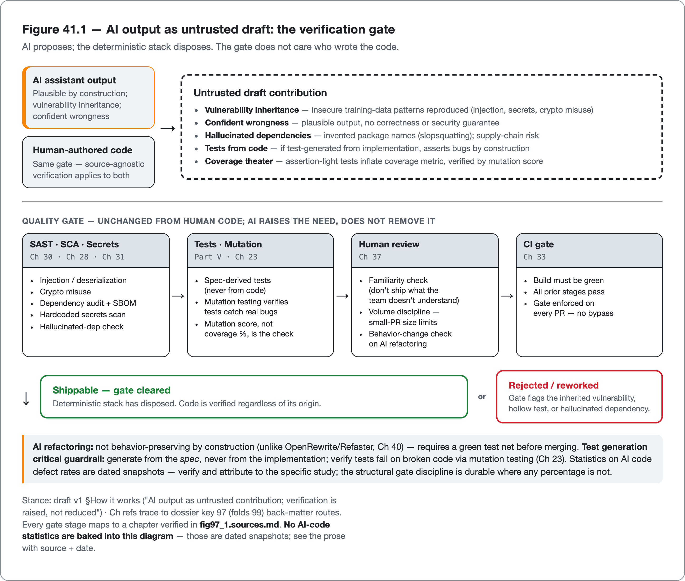

<!--
Dossier key: 97 (owner, leads, Part XII umbrella) + folds 99 — per 01-index/FINAL_INDEX.md Ch 41 (OPENS Part XII — AI-Era Code Quality)
Slug: 97_ai_generated_code_quality (owner key 97)
Part / arc position: Part XII — AI-Era Code Quality, Chapter 41 (OPENS Part XII; Ch 41-42)
Companion module: 08-companion-code/97_ai_generated_code_quality/ (an AI-drafted string-concat SQL lookup that SpotBugs flags + review catches → PreparedStatement fix; an AI test generated-from-code that reaches full coverage while its mutants survive, vs a spec-derived test that kills them) — ✅ EXAMPLE-BUILD = BUILT GREEN [MANUAL — tooling pending] (JDK 21.0.11; mvn -B -Pquality verify: 12 tests, 0 Checkstyle, 0 unsuppressed SpotBugs; per _EXAMPLE.md 2026-06-27; 5 displayed snippet tags + a 6th `under-test` present-but-not-displayed). Spec + Snippet tags at foot.
Verified against SOURCE-PIN: 2026-06-20. Sources (2 dossiers; Part XII umbrella; AI-stats DATED+ATTRIBUTED never timeless; the book is itself AI-written — practice what it preaches):
- AI-generated code quality (97, leads, umbrella): AI assistants now part of most Java workflows → quality of AI-generated code is first-class. Evidence two-sided: large productivity gains AND measurable increase in defects/vulns. CORE STANCE (rest of Part XII operationalizes): AI-generated code is a DRAFT not a DELIVERABLE — same quality gates as human code + a few AI-specific checks. Why risk (mechanism): LLMs trained on massive public code containing bugs/vulns → IMPLICIT VULNERABILITY INHERITANCE (reproduce insecure patterns; "can't be fully fixed by prompt-tweaking or post-hoc checking"); also confidently produce plausible-but-wrong code (no ground-truth intent). Characteristic Java risks: injection SQL/XSS + insecure-deserialization (Ch 30 key 69/72); hardcoded secrets (Ch 31 key 71); crypto misuse (Ch 30 key 74); outdated/hallucinated deps incl "slopsquatting" (hallucinated package names Ch 28 key 65/66); subtle logic errors; over-complex/non-idiomatic; missing edge-cases. DATED evidence (attribute+verify): studies indicate a large fraction of AI snippets carry security gaps + AI tools frequently fail to prevent XSS; Java/Python fewer memory-safety issues than C/C++ but still real risk. Specific %s (~40% critical gaps, XSS missed 86%) ⚠ VERIFY AT PIN, cited to the specific dated study, "as of <date>" NOT timeless. Stance: treat AI output as UNTRUSTED contribution — SAST/SCA/secrets (Ch 30/28/31 key 70/65/71) + tests (Part V) + review (Ch 37 key 84) + gate (Ch 33 key 76). AI accelerates WRITING; does not reduce need for VERIFICATION (RAISES it). Productivity real (most orgs report gains key 100); useful for boilerplate/test-scaffold/refactor-suggestions when verified; Java fares relatively-well vs memory-unsafe (still not safe). LIMITS (core): confident-wrongness (plausible, no correctness/security guarantee — OVER-TRUST is THE central risk); vulnerability-inheritance (insecure patterns recur; AI doesn't "know" OWASP unless verified Ch 30 key 69); hallucinated-deps/APIs (non-existent packages supply-chain slopsquatting Ch 28); volume-outpaces-review (more code faster than humans can review Ch 37 size limits — strains the gate); statistics-volatile (any % a dated snapshot — verify+date); skill-atrophy/familiarity-gap (shipping code you don't understand). SELF-AWARE: this book is AI-written (PROVENANCE) — every fact gated.
- AI-assisted refactoring/testgen (99, §B): two most common AI uses — refactoring + test generation — both attractive (tedious, fast) + both a sharp trap: AI refactoring can SILENTLY CHANGE BEHAVIOR; AI tests generated FROM the code just assert what the code currently does (bugs included). Use w/ GUARDRAILS; where deterministic tools (OpenRewrite/Refaster Ch 40 key 94) are safer. AI-refactoring: LLM suggests structural changes/modernizations. Guardrail: NOT behavior-preserving by construction (vs IDE/OpenRewrite Ch 39/40 key 91/94) → MUST be backed by a green test suite (characterize first on legacy Ch 39 key 92) + reviewed (Ch 37 key 84). Mechanical large-scale → prefer deterministic OpenRewrite/Refaster (Ch 40); AI for judgment-heavy one-offs. AI test generation — THE CRITICAL GUARDRAIL: do NOT generate tests FROM the implementation — defeats the "double-bookkeeping" of tests (the test must independently encode INTENDED behavior; a test derived from the code just pins current behavior bugs-included — same trap as characterization Ch 39 key 92 but sold as "new tests"). Generate tests from the SPEC/requirements, or AI to suggest CASES/edge-inputs a human then asserts; verify generated tests actually FAIL when code is broken (mutation testing Ch 23 key 47 is the check). CodeScene three guardrails (attribute): Code Quality, Code Familiarity (don't ship code you don't understand), Code/Test Coverage. Verification mandatory: AI refactor/tests → build + tests + mutation + review + gate (Ch 33/23/37 key 75/47/84/76) — AI proposes, the deterministic stack disposes. FOR: real time savings (verified); AI good at edge-case IDEATION (suggest inputs a human might miss, then human-asserts — complements property-based Ch 22 key 46); pairs w/ deterministic tools. LIMITS (central): AI-refactoring-not-behavior-preserving (without a net can silently break — #1 risk vs OpenRewrite LST); tests-from-code anti-pattern (pass by construction, assert bugs as correct, false confidence — LOUDEST caveat; mutation testing Ch 23 exposes hollow tests); coverage-theatre (AI rapidly generates high-coverage low-value assertion-light tests, inflating vanity Ch 23 key 48/04/80); familiarity-gap; volume-strains-review (Ch 37 key 84).
⚠ verify-at-pin [tracked: 09-flags/97_ai_code_quality_stats_sources_verify_at_pin.md, raised 2026-06-27]: ALL AI-code statistics (% with vulns, XSS-miss rate, productivity %) — cite the specific study + date, NEVER timeless; "slopsquatting"/hallucinated-dep framing (primary source); CodeScene three-guardrails wording; "double-bookkeeping / don't generate tests from code" attribution; AI-testgen effectiveness stats. SOURCE-PIN §7 canon gaps: arXiv 2502.01853 + 2409.19182 (exist; figures ⚠), CodeScene guardrails not pinned rows. NONE confirmable from SOURCE-PIN.md + the built module alone → all stay flagged, kept DATED + ATTRIBUTED in prose, never timeless.
Routes: AI code review (augment-not-replace) + governing AI in workflow → Ch 42 (98/100); security/OWASP/injection/secrets/crypto → Ch 30/31 (69/70/71/72/74); SAST → Ch 31 (70); SCA/hallucinated-deps/SBOM → Ch 28 (65/66); tests (the verification net) → Part V; mutation testing (the test-of-tests) → Ch 23 (47); coverage theatre → Ch 23 (48/80); property-based (edge-case ideation) → Ch 22 (46); refactoring/characterization → Ch 39 (91/92); deterministic transforms (OpenRewrite/Refaster) → Ch 40 (94); review/size limits → Ch 37 (84); CI gate → Ch 33 (76); folklore/date-every-stat discipline → Ch 1/2 (04); provenance (book is AI-written) → front matter/PROVENANCE.
DRAFT v1 — gates manual; AI-code-is-a-draft-not-a-deliverable + AI-proposes-deterministic-stack-disposes(raised) + confident-wrongness/over-trust-is-the-central-risk + vulnerability-inheritance + hallucinated-deps + tests-from-code-is-an-anti-pattern + date-and-attribute-every-AI-stat + verification-raised-not-reduced + self-aware-this-book-is-AI-written shapes; PART XII OPENER/UMBRELLA. EXAMPLE-BUILD = BUILT GREEN (mvn -B -Pquality verify; JDK 21.0.11; 12 tests; 0 Checkstyle / 0 unsuppressed SpotBugs; per _EXAMPLE.md 2026-06-27).
-->

# The Draft That Looks Like a Deliverable

*The quality of AI-generated Java — its characteristic risks, the guardrails for AI-assisted refactoring and test generation, and the one stance that makes AI safe to use · 97 (folds 99) · Part XII (opener / umbrella)*

> An AI assistant writes a clean, idiomatic, well-tested pull request in thirty seconds. It also has a SQL injection it learned from its training data, imports a package that does not exist, and passes its own tests because they were generated from the buggy code. Nothing looks wrong.

## Hook

An AI assistant produces a Java pull request in thirty seconds: clean, idiomatic, well-named, with passing tests. It reads more cleanly than a lot of hand-written code. It also concatenates user input directly into a SQL query (a vulnerability reproduced from the millions of insecure examples in its training data), imports a Maven dependency that does not exist, and passes its own test suite *only because those tests were generated from the implementation* and assert exactly what the buggy code does. Three serious defects, zero visible warning signs, because the code is **plausible by construction**: a language model is optimized to produce output that *looks like* correct code, whether or not it is. That plausibility is the central risk of the AI era. It disarms the one instinct a human reviewer relies on, the sense that something looks off, precisely when something is.

This chapter is the umbrella over Part XII, and it establishes the single stance that makes AI safe to use for Java: **AI-generated code is a draft, not a deliverable.** It goes through every quality gate in this book (static analysis, security scanning, tests, review, the CI gate) *unchanged*, plus a few AI-specific checks. The generative shift changes *who or what writes the first draft*; it does not change the need to verify that draft, and in fact it *raises* that need, because AI produces more code, faster, carrying confident wrongness and inherited vulnerabilities that human authorship does not introduce at the same rate. The chapter has two halves: the *characteristic risks* of AI-generated Java and the verification stance that contains them, and then the two most common AI uses (*refactoring* and *test generation*) with the guardrails that keep them trustworthy. A note on honesty: this book is itself AI-written, and it gates every fact it states. That discipline is the subject of this part, practiced on itself.

## Overview

**What this chapter covers**

- **Why AI code carries risk**: vulnerability inheritance from training data and confident wrongness, and the characteristic Java risks (injection, secrets, crypto, hallucinated dependencies, logic errors).
- **The stance**: AI output as an untrusted contribution that goes through the full quality stack. Verification raised, not reduced.
- **AI-assisted refactoring**: not behavior-preserving by construction, so it requires a test net (and where deterministic tools are safer).
- **AI test generation**: the critical guardrail. Never generate tests *from* the code (double-bookkeeping); verify with mutation testing.

**What this chapter does NOT cover.** AI code review and governing AI in the workflow at the team level (the next chapter). The security tools the stance relies on: SAST, SCA, secrets (Chapters 30, 31, 28). The test net and mutation testing (Part V, Chapter 23). Deterministic transforms: OpenRewrite/Refaster (Chapter 40). This is a **fast-moving topic**: every statistic here is **dated and attributed to its specific study, never stated as a timeless constant**. Model capability changes too fast for any percentage to stay true, and the folklore discipline of Chapters 1–2 applies with full force to AI numbers.

**The one idea to hold**: *AI-generated code is a draft, not a deliverable. It is plausible by construction, which makes over-trust the central risk, so it goes through the exact same quality gates as human code plus AI-specific checks; AI accelerates writing without reducing the need for verification; it raises that need. AI proposes while the deterministic stack disposes.*

## How it works

*AI output as an untrusted draft, flowing through the full quality gate (SAST/SCA/secrets → tests/mutation → review → CI gate) before it can ship.*

### Why AI-generated code carries risk

Two mechanisms make AI-generated code risky in characteristic ways, and understanding them is what turns "be careful with AI" into specific, checkable practice.

> **CONCEPT** *Vulnerability inheritance and confident wrongness.* A language model is trained on an enormous corpus of public code that *contains* bugs and vulnerabilities, so it reproduces those insecure patterns. Researchers call this property **vulnerability inheritance**, and the studies note it "cannot be fully fixed by prompt-tweaking or post-hoc checking." The model will write the string-concatenated SQL query, the disabled certificate check, the weak cipher. Not because the model is careless, but because those patterns are *well-represented in what it learned from*. The second mechanism is **confident wrongness**: a model has no access to ground-truth intent, so it produces plausible-looking code with no guarantee of correctness, stated with exactly the same fluency whether right or wrong. Together these make over-trust the central risk: the code looks authoritative and is sometimes silently broken or insecure.

The characteristic Java risks follow directly: injection (SQL and XSS) and insecure-deserialization patterns (Chapter 30); hardcoded secrets (Chapter 31); cryptographic misuse (Chapter 30); outdated or *hallucinated* dependencies (including **slopsquatting**, where the model invents a plausible package name that an attacker can then register and weaponize; Chapter 28); subtle logic errors; over-complex or non-idiomatic code; and missing edge-case handling. The empirical evidence is real but *volatile*: as of recent (2024–2025) studies, a substantial fraction of AI-generated snippets were found to contain security weaknesses, and AI tools frequently failed to prevent XSS. Specific figures (for example, often-cited rates in the range of "around 40% with critical gaps" or "XSS missed in the large majority of cases") **must be verified against the specific dated study and cited as a snapshot, never as a constant.** Java fares relatively well compared with memory-unsafe languages like C/C++ in these studies (fewer memory-safety classes of bug), but "relatively well" is not "safe."

The companion module makes the injection case concrete on the storefront. The AI draft concatenates the email value straight into the query text — the inherited pattern, with no warning sign:

<!-- include: 97_ai_generated_code_quality/src/main/java/org/acme/ai/AiDraftedLookup.java#sql-concat -->

The reviewed fix binds the value as a parameter, so it can never be parsed as SQL — the same fix a human draft of the same bug would get, because the gate is source-agnostic:

<!-- include: 97_ai_generated_code_quality/src/main/java/org/acme/ai/ReviewedLookup.java#sql-prepared -->

In the module the AI-drafted query is the one shape SpotBugs flags (`SQL_NONCONSTANT_STRING_PASSED_TO_EXECUTE`), exactly as it would for a human-written equivalent — the gate does not care who wrote the code.

> **CONCEPT** *The stance: AI output is an untrusted contribution; verification is raised, not reduced.* Because the code is plausible-but-unverified, the only safe stance is to treat AI output as an unvetted contribution from an unknown external contributor: run it through SAST and SCA and secrets scanning (Chapters 30, 31, 28), the test suite (Part V), human review (Chapter 37), and the CI gate (Chapter 33). The crucial inversion: **AI accelerates *writing* but does not reduce the need for *verification*; it raises that need**, because there is now more code, produced faster, with confident-wrongness and inherited-vulnerability risk that did not exist at the same rate before. The entire quality stack of Parts IV–XI is what makes AI safe to use; AI does not replace it, it makes it more necessary.

The productivity side is genuinely real. Most organizations report meaningful productivity gains and faster delivery with AI assistants (the next chapter's figures), and AI is legitimately useful for boilerplate, test scaffolding, and refactoring suggestions *when verified*. The point is not to refuse the tool; the output goes through the gate. The module models that gate as a running path: an AI contribution that is oversized, malformed, or — in the stricter profile — carries no attested provenance is turned away rather than accepted, treating the draft as untrusted until verified.

<!-- include: 97_ai_generated_code_quality/src/main/java/org/acme/ai/AiReviewGate.java#failure-path -->

### AI-assisted refactoring and test generation: the guardrails

The two most common AI coding uses, refactoring and test generation, are both attractive (they automate tedious work, fast) and both carry a sharp, specific trap that the general stance has to be sharpened into guardrails for.

**AI-assisted refactoring** is the more obvious case. An LLM suggesting a structural change or modernization is *not behavior-preserving by construction*. An IDE refactoring or an OpenRewrite recipe (Chapters 39, 40) is correct by its type-aware mechanics; an AI's suggestion, lacking that guarantee, can *silently change behavior*. So the guardrail is the refactoring discipline of Chapter 39, made mandatory: it must be backed by a green test suite (characterize first on untested legacy), and reviewed. And the division of labor with the last chapter's engine is precise: **for mechanical, large-scale changes, prefer the deterministic tools (OpenRewrite/Refaster); use AI for the judgment-heavy, one-off refactors** where a human will review the result anyway.

> **CONCEPT** *Never generate tests from the code: that defeats their double-bookkeeping.* The loudest guardrail in the AI era. A test's entire value is **double-bookkeeping**: the test independently encodes the *intended* behavior, so that when it disagrees with the code, a bug has been found. Generating a test *from the implementation* defeats exactly that. The test now asserts whatever the code does, *bugs included*, and passes by construction. It is the characterization-test trap (Chapter 39), but disguised as "new tests" and therefore far more dangerous, because it looks like real test coverage while verifying nothing. The guardrails: generate tests from the *spec or requirements* (not the code), or use AI to *suggest cases and edge inputs* that a human then asserts on. Always verify the generated tests actually *fail when the code is broken*, which is exactly what mutation testing (Chapter 23) checks. AI is genuinely good at *edge-case ideation* (proposing inputs a human might miss, then human-asserted; it complements property-based testing, Chapter 22). It is dangerous at *writing the assertions itself from the code.*

The module shows the trap and its repair on one method. A test generated from the implementation runs every line — full line coverage — while asserting only that the result is non-null, so every boundary and arithmetic mutant survives:

<!-- include: 97_ai_generated_code_quality/src/test/java/org/acme/ai/AiGeneratedCodeQualityTest.java#weak-test -->

A spec-derived test encodes the intended behavior independently — both sides of the boundary, the exact total — so the same mutants die:

<!-- include: 97_ai_generated_code_quality/src/test/java/org/acme/ai/AiGeneratedCodeQualityTest.java#strong-test -->

The line coverage is identical for both; the mutation score is not. That gap is what coverage cannot see and what the tests-from-code trap hides.

The other limits sharpen the picture. **Coverage theater**: AI can rapidly generate high-coverage but assertion-light tests, inflating the coverage vanity metric (Chapter 23) while testing nothing. Mutation testing is the antidote. The **familiarity gap**: shipping AI code or tests a developer does not fully understand is a maintainability and correctness risk. CodeScene identifies this as one of three AI guardrails (Code Quality, Code Familiarity, Code/Test Coverage): do not ship code the team does not understand. And **volume strains review** (Chapter 37): AI generates more code than any team can carefully verify. The unifying rule across both halves is the last chapter's principle, raised in stakes: **AI proposes; the deterministic stack disposes.** Build, tests, mutation, review, and the gate are what turn an AI draft into something shippable.

## Deep dive: the gate does not care who wrote the code

The reassuring truth under this entire part (and the reason a book about code quality is *more* relevant in the AI era, not less) is that **the quality stack this book has built is exactly the verification layer AI-generated code needs, and it works without modification.** A SQL injection is caught by the same SAST rule (Chapter 30) whether a human or a model wrote it. A hallucinated dependency is caught by the same SCA and SBOM checks (Chapter 28). A behavior-changing refactor is caught by the same test suite (Part V); a hollow test is caught by the same mutation testing (Chapter 23); a confidently-wrong logic error is caught by the same human review (Chapter 37) and the same CI gate (Chapter 33). The gate does not care who or what wrote the code; it cares whether the code passes. That is the deepest reason the stance works: AI changes the *source* of the first draft, but the *verification* is source-agnostic, and a team that already has a strong gate is already most of the way to using AI safely. The forty chapters before this one are not obsoleted by AI; they are the thing that makes AI usable.

What *is* genuinely new is a shift in where the risk concentrates, and it sharpens two of the book's recurring themes. First, **the bottleneck moves decisively from writing to verifying.** When writing was the expensive step, the gate was a check on a scarce, human-paced flow of code. When writing becomes nearly free, the gate becomes the *actual constraint*. The volume of plausible code can outpace the team's capacity to review and verify it, which is why the size-limit and review disciplines (Chapter 37) and the automated stack (Parts IV–IX) matter more, not less. Second, **confident wrongness defeats the human's primary defense.** Human-written code carries subtle signals of its author's uncertainty: a hesitant comment, a rushed section, a TODO. Those cue a reviewer to look harder. AI-generated code carries no such signals; it is uniformly fluent, so the reviewer's instinct for "this looks shaky" misfires, and the *only* reliable defense is the mechanical stack that does not rely on instinct at all. Against confident wrongness, the read cannot be trusted; the gate must run. That is what "AI proposes, the deterministic stack disposes" means in practice.

The stance is a discipline against a specific temptation, and the temptation is strongest exactly when AI is most useful. The better the AI gets, the more plausible its output, the more its productivity gains tempt a team to skip the verification: to merge the clean-looking PR, to trust the passing tests, to ship the refactor without the test net. And the better it gets, the *more* dangerous skipping verification becomes, because the failures that remain are the subtle, plausible, confidently-wrong ones that look exactly like correct code. There is no version of AI capability that removes the need for the gate. A more capable model writes more convincing drafts, which raises the cost of the errors that slip through. This is also why the volatility of the statistics matters beyond mere accuracy: a reader who anchors on "AI code is 40% vulnerable" will be wrong within a year as models improve, and might conclude the problem is solved. The durable truth is not a percentage but a *structural* one. AI generates plausible-but-unverified code; verification is therefore mandatory; that is true regardless of how good the model is. The number dates; the discipline does not. Every figure in this part is stamped with its source and its date. This book, itself AI-written, gates every fact it states. The stance the chapter teaches is the stance the book practices on itself: trust nothing because it sounds right; verify everything because it must.

## Limitations & when NOT to reach for it

- **Over-trust is the central risk.** AI code is plausible by construction; its fluency is not evidence of correctness or security. Treat every AI output as an untrusted contribution, full stop.
- **Vulnerability inheritance cannot be prompted away.** Models reproduce insecure training-data patterns; this is not fixed by prompt-tweaking or post-hoc cleanup, only by running the security stack (SAST/SCA/secrets) on the output.
- **Hallucinated dependencies are a supply-chain attack surface.** Invented package names (slopsquatting) can be registered by attackers; verify every dependency actually exists and resolves to the intended artifact (Chapter 28).
- **Never generate tests from the code.** They pass by construction and assert the bugs, destroying the double-bookkeeping that gives tests their value. Generate from spec, or human-assert AI-suggested cases; verify with mutation testing (Chapter 23).
- **AI refactoring is not behavior-preserving.** Without a green test net it can silently change behavior; for mechanical changes prefer deterministic tools (OpenRewrite/Refaster, Chapter 40).
- **Coverage theater is real with AI.** High-coverage, assertion-light generated tests inflate the vanity metric while testing nothing; mutation score, not coverage percentage, is the real check.
- **Volume outpaces review.** AI generates more than a team can carefully verify; the gate, not the keyboard, is now the constraint. Do not let plausible volume flood it.
- **Every statistic dates fast.** Any AI-quality percentage is a snapshot of a specific model at a specific time; verify and date it, and never reason from a number as if it were constant. The structural risk is durable; the figure is not.
- **Do not ship what the team does not understand.** The familiarity gap (CodeScene) is a real maintainability and correctness risk. AI-assisted is not AI-abdicated.

## Alternatives & adjacent approaches

- **AI-assisted vs deterministic transforms:** for mechanical, large-scale change, OpenRewrite/Refaster (Chapter 40) are behavior-preserving by construction; reserve AI for judgment-heavy one-offs that a human reviews.
- **Tests from spec vs tests from code:** the central test-generation choice. Spec-derived (or human-asserted AI-suggested cases) preserve double-bookkeeping; code-derived destroy it.
- **AI for ideation vs AI for assertion:** AI is strong at proposing edge cases and inputs (then human-asserted, complementing property-based testing, Chapter 22) and weak at writing correct assertions from the code.
- **Coverage vs mutation as the AI-test check:** coverage is gameable by assertion-light generated tests; mutation testing (Chapter 23) verifies the tests actually catch bugs.
- **Refuse AI vs gate AI:** the choice this chapter resolves in favor of gating. Use the tool; run its output through the full stack.

These compose into the AI-era posture: use AI to draft, prefer deterministic tools for mechanical change, generate tests from intent not implementation, and run everything through the unchanged quality gate.

## When to use what

- **For drafting boilerplate, scaffolding, suggestions:** AI, fast and useful, treated as a draft to verify.
- **For mechanical, large-scale refactoring/migration:** deterministic tools (OpenRewrite/Refaster, Chapter 40), behavior-preserving by construction. Not AI.
- **For judgment-heavy one-off refactors:** AI *with* a green test net (characterize legacy first) and review.
- **For test generation:** from the spec, or human-assert AI-suggested edge cases. Never from the implementation; verify with mutation testing.
- **For security:** run SAST/SCA/secrets on all AI output as a matter of course; assume vulnerability inheritance.
- **For dependencies:** verify every AI-suggested package actually exists and is the intended one (slopsquatting).
- **Always:** AI proposes; the deterministic stack (build, tests, mutation, review, gate) disposes. Verification is raised, not reduced.

## Hand-off to the next chapter

This chapter set the stance for *an individual* using AI: treat the output as a draft, run it through the gate. But AI in a real engineering organization is not one developer with an assistant. It is a whole team generating code faster than the existing review process was designed for, raising team-level and governance questions this chapter only gestured at. Can AI itself help *review* the flood of AI-generated code, and what are the limits of AI reviewing AI? How does an organization *govern* AI use: what policies, what disclosure, what guardrails at the platform level, what stays mandatorily human? The next chapter turns to **AI code review and governing AI in the workflow**, using AI as a review *augmentation* (never a replacement for human judgment or the deterministic gate), and the governance frameworks that let an organization adopt AI at scale without the verification discipline quietly eroding under the volume. The stance stays the same; the scale and the stakes go up.

## Back matter — sources & traceability

- **AI-generated code quality** (key 97, leads, Part XII umbrella; arXiv 2502.01853 "Security and Quality in LLM-Generated Code" + 2409.19182 "AI-Generated Code Considered Harmful" — ⚠ §7 canon rows, figures @pin; OWASP Ch 30 key 69) — AI code first-class quality concern; two-sided (productivity + elevated defects/vulns). STANCE: AI code is a DRAFT not a DELIVERABLE — same gates + AI-specific checks. Mechanism: vulnerability-inheritance (reproduces insecure training-data patterns; "can't be fully fixed by prompt-tweaking/post-hoc") + confident-wrongness (no ground-truth intent). Java risks: injection/deserialization (Ch 30 key 69/72), secrets (Ch 31 key 71), crypto (Ch 30 key 74), hallucinated-deps/slopsquatting (Ch 28 key 65/66), logic errors, non-idiomatic, missing edge-cases. Stance: untrusted contribution → SAST/SCA/secrets (Ch 30/28/31) + tests (Part V) + review (Ch 37) + gate (Ch 33); AI raises-not-reduces verification. *(ALL stats ⚠ VERIFY @pin + DATED + ATTRIBUTED, never timeless — "~40% gaps"/"XSS 86%" are dated snapshots; Java>C/C++ but not safe. LIMITS: confident-wrongness/over-trust; vulnerability-inheritance; hallucinated-deps; volume-outpaces-review; statistics-volatile; skill-atrophy/familiarity-gap. SELF-AWARE: book is AI-written, gates every fact.)*
- **AI-assisted refactoring/testgen** (key 99, §B; CodeScene guardrails — ⚠ wording @pin; mutation Ch 23 key 47) — refactoring + testgen: attractive + sharp traps. AI-refactoring NOT behavior-preserving by construction (vs IDE/OpenRewrite Ch 39/40 key 91/94) → MUST have a green test net (characterize first Ch 39 key 92) + review (Ch 37); mechanical → deterministic (Ch 40), AI → judgment-heavy one-offs. **TEST GENERATION CRITICAL GUARDRAIL**: do NOT generate tests FROM code (defeats double-bookkeeping — asserts bugs, passes by construction; the characterization trap Ch 39 sold as "new tests"); generate from SPEC, or AI-suggest cases + human-assert; verify-they-fail-on-broken-code via mutation testing (Ch 23 key 47). CodeScene 3 guardrails: Code Quality / Code Familiarity (don't-ship-what-you-don't-understand) / Code-Test Coverage. AI proposes, deterministic stack disposes (build+tests+mutation+review+gate Ch 33/23/37). *(FOR: time savings verified; edge-case ideation — complements property-based Ch 22 key 46; pairs w/ deterministic. LIMITS: not-behavior-preserving (#1); tests-from-code anti-pattern (LOUDEST; mutation Ch 23 exposes); coverage-theatre (Ch 23 key 48/80); familiarity-gap; volume-strains-review.)*
- **Routing** — AI review + governance → Ch 42 (98/100); security/OWASP → Ch 30/31 (69/70/71/72/74); SCA/hallucinated-deps → Ch 28 (65/66); tests → Part V; mutation → Ch 23 (47); coverage theatre → Ch 23 (48/80); property-based → Ch 22 (46); refactoring/characterization → Ch 39 (91/92); deterministic transforms → Ch 40 (94); review/size → Ch 37 (84); gate → Ch 33 (76); date-every-stat folklore → Ch 1/2 (04); provenance → front matter. SOURCE-PIN §7 canon: arXiv 2502.01853 + 2409.19182 + CodeScene guardrails TO-PIN (not pinned rows → tracked in 09-flags/97_ai_code_quality_stats_sources_verify_at_pin.md); every AI statistic dated+attributed, never timeless.

**Companion module (✅ EXAMPLE-BUILD = BUILT GREEN [MANUAL — tooling pending]):** `08-companion-code/97_ai_generated_code_quality/`, two illustrative demos on the storefront domain: (a) an **AI-drafted lookup with an inherited vulnerability** (`AiDraftedLookup`, string-concatenated SQL — the classic vulnerability-inheritance pattern) that **SpotBugs (Ch 30) flags** (`SQL_NONCONSTANT_STRING_PASSED_TO_EXECUTE`, verified load-bearing) → fixed to a bound `PreparedStatement` (`ReviewedLookup`) — showing "AI draft → gates → fix"; (b) an **AI test generated from the code** (`AiTestGeneratedFromTheCode`) that reaches full line coverage while its boundary and arithmetic **mutants survive** (the tests-from-code trap; **mutation testing (Ch 23)** is the check that exposes it), shown beside a **spec-derived test** (`SpecDerivedTest`) that *kills* them. The `AiReviewGate` running path wires the reviewed fix alone, treats an AI contribution as untrusted (rejects oversized / malformed / provenance-less input — the failure path), and exposes a readiness probe + rejected-count metric; the AI-drafted shape is never reachable from it. **Honest edges (comments):** the AI output is an untrusted contribution every gate runs on; the vulnerability is inherited not invented; the hollow test looks like coverage but is double-bookkeeping-free; mutation score, not coverage %, is the real check; **no AI statistic is embedded in the code** (figures date, mechanisms do not). Build: JDK 21.0.11; `-Pquality verify` → 12 tests, 0 Checkstyle, 0 unsuppressed SpotBugs. Demonstrates "AI-code-is-a-draft" + "AI-proposes-deterministic-stack-disposes" + "never tests-from-code."

**Snippet tags:** `sql-concat` (the AI-drafted string-concat lookup), `sql-prepared` (the reviewed bound-parameter fix); `weak-test` (the tests-from-code trap: full coverage, mutants survive), `strong-test` (the spec-derived test that kills them); `failure-path` (the AI-review gate's reject path). All five displayed regions resolve to ≤9-line `// tag::` regions inside the compiled module (verified by `check_snippets.sh`). A sixth tagged region, `under-test` (the boundary+arithmetic core of `OrderTotals`), backs the trap demo and is available but not displayed.

## Next chapter teaser

This chapter set the stance for one developer with an assistant. But AI in an organization is a whole team generating code faster than the review process was built for — raising governance questions: can AI help review the flood of AI code, and what are the limits of AI reviewing AI? What policies, disclosure, and platform guardrails let an org adopt AI without the verification discipline eroding under the volume? The next chapter turns to AI code review (augmentation, never replacement) and governing AI in the workflow — the same stance, at organizational scale.
