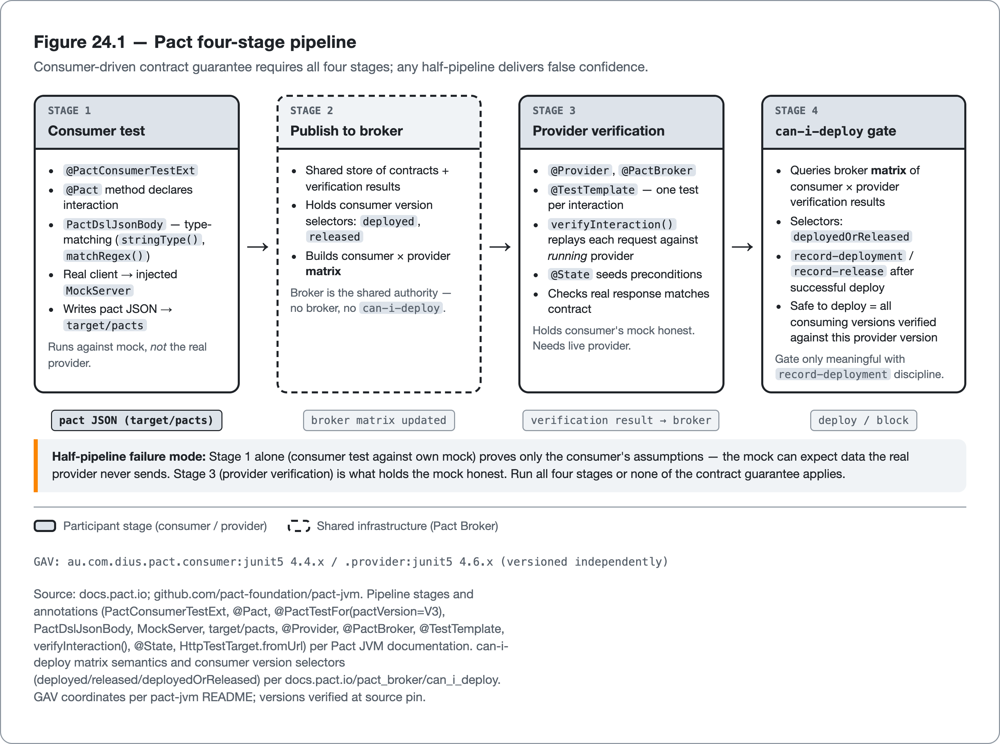
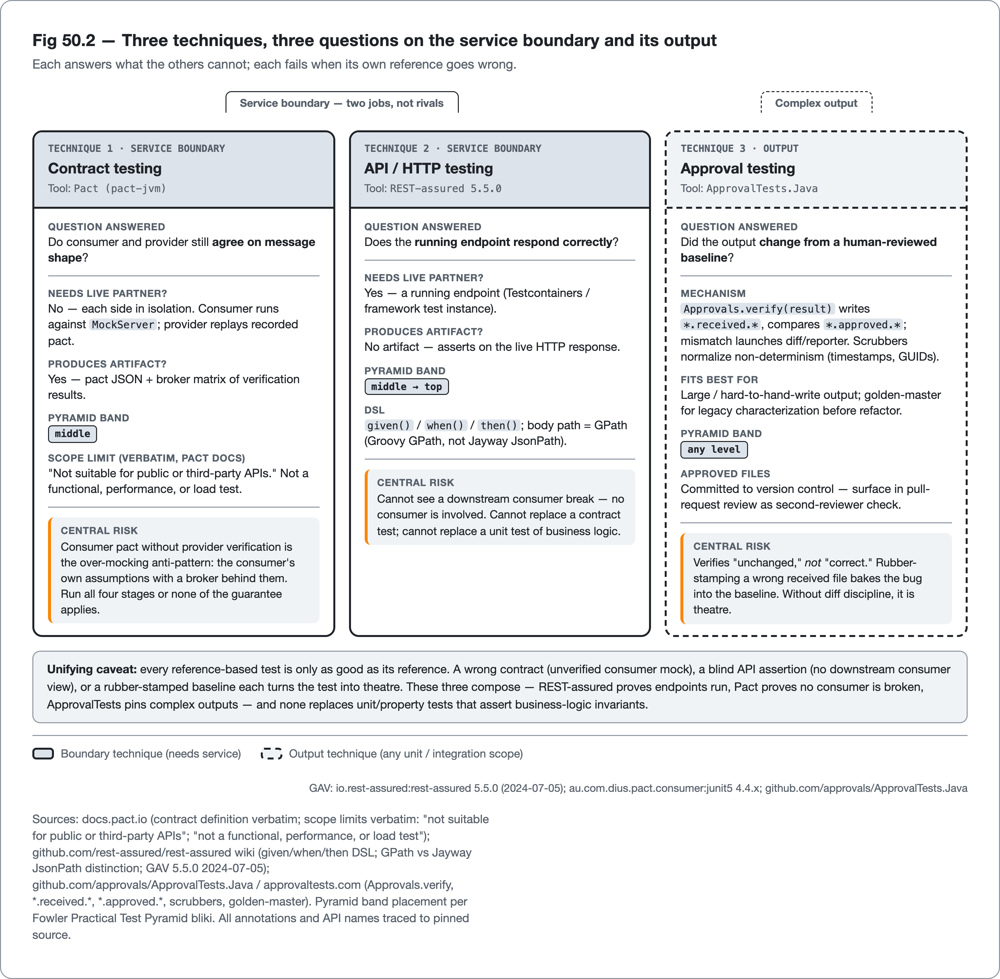

<!--
Dossier key: 50 (owner, leads) + folds 52 — per 01-index/FINAL_INDEX.md Ch 24 (CLOSES Part V; Ch 25 opens Part VI — Architecture & Design Governance)
Slug: 50_contract_approval_testing (owner key 50)
Part / arc position: Part V — Testing, Chapter 24 of 20-24 (CLOSER)
Companion module: 08-companion-code/50_contract_approval_testing/ — EXAMPLE-BUILD = BUILT GREEN 2026-06-26 (mvn -B -Pquality clean verify = BUILD SUCCESS; 12 tests, 0 failures; 0 Checkstyle, 0 SpotBugs; JDK 21.0.11). The three named tools (Pact/REST-assured/ApprovalTests.Java) are cited-not-built — their mechanisms are realized in plain JDK+JUnit+AssertJ with zero runtime deps (Pact provider verification + REST-assured both need a running provider; ApprovalTests.Java is unpinned), recorded in 09-flags/. Spec at foot.
Verified against SOURCE-PIN: 2026-06-20. Sources (each tool cited to its OWN docs; complementary-not-rivals, crown none):
- Contract/API (50): TWO jobs on ONE boundary, two questions. Contract testing (Pact): "do the two sides agree on message shape without standing up both?" VERBATIM "a technique for testing an integration point by checking each application in isolation to ensure the messages it sends or receives conform to a shared understanding documented in a 'contract'"; "code-first consumer-driven"; "contract is generated during the execution of the automated consumer tests"; "only communication paths actually used by consumers get tested". API/HTTP (REST-assured): "does the running endpoint respond correctly?" given()/when()/then() DSL; .body(path,matcher) GPath (Groovy GPath, NOT Jayway JsonPath, verbatim); Hamcrest; RequestSpecBuilder/ResponseSpecBuilder; matchesJsonSchemaInClasspath. Pact 4-stage pipeline: consumer test (PactConsumerTestExt @ExtendWith; @Pact(consumer,provider)→RequestResponsePact; @PactTestFor(providerName,pactMethod,pactVersion=V3,port); PactDslJsonBody TYPE-matching stringType/matchRegex; MockServer injected; writes target/pacts) → publish to Pact Broker → provider verification (au.com.dius.pact.provider:junit5; @Provider; @PactFolder/@PactBroker; PactVerificationInvocationContextProvider+@TestTemplate one-test-per-interaction; PactVerificationContext.verifyInteraction() REPLAYS; context.setTarget(HttpTestTarget.fromUrl); @State preconditions) → can-i-deploy (broker MATRIX of consumer×provider verification VERBATIM; consumer version selectors deployed/released/deployedOrReleased; record-deployment/record-release). Pyramid: contract=middle (NO live partner); API=middle→top (needs running endpoint). GAV au.com.dius.pact.consumer:junit5 / .provider:junit5 [dossier observed 4.4.x/4.6.x at research time]; io.rest-assured:rest-assured [dossier observed 5.5.0]. ⚠ PIN CORRECTION 2026-06-27: SOURCE-PIN §3 now pins Pact-JVM 4.7.0 (consumer+provider together) and REST-assured 6.0.0 — back-matter §"sources" carries the pinned versions; the 4.x annotation set/pactVersion default re-trace against 4.7.0 stays ⚠ @pin. Tools cited-not-built (realized in JDK+JUnit; no GAV compiled).
- Snapshot/approval (52): inverts inline assertion — test produces output, framework compares to stored *approved* file, any diff fails, human reviews + approves (received→approved=baseline). Approvals.verify(result) writes *.received.*, compares *.approved.*; mismatch launches diff/reporter. Scrubbers normalize non-determinism (timestamps/GUIDs/ordering). Variants: strings/objects/collections/combinations. Fits: large/hard-to-hand-write output (reports/serialized DTOs/generated text); characterizing legacy before refactor (golden-master, Feathers WELC). HONEST SPINE: verifies "UNCHANGED" not "CORRECT" — headline risk = rubber-stamp a wrong received into approved, baking the bug into the baseline; approval discipline (read the diff) mandatory or it's theatre. ApprovalTests.Java (github.com/approvals/ApprovalTests.Java; approvaltests.com).
SOURCE-PIN §3 pins (corrected 2026-06-27): Pact-JVM 4.7.0 (consumer/provider versioned together at 4.7.0), REST-assured 6.0.0. ApprovalTests.Java remains unpinned (no §3 row). ⚠ verify-at-pin (these need Pact 4.7.0 / ApprovalTests upstream docs, not openable here): exact GAV artifact-ids at 4.7.0; @PactTestFor pactVersion default (V3/V4); consumer-version-selector set + can-i-deploy/record-deployment CLI flags; PactDslJsonBody matcher method names; pact output dir/override props; ApprovalTests API (Approvals.verify, reporters, scrubbers) + JUnit integration. The three tools are cited-not-built: their mechanisms are realized in plain JDK+JUnit (module built green), so no tool GAV/annotation enters the companion. SOURCE-PIN gaps: DEMO-CATALOG missing; Cohn 2009 + Feathers WELC not §7 rows.
Routes: integration-test mechanics (Testcontainers/flakiness) → Ch20(49); effectiveness vs coverage framing → Ch23(47/48); API SIGNATURE compat (revapi/japicmp ≠ message contract) → key 60; deploy-gate policy consuming can-i-deploy → CI part(80/105); over-mocking (consumer mock held honest by provider verify) → Ch21(44); security testing Pact excludes → Part VIII(70); legacy characterization (golden-master) → key 92; assertions → Ch21(43).
DRAFT v1 — gates manual; two-jobs-on-one-boundary + four-stage-pipeline + verifies-unchanged-not-correct + golden-master-for-legacy shapes; PART V CLOSER (hand-off opens Part VI — Architecture & Design Governance, Ch 25 keys 53+54+57). EXAMPLE-BUILD pending.
-->

# Correctness Against an Outside Reference

*Contract testing for the agreements between services, API testing for the running endpoint, and approval testing against a reviewed baseline · Part V (closer)*

> A service can pass every test it owns, hit 100% coverage, kill every mutant, and still break the team downstream, because nothing in the suite encoded what they depend on.

## Hook

An orders service is in great shape by every measure from the last three chapters: well-distributed tests across the pyramid, high branch coverage, a strong mutation score. A developer renames a JSON field from `id` to `orderId`, tidier, fully covered, every mutant still killed. It ships, and the *consumer* team's integration breaks in production, because their code reads `id` and nothing in the orders service's own suite knew they depended on it. Every test the service owns asks "does my code do what *I* expect?" None asks "does my code still do what my *consumers* expect?" That question lives outside the service, and no inward-looking test can answer it.

That is the gap this final chapter of Part V closes, and it generalizes. Everything so far has tested correctness against expectations *restated inside the test* (`assertThat(x).isEqualTo(expected)`, with `expected` written by the test author). This chapter covers two techniques that test correctness against an **external reference** instead: a **contract** (what a consumer actually expects of a provider, captured executably) and an **approved baseline** (a complex output a human once reviewed and signed off as correct). **Contract testing** (Pact) and **API testing** (REST-assured) handle the service boundary (the agreement between two sides, and the behaviour of the running endpoint). **Approval testing** (ApprovalTests) handles outputs too large or intricate to hand-assert, pinning them against a reviewed snapshot so any drift surfaces. Both move the assertion from "I expect X" to "it still matches the reference", and both carry a sharp failure mode when the reference itself goes wrong.

## Overview

**What this chapter covers**

- **Contract testing** with Pact: consumer-driven contracts, the four-stage pipeline, and the `can-i-deploy` gate.
- **API testing** with REST-assured: the given/when/then DSL against a running endpoint.
- Why contract and API testing are **two different jobs on one boundary**, not rivals.
- **Approval (snapshot/golden-master) testing**: pinning hard-to-assert output against a reviewed baseline, and its central risk.

**What this chapter does NOT cover.** Integration-test mechanics: running a provider via Testcontainers or a framework slice (Chapter 22). Test effectiveness: coverage and mutation (Chapter 23). API *signature* compatibility (binary/source compat via revapi/japicmp, a different kind of contract, covered with API design in Chapter 7). Deploy-gate *policy* that consumes `can-i-deploy` (the CI part). Security testing, which Pact explicitly excludes (Part VIII). Each tool is cited to its own docs; the paired tools are **complementary, crowning none**.

**One idea to carry forward:** *these techniques assert against a reference outside the test (a consumer's contract or a human-approved baseline), so they catch correctness an inward assertion cannot; but a wrong reference (an unverified contract, a rubber-stamped baseline) turns the test into theatre.*

## How it works

Contract testing runs as a sequence, and the guarantee holds only when every step runs. Figure 24.1 lays out that sequence as Pact's four-stage pipeline, from the consumer test that records the contract to the `can-i-deploy` gate that reads the results, and marks why any half-pipeline gives false confidence.



*Figure 24.1 — Pact four-stage pipeline — Consumer-driven contract guarantee requires all four stages; any half-pipeline delivers false confidence.*

That pipeline is one of three techniques this chapter covers, and they divide one boundary and its output between them. Each answers a question the other two cannot. Figure 24.2 maps each technique to its question (do the sides agree, does the endpoint behave, does the output still match the baseline) and to the reference whose failure breaks it. The three sections that follow then walk each in turn.



*Figure 24.2 — Three techniques, three questions on the service boundary and its output — Each answers what the others cannot; each fails when its own reference goes wrong.*


### Contract testing: do the two sides still agree?

**Contract testing** verifies that an integration point still works *without standing up both sides*. Pact's own definition: it is "a technique for testing an integration point by checking each application in isolation to ensure the messages it sends or receives conform to a shared understanding that is documented in a 'contract'." Pact is specifically **consumer-driven**: "the contract is generated during the execution of the automated consumer tests," so "only communication paths actually used by consumers get tested": the contract is exactly what the consumer relies on, no more. Provider behaviour no current consumer uses can change freely; behaviour a consumer *does* use cannot change without the contract catching it. That is precisely the field-rename from the hook.

The mechanism is a four-stage pipeline:

1. **Consumer test** generates the contract. The consumer's test runs against a Pact **mock server**, not the real provider. It declares the expected interaction in a `@Pact` method, describing the body with `PactDslJsonBody` by **type, not value** (`stringType()`, `matchRegex()`, matching *shape*), and points the real client code at the injected `MockServer`, and on success the extension writes a pact JSON file to `target/pacts`.
2. **Publish** the pact to a **Pact Broker**, the shared store of contracts and verification results.
3. **Provider verification** replays the contract. The provider's test (`@Provider`, sourcing pacts via `@PactFolder` or `@PactBroker`) uses `@TestTemplate` to generate **one test per interaction**, calls `context.verifyInteraction()` to replay each recorded request against the *running provider* and check the real response matches, with `@State` methods seeding preconditions (e.g. "order 42 exists").
4. **`can-i-deploy`** is the gate. The broker holds a **matrix** of verification results for every consumer-version × provider-version pair, "used by the can-i-deploy tool to determine if an application is safe to deploy." Consumer version selectors (`deployed`, `released`) scope verification to what is actually running in each environment.

The companion module realizes the same guarantee in plain JUnit, since Pact's provider verification needs a running provider. The consumer drives a contract by declaring exactly the fields it reads:

<!-- include: 50_contract_approval_testing/src/test/java/org/acme/contracttesting/OrderContractTest.java#consumer-contract -->

The provider renders that response from one place. The identifier field name is a single value, so the field-rename from the hook is one edit:

<!-- include: 50_contract_approval_testing/src/main/java/org/acme/contracttesting/OrderProvider.java#provider-render -->

Provider verification then replays the contract against that real provider response:

<!-- include: 50_contract_approval_testing/src/test/java/org/acme/contracttesting/OrderContractTest.java#provider-verify -->

The contract's own check is a presence test over the fields the consumer named, so a renamed or dropped field fails it:

<!-- include: 50_contract_approval_testing/src/main/java/org/acme/contracttesting/OrderContract.java#contract-verify -->

> **CONCEPT** *The contract is only honest if both halves run.* The consumer test alone proves nothing real: it runs against a mock the consumer author wrote, which could expect data the provider would never send. The provider verification holds that mock honest by replaying the contract against the real provider. A consumer pact without provider verification is the over-mocking anti-pattern from Chapter 21 wearing a contract's clothes: a green test asserting the consumer's own assumptions. The pipeline only delivers its guarantee when run whole.

### API testing: does the running endpoint respond correctly?

**REST-assured** answers a different question on the same boundary: not "do the sides agree?" but "does this running endpoint actually respond correctly?" It exercises a live (or test-instance) HTTP service with a fluent given/when/then DSL:

```java
given().param("id", 42)
.when().get("/orders/42")
.then().statusCode(200).body("id", equalTo(42));
```

`given()` sets up the request (params, headers, body auto-serialized, auth), `when()` issues the verb, and `then()` asserts on the **live response**: `statusCode`, headers, and `body(path, matcher)` where `path` is a **GPath** expression (Groovy GPath, explicitly *not* Jayway JsonPath, a distinction worth stating once) and `matcher` is a Hamcrest matcher. `RequestSpecBuilder`/`ResponseSpecBuilder` keep large suites free of repeated setup, and `matchesJsonSchemaInClasspath` validates a response against a JSON Schema. REST-assured produces no artifact and requires the endpoint to be *running*; in CI, it runs typically against a Testcontainers-backed or framework-test instance (Chapter 22).

The companion module exercises the same request-response-then shape in-JVM, asserting on the status and the body the consumer reads:

<!-- include: 50_contract_approval_testing/src/test/java/org/acme/contracttesting/OrderEndpointTest.java#endpoint-behaviour -->

> **CONCEPT** *Two jobs on one boundary, not rivals.* A contract test verifies *agreement* between a specific consumer and provider, each in isolation, with no network call to a live partner. An API test verifies the *behaviour* of a running endpoint. Each is the wrong tool for the other's question: REST-assured against a service cannot see a downstream consumer break (no consumer is involved), and Pact never calls a live endpoint so it cannot confirm the service actually runs. A mature service uses both (REST-assured to prove its endpoints work, Pact to prove it has not broken a consumer).

| Technique | Pyramid band | Needs a live partner? | Produces an artifact? | Question answered |
|---|---|---|---|---|
| Contract (Pact) | middle | **no** — each side in isolation | **yes** — pact + broker results | do the two sides *agree*? |
| API/HTTP (REST-assured) | middle→top | **yes** — a running endpoint | no | does the running endpoint *behave*? |

### Approval testing: does the output still match what a human approved?

The third technique inverts the assertion entirely. Most tests state the expected value inline; **approval testing** (also called snapshot or golden-master testing) produces output, compares it to a stored **approved** file, and fails on any difference. A human then reviews the diff and, if it is correct, **approves** it (the new output becomes the baseline). `Approvals.verify(result)` writes a `*.received.*` file, compares it to the committed `*.approved.*`, and on mismatch launches a diff tool for inspection. **Scrubbers** normalize non-deterministic content (timestamps, GUIDs, ordering) so the test does not flake.

The companion module captures that mechanism in a small verifier: it writes the received file, compares it to the committed approved file, and fails on any difference or a missing baseline:

<!-- include: 50_contract_approval_testing/src/main/java/org/acme/contracttesting/SnapshotVerifier.java#snapshot-verify -->

A scrubber is an ordinary string transform applied before the comparison; here it normalizes the report's timestamp:

<!-- include: 50_contract_approval_testing/src/test/java/org/acme/contracttesting/OrderReportApprovalTest.java#scrubber -->

The test itself is then a single `verify` call against the reviewed baseline:

<!-- include: 50_contract_approval_testing/src/test/java/org/acme/contracttesting/OrderReportApprovalTest.java#approval-verify -->

It shines exactly where inline assertions fail: output that is **large or hard to hand-write** (generated reports, serialized DTOs, rendered text) where dozens of brittle field assertions would be unreadable, replaced by one `verify` call. It is also the classic safety net for **characterizing legacy code** before a refactor (the golden-master technique): capture the current behaviour as the approved baseline, change the structure underneath, and trust the baseline to flag any behavioural drift (a later part goes deeper on legacy work).

## Deep dive: when the reference itself is wrong

The power of all three techniques is that the assertion lives in an external reference; the danger is the same fact. An inward `assertThat(x).isEqualTo(2)` is wrong only if the author miswrote `2`. A reference-based test is wrong if the *reference* is wrong, and the reference can go wrong silently.

**Approval testing's central risk: it verifies "unchanged," not "correct."** When a test fails because the output changed, the developer reviews the diff and approves the new `received` file as the baseline. If they actually *read* the diff, this is a genuine human-in-the-loop check. If they rubber-stamp it (promote `received` to `approved` without scrutiny because the build is red), they bake the bug into the baseline. Every future run then happily confirms the wrong output forever. An approval suite where no one reads the diffs is pure theatre: it asserts that the output has not changed since someone stopped paying attention.

The discipline is therefore mandatory. Approval testing is only worth running where the diffs will genuinely be scrutinized, and approved files belong in version control precisely so they surface in pull-request review where a second person sees them. The secondary costs follow from the same root. Large approved files create noisy diffs and merge conflicts, so right-size the snapshot. Any un-scrubbed non-determinism makes the test flake (Chapter 20).

**Contract testing has the analogous failure**, already named: a consumer pact whose mock expects data the real provider would never produce satisfies the contract while being wrong, until the provider verification catches it. Skip the provider half and the "contract" is the consumer's untested assumption with a broker behind it.

Contract testing also carries hard scope limits stated by Pact itself. It is **not suitable for public or third-party APIs**, because no team can identify or coordinate with every consumer. It is **not a functional, performance, or load test**. A green contract proves the two sides agree on *message shape*, not that the provider's business logic is correct, that auth is enforced, or that the system survives load. Treating a green contract as proof of correctness is the central Pact anti-pattern.

The pipeline also requires real operational discipline: a broker, `record-deployment`/`record-release` so `can-i-deploy` is meaningful, and `@State` handlers. A two-service shop may find the overhead exceeds the value.

The unifying caveat is the honest close to Part V. Every reference-based test is only as good as its reference, and every test in the part has been only as good as something: an assertion an author wrote, a contract a consumer recorded, a baseline a human approved, a mutation a tool seeded. None proves correctness; each is a signal that must be kept honest.

These techniques sit in the middle and boundary of the pyramid. They do not replace the unit tests below that check business logic, the effectiveness measures of the last chapter, or a small number of end-to-end tests above. A green contract, a green API test, and a green approval are evidence of a healthy boundary and stable outputs, not of a correct product. That humility (a test is a signal, not a proof) is the thread through the whole of Part V.

## Limitations & when NOT to reach for it

- **Pact is not for public or third-party APIs.** It needs identifiable, coordinated consumers; its home is intra-organisation services the team controls on both sides. For a public API, schema validation (or revapi/japicmp for signatures, Chapter 7) fits better.
- **A contract is not a functional, performance, or load test.** Green means the sides agree on shape, not that the logic is right, auth holds, or the system scales. Do not read it as correctness; pair with unit, integration, and security tests.
- **A consumer pact without provider verification is false confidence.** The mock can drift from reality; only the provider-side replay holds it honest. Run the whole pipeline or none of it.
- **Pact carries operational overhead.** A broker, deployment/release recording, and `@State` handlers are real infrastructure; a tiny system may not justify it.
- **REST-assured needs a running endpoint.** Slower and heavier than an isolated contract test; and GPath is Groovy GPath, not Jayway JsonPath (a learning edge whose mistakes surface at runtime).
- **Approval testing verifies "unchanged," not "correct."** The headline risk: rubber-stamping a wrong `received` file bakes the bug into the baseline. When NOT to use it: where no one will actually read the diffs. Without that discipline, it is theatre.
- **Approval files churn and flake.** Large snapshots make noisy diffs and merge conflicts; un-scrubbed non-determinism flakes the test. Right-size snapshots and scrub.
- **Approval testing says *what*, not *why*.** A baseline pins the output, not the intent; pair it with a few example tests that assert the meaningful invariants.
- **All three test the boundary or the output, not the whole system.** They complement, never replace, unit/property tests below and a thin end-to-end layer above.

## Alternatives & adjacent approaches

- **JSON Schema validation** (REST-assured `matchesJsonSchema`) — a one-sided, static structural check of a response; fits a public API that cannot be contract-tested with consumer-driven Pact.
- **Full end-to-end tests** — exercise the whole flow across real services; higher fidelity, far slower and flakier, used sparingly at the pyramid's top.
- **API signature compatibility** (revapi/japicmp, Chapter 7) — a *different* contract: binary/source compatibility of a published library's API, not a message contract between services.
- **Example and property tests** (Chapters 21–22) — assert the meaningful invariants an approval file cannot express; the right companion to a golden-master baseline.
- **Manual diff review in code review** — the human half of approval testing; the technique only works when this actually happens.

These compose into one boundary-and-output program: REST-assured proves the endpoints run, Pact proves no consumer has been broken, approval testing pins complex outputs and legacy behaviour, and example/property tests below assert the logic, each checking a kind of correctness the others cannot.

## When to use what

- **"Did we break a downstream consumer?"** — contract testing (Pact), with provider verification and `can-i-deploy`, for services the team controls on both sides.
- **"Does this running endpoint respond correctly?"** — REST-assured against a Testcontainers/test instance.
- **A public or third-party API that cannot be coordinated with:** JSON Schema validation, not Pact.
- **Output too large or intricate to hand-assert** (reports, serialized objects, generated text): approval testing, *only* where diffs will be read.
- **Locking legacy behaviour before a refactor:** approval testing as a golden master (a later part goes deeper).
- **Expressing *why* an output is right:** a few example tests alongside the approval baseline, not the baseline alone.
- **Proving the system is correct:** none of these alone. Combine with unit/property tests, effectiveness measures, and a thin E2E layer.

The companion module is a small orders boundary that puts all three references into one buildable form: a consumer-driven `OrderContract` both sides verify against, an in-JVM endpoint exercise, and a `SnapshotVerifier` that pins a generated report to a committed `*.approved.txt`. Its centrepiece is the failure path. Renaming the provider's `id` field fails the contract verification while the provider's own one-sided shape test still passes. Because Pact's provider verification and REST-assured both need a running service, and ApprovalTests.Java is outside this book's source pin, the module realizes the three mechanisms in plain JDK + JUnit and names each production tool in its README; that prose-only status is recorded in `09-flags/`.

**Snippet tags:** `consumer-contract`, `provider-verify` (`OrderContractTest.java`); `provider-render` (`OrderProvider.java`); `contract-verify` (`OrderContract.java`); `endpoint-behaviour` (`OrderEndpointTest.java`); `snapshot-verify` (`SnapshotVerifier.java`); `scrubber`, `approval-verify` (`OrderReportApprovalTest.java`) — 8 tags, each ≤9 lines, all bound into the prose above via tag-include markers and verified green by `check_snippets.sh`.

## Hand-off to the next part

Part V built and measured a test suite from the unit base to the service boundary (structure and doubles, real dependencies and generated inputs, coverage and mutation, contracts and approved baselines), and its recurring lesson was humility: every test is a signal kept honest by something outside it, never a proof. The tests verify that the code *behaves*. They say little about whether the code is *well-structured*: whether responsibilities are placed sensibly, whether modules depend in the right direction, whether the architecture will survive a year of change. That is the subject of **Part VI: Architecture & Design Governance**, which opens with the design principles that shape where behaviour lives: SOLID, coupling and cohesion, and package structure, the qualities that decide whether a codebase stays testable, or slowly becomes the thing no test suite can rescue.

## Back matter — sources & traceability

- **Contract testing / Pact** (`docs.pact.io`; `github.com/pact-foundation/pact-jvm`): definition verbatim ("checking each application in isolation … messages … conform to a … 'contract'"; "code-first consumer-driven"; "contract is generated during the execution of the automated consumer tests"; "only communication paths actually used by consumers get tested"). Four-stage pipeline — consumer (`PactConsumerTestExt`, `@Pact`, `@PactTestFor(pactVersion=V3)`, `PactDslJsonBody` type-matching, injected `MockServer`, `target/pacts`) → broker → provider (`@Provider`, `@PactFolder`/`@PactBroker`, `PactVerificationInvocationContextProvider`+`@TestTemplate` one-per-interaction, `verifyInteraction()`, `HttpTestTarget.fromUrl`, `@State`) → `can-i-deploy` (matrix verbatim; consumer version selectors `deployed`/`released`/`deployedOrReleased`). Suitability limits verbatim (NOT public/3rd-party; NOT functional/perf/load; data-setup-via-API; pass-through). GAV `au.com.dius.pact.consumer:junit5` / `au.com.dius.pact.provider:junit5`, at **Pact-JVM 4.7.0** (SOURCE-PIN §3, corrected 2026-06-27). Cited-not-built: realized in plain JDK+JUnit in the companion (module built green), so no Pact GAV/annotation is compiled. *(version traced to pin; the verbatim quotes, exact 4.7.0 GAV artifact-ids, pactVersion-default, selector-set, CLI-flags & matcher-method-names ⚠ @pin — Pact 4.7.0 docs not openable in this pass.)*
- **API testing / REST-assured** (`github.com/rest-assured/rest-assured` wiki): `given()…when()…then()`; `.body(path, matcher)` GPath ("not … Kalle Stenflo's JsonPath", verbatim) + Hamcrest; `RequestSpecBuilder`/`ResponseSpecBuilder`; `matchesJsonSchemaInClasspath`; auto (de)serialization. GAV `io.rest-assured:rest-assured`, at **6.0.0** (2025-12; Java 17+) per SOURCE-PIN §3 (corrected 2026-06-27). Cited-not-built: the given/when/then shape is realized in-JVM in `OrderEndpointTest` (module built green). *(version traced to pin; the GPath-vs-JsonPath verbatim and the per-module 6.0.0 coordinates ⚠ @pin — REST-assured 6.0.0 wiki not openable in this pass.)*
- **Pyramid placement** — Cohn (*Succeeding with Agile*, 2009; ⚠ §7 canon row) + Fowler *Practical Test Pyramid* / *Integration Contract Test* bliki (verbatim "faster, more independent and usually easier to reason about"; contract tests in the middle band).
- **Approval/snapshot** (`github.com/approvals/ApprovalTests.Java`; `approvaltests.com`): `Approvals.verify(result)` → `*.received.*` vs `*.approved.*`, diff/reporter on mismatch, human approves; scrubbers for non-determinism; variants strings/objects/collections/combinations; golden-master for legacy characterization (Feathers *WELC*, ⚠ §7 canon row). **Honest spine: verifies "unchanged" not "correct"** — rubber-stamp risk bakes the bug into the baseline; approval discipline mandatory. *(model verified; API/version/JUnit-integration ⚠ @pin.)*
- **Routing** — integration-test mechanics (Testcontainers/flakiness) → Ch 22/20 (49); effectiveness vs coverage → Ch 23 (47/48); API signature compat (revapi/japicmp ≠ message contract) → Ch 7 (60); deploy-gate policy consuming `can-i-deploy` → CI part (80/105); over-mocking (consumer mock held honest by provider verify) → Ch 21 (44); security testing Pact excludes → Part VIII (70); legacy characterization → later part (92); assertions → Ch 21 (43). DEMO-CATALOG missing. The *real* Pact provider verification + REST-assured tests are runtime-gated (need a running provider via Testcontainers/Boot); the companion sidesteps that by realizing both mechanisms in-JVM, so the module itself is built green (a real-tool runtime upgrade stays a future option, recorded in 09-flags/).

**Companion module (BUILT GREEN 2026-06-26 — `mvn -B -Pquality clean verify` = BUILD SUCCESS; 12 tests, 0 failures; 0 Checkstyle, 0 SpotBugs; JDK 21.0.11; see `_EXAMPLE.md`):** `08-companion-code/50_contract_approval_testing/` — an `orders` boundary: a provider rendering `GET /orders/{id}` and a client consumer. The chapter's three named tools are **cited-not-built** — each is named as the production library for its job, and its *mechanism* is realized in plain JDK + JUnit + AssertJ with zero runtime dependencies (Pact provider verification and REST-assured both need a running provider; ApprovalTests.Java is unpinned), per `09-flags/50_contract_approval_tools_runtime_gated_and_unpinned.md`. As realized: (1) **REST-assured**'s `given().when().get(...).then().statusCode(200).body("id", …)` shape → exercised in-JVM in `OrderEndpointTest`; (2)+(3) **Pact**'s consumer-driven contract + provider-verification-replays split → a shared `OrderContract` both the consumer test and the provider verification check against; (4) **ApprovalTests.Java**'s `*.received*`-vs-`*.approved*` loop with a timestamp scrubber → `SnapshotVerifier` + a committed `order-report.approved.txt`. **Failure path (built and passing):** rename the provider field `id`→`orderId` and the **contract verification fails** (`ContractViolationException` naming the missing `id` — the consumer-breaking change caught) while the provider's own one-sided **in-JVM shape test still passes** (`orderId`/`status`/`total` all present) — a contract catches what a one-sided test misses. The approval test's honest edge — approving a wrong `received` report bakes the bug into the baseline — is shown as a passing-but-critiqued test (`rubberStampingAWrongBaselineHidesABug`).

## Next chapter teaser

Part V proved the code behaves. It said nothing about whether the code is *built well* — whether each class has one reason to change, whether modules depend inward toward stable abstractions, whether the package structure reflects the domain or the framework convention. Those structural qualities decide whether a codebase stays testable and changeable, or slowly calcifies into the system every change breaks. Part VI opens with the design principles that govern them: SOLID, coupling and cohesion, and the package structure that holds a growing codebase together.
